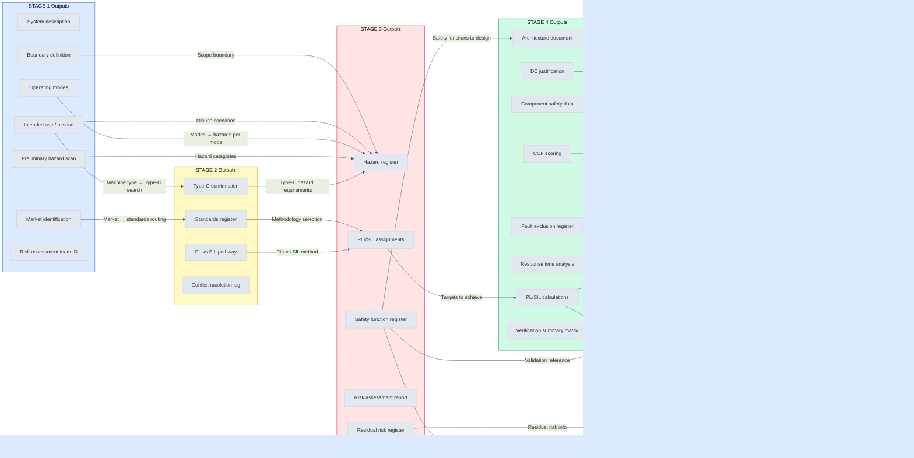
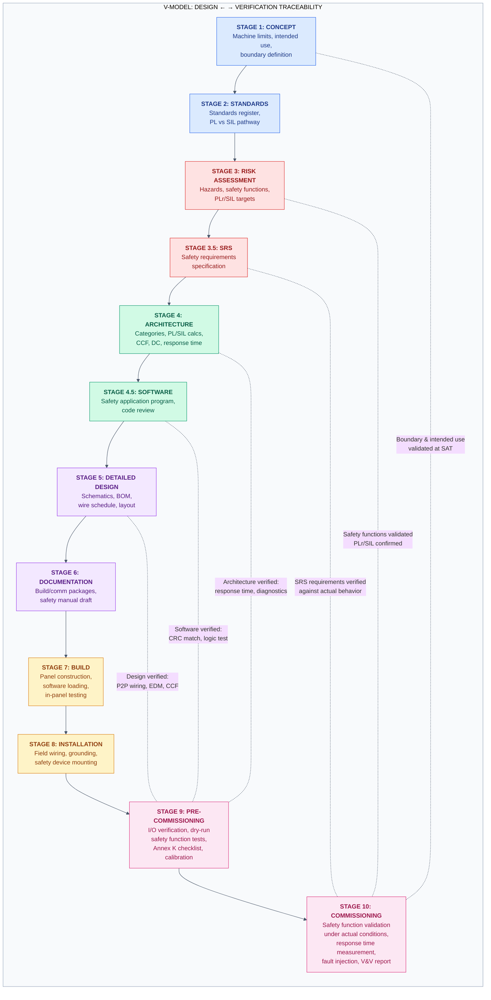
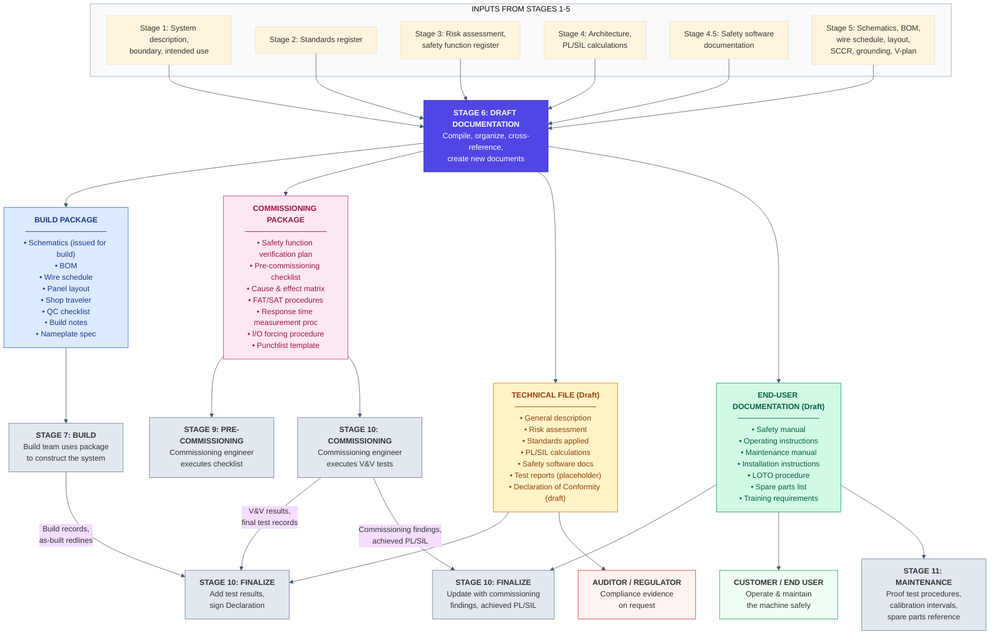
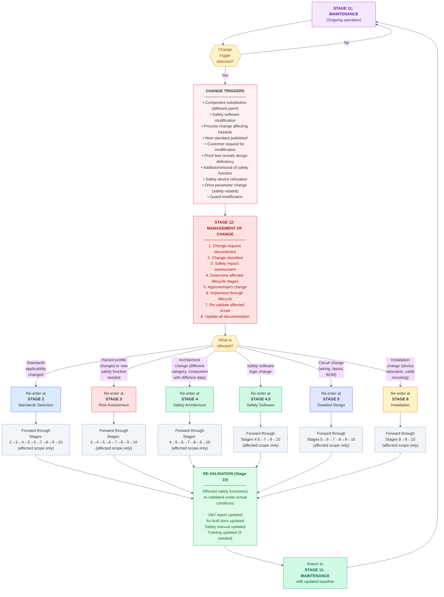
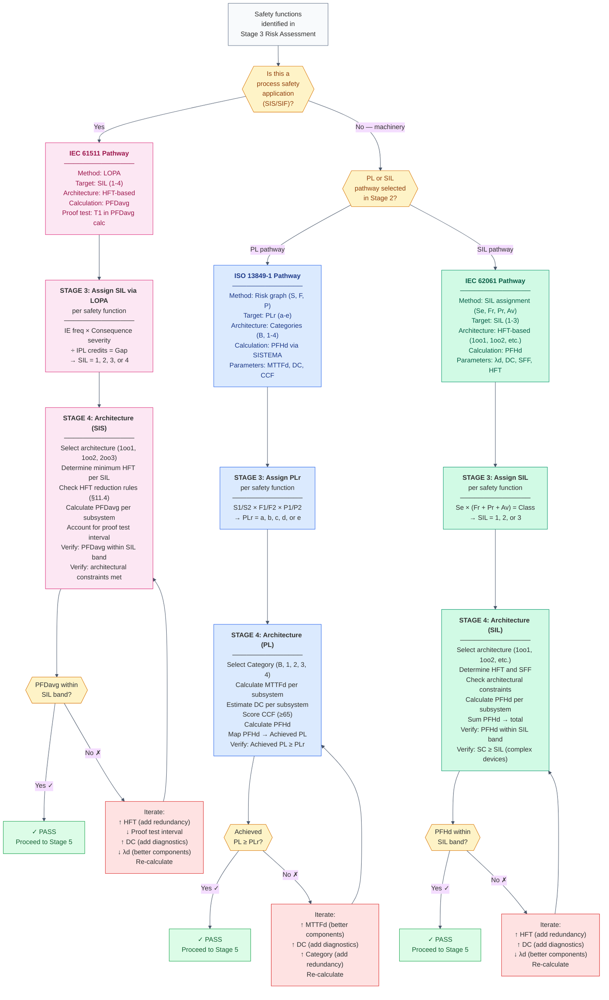

https://kyawminthu20.github.io/Control-System-Tools/lifecycle/

# Suggested Additions to Your Engineering Flow Lifecycle Page

Your table is already solid — it covers the core V-model stages well. Below are additions organized by **missing stages**, **missing columns/metadata**, and **page-level sections** that would surround the table.

---

## 1. Missing or Under-Represented Stages

### Insert Between Stage 3 and 4: **Safety Requirements Specification (SRS)**

| # | Stage | Standards | Key Deliverable | PL/SIL Decision |
|---|-------|-----------|----------------|-----------------|
| 3.5 | Safety Requirements Specification | IEC 62061 §5.3, IEC 61511-1 §10, ISO 13849-1 §5 | SRS document (safety functions, required PL/SIL, process parameters, demand mode, response times) | Assigns target PL/SIL per safety function |

**Why:** Your current flow jumps from risk assessment straight to architecture. The SRS is the single most referenced deliverable in audits — it's the contract between "what risk did we find" and "what are we designing." Every safety function should have a line item defining its required integrity level, inputs, outputs, and response time before architecture begins.

---

### Insert Between Stage 4 and 5: **Software / Application Program Safety**

| # | Stage | Standards | Key Deliverable | PL/SIL Decision |
|---|-------|-----------|----------------|-----------------|
| 4.5 | Safety Software & Application Logic | IEC 62061 §6.7, ISO 13849-1 Annex J, IEC 61508-3, IEC 61511-1 §12 | Software safety requirements, cause & effect matrix, application program verification record, limited variability language (LVL) justification | — |

**Why:** If you're using safety PLCs (SafetyPLC, GuardLogix, F-CPU, etc.), the application logic has its own lifecycle requirements that are distinct from hardware design. Annex J of ISO 13849-1 and Clause 6.7 of IEC 62061 have specific requirements for SRESW vs SRASW. Auditors regularly look for evidence that software was developed and verified independently from hardware.

---

### Add After Stage 11: **Management of Change (MOC)**

| # | Stage | Standards | Key Deliverable | PL/SIL Decision |
|---|-------|-----------|----------------|-----------------|
| 12 | Management of Change | IEC 61511-1 §17, ISO 13849-1 §10.2, IEC 62061 §6.9 | MOC procedure, change impact assessment, re-verification records | Re-confirm PL/SIL if safety function affected |

**Why:** This is arguably the most commonly failed audit point in operating facilities. Any modification — a component substitution, a software change, a process change — needs a structured loop back to the appropriate lifecycle stage. Without this, the lifecycle is open-ended.

---

### Add After MOC: **Decommissioning / End of Life**

| # | Stage | Standards | Key Deliverable | PL/SIL Decision |
|---|-------|-----------|----------------|-----------------|
| 13 | Decommissioning | IEC 61511-1 §18, ISO 12100 §6.1 | Decommissioning plan, residual risk documentation, isolation verification | — |

**Why:** Standards explicitly include this. It closes the lifecycle loop and addresses scenarios like partial decommissioning where some safety functions are removed but the machine/process continues operating.

---

## 2. Missing Columns to Add to the Table

Consider expanding your table with these columns:

| Column | Purpose |
|--------|---------|
| **Inputs / Entry Criteria** | What must exist before this stage begins (e.g., "Approved risk assessment" before Architecture). Prevents stages from starting prematurely. |
| **Gate Review / Exit Criteria** | What must be true to exit the stage. Makes the table actionable for project managers. Example: Stage 3 exit = "All safety functions identified, target PL/SIL assigned, risk assessment signed off." |
| **Responsible Role** | Who owns the deliverable (Safety Engineer, Controls Engineer, Project Manager, etc.). Could be a simple RACI reference. |
| **Verification Method** | How each stage's deliverable is confirmed (peer review, analysis, testing, simulation). Maps to V&V strategy. |
| **Typical Tools / Templates** | Links to your internal templates, calculators (SISTEMA, SILver, exSILentia), or checklists. Makes the page operationally useful. |

Your expanded header row would look like:

```
# | Stage | Standards | Inputs | Key Deliverable | Verification Method | Responsible | PL/SIL Decision | Exit Criteria
```

---

## 3. Page-Level Sections to Add Around the Table

### A. Purpose & Scope Statement (Top of Page)
A short paragraph defining:
- What types of projects this lifecycle applies to (new machines, retrofits, process safety)
- Boundary between this lifecycle and your general project engineering lifecycle
- When to use PL path (machinery/ISO 13849) vs SIL path (IEC 62061 / IEC 61511)

### B. Visual Lifecycle Diagram
A V-model or flowchart diagram showing:
- The left leg (specification stages 1–5) descending
- The right leg (verification stages 9–11) ascending
- Horizontal traceability lines connecting corresponding stages (e.g., SRS ↔ Commissioning V&V, Architecture ↔ Pre-Commissioning)
- The MOC feedback loop from any operational stage back to the appropriate design stage
- Clear decision diamond at Stage 3 for PL vs SIL routing

This makes the page immediately understandable at a glance.

### C. PL vs SIL Decision Routing Logic
A brief decision tree or table:

| Condition | Path |
|-----------|------|
| Machinery under EU Machinery Directive / ISO domain | ISO 13849-1 → PL |
| Machinery where subsystem SIL approach preferred | IEC 62061 → SIL (SILCL) |
| Process industry / SIS | IEC 61511 → SIL |
| Complex / mixed systems | IEC 61508 as umbrella → SIL |
| E/E safety systems with software ≥ SIL 2 | IEC 61508-3 software lifecycle applies |

This contextualizes your "PL/SIL Decision" column.

### D. Common Cause Failure (CCF) and Diagnostic Coverage (DC) Requirements
A short reference section or link explaining:
- When CCF analysis is required (Category 2, 3, 4 in ISO 13849-1; any redundant architecture in IEC 62061/61508)
- How DC is estimated and where it feeds in (Stage 4/5)
- Minimum CCF score thresholds (≥65 points per ISO 13849-1 Annex F)

These are the quantitative items engineers most frequently need to look up mid-lifecycle.

### E. Traceability Matrix Reference
A note (or embedded template) showing how to trace:
```
Hazard → Safety Function → SRS Line Item → Architecture Block → Circuit/Code → Test Case → V&V Record
```
This is the backbone auditors follow. Even a simple table template showing this chain per safety function would be very valuable.

### F. Competency Requirements
A brief table of minimum competency expectations per stage:

| Stage | Competency Needed |
|-------|------------------|
| Risk Assessment | Trained in ISO 12100 methodology, familiar with applicable type-C standards |
| Safety Architecture | Able to perform PL/SIL calculations (SISTEMA, manual, etc.) |
| Safety Software | Trained in LVL programming per IEC 62061 §6.7 or equivalent |
| Commissioning V&V | Independent from design team (or justified if not) |

IEC 61511 §5 and IEC 61508-1 §6 explicitly require competency management. This protects you in audits.

### G. Normative & Informative References
A consolidated list of every standard mentioned, with edition/year, so there's no ambiguity:

```
- ISO 12100:2010
- ISO 13849-1:2023 (or 2015 — specify which you follow)
- IEC 62061:2021
- IEC 61508:2010 (Parts 1–7)
- IEC 61511-1:2016+A1:2017
- NFPA 79:2024 (or applicable edition)
- UL 508A
- IEC 60204-1:2016
- IEC 61140:2016
- NEC (NFPA 70, specify year)
```

### H. Revision History Table
For the page itself — this is a controlled document that will change.

---

## 4. Quick-Win Additions to Existing Stages

| Stage | What to Add |
|-------|-------------|
| **Stage 2 – Standards Selection** | Add type-C standards identification (e.g., ISO 10218 for robots, ISO 16092 for presses). Type-C standards override type-B defaults and auditors expect them to be identified early. |
| **Stage 3 – Risk Assessment** | Call out the methodology explicitly (risk graph per ISO 13849-1 Annex A, risk matrix per ISO 12100 Annex A, SIL assignment per IEC 62061 Annex A or risk graph per IEC 61511). Add "hazard log" as a deliverable — it's a living document distinct from the risk assessment report. |
| **Stage 5 – Detailed Design** | Add SISTEMA/SILver calculation report (or equivalent quantitative verification) as a key deliverable. Add environmental requirements (EMC per IEC 61326, operating temperature, vibration). |
| **Stage 7 – Build** | Add functional test at panel level (pre-shipment). Add configuration backup of safety PLC program with CRC/signature. |
| **Stage 9 – Pre-Commissioning** | Add proof test baseline values (e.g., initial trip point calibrations, valve stroke times). These become the reference for Stage 11 maintenance. |
| **Stage 10 – Commissioning** | Clarify whether FAT and SAT are separate sub-stages (they usually are, with different locations and responsibilities). Add "independence of verification" requirement. |
| **Stage 11 – Maintenance** | Add proof test interval (T_proof) justification linked back to SIL/PL calculations. Add bypass/override management procedure. |

---

## Summary: Priority Additions

If you only do five things:

1. **Add the SRS stage** — it's the most important missing piece
2. **Add the MOC stage** — it closes the lifecycle
3. **Add the V-model diagram** — it makes the page visually navigable
4. **Add Entry/Exit criteria columns** — they make the table enforceable
5. **Add the traceability chain** — it's what auditors actually follow

These changes would take your page from a reference table to a governing lifecycle document.

# Introduction Section for Your Safety Engineering Lifecycle Page

Below is a complete introduction structure you can place at the top of your page, before the stage table.

---

## 1. Purpose

This document defines the **Safety Engineering Lifecycle** — the structured sequence of stages, deliverables, and decision gates required to identify, design, implement, verify, and maintain safety-related controls for machinery and process systems.

It exists to ensure that every project involving safeguarding — whether a new machine build, a retrofit, an integration, or a controls upgrade — follows a repeatable, standards-compliant process from initial concept through decommissioning. It is not a substitute for engineering judgment; it is the framework within which that judgment is applied and documented.

This lifecycle governs all work where the outcome includes one or more **safety functions** — any function of a machine or process whose failure would directly result in an increase in risk to persons.

---

## 2. Scope of Application

This lifecycle applies to:

| Project Type | Example |
|-------------|---------|
| New machine design & build | Custom assembly cell, press system, robotic workcell |
| Machine retrofit or modification | Adding a safety interlock to an existing line, guard redesign |
| Controls integration | Integrating third-party machines into a common safety system |
| Process safety instrumented systems | SIS design for chemical, oil & gas, or process facilities |
| Panel design & build | UL 508A / NFPA 79 control panels containing safety-rated circuits |
| Management of Change | Any change to an existing safety function, hardware, or logic |

It does **not** replace your general project engineering lifecycle (mechanical design, process engineering, project management). It runs **parallel to and embedded within** that lifecycle, with defined integration points described below.

---

## 3. How This Lifecycle Integrates with the General Engineering Lifecycle

Most engineering organizations operate a project lifecycle that looks roughly like this:

```
Sales/Proposal → Concept → Engineering → Procurement → Build → Ship → Install → Commission → Handover → Support
```

The safety engineering lifecycle is **not a separate track that happens after the fact**. It is embedded within the general engineering lifecycle and must begin at the earliest feasible stage. Bolting safety on at the end — during build or commissioning — is the single most common root cause of cost overruns, rework, and non-compliant deliveries.

### Integration Map

```
General Engineering              Safety Engineering
Lifecycle                        Lifecycle
─────────────────                ─────────────────

Sales / Proposal ◄──────────── (awareness only — flag if safety scope exists)
        │
        ▼
Concept / Kickoff ◄════════════ Stage 1: Concept
        │                        Define machine limits, intended use,
        │                        foreseeable misuse, scope boundaries
        ▼
Preliminary Engineering ◄══════ Stage 2: Standards Selection
        │                       Stage 3: Risk Assessment ★ CRITICAL GATE
        │                       Stage 3.5: Safety Requirements Spec (SRS)
        │
        │                       ┌─────────────────────────────┐
        │                       │  PL / SIL DECISION POINT    │
        │                       │  This determines everything │
        │                       │  downstream. Do not pass    │
        │                       │  this gate without sign-off.│
        │                       └─────────────────────────────┘
        ▼
Detailed Engineering ◄════════ Stage 4: Safety Architecture
        │                       Stage 4.5: Safety Software/Logic
        │                       Stage 5: Detailed Design
        │                       Stage 5.1: Safety Wiring Practices
        ▼
Documentation ◄════════════════ Stage 6: Draft Documentation
        │
        ▼
Procurement / Build ◄═════════ Stage 7: Build
        │
        ▼
Ship / Install ◄══════════════ Stage 8: Installation
        │
        ▼
Commissioning ◄═══════════════ Stage 9: Pre-Commissioning
        │                       Stage 10: Commissioning (V&V, FAT/SAT)
        ▼
Handover / Operate ◄══════════ Stage 11: Maintenance & Proof Test
        │
        ▼
Ongoing Operations ◄══════════ Stage 12: Management of Change
        │                       (loops back to any prior stage)
        ▼
End of Life ◄═════════════════ Stage 13: Decommissioning
```

### The Key Principle

> **Safety engineering begins at Concept and produces its most important outputs during Preliminary Engineering — before detailed design starts.**

If your general engineering process is already selecting components, drawing schematics, or writing PLC code before Stage 3 (Risk Assessment) and Stage 3.5 (SRS) are complete, the lifecycle is broken. Everything in detailed design depends on knowing:

- What are the safety functions?
- What is the required Performance Level (PL) or Safety Integrity Level (SIL) for each?
- What architecture category is needed?
- What are the response time and diagnostic coverage requirements?

Without those answers, every design decision is either a guess or a rework liability.

---

## 4. When to Enter This Lifecycle

| Trigger | Entry Point |
|---------|-------------|
| New project kicked off with any safeguarding scope | Stage 1 — from the beginning |
| Existing machine being modified (new hazard, new safeguard, component change) | Stage 3 — risk assessment of the change, via MOC procedure |
| Customer or internal audit finding against an existing machine | Stage 3 — gap assessment against current standards, then forward |
| Replacement-in-kind of a safety component (no functional change) | Stage 12 (MOC) — verify equivalence, document, no re-design needed |
| Software-only change to a safety PLC program | Stage 12 (MOC) → Stage 4.5 — software safety lifecycle re-engaged |
| Periodic proof testing reveals degradation | Stage 11 — maintenance lifecycle, may trigger MOC if repair changes the function |

### Projects That Require This Lifecycle

To be explicit — if **any** of the following are true, this lifecycle is mandatory:

- The system includes a safety-rated controller, relay, interlock, or SIS
- The project scope references ISO 13849, IEC 62061, IEC 61508, or IEC 61511
- A risk assessment identifies hazards requiring risk reduction beyond inherent safe design and fixed guards alone
- The customer specification requires a PL or SIL target
- The system includes safety-rated devices (e-stops, light curtains, safety switches, safety valves, safety PLCs)
- The project involves a CE-marked machine under the Machinery Directive / Machinery Regulation
- The project involves a process safety instrumented function (SIF)

---

## 5. Roles and Responsibilities Overview

This lifecycle requires involvement from multiple disciplines. No single engineer owns every stage.

| Role | Primary Involvement |
|------|-------------------|
| **Project Manager** | Ensures lifecycle stages are scheduled into the project plan, gates are respected, resources are allocated |
| **Safety / Controls Engineer** | Owns Stages 2–5, leads risk assessment, authors SRS, performs PL/SIL calculations, designs safety architecture and logic |
| **Mechanical / Process Engineer** | Contributes to Stage 1 (machine limits), Stage 3 (hazard identification — they know the process), Stage 8 (installation) |
| **Electrical / Panel Engineer** | Owns Stage 5 detailed electrical design, Stage 5.1 wiring practices, Stage 7 build |
| **Software / Controls Programmer** | Owns Stage 4.5 safety application logic, contributes to Stage 10 V&V |
| **Commissioning Engineer** | Owns Stages 9–10, executes pre-commissioning checklists and FAT/SAT |
| **End User / Operations** | Participates in Stage 3 (they know the real-world use and foreseeable misuse), owns Stage 11 maintenance |
| **Independent Verifier** | Reviews and verifies deliverables at gate points — should not be the same person who designed the safety function (required at SIL 2+ per IEC 61508/61511, best practice at any level) |

---

## 6. Foundational Standards Framework

This lifecycle is built on the requirements of the following hierarchy:

```
                    ┌─────────────────┐
                    │   IEC 61508     │  ← Umbrella: functional safety of E/E/PE systems
                    │   (All parts)   │
                    └────────┬────────┘
                             │
            ┌────────────────┼────────────────┐
            ▼                ▼                 ▼
    ┌──────────────┐ ┌──────────────┐ ┌──────────────────┐
    │ ISO 13849-1  │ │ IEC 62061    │ │ IEC 61511        │
    │ Machinery    │ │ Machinery    │ │ Process Industry  │
    │ PL pathway   │ │ SIL pathway  │ │ SIS / SIF / SIL  │
    └──────┬───────┘ └──────┬───────┘ └────────┬─────────┘
           │                │                   │
           ▼                ▼                   ▼
    ┌──────────────────────────────────────────────────────┐
    │              ISO 12100 — Risk Assessment              │
    │         (Foundation for all safety engineering)        │
    └──────────────────────────────────────────────────────┘
           │                │                   │
           ▼                ▼                   ▼
    ┌──────────────┐ ┌──────────────┐ ┌──────────────────┐
    │ NFPA 79      │ │ UL 508A      │ │ IEC 60204-1      │
    │ NEC (NFPA 70)│ │              │ │ IEC 61140        │
    │              │ │              │ │                   │
    │ Electrical   │ │ Panel        │ │ Electrical safety │
    │ safety of    │ │ construction │ │ of machinery      │
    │ machinery    │ │              │ │                   │
    └──────────────┘ └──────────────┘ └──────────────────┘
```

The selection of which pathway (PL vs SIL) and which implementation standards apply is determined at **Stage 2 (Standards Selection)** and confirmed at **Stage 3 (Risk Assessment)**. The routing logic is documented in your `_standards_map.md`.

---

## 7. Key Principles Governing This Lifecycle

These are non-negotiable principles. If a project deviates from any of them, it must be documented and justified.

**1. Safety is designed in, not tested in.**
The lifecycle front-loads analysis and specification. Commissioning testing verifies what was designed — it does not discover what should have been designed.

**2. Every safety function must be traceable from hazard to verification.**
```
Hazard → Safety Function → SRS requirement → Architecture → Design/Code → Test Case → V&V Record
```
If any link in this chain is missing, the safety function is not adequately documented.

**3. Risk assessment precedes design.**
No safety architecture, component selection, or PLC programming begins until the risk assessment and SRS are complete and approved for the relevant scope.

**4. The PL/SIL target is determined by risk, not by available hardware.**
You do not select a safety relay and then claim its PL. You determine the required PL/SIL from the risk assessment, then design to meet or exceed it.

**5. Independence of verification scales with integrity level.**
At minimum, the person who verifies a safety function should not be the same person who designed it. At SIL 2 and above (or PL d/e for complex systems), formal independence is expected.

**6. Changes restart the lifecycle at the appropriate stage.**
There is no such thing as a "minor" change to a safety function. All changes go through MOC and re-enter the lifecycle at the stage where the change has impact.

---

## 8. How to Use This Page

- **If you are starting a new project:** Begin at Stage 1 and proceed sequentially. Do not skip stages. Use the exit criteria at each gate to confirm readiness before advancing.
- **If you are modifying an existing system:** Enter through Stage 12 (MOC), assess the impact, and re-enter the lifecycle at the earliest affected stage.
- **If you are reviewing or auditing a completed project:** Use the traceability chain and the deliverables column to verify that evidence exists for each stage.
- **If you are a project manager scheduling work:** Use the integration map above to align safety lifecycle stages with your general project milestones. The critical path item is almost always **Stage 3 (Risk Assessment) and Stage 3.5 (SRS)** — these must complete before detailed engineering begins.

---

## Stage Summary Table

*[Your existing table goes here, with the additions previously recommended]*

---

This introduction sets the context so that anyone landing on the page — whether they are a junior engineer, a project manager, a customer, or an auditor — understands **what** this lifecycle is, **why** it exists, **when** it activates, and **how** it fits into the work they are already doing. Without this framing, the stage table is a checklist without authority.

===============================================

https://kyawminthu20.github.io/Control-System-Tools/lifecycle/concept/

# Improved Lifecycle Stage 01 — Concept

Below is a comprehensive restructure with everything the page should contain.

---

## 1. Purpose of This Stage

This is the foundation stage of the safety engineering lifecycle. Its purpose is to establish **what the machine or system is**, **what it does**, **where its boundaries are**, and **what context it operates in** — before any risk assessment, design, or standards compliance work begins.

Every decision made in later stages depends on the accuracy and completeness of what is defined here. A poorly defined concept stage leads to:

- Missed hazards in risk assessment (because the scope was unclear)
- Wrong standards selected (because the market or application was not identified)
- Scope creep during design (because boundaries were not agreed)
- Disputes during commissioning (because intended use was ambiguous)

> **The concept stage answers one question: What exactly are we making safe, and for whom?**

---

## 2. Entry Criteria

This stage begins when **any** of the following are true:

| Trigger | Source |
|---------|--------|
| New project kicked off with safety scope identified | Project manager / sales handoff |
| Customer specification received referencing safety requirements | Proposal or contract review |
| Internal decision to design a new machine or system | Engineering leadership |
| Significant modification to an existing machine requiring re-scoping | MOC process (Stage 12 routes back here) |

### Required Inputs to Begin

| Input | Source | Why It Matters |
|-------|--------|----------------|
| Customer specification or RFQ | Sales / customer | Defines what the customer expects the machine to do |
| Process description or P&ID (if applicable) | Process engineering | Defines what the machine interacts with |
| Site or facility information | Customer / site survey | Environmental conditions, existing infrastructure, local codes |
| Applicable contract or regulatory requirements | Legal / commercial | CE marking, OSHA, NRTL listing, customer-specific mandates |
| Prior machine documentation (if retrofit/modification) | Engineering records | Existing risk assessments, drawings, safety function register |

**If these inputs are not available, document what is missing and flag it as an assumption to be confirmed.**

---

## 3. Standards Influence

| Standard | Role at This Stage |
|----------|-------------------|
| **ISO 12100:2010 §5** | Defines the methodology for determining limits of the machine — use limits, space limits, time limits, and other limits |
| **ISO 12100:2010 §3.22–3.24** | Defines intended use, reasonably foreseeable misuse, and intended purpose — the language you use here must align with these definitions |
| **Machinery Directive 2006/42/EC** or **Machinery Regulation (EU) 2023/1230** | If CE marking is required, the essential health and safety requirements (EHSRs) apply from concept onward — EHSR 1.1.1 requires consideration of intended use and foreseeable misuse at the design stage |
| **Type-C standards (initial identification)** | If the machine type has a dedicated product standard (e.g., ISO 10218 for robots, ISO 16092 for presses, ISO 11161 for integrated manufacturing systems), it must be identified now — type-C standards override type-B defaults and may impose specific concept-stage requirements |
| **OSHA 29 CFR 1910 Subpart O** (if US market) | General requirements for machinery — establishes employer obligations that inform what "intended use" means in a US context |
| **ANSI/NFPA 79** (if US market) | Early identification that this will govern electrical design — influences concept decisions about voltage, power distribution, control architecture |
| **IEC 61511-1 §8** (if process safety) | Requires a clear definition of the process, its hazards, and the allocation of safety functions to protection layers — this allocation starts at concept |

### Note on Type-C Standards

At this stage you are not yet selecting all applicable standards (that is Stage 2). However, you **must** identify whether a type-C standard exists for your machine type, because type-C standards can impose requirements that fundamentally change the concept — for example:

- ISO 10218-2 requires specific definitions of collaborative workspace if a robot is involved
- ISO 11161 requires definition of inter-machine interfaces and zone boundaries for integrated systems
- ISO 16092 requires specific definitions of operating modes for press systems

If a type-C standard exists and you do not identify it here, you risk designing to generic requirements that are later overridden.

---

## 4. Engineering Activities

### 4.1 Define Machine / System Limits

Per ISO 12100 §5.2, determine:

| Limit Type | What to Define | Example |
|-----------|---------------|---------|
| **Use limits** | Intended use, operating modes, operator skill level, foreseeable misuse | "Machine is intended for continuous production of Part X by trained operators. Foreseeable misuse includes reaching into the die area during cycling." |
| **Space limits** | Physical boundary of the machine, range of motion, reach zones, operator access positions | "Machine boundary includes the press frame, conveyor infeed, and outfeed to point of transfer to downstream conveyor." |
| **Time limits** | Expected life of machine, recommended service intervals, life of safety-critical components | "Designed for 20-year service life, safety components rated for 10-year replacement cycle." |
| **Other limits** | Material properties, environmental conditions (temperature, humidity, dust, vibration, altitude), utility requirements | "Operating environment: 0–45°C, indoor, non-explosive atmosphere, 480V 3-phase supply." |

### 4.2 Document Intended Use and Foreseeable Misuse

This is not a one-sentence statement. It should be a structured narrative covering:

**Intended Use:**
- What does the machine do (process, function, output)?
- Who operates it (skill level, training assumptions)?
- What materials does it process?
- What are the defined operating modes (automatic, manual, setup, maintenance, cleaning, fault recovery)?
- What is the production context (standalone, part of a line, upstream/downstream interfaces)?

**Reasonably Foreseeable Misuse:**
- What could an operator do wrong that is predictable based on human behavior?
- What could maintenance personnel do that bypasses safety?
- What could happen if the machine is used beyond its rated capacity?
- What could happen if the machine is operated in an environment it was not designed for?

> **Important:** Foreseeable misuse is not "anything imaginable." Per ISO 12100 §3.24, it is use that is **not intended by the designer but can be readily anticipated based on human behavior.** Document both what is foreseeable misuse AND what is explicitly excluded from scope (abnormal use that is not foreseeable).

### 4.3 Identify Applicable Markets and Regulatory Context

| Market | Regulatory Framework | Implications at Concept Stage |
|--------|---------------------|-------------------------------|
| European Union | Machinery Directive / Regulation, CE marking | Must design to harmonized standards, must produce Declaration of Conformity, must include technical file |
| United States | OSHA, NRTL listing (UL/CSA), NEC, NFPA 79 | Must design to US national codes, panel may require UL 508A listing, field wiring per NEC |
| Canada | CSA standards, provincial regulations | May require CSA certification or field evaluation |
| Global / multiple markets | All of the above, potentially simultaneously | Must identify conflicts between standards early (e.g., NFPA 79 vs IEC 60204-1 differences in wire color, grounding) |

**This decision directly affects Stage 2 (Standards Selection) and Stage 5 (Detailed Design). It cannot be deferred.**

### 4.4 Identify Initial Stakeholders for Risk Assessment

At concept stage, identify **who must participate** in the Stage 3 risk assessment:

| Stakeholder | Why They Are Needed |
|------------|-------------------|
| Machine operator (or representative) | Knows actual use patterns and workarounds |
| Maintenance technician (or representative) | Knows access requirements and common failure modes |
| Process / mechanical engineer | Knows the physical hazards, forces, materials |
| Controls / safety engineer | Knows safety architecture options and standards |
| Customer safety representative (if applicable) | Knows site-specific requirements and risk tolerance |

**If the risk assessment team is not identified at concept, it will be assembled ad hoc at Stage 3 and will likely be missing critical perspectives.**

### 4.5 Establish Preliminary Safety Objectives

These are not PL/SIL targets (those come from Stage 3). These are project-level objectives such as:

- "All operator access points shall be safeguarded to prevent contact with hazardous motion"
- "The system shall achieve a safe state within [X] seconds of any safety demand"
- "The safety system shall comply with [specific customer safety specification reference]"
- "No single fault shall lead to loss of the safety function" (this is a preliminary architecture intent, to be confirmed at Stage 4)

### 4.6 Identify Known Hazard Categories (Preliminary)

Without conducting the full risk assessment (Stage 3), perform a **preliminary hazard scan** to identify the broad categories of hazards that will need to be assessed:

| Hazard Category (per ISO 12100 Annex B) | Present? | Notes |
|-----------------------------------------|----------|-------|
| Mechanical (crushing, shearing, cutting, entanglement, impact, stabbing/puncture, friction, high-pressure fluid) | | |
| Electrical (direct/indirect contact, arc flash, electrostatic) | | |
| Thermal (burns, scalds, frostbite) | | |
| Noise | | |
| Vibration | | |
| Radiation (ionizing, non-ionizing, laser) | | |
| Material/substance (chemical, biological, dust, fume) | | |
| Ergonomic (posture, repetitive motion, manual handling) | | |
| Environmental (slip, trip, fall, oxygen deficiency) | | |
| Combination / unexpected startup | | |

**This is not the risk assessment. It is a scoping exercise to ensure the risk assessment in Stage 3 covers all relevant hazard types and the right expertise is in the room.**

---

## 5. Key Deliverables

| # | Deliverable | Description | Format / Template |
|---|------------|-------------|-------------------|
| 1 | **System description** | Narrative of what the machine does, its function, its process context, its interfaces with upstream/downstream equipment and personnel | Document (1–3 pages typical) |
| 2 | **Intended use and foreseeable misuse statement** | Structured per ISO 12100 §5.2 — operating modes, user groups, materials processed, environmental conditions, and explicitly identified foreseeable misuse scenarios | Section within system description or standalone document |
| 3 | **Machine / system boundary definition** | What is inside and outside the scope of this safety engineering effort — physical boundary, control boundary, interface boundaries with adjacent equipment | Drawing or diagram with narrative |
| 4 | **Operating mode definitions** | List of all modes the machine will operate in (automatic, manual, setup, jog, maintenance, cleaning, fault recovery, emergency stop, restart after e-stop) with description of each | Table |
| 5 | **Market and regulatory identification** | Which markets the machine will be delivered to, which regulatory frameworks apply, whether CE marking or NRTL listing is required | Table |
| 6 | **Initial standards identification** | Preliminary list of type-A, type-B, and type-C standards that may apply (to be confirmed in Stage 2) | Standards register draft |
| 7 | **Operating assumptions** | Process parameters, environmental conditions, operator training assumptions, maintenance access assumptions, utility specifications | Table or document section |
| 8 | **Preliminary hazard category scan** | Checklist of ISO 12100 Annex B hazard categories with initial identification of which are present | Checklist table |
| 9 | **Risk assessment team identification** | Named individuals or roles who will participate in Stage 3 | List |
| 10 | **Concept-stage assumptions register** | Any assumptions made due to incomplete information, with owner and date for resolution | Table (living document) |

---

## 6. Exit Criteria — Gate Review

This stage is complete when **all** of the following are true:

| # | Criterion | Evidence |
|---|-----------|----------|
| 1 | Machine/system boundary is defined and agreed with stakeholders | Signed or approved boundary drawing/description |
| 2 | Intended use and foreseeable misuse are documented per ISO 12100 §5.2 | Documented in system description |
| 3 | All operating modes are identified and described | Operating mode table complete |
| 4 | Target markets and regulatory frameworks are identified | Market identification table complete |
| 5 | Type-C standard applicability is determined (exists or confirmed none applies) | Documented in initial standards identification |
| 6 | Preliminary hazard categories are scanned | Hazard category checklist complete |
| 7 | Risk assessment team is identified and scheduled | Names/roles listed, Stage 3 scheduled in project plan |
| 8 | All assumptions are documented with owners | Assumptions register created |
| 9 | Concept deliverables are reviewed by at least one person other than the author | Review record (signature, date, comments resolved) |

**If any criterion is not met, the stage does not close. Proceeding to Stage 2 without a defined boundary and intended use statement will result in an unfounded standards selection.**

---

## 7. Roles and Responsibilities at This Stage

| Role | Responsibility |
|------|---------------|
| **Project Manager** | Ensures this stage is scheduled, resourced, and completed before engineering proceeds; owns the project timeline gate |
| **Safety / Controls Engineer** | Authors the system description, boundary definition, and intended use/misuse statement; identifies preliminary standards and hazard categories |
| **Mechanical / Process Engineer** | Provides process description, machine function, material properties, environmental conditions; validates boundary definition |
| **Sales / Application Engineer** | Provides customer specification, market identification, contractual safety requirements; clarifies customer intent |
| **Customer (if accessible)** | Confirms intended use, operating modes, site conditions, user training assumptions |

---

## 8. Common Mistakes at This Stage

| Mistake | Consequence | How to Avoid |
|---------|-------------|-------------|
| Boundary is vague or undefined | Risk assessment in Stage 3 either misses hazards at interfaces or wastes time assessing things outside scope | Use a physical drawing with a clear line. If it's inside the line, it's in scope. If it's outside, it's not. Document interface responsibilities. |
| Foreseeable misuse is not documented | Auditors and risk assessment both suffer — if you didn't anticipate misuse at concept, you won't design against it | Use ISO 12100 §5.2 and Annex B as a structured prompt. Interview operators or experienced field engineers. |
| Operating modes are incomplete | Safety functions designed for automatic mode may not address manual/setup/maintenance modes, leading to gaps | Use a standard mode list as a starting checklist: automatic, manual, setup/jog, maintenance, cleaning, fault recovery, e-stop, restart, teach (if applicable). |
| Market is assumed rather than confirmed | Designing to IEC standards when the machine goes to a US facility that requires NFPA 79 and UL 508A, or vice versa | Confirm market in writing with sales/customer before proceeding. |
| Type-C standard is missed | Entire design proceeds under generic type-B standards, then a late-stage review reveals a type-C standard that imposes different/additional requirements, causing rework | Search for type-C standards by machine type at concept. Check ISO, IEC, and ANSI/NFPA catalogs. |
| Concept stage is skipped because "we've built this machine before" | Prior machine may have been non-compliant, or the new project has different scope, different market, or different customer requirements | Every project gets a concept stage, even if it is brief. Document what is the same and what is different from the prior machine. |

---

## 9. Relationship to Adjacent Stages

```
                    ┌──────────────────────────┐
                    │  PROJECT KICKOFF          │
                    │  (General Engineering)    │
                    └────────────┬─────────────┘
                                 │
                                 ▼
                    ┌──────────────────────────┐
                    │  STAGE 1: CONCEPT         │  ◄── You are here
                    │                          │
                    │  Outputs:                │
                    │  • System description    │
                    │  • Boundary definition   │
                    │  • Intended use/misuse   │
                    │  • Market identification │
                    │  • Operating modes       │
                    │  • Preliminary hazard    │
                    │    categories            │
                    └────────────┬─────────────┘
                                 │
                    All outputs feed directly into
                                 │
                                 ▼
                    ┌──────────────────────────┐
                    │  STAGE 2: STANDARDS       │
                    │  SELECTION                │
                    │                          │
                    │  Uses market ID and      │
                    │  type-C identification   │
                    │  to build full standards │
                    │  register                │
                    └────────────┬─────────────┘
                                 │
                                 ▼
                    ┌──────────────────────────┐
                    │  STAGE 3: RISK ASSESSMENT │
                    │                          │
                    │  Uses boundary, intended │
                    │  use/misuse, operating   │
                    │  modes, and hazard       │
                    │  categories as direct    │
                    │  inputs                  │
                    └──────────────────────────┘
```

---

## 10. Templates and Tools

| Resource | Purpose |
|----------|---------|
| System Description Template | Structured document with sections for all concept-stage deliverables |
| Boundary Definition Drawing Template | CAD or Visio template with scope boundary notation |
| Operating Mode Checklist | Standard list of modes to consider for every machine |
| Hazard Category Scan Checklist | ISO 12100 Annex B categories in checklist format |
| Assumptions Register Template | Table with columns: Assumption, Impact if Wrong, Owner, Resolution Date, Status |

*Link to your internal template repository here.*

---

This restructured page turns Stage 1 from a brief summary into an **actionable, auditable stage** that an engineer can follow step by step and a reviewer can verify against defined exit criteria. Every later stage depends on the completeness of what is produced here.

======================================

https://kyawminthu20.github.io/Control-System-Tools/lifecycle/standards-selection/

# Improved Lifecycle Stage 02 — Standards Selection

Below is a comprehensive restructure of the page.

---

## 1. Purpose of This Stage

This stage translates the concept-stage outputs — system description, boundary definition, market identification, and machine type — into a **definitive, project-specific register of applicable standards** that will govern all subsequent design, build, verification, and documentation activities.

Standards selection is not administrative. It is an engineering decision with direct consequences:

- Selecting the wrong standards means designing to requirements that do not satisfy the applicable regulatory framework — resulting in non-compliance discovered at commissioning, shipment, or audit
- Missing a type-C standard means designing to generic type-B requirements when more specific (and often more stringent or more permissive) requirements exist for that machine type
- Failing to identify conflicts between standards (e.g., NFPA 79 vs IEC 60204-1 wire color conventions) means discovering them during detailed design when changes are expensive
- Not deciding the PL vs SIL pathway at this stage means the risk assessment in Stage 3 cannot assign targets using the correct methodology

> **This stage answers: What rules are we designing to, and where those rules conflict, which takes precedence?**

---

## 2. Entry Criteria

This stage begins when **Stage 1 (Concept) exit criteria are met**.

### Required Inputs

| Input | Source (Stage) | Why It Matters |
|-------|---------------|----------------|
| System description | Stage 1 | Determines which type-C standards apply based on machine function |
| Machine / system boundary definition | Stage 1 | Determines what is inside the scope of standards compliance |
| Market and regulatory identification | Stage 1 | Determines which national/regional codes and directives apply |
| Operating mode definitions | Stage 1 | Some standards have specific requirements per operating mode (e.g., ISO 10218 for collaborative robot modes) |
| Type-C standard preliminary identification | Stage 1 | Starting point — to be confirmed and expanded here |
| Customer specification / contract | Sales / customer | May mandate specific standards, editions, or certifications |
| Assumptions register | Stage 1 | Any unresolved assumptions that affect standards applicability |

**If market identification is not confirmed from Stage 1, this stage cannot produce a reliable standards register. Resolve before proceeding.**

---

## 3. Standards Influence

| Standard | Role at This Stage |
|----------|-------------------|
| **ISO 12100:2010** | Defines the type-A / type-B / type-C hierarchy that governs how standards interact and which takes precedence |
| **`_standards_map.md`** | Internal routing document — primary tool for mapping project characteristics to applicable standards |
| **Decision workflow crosswalk** | Internal tool for resolving PL vs SIL pathway selection |
| **EU Machinery Directive 2006/42/EC / Machinery Regulation (EU) 2023/1230** | If CE marking is required, the list of harmonized standards determines which standards provide presumption of conformity |
| **EU Official Journal (OJ)** | Current list of harmonized standards under the Machinery Directive — must verify that the edition you are using is the one currently listed |
| **OSHA standards (29 CFR 1910)** | If US market, OSHA references specific consensus standards — these are not optional if cited in the contract or if OSHA jurisdiction applies |
| **Customer specification** | May mandate specific standards, editions, or deviations — these override default routing in some cases |

---

## 4. Standards Hierarchy — How Standards Interact

Before selecting standards, understand how they relate to each other:

```
┌─────────────────────────────────────────────────────────────┐
│  TYPE-A: Basic safety standards (fundamental concepts)       │
│  ISO 12100                                                   │
│  Applies to ALL machinery                                    │
└──────────────────────────┬──────────────────────────────────┘
                           │
┌──────────────────────────▼──────────────────────────────────┐
│  TYPE-B: Generic safety standards                            │
│                                                              │
│  B1 — Safety aspects:          B2 — Safeguarding devices:   │
│  • ISO 13849-1 (PL)           • ISO 13850 (e-stop)         │
│  • IEC 62061 (SIL)            • ISO 14119 (interlocking)   │
│  • IEC 60204-1 (electrical)   • ISO 13855 (safety distance)│
│  • ISO 13857 (reach distances)• IEC 61496 (light curtains) │
│  • IEC 61508 (functional      • ISO 14120 (guards)         │
│    safety umbrella)                                          │
│  Applies to wide range of machinery                         │
└──────────────────────────┬──────────────────────────────────┘
                           │
┌──────────────────────────▼──────────────────────────────────┐
│  TYPE-C: Machine-specific safety standards                   │
│                                                              │
│  • ISO 10218-1/2 (robots)                                   │
│  • ISO/TS 15066 (collaborative robots)                      │
│  • ISO 16092 (presses)                                      │
│  • ISO 11161 (integrated manufacturing systems)             │
│  • ISO 11553 (laser processing machines)                    │
│  • ISO 13732 (packaging machinery)                          │
│  • EN 415 (packaging machinery)                             │
│  • EN 619 (conveyors)                                       │
│  Applies to specific machine type                           │
│                                                              │
│  ★ TYPE-C OVERRIDES TYPE-B where they conflict ★            │
└─────────────────────────────────────────────────────────────┘
```

### The Override Rule

Per ISO 12100 Introduction:

> When a type-C standard deviates from one or more provisions dealt with by a type-A or type-B standard, the type-C standard takes precedence.

**This means:** If ISO 10218-2 specifies a particular safety distance calculation method for robotic cells, that method takes precedence over the generic ISO 13855 method — even if ISO 13855 would give a different result. You must identify type-C applicability before finalizing your type-B standards selections.

---

## 5. Engineering Activities

### 5.1 Confirm Market and Regulatory Requirements

Validate and expand the market identification from Stage 1:

| Question | Answer Needed | Impact |
|----------|--------------|--------|
| Is CE marking required? | Yes / No | If yes: Machinery Directive/Regulation applies, harmonized standards provide presumption of conformity |
| Is NRTL listing required (UL, CSA)? | Yes / No / Specific NRTL | If yes: UL 508A (panels), UL 61010 (test equipment), etc. |
| Is the machine installed in the US? | Yes / No | If yes: NEC (NFPA 70) governs field wiring, NFPA 79 governs machine electrical |
| Is the machine installed in Canada? | Yes / No | If yes: CEC (CSA C22.1), CSA standards may apply |
| Does the customer specification mandate specific standards? | List them | Customer mandates may add to or override default selections |
| Are there site-specific requirements? | List them | Some facilities (pharmaceutical, automotive, semiconductor) have internal standards that exceed published standards |
| Is the machine subject to process safety regulation? | Yes / No | If yes: IEC 61511 / IEC 61508 pathway, potentially OSHA PSM (29 CFR 1910.119) |

### 5.2 Identify All Applicable Type-C Standards

This is the most commonly missed activity at this stage. Use the machine type identified in Stage 1 to search for applicable type-C standards:

| Machine Type | Potentially Applicable Type-C Standards |
|-------------|---------------------------------------|
| Robotic system / robotic cell | ISO 10218-1, ISO 10218-2, ISO/TS 15066, ANSI/RIA 15.06 |
| Press / stamping system | ISO 16092 series, ANSI B11.1 through B11.19 |
| Integrated manufacturing system | ISO 11161 |
| Packaging machinery | EN 415 series |
| Conveyor system | EN 619, ANSI/ASME B20.1 |
| Laser processing machine | ISO 11553, IEC 60825-1 |
| Woodworking machinery | EN 691 (general), machine-specific EN standards |
| Printing machinery | EN 1010 series |
| Machine tools | ISO 16090 series |
| Food processing machinery | EN 1672-2 |
| Rubber and plastics machinery | EN 289, EN 201 (injection molding) |
| Lifting equipment / cranes | EN 13001, EN 15011 |

**If no type-C standard exists for your machine type**, document that determination explicitly. The project will then rely entirely on type-A and type-B standards.

**If the machine is a combination of types** (e.g., a robotic press tending cell), identify all applicable type-C standards and note where they overlap or conflict.

### 5.3 Apply the Routing Logic

The `_standards_map.md` routing document provides the primary decision logic. The expanded routing is:

```
START
  │
  ├─► Is the machine / system for the US market?
  │     │
  │     ├─ YES ──► NEC (NFPA 70) — field installation
  │     │          NFPA 79 — machine electrical safety
  │     │          UL 508A — if control panel NRTL listing required
  │     │          ANSI B11 series — if applicable machine type
  │     │          ANSI/RIA 15.06 — if robotic system (US version of ISO 10218)
  │     │          OSHA 29 CFR 1910 Subpart O — general machine guarding
  │     │          OSHA 29 CFR 1910.147 — lockout/tagout (LOTO)
  │     │
  │     └─ NO ───► Skip US-specific codes
  │
  ├─► Is the machine / system for the EU market (CE marking)?
  │     │
  │     ├─ YES ──► ISO 12100 — risk assessment (type-A)
  │     │          IEC 60204-1 — electrical safety of machinery
  │     │          ISO 13849-1 OR IEC 62061 — functional safety (see 5.4)
  │     │          ISO 13857 — safety distances (reach over, through, around)
  │     │          ISO 13855 — safety device positioning (approach speed)
  │     │          ISO 13850 — emergency stop design
  │     │          ISO 14119 — interlocking devices (if guards with interlocks)
  │     │          ISO 14120 — guards (fixed, movable)
  │     │          IEC 61496 — light curtains (if used)
  │     │          Applicable type-C standard(s) from 5.2
  │     │
  │     └─ NO ───► Skip EU harmonized standards (unless customer requires)
  │
  ├─► Is the machine for BOTH US and EU (global)?
  │     │
  │     └─ YES ──► Apply BOTH sets above
  │                Identify conflicts (see 5.5)
  │                Default to MOST RESTRICTIVE requirement from each
  │                Document conflict resolution in standards register
  │
  ├─► Are safety functions present or anticipated?
  │     │
  │     ├─ YES ──► Select PL or SIL pathway (see 5.4)
  │     │          ISO 13849-1 → Performance Level (PL a through e)
  │     │          IEC 62061 → Safety Integrity Level (SIL 1 through 3)
  │     │          IEC 61508 → if umbrella / complex / novel system
  │     │
  │     └─ NO ───► Document why no safety functions exist
  │                (rare — most machines have at least e-stop)
  │
  └─► Is this a process safety application (SIS/SIF)?
        │
        ├─ YES ──► IEC 61511-1/2/3 — process sector functional safety
        │          IEC 61508 — foundation standard
        │          ISA 84.00.01 — US adoption of IEC 61511
        │          OSHA PSM 29 CFR 1910.119 — if applicable process
        │
        └─ NO ───► Skip process safety standards
```

### 5.4 PL vs SIL Pathway Selection

This is a **preliminary decision** made here and **confirmed at Stage 3** after risk assessment. The decision determines which methodology is used to assign safety integrity targets.

| Factor | Favors ISO 13849-1 (PL) | Favors IEC 62061 (SIL) |
|--------|------------------------|------------------------|
| Machine type | Standard machinery, discrete manufacturing | Complex machinery with extensive safety PLC logic |
| Customer requirement | Customer specifies PL | Customer specifies SIL |
| Industry norm | Most machinery OEMs in EU use PL | Process industry, some automotive OEMs prefer SIL |
| Subsystem complexity | Simple to moderate (relay-based, hardwired, small safety PLC programs) | Complex (multiple safety PLCs, networked safety, extensive diagnostics) |
| Existing company practice | Team is experienced with SISTEMA and PL calculations | Team is experienced with SIL calculations and IEC 62061 methodology |
| Type-C standard requirement | Type-C standard references ISO 13849-1 | Type-C standard references IEC 62061 |
| Regulatory context | CE marking, Machinery Directive | Process safety, IEC 61511 (always SIL) |

**Important notes:**
- ISO 13849-1:2023 and IEC 62061:2021 have been significantly harmonized — either can be used for machinery applications
- You **cannot mix** PL and SIL within a single safety function — one function, one methodology
- You **can** use different methodologies for different safety functions on the same machine (though this adds complexity and is generally discouraged)
- For process safety (SIS/SIF), the pathway is always SIL via IEC 61511 — there is no PL option
- Document the rationale for the pathway selection — auditors will ask why

### 5.5 Identify and Resolve Standards Conflicts

For global projects (US + EU, or multi-market), conflicts **will** exist. Identify them now, not during detailed design.

| Topic | NFPA 79 (US) | IEC 60204-1 (EU) | Resolution Approach |
|-------|-------------|-------------------|-------------------|
| Wire color — protective earth | Green or green/yellow | Green/yellow only | Use green/yellow (satisfies both) |
| Wire color — neutral | White or gray | Light blue | Must decide per market OR use dual-labeled |
| Wire color — ungrounded conductors | Any color except green, white, gray | Any color except green/yellow, light blue | Use black (satisfies both) |
| Control circuit voltage | 120V common | 24VDC or 230V common | Specify per project — document basis |
| Overcurrent protection | Per NEC Article 430 | Per IEC 60204-1 §7 | Apply most restrictive |
| Disconnect requirements | NFPA 79 §5.3 | IEC 60204-1 §5.3 | Generally aligned — verify specific requirements |
| Grounding / earthing | NEC Article 250 | IEC 60204-1 §8 | Apply both — document compliance to each |
| Panel enclosure rating | NEMA types | IP ratings per IEC 60529 | Provide NEMA-to-IP cross-reference, design to most restrictive |
| Emergency stop color | Red on yellow background | Red on yellow background | Aligned (ISO 13850 governs both) |

**Document every conflict resolution decision in the standards register with rationale.**

### 5.6 Identify Applicable Type-B2 Standards (Safeguarding Device Standards)

Based on the preliminary hazard scan from Stage 1 and the anticipated safeguarding approach, identify which device-specific standards will apply:

| If You Anticipate Using... | Applicable Standard |
|---------------------------|-------------------|
| Emergency stop devices | ISO 13850 |
| Guard interlocking devices | ISO 14119 |
| Fixed and movable guards | ISO 14120 |
| Light curtains / AOPDs | IEC 61496-1 and applicable part (e.g., -2 for type 4) |
| Two-hand control devices | ISO 13851 |
| Pressure-sensitive mats / edges | ISO 13856-1, -2, -3 |
| Enabling devices (hold-to-run) | ISO 11161 Annex A, IEC 60204-1 §9.2.6 |
| Safety distances (reaching over/through/around) | ISO 13857 |
| Safety device positioning (approach speed) | ISO 13855 |
| Trapped key interlocks | ISO 14119 |

### 5.7 Verify Standard Editions

Standards are revised. Using an outdated edition can mean non-compliance:

| Check | Action |
|-------|--------|
| Is the edition you are referencing the current published edition? | Verify against ISO, IEC, ANSI, or NFPA catalog |
| If CE marking: is the edition listed in the EU Official Journal as a harmonized standard? | Verify against the current OJ listing — a standard can be current but not yet harmonized, or harmonized but withdrawn |
| Does the customer specification require a specific edition? | If yes, use that edition (even if not the latest) and document |
| Has a new edition been published since project start that changes requirements? | If yes, assess impact and decide whether to adopt — document decision |
| What is the transition period (if a new edition was recently published)? | Some standards have a transition date after which the old edition is withdrawn |

---

## 6. Key Deliverables

| # | Deliverable | Description |
|---|------------|-------------|
| 1 | **Standards register** | Formal list of all applicable standards with applicability basis, scope, edition, and conflict resolution notes (see expanded template below) |
| 2 | **PL vs SIL pathway selection record** | Documented decision with rationale for which functional safety methodology will be used, per safety function or for the project as a whole |
| 3 | **Type-C standard applicability determination** | Documented search and conclusion — either the applicable type-C standard(s) or a statement that none applies, with basis |
| 4 | **Standards conflict resolution log** | For multi-market projects: list of identified conflicts between standards with resolution and rationale for each |
| 5 | **Updated assumptions register** | Any new assumptions identified during standards selection, added to the register from Stage 1 |

### Expanded Standards Register Template

| # | Standard | Edition | Applicable? | Basis for Applicability | Scope / Applicable Sections | Harmonized (EU OJ)? | Conflict Notes | Verified By | Date |
|---|----------|---------|-------------|------------------------|---------------------------|---------------------|---------------|------------|------|
| 1 | NEC (NFPA 70) | 2023 | Yes | US installation, per contract | Articles 409, 430, 670 | N/A (US code) | — | [Name] | [Date] |
| 2 | NFPA 79 | 2024 | Yes | US machinery electrical, per contract | All chapters | N/A (US standard) | Wire color conflicts with IEC 60204-1 — see conflict log | [Name] | [Date] |
| 3 | UL 508A | 4th Ed. | Yes | NRTL listing required per customer | All sections | N/A (US listing) | — | [Name] | [Date] |
| 4 | ISO 12100 | 2010 | Yes | CE marking, type-A | Full standard | Yes | — | [Name] | [Date] |
| 5 | ISO 13849-1 | 2023 | Yes | CE marking, PL pathway selected | All clauses | Verify OJ listing for 2023 edition | — | [Name] | [Date] |
| 6 | IEC 60204-1 | 2016 | Yes | CE marking, EU electrical | All clauses | Yes | Wire color conflicts with NFPA 79 — see conflict log | [Name] | [Date] |
| 7 | ISO 10218-2 | 2011 | Yes | Robotic cell — type-C applies | All clauses | Yes | Overrides ISO 13855 safety distance calculation per type-C precedence | [Name] | [Date] |
| 8 | ISO 13857 | 2019 | Yes | Safety distances for guards | Tables 1–4 | Yes | ISO 10218-2 may override for robot-specific scenarios | [Name] | [Date] |
| 9 | ISO 14119 | 2013 | Yes | Interlocked guards present | All clauses | Yes | — | [Name] | [Date] |
| 10 | ISO 13850 | 2015 | Yes | E-stop devices present | All clauses | Yes | — | [Name] | [Date] |
| 11 | IEC 62061 | 2021 | No | PL pathway selected instead | — | — | Retained as reference for subsystem SIL data if needed | [Name] | [Date] |
| 12 | IEC 61511 | 2016+A1 | No | Not a process safety application | — | — | — | [Name] | [Date] |

**Every "No" entry must have a documented basis for exclusion, not just a blank.**

---

## 7. Exit Criteria — Gate Review

This stage is complete when **all** of the following are true:

| # | Criterion | Evidence |
|---|-----------|----------|
| 1 | Standards register is complete with all applicable type-A, type-B, type-B2, and type-C standards identified | Completed register with all columns filled |
| 2 | Every standard in the register has a confirmed edition and applicability basis | Edition column and basis column complete for all entries |
| 3 | Type-C standard applicability is confirmed or explicitly ruled out with documented rationale | Type-C determination record |
| 4 | PL vs SIL pathway is selected with documented rationale | Pathway selection record |
| 5 | For multi-market projects: all known conflicts between standards are identified and resolution is documented | Conflict resolution log |
| 6 | Harmonized standard status is verified against current EU OJ listing (if CE marking applies) | OJ verification date recorded |
| 7 | Customer-mandated standards are included and any deviations from default routing are documented | Customer requirements cross-referenced in register |
| 8 | Standards register is reviewed by at least one person other than the author | Review signature, date, comments resolved |
| 9 | Stage 1 assumptions affecting standards selection are resolved or explicitly carried forward | Updated assumptions register |

**If the PL vs SIL pathway is not decided, Stage 3 cannot proceed — the risk assessment methodology depends on this decision.**

---

## 8. Roles and Responsibilities at This Stage

| Role | Responsibility |
|------|---------------|
| **Safety / Controls Engineer** | Owns this stage — authors the standards register, performs the routing logic, selects PL vs SIL pathway, identifies type-C standards, identifies conflicts |
| **Project Manager** | Ensures this stage is completed before detailed engineering begins; confirms market and contract requirements are communicated to the safety engineer |
| **Mechanical / Process Engineer** | Confirms machine type classification for type-C standard identification; identifies any process-specific standards (e.g., food safety, pharmaceutical GMP) |
| **Sales / Application Engineer** | Confirms customer-mandated standards, certifications, and market destinations; resolves ambiguities in customer specification |
| **Quality / Compliance** | Verifies harmonized standard status against EU OJ (if CE marking); confirms NRTL listing requirements (if US market) |

---

## 9. Common Mistakes at This Stage

| Mistake | Consequence | How to Avoid |
|---------|-------------|-------------|
| Type-C standard is not identified | Design proceeds under generic type-B requirements; late discovery causes rework or non-compliance | Systematically search for type-C standards by machine type — use the table in 5.2 as a starting checklist |
| Using an outdated edition of a standard | Design may comply with withdrawn requirements but not current ones; CE presumption of conformity may not apply | Verify editions against current catalogs and EU OJ at the start of the project |
| PL vs SIL pathway not decided | Risk assessment in Stage 3 cannot assign targets; engineers use ad hoc methods; calculations are inconsistent | Make the decision here, document rationale, confirm at Stage 3 |
| Standards conflicts not identified for global projects | Discovered during detailed design or build — causes wire re-pulling, label changes, panel rework | Run the conflict check in 5.5 for every multi-market project |
| "We always use these standards" without project-specific verification | Prior project may have been a different machine type, different market, or different customer — standards applicability is project-specific | Start from the routing logic every time, even if the result is the same |
| Customer specification references standards without edition | Ambiguous — which edition did they mean? | Clarify with customer in writing before finalizing register |
| Standards register is created but never updated | New standards or editions published during a long project; scope changes add new machine types | Assign an owner and a review trigger (scope change, phase gate, or quarterly for long projects) |
| Non-applicable standards are simply left blank instead of explicitly excluded | Auditors cannot tell whether the standard was considered and excluded or simply overlooked | Every standard considered must have a "Yes" or "No" with a documented basis |

---

## 10. Relationship to Adjacent Stages

```
┌──────────────────────────────┐
│  STAGE 1: CONCEPT             │
│                              │
│  Provides:                   │
│  • System description        │
│  • Machine type              │
│  • Market identification     │
│  • Type-C preliminary ID     │
│  • Operating modes           │
└──────────────┬───────────────┘
               │
               ▼
┌──────────────────────────────┐
│  STAGE 2: STANDARDS           │  ◄── You are here
│  SELECTION                    │
│                              │
│  Produces:                   │
│  • Standards register        │
│  • PL vs SIL pathway         │
│  • Type-C confirmation       │
│  • Conflict resolution log   │
└──────────────┬───────────────┘
               │
               │  All outputs feed directly into
               ▼
┌──────────────────────────────┐
│  STAGE 3: RISK ASSESSMENT     │
│                              │
│  Uses:                       │
│  • Standards register to     │
│    determine which risk      │
│    assessment methodology    │
│    applies                   │
│  • PL vs SIL pathway to     │
│    determine how targets     │
│    are assigned              │
│  • Type-C standards for      │
│    machine-specific hazard   │
│    requirements and pre-     │
│    defined safety measures   │
└──────────────┬───────────────┘
               │
               ▼
┌──────────────────────────────┐
│  STAGE 4: SAFETY ARCHITECTURE │
│                              │
│  Uses:                       │
│  • Standards register to     │
│    determine architecture    │
│    requirements (categories  │
│    per ISO 13849-1 or HFT   │
│    per IEC 62061)            │
│                              │
│  STAGE 5: DETAILED DESIGN    │
│                              │
│  Uses:                       │
│  • NFPA 79 / IEC 60204-1    │
│    for electrical design     │
│  • UL 508A for panel design  │
│  • Conflict resolution log   │
│    for multi-market wiring   │
│    decisions                 │
└──────────────────────────────┘
```

---

## 11. Reference: PL ↔ SIL Approximate Equivalence

For reference only — these are **approximate** equivalences, not exact conversions:

| Performance Level (ISO 13849-1) | SIL (IEC 62061) | PFH range |
|-------------------------------|-----------------|-----------|
| PL a | — | ≥ 10⁻⁵ to < 10⁻⁴ |
| PL b | SIL 1 | ≥ 3 × 10⁻⁶ to < 10⁻⁵ |
| PL c | SIL 1 | ≥ 10⁻⁶ to < 3 × 10⁻⁶ |
| PL d | SIL 2 | ≥ 10⁻⁷ to < 10⁻⁶ |
| PL e | SIL 3 | ≥ 10⁻⁸ to < 10⁻⁷ |

**Do not use this table to convert between PL and SIL after the fact. Choose one methodology and apply it consistently.**

---

## 12. Templates and Tools

| Resource | Purpose |
|----------|---------|
| `_standards_map.md` | Primary routing logic document |
| Decision workflow crosswalk | PL vs SIL pathway selection tool |
| Standards register template | Spreadsheet with all columns per Section 6 |
| Type-C standards lookup table | Reference list of machine types and corresponding type-C standards |
| Conflict resolution log template | Table for documenting multi-market standards conflicts and resolutions |
| EU Official Journal harmonized standards list | External reference — verify at [EU harmonized standards database](https://single-market-economy.ec.europa.eu/single-market/european-standards/harmonised-standards_en) |

---

This restructured page transforms Stage 2 from a brief routing table into a **complete, auditable stage** with defined inputs, structured activities, decision rationale, conflict management, and verifiable exit criteria.

=================================

https://kyawminthu20.github.io/Control-System-Tools/lifecycle/risk-assessment/

# Improved Lifecycle Stage 03 — Risk Assessment

Below is a comprehensive restructure of the page.

---

## 1. Purpose of This Stage

This is the most consequential stage in the safety engineering lifecycle. Every design decision, component selection, architecture choice, and verification test downstream traces back to what is determined here. This stage answers three questions:

- **What can hurt someone?** (Hazard identification)
- **How bad can it get, and how likely is it?** (Risk estimation and evaluation)
- **How much risk reduction does each safety function need to provide?** (PLr or SIL assignment)

If hazards are missed here, they will not be designed against. If risk is underestimated, the safety architecture will be inadequate. If risk is overestimated, the project will carry unnecessary cost and complexity. There is no later stage that compensates for errors made here — Stage 10 (Commissioning) verifies what was designed, it does not discover what should have been designed.

This is the **PL/SIL decision point**. The required Performance Level (PLr) or Safety Integrity Level (SIL) for each safety function is assigned here, based on the risk assessment outcome and the pathway selected in Stage 2. This assignment drives everything in Stages 4 through 10.

> **This stage answers: What are the hazards, how much risk reduction is required, and what safety functions must exist to provide it?**

---

## 2. Entry Criteria

This stage begins when **Stage 2 (Standards Selection) exit criteria are met**.

### Required Inputs

| Input | Source (Stage) | Why It Matters |
|-------|---------------|----------------|
| System description | Stage 1 | Defines what the machine does — without this, hazard identification has no context |
| Machine / system boundary definition | Stage 1 | Defines what is inside scope — hazards outside the boundary are not assessed (or are assessed separately) |
| Intended use and foreseeable misuse statement | Stage 1 | Directly drives hazard identification — misuse scenarios are a primary source of hazards |
| Operating mode definitions | Stage 1 | Hazards differ by mode — a machine may be safe in automatic but hazardous during setup or maintenance |
| Preliminary hazard category scan | Stage 1 | Starting checklist to ensure no hazard category is overlooked |
| Standards register | Stage 2 | Determines which risk assessment methodology applies and which type-C standards impose specific hazard requirements |
| PL vs SIL pathway selection | Stage 2 | Determines whether PLr (ISO 13849-1 risk graph) or SIL (IEC 62061 / IEC 61511 method) is used to assign targets |
| Type-C standard applicability determination | Stage 2 | Type-C standards may define specific hazards, pre-defined safety measures, or modified risk assessment requirements for the machine type |
| Risk assessment team identification | Stage 1 | The right people must be in the room |

**If the boundary definition or intended use statement is incomplete, the risk assessment will have gaps. Do not proceed until Stage 1 deliverables are confirmed.**

---

## 3. Standards Influence

| Standard | Role at This Stage |
|----------|-------------------|
| **ISO 12100:2010 §5, §6, Annex A, Annex B** | Defines the complete risk assessment methodology: determination of limits, hazard identification, risk estimation, risk evaluation, and risk reduction strategy (three-step method). This is the foundational standard for this stage. |
| **ISO 13849-1:2023 §4, Annex A** | Provides the risk graph method for assigning required Performance Level (PLr) to each safety function — parameters S, F, P |
| **IEC 62061:2021 §5, Annex A** | Provides the SIL assignment method (SILCL determination) for machinery applications — parameters Se, Fr, Pr, Av |
| **IEC 61511-1:2016 §8, §9** | Provides HAZOP methodology for hazard identification and LOPA (Layer of Protection Analysis) for SIL assignment in process safety applications |
| **IEC 61508-5:2010** | Provides alternative SIL determination methods (risk graph, hazardous event severity matrix, quantitative method) — used when IEC 62061 or IEC 61511 are not applicable |
| **Applicable type-C standards** | May define specific hazards that must be assessed, pre-defined risk levels, or mandatory safety measures that bypass the risk graph (e.g., ISO 10218-2 defines specific hazards for robotic cells; ISO 16092 defines specific hazards for presses) |
| **ANSI B11.0** | US machinery risk assessment methodology — largely harmonized with ISO 12100 but with some differences in risk scoring approach. Required if ANSI B11 series is in the standards register. |
| **ISO/TR 14121-2:2012** | Technical report providing practical guidance and examples for the ISO 12100 risk assessment process — not normative but highly useful as a reference |

---

## 4. The Three-Step Risk Reduction Strategy (ISO 12100 §6)

Before identifying hazards and assigning safety functions, the team must understand the hierarchy of risk reduction that governs all decisions:

```
┌──────────────────────────────────────────────────────────┐
│  STEP 1: Inherently Safe Design (§6.2)                    │
│                                                          │
│  Eliminate the hazard or reduce risk by design choices:  │
│  • Eliminate pinch points by geometry change             │
│  • Reduce force/speed/energy to non-hazardous levels    │
│  • Substitute hazardous materials                        │
│  • Apply ergonomic principles                            │
│                                                          │
│  ★ This step is ALWAYS considered first ★               │
│  ★ Before any guard or safety function is applied ★     │
└──────────────────────────┬───────────────────────────────┘
                           │ If residual risk remains
                           ▼
┌──────────────────────────────────────────────────────────┐
│  STEP 2: Safeguarding and Protective Measures (§6.3)      │
│                                                          │
│  Apply guards and safety functions:                      │
│  • Fixed guards (ISO 14120)                              │
│  • Interlocked guards (ISO 14119)                        │
│  • Safety devices (light curtains, mats, two-hand)      │
│  • Safety-related control functions (e-stop, STO, etc.) │
│                                                          │
│  ★ Safety functions assigned here get PLr/SIL targets ★ │
└──────────────────────────┬───────────────────────────────┘
                           │ If residual risk remains
                           ▼
┌──────────────────────────────────────────────────────────┐
│  STEP 3: Information for Use (§6.4)                       │
│                                                          │
│  Warnings, signs, training, PPE instructions:            │
│  • Warning labels and signs                              │
│  • Operating manuals and safety instructions             │
│  • Training requirements                                 │
│  • PPE specifications                                    │
│                                                          │
│  ★ This step alone is NEVER sufficient for high risk ★  │
│  ★ It supplements Steps 1 and 2 — does not replace ★   │
└──────────────────────────────────────────────────────────┘
```

**Every hazard identified in this stage must be evaluated against all three steps in order.** The risk assessment must document what inherently safe design measures were considered (Step 1) before assigning safety functions (Step 2). Auditors specifically look for evidence that Step 1 was not skipped.

---

## 5. Engineering Activities

### 5.1 Assemble the Risk Assessment Team

The risk assessment is a **team activity**, not a solo exercise. Per ISO 12100 and good practice, the team should include:

| Role | Contribution |
|------|-------------|
| Safety / controls engineer | Facilitates the process, understands standards methodology, documents results |
| Mechanical / process engineer | Knows the physical hazards — forces, energies, materials, failure modes |
| Machine operator or operator representative | Knows actual use patterns, workarounds, and misuse scenarios that engineers may not anticipate |
| Maintenance technician or representative | Knows access requirements, common interventions, and what goes wrong in the field |
| Customer safety representative (if available) | Knows site-specific risks, local requirements, and organizational risk tolerance |
| Project manager (observer) | Understands scope and schedule implications of risk assessment findings |

**Minimum team size: 3 people with different perspectives. A risk assessment performed by one person is inherently limited and may not satisfy audit requirements.**

### 5.2 Determine Machine Limits (Confirm Stage 1)

Before identifying hazards, confirm that the machine limits defined in Stage 1 are still accurate and complete:

| Limit Category | Confirm |
|---------------|---------|
| Use limits | Intended use, foreseeable misuse, operator populations, skill levels |
| Space limits | Physical boundary, operator access positions, reach zones, adjacent equipment interfaces |
| Time limits | Machine life, component life, duty cycle |
| Other limits | Environmental conditions, materials processed, energy sources |

**If limits have changed since Stage 1, update the Stage 1 deliverables before proceeding.**

### 5.3 Identify Hazards — Systematic Process

This is the most critical activity. Missing a hazard here means it will not be assessed, not be designed against, and not be verified.

#### Method Selection

| Method | When to Use | Standard Reference |
|--------|------------|-------------------|
| **Checklist against ISO 12100 Annex B** | Always — baseline for every machine | ISO 12100 Annex B |
| **Task-based analysis** | When operator interaction is significant — walk through every task an operator or maintainer performs | ISO 12100 §5.4 |
| **Zone-based analysis** | When the machine has distinct physical zones with different hazard profiles | ISO 12100 §5.4, ISO 11161 (for integrated systems) |
| **Mode-based analysis** | When hazards differ significantly between operating modes (automatic, setup, maintenance) | ISO 12100 §5.2 |
| **HAZOP** | For process safety applications — systematic deviation analysis of process parameters | IEC 61511-1 §8 |
| **What-if analysis** | Supplementary method — brainstorming "what if" scenarios | General practice |
| **Failure mode analysis** | When control system failures can create hazards | ISO 13849-1, IEC 62061 |
| **Energy-based analysis** | Identify all energy sources (electrical, pneumatic, hydraulic, gravitational, kinetic, thermal, chemical) and trace their hazardous release paths | OSHA LOTO (29 CFR 1910.147), ISO 12100 Annex B |

**Recommended approach for most machinery projects:**

Use a **combined task-based and zone-based approach** with the **ISO 12100 Annex B checklist** as a verification layer:

1. Divide the machine into physical zones per the boundary definition
2. For each zone, walk through every task performed by every user group in every operating mode
3. For each task-zone-mode combination, identify hazards using the Annex B categories
4. Cross-check the complete hazard list against Annex B to confirm no category was missed

#### Hazard Identification Checklist (ISO 12100 Annex B — Expanded)

| # | Hazard Category | Specific Hazards to Consider | Typical Sources |
|---|----------------|------------------------------|-----------------|
| 1 | **Mechanical** | Crushing, shearing, cutting/severing, entanglement, drawing-in/trapping, impact, stabbing/puncture, friction/abrasion, high-pressure fluid injection/ejection | Moving parts, closing dies, rotating shafts, conveyors, robots, hydraulic lines |
| 2 | **Electrical** | Direct contact with live parts, indirect contact (fault to ground), electrostatic phenomena, thermal radiation/short circuit, arc flash | Control panels, motor terminals, bus bars, high-voltage supplies, capacitor banks |
| 3 | **Thermal** | Burns from hot surfaces, scalds from steam/fluid, frostbite from cryogenics, heat stress from environment | Ovens, heaters, molten material, cryogenic systems, steam lines |
| 4 | **Noise** | Hearing damage from continuous exposure, startle response from impulse noise | Pneumatic exhausts, impacts, motors, gearboxes, material handling |
| 5 | **Vibration** | Whole-body vibration, hand-arm vibration | Vibrating feeders, impact tools, mobile equipment |
| 6 | **Radiation** | Ionizing (X-ray), non-ionizing (UV, IR, RF), laser | Welding, inspection systems, RF heaters, laser processing |
| 7 | **Material / substance** | Contact with or inhalation of chemicals, biological agents, dust, fume | Chemicals processed, welding fume, wood dust, oil mist |
| 8 | **Ergonomic** | Awkward posture, repetitive motion, excessive force, poor visibility, mental overload | Manual loading/unloading, control placement, display design |
| 9 | **Environmental** | Slip/trip/fall, oxygen deficiency/enrichment, fire, explosion | Floor conditions, confined spaces, flammable materials, dust accumulation |
| 10 | **Combination / associated** | Unexpected startup, failure to stop, overspeed, loss of stability (tip-over), ejection of parts/fluid, gravity fall of suspended load, loss of vacuum/pressure holding a load | Control system failure, energy storage release, pneumatic/hydraulic failure |
| 11 | **Hazards during specific life phases** | Transport, assembly/installation, commissioning, setting/teaching, process changeover, cleaning, fault-finding, maintenance, dismantling/disposal | All phases per ISO 12100 §5.4 |

### 5.4 Estimate Risk — For Each Identified Hazard

For each hazard, estimate risk using the parameters defined by the applicable standard:

#### ISO 12100 Risk Estimation (General)

| Parameter | Definition | Considerations |
|-----------|-----------|----------------|
| **Severity of harm (S)** | How bad is the worst credible outcome? | Reversible injury, irreversible injury, death |
| **Probability of occurrence of harm** | Composite of the following three factors: | |
| — Frequency and duration of exposure (F) | How often and how long is a person exposed? | Continuous, periodic, rare |
| — Probability of hazardous event (O)** | How likely is the hazardous event given exposure? | Mechanical reliability, human error likelihood, environmental factors |
| — Possibility of avoiding or limiting harm (P) | Can the person detect and escape the hazard? | Speed of hazard onset, visibility, escape routes, awareness |

**Note:** The exact parameter names and scales vary between ISO 12100 (general risk estimation), ISO 13849-1 Annex A (PLr risk graph), and IEC 62061 Annex A (SIL assignment). Use the parameters from the methodology you selected in Stage 2.

#### ISO 13849-1 Risk Graph Parameters (for PLr Assignment)

```
                          Starting point
                              │
                     ┌────────┴────────┐
                     S1                S2
               (slight/reversible)  (serious/death)
                     │                 │
                ┌────┴────┐       ┌────┴────┐
                F1        F2      F1        F2
             (rare)    (frequent) (rare)  (frequent)
                │         │        │         │
              ┌─┴─┐    ┌─┴─┐   ┌─┴─┐    ┌─┴─┐
              P1  P2   P1  P2  P1  P2   P1  P2
              │   │    │   │   │   │    │   │
              a   b    b   c   b   c    c   d ← PLr
                                        d   e
```

| Parameter | Level | Description |
|-----------|-------|-------------|
| **S — Severity** | S1 | Slight (normally reversible) injury |
| | S2 | Serious (normally irreversible) injury including death |
| **F — Frequency/Duration** | F1 | Seldom-to-less-often and/or short exposure time |
| | F2 | Frequent-to-continuous and/or long exposure time |
| **P — Possibility of avoidance** | P1 | Possible under specific conditions |
| | P2 | Scarcely possible |

#### IEC 62061 SIL Assignment Parameters

| Parameter | Levels | Description |
|-----------|--------|-------------|
| **Se — Severity** | 4 | Death, loss of eye/arm |
| | 3 | Permanent, loss of fingers |
| | 2 | Reversible, medical attention |
| | 1 | Reversible, first aid |
| **Fr — Frequency of exposure** | 5 | ≥ 1/hour |
| | 4 | ≥ 1/day to < 1/hour |
| | 3 | ≥ 1/2 weeks to < 1/day |
| | 2 | ≥ 1/year to < 1/2 weeks |
| | 1 | < 1/year |
| **Pr — Probability of hazardous event** | 5 | Very high |
| | 4 | Likely |
| | 3 | Possible |
| | 2 | Rarely |
| | 1 | Negligible |
| **Av — Possibility of avoidance** | 5 | Impossible |
| | 3 | Possible |
| | 1 | Likely |

**Class (Cl) = Fr + Pr + Av**

| | Cl = 3–4 | Cl = 5–7 | Cl = 8–10 | Cl = 11–13 | Cl = 14–15 |
|---|---------|---------|----------|-----------|-----------|
| **Se = 4** | SIL 2 | SIL 2 | SIL 2 | SIL 3 | SIL 3 |
| **Se = 3** | — | SIL 1 | SIL 2 | SIL 3 | SIL 3 |
| **Se = 2** | — | — | SIL 1 | SIL 2 | SIL 2 |
| **Se = 1** | — | — | — | SIL 1 | SIL 1 |

#### IEC 61511 LOPA Method (Process Safety)

| Element | Description |
|---------|-------------|
| **Consequence** | Severity of the hazardous event if all protection layers fail |
| **Initiating event frequency** | How often the initiating cause occurs (demands/year) |
| **Protection layers (IPLs)** | Independent layers that reduce risk (BPCS, alarms, relief valves, dikes, etc.) |
| **Target mitigated event likelihood** | Tolerable frequency of the consequence, per corporate or regulatory risk criteria |
| **Required SIL** | Determined by the gap between the unmitigated event likelihood and the tolerable target after crediting all non-SIS IPLs |

**LOPA is a semi-quantitative method. Each IPL must be independent, auditable, and have a defined PFD. Do not credit IPLs that are not truly independent of the initiating event and each other.**

### 5.5 Evaluate Risk — Is the Risk Tolerable?

For each hazard, after estimation, determine:

| Question | If Yes | If No |
|----------|--------|-------|
| Is the risk already tolerable with inherently safe design only (Step 1)? | Document the inherent safe design measure. No safety function needed. Move to Step 3 (information for use) if any residual risk remains. | Proceed to Step 2 — assign safeguarding measures and safety functions. |
| After applying guards (fixed guards, barriers), is the risk tolerable? | Document the guarding measure. No safety-related control function needed for this hazard. | A safety-related control function (safety function) is required — assign PLr or SIL. |
| After applying the safety function at the assigned PLr/SIL, is the residual risk tolerable? | Document the residual risk and any Step 3 measures (warnings, training, PPE). | Increase the PLr/SIL target, add additional safety functions, or revisit inherent safe design. Iterate until tolerable. |

**Residual risk is never zero.** The goal is to reduce risk to a tolerable level, not to eliminate it. Document what residual risk remains and what Step 3 measures address it.

### 5.6 Define Safety Functions

For each hazard where a safety-related control function is required (Step 2), define the safety function:

| Element | What to Define | Example |
|---------|---------------|---------|
| **Safety function name/ID** | Unique identifier | SF-01: Guard interlock — operator access door |
| **Description** | What the function does in plain language | "When the operator access door is opened, the safety function shall remove power to the press ram drive within 200ms and prevent restart until the door is closed and a deliberate reset action is performed." |
| **Hazard reference** | Which hazard(s) this function mitigates | H-03: Crushing by press ram |
| **Triggering event** | What initiates the safety function | Door opened, light curtain interrupted, e-stop pressed |
| **Safe state** | What the machine must do when the safety function activates | Motor stopped, energy isolated, ram at top dead center, etc. |
| **Response time requirement** | Maximum allowable time from demand to safe state | 200ms (derived from safety distance calculation per ISO 13855) |
| **Required integrity level** | PLr or SIL target from the risk graph/assignment | PLr = d, or SIL 2 |
| **Reset behavior** | How the machine returns to normal after the safety function has activated | Manual reset required (per ISO 13849-1 §5.2.2), or automatic restart permitted (with justification per ISO 12100 §6.3.3.2.5) |
| **Operating modes affected** | Which modes this safety function is active in | Automatic, manual — bypassed during maintenance with LOTO |
| **Bypass/muting conditions (if any)** | Under what conditions the safety function may be bypassed | "Light curtain is muted during part ejection cycle when robot arm breaks the beam — muting conditions per IEC 62046" |

**This definition becomes the Safety Function Specification, which is the primary input to the Safety Requirements Specification (SRS) in Stage 3.5.**

### 5.7 Apply Type-C Standard Requirements

If a type-C standard applies (identified in Stage 2), check it for:

| Type-C Requirement Type | Action |
|------------------------|--------|
| **Pre-defined hazard lists** | Verify your hazard identification covers all hazards listed in the type-C standard |
| **Mandatory safety measures** | Some type-C standards mandate specific safety measures regardless of risk assessment outcome (e.g., ISO 10218-2 requires specific safeguarding for collaborative workspaces) — add these to the safety function register even if your risk assessment alone would not have required them |
| **Pre-assigned PLr or SIL** | Some type-C standards assign PLr or SIL for specific safety functions — these override your risk graph result if they are more stringent |
| **Modified risk assessment parameters** | Some type-C standards modify or constrain the risk estimation parameters for specific hazards |
| **Specific test requirements** | Some type-C standards require specific validation tests that must be planned for in Stage 10 |

### 5.8 Consider All Life Phases

Hazards must be assessed for **every phase of the machine's life**, not just normal production operation:

| Life Phase | Hazards Often Missed |
|-----------|---------------------|
| **Transport and handling** | Tip-over, dropped load, shifting center of gravity |
| **Installation and assembly** | Electrical connection errors, first energization hazards, structural instability during assembly |
| **Commissioning and startup** | Unexpected motion during first power-up, unverified safety functions, software errors |
| **Setting, teaching, programming** | Operator in hazard zone during setup, reduced speed not verified, teach pendant failure |
| **Normal operation — automatic** | Primary production hazards (usually well-assessed) |
| **Normal operation — manual/jog** | Operator closer to hazards, reduced safeguarding, hold-to-run requirements |
| **Cleaning** | Access to normally guarded zones, chemical exposure, slip hazards |
| **Fault finding and troubleshooting** | Bypassed safety functions, energized troubleshooting, unexpected restart |
| **Maintenance and repair** | LOTO failures, stored energy release, gravity fall, working at height |
| **Process changeover / tooling change** | Manual handling of heavy tooling, pinch points during die/tool change |
| **Dismantling and disposal** | Stored energy, hazardous materials, structural collapse |

---

## 6. The PL/SIL Decision — Detailed

This is the formal decision point where each safety function receives its integrity target.

### Decision Process

```
For each safety function identified in 5.6:
    │
    ├─► Was the PL pathway selected in Stage 2?
    │     │
    │     └─ YES ──► Apply ISO 13849-1 Annex A risk graph
    │                 Assign PLr (a, b, c, d, or e)
    │                 Document S, F, P values and rationale
    │
    ├─► Was the SIL pathway selected in Stage 2?
    │     │
    │     └─ YES ──► Apply IEC 62061 Annex A SIL assignment
    │                 Assign SIL (1, 2, or 3)
    │                 Document Se, Fr, Pr, Av values and rationale
    │
    ├─► Is this a process safety SIF?
    │     │
    │     └─ YES ──► Apply IEC 61511 LOPA
    │                 Assign SIL (1, 2, 3, or 4)
    │                 Document initiating event, IPL credits, target
    │
    └─► Does the applicable type-C standard pre-assign a PLr/SIL?
          │
          └─ YES ──► Use the type-C assigned value if it is
                      MORE STRINGENT than your risk graph result.
                      If your risk graph gives a higher target
                      than the type-C standard, use the higher
                      value and document the rationale.
```

### Common PLr/SIL Assignment Errors

| Error | Consequence | How to Avoid |
|-------|-------------|-------------|
| Assigning PLr/SIL to the machine instead of to individual safety functions | Different safety functions on the same machine may require different integrity levels — a blanket assignment either over-designs or under-designs | Assign PLr/SIL per safety function, not per machine |
| Underestimating severity (S1 when S2 applies) | Integrity target is too low; safety function is under-designed | If the hazard can cause serious irreversible injury or death, it is S2 — do not downgrade because it "probably won't be that bad" |
| Claiming P1 (avoidance possible) without justification | Lowers the PLr by one level; if avoidance is not actually possible, the safety function is under-designed | P1 requires specific, documentable conditions: slow onset, high visibility, proven escape route, trained personnel. If in doubt, use P2. |
| Ignoring frequency of exposure for maintenance tasks | Maintenance may be infrequent (F1) but exposure during maintenance may be long and in close proximity — the combination still creates risk | Assess the actual exposure scenario, not just the calendar frequency |
| Crediting non-independent protection layers in LOPA | Overstates risk reduction; SIL target is too low | Each IPL must be independent of the initiating event and all other IPLs. BPCS cannot be credited as an IPL if BPCS failure is the initiating event. |
| Not iterating after applying risk reduction | Risk assessment shows high risk, safety function is assigned, but no one checks whether the residual risk is now tolerable | After assigning every safety function, re-evaluate the residual risk. Document that the residual risk is tolerable with the assigned measures in place. |

---

## 7. Key Deliverables

| # | Deliverable | Description |
|---|------------|-------------|
| 1 | **Risk assessment report** | Complete documented record of the risk assessment process, including all inputs, participants, methods, hazard identification, risk estimation, risk evaluation, risk reduction decisions, and residual risk |
| 2 | **Hazard identification register** | Systematic list of all identified hazards, organized by zone, task, mode, and life phase, with reference to ISO 12100 Annex B categories |
| 3 | **Risk estimation and evaluation records** | For each hazard: severity, frequency, probability, avoidance parameters with rationale; risk level before and after risk reduction measures |
| 4 | **Safety function register** | List of all safety functions with the specification elements defined in Section 5.6 — this is the primary input to the SRS (Stage 3.5) |
| 5 | **PLr/SIL assignment record** | For each safety function: the assigned PLr or SIL with the risk graph/assignment parameters and rationale documented |
| 6 | **Three-step method documentation** | For each hazard: evidence that inherently safe design (Step 1) was considered before safeguarding (Step 2) and information for use (Step 3) |
| 7 | **Residual risk register** | Documentation of residual risk remaining after all three steps, with assessment that it is tolerable |
| 8 | **Type-C standard cross-check record** | If a type-C standard applies: evidence that all type-C hazards were assessed and type-C mandatory measures were included |
| 9 | **Updated assumptions register** | Any new assumptions identified during risk assessment, with owner and resolution date |

### Safety Function Register — Template

This is the most important output of this stage. It bridges the risk assessment to the safety architecture.

| SF-ID | Safety Function Name | Description | Hazard Ref | Triggering Event | Safe State | Response Time | Required PLr / SIL | Risk Graph Parameters | Reset Behavior | Active Modes | Bypass/Muting Conditions | Type-C Mandate? | Notes |
|-------|---------------------|-------------|-----------|-----------------|-----------|--------------|--------------------|-----------------------|---------------|-------------|------------------------|----------------|-------|
| SF-01 | Guard interlock — operator door | Remove press ram drive power when door opens | H-03 | Door opened | Ram stopped, drive de-energized | ≤200ms | PLd | S2, F2, P2 | Manual reset | Auto, Manual | None | No | Response time from ISO 13855 calc |
| SF-02 | E-stop — operator station | Stop all hazardous motion on e-stop activation | H-01 through H-12 | E-stop pressed | Category 0 or 1 stop per IEC 60204-1 | ≤500ms | PLd | S2, F2, P1 | Manual reset | All modes | None | No | Per ISO 13850 |
| SF-03 | Light curtain — infeed | Prevent press cycling when operator is in detection zone | H-03, H-04 | Light curtain interrupted | Ram stopped, cycle inhibited | ≤150ms | PLe | S2, F2, P2 | Automatic restart permitted during auto cycle | Auto | Muted during robot load cycle — muting per IEC 62046 | No | Safety distance per ISO 13855 |
| SF-04 | Speed monitoring — setup mode | Limit ram speed to ≤10mm/s during setup mode | H-03 | Speed exceeds limit | Drive disabled | ≤100ms | PLd | S2, F1, P1 | Manual reset | Setup only | N/A | ISO 16092 requires speed limiting in setup | Type-C driven |
| SF-05 | SIS — high pressure trip | Close isolation valve on high-pressure detection | H-15 | Pressure > setpoint | Valve closed, process isolated | ≤2s | SIL 2 | LOPA: IE freq 0.1/yr, consequence severity 4, no credited IPLs | Manual reset after investigation | All | None | IEC 61511 applies | Process safety SIF |

### Risk Assessment Report — Recommended Structure

| Section | Content |
|---------|---------|
| 1. Scope and objectives | Machine/system identified, boundary reference, standards applied |
| 2. Risk assessment team | Names, roles, qualifications, date(s) of assessment |
| 3. Methodology | Which method(s) used (ISO 12100, HAZOP, LOPA, etc.), which risk graph (ISO 13849-1 or IEC 62061), justification |
| 4. Machine limits | Reference to Stage 1 system description, intended use, foreseeable misuse, operating modes |
| 5. Hazard identification | Complete hazard register with zone, task, mode, life phase, hazard category |
| 6. Risk estimation and evaluation | For each hazard: parameters, risk level before risk reduction, three-step method analysis |
| 7. Safety function register | Complete register per template above |
| 8. PLr/SIL assignments | Summary table of all safety functions with assigned integrity levels |
| 9. Residual risk assessment | For each hazard: residual risk after all three steps, tolerability determination |
| 10. Type-C cross-check | Evidence of compliance with type-C specific requirements |
| 11. Assumptions and limitations | What was assumed, what was not assessed, what requires follow-up |
| 12. Conclusions and recommendations | Summary of key findings, any items requiring design team action |
| 13. Signatures | Risk assessment team sign-off with date |
| Appendix A | Photographs, layout drawings, zone maps used during assessment |
| Appendix B | Completed checklists (ISO 12100 Annex B, type-C checklists) |
| Appendix C | LOPA worksheets (if applicable) |

---

## 8. Exit Criteria — Gate Review

This stage is complete when **all** of the following are true:

| # | Criterion | Evidence |
|---|-----------|----------|
| 1 | All hazards are identified systematically using at least one structured method and cross-checked against ISO 12100 Annex B | Completed hazard register |
| 2 | All life phases are covered, not just normal operation | Life phase column populated in hazard register |
| 3 | All operating modes are assessed | Mode column populated in hazard register |
| 4 | For each hazard, the three-step risk reduction method is documented (inherent safe design considered before safeguarding) | Three-step documentation for each hazard |
| 5 | Every safety function has a unique ID, description, safe state, response time, and assigned PLr or SIL | Completed safety function register |
| 6 | PLr/SIL risk graph parameters are documented with rationale for each safety function | PLr/SIL assignment record |
| 7 | Type-C standard requirements are cross-checked and any mandatory measures are included | Type-C cross-check record |
| 8 | Residual risk is assessed and documented as tolerable for every hazard | Residual risk register |
| 9 | Risk assessment team includes at least 3 people with relevant expertise | Team roster in report |
| 10 | Risk assessment report is reviewed and signed by all team members | Signed report |
| 11 | Safety function register is complete and ready to serve as input to SRS (Stage 3.5) | Register reviewed and approved |
| 12 | All assumptions are documented with owners and resolution dates | Updated assumptions register |

**If any safety function does not have an assigned PLr/SIL, Stage 4 (Safety Architecture) cannot proceed for that function.**

---

## 9. Roles and Responsibilities at This Stage

| Role | Responsibility |
|------|---------------|
| **Safety / Controls Engineer** | Facilitates and documents the risk assessment; applies risk graph methodology; authors safety function register and PLr/SIL assignments; authors risk assessment report |
| **Mechanical / Process Engineer** | Identifies mechanical/process hazards, energy sources, failure modes; provides input on severity and frequency; validates inherently safe design considerations |
| **Operator / Operator Representative** | Provides real-world input on exposure frequency, misuse scenarios, avoidance possibility; validates operating mode descriptions |
| **Maintenance Technician / Representative** | Identifies maintenance-phase hazards, access requirements, LOTO scenarios, common failure modes |
| **Customer Safety Representative** | Confirms site-specific hazards, risk tolerance, and any mandatory measures from customer safety standards |
| **Project Manager** | Ensures the risk assessment is scheduled with adequate time and the right participants; understands schedule impact of findings |

---

## 10. Common Mistakes at This Stage

| Mistake | Consequence | How to Avoid |
|---------|-------------|-------------|
| Risk assessment performed by one person at a desk | Misses hazards that are obvious to operators and maintainers; may not satisfy audit requirements for team-based assessment | Assemble a multidisciplinary team; conduct the assessment at the machine or with detailed drawings/models |
| Only assessing automatic mode | Misses hazards during setup, maintenance, cleaning, fault recovery — which is where most serious injuries occur | Use the life phase and operating mode tables in Sections 5.3 and 5.8 as mandatory checklists |
| Skipping Step 1 (inherently safe design) | Jumps straight to adding guards and safety functions; may result in unnecessary complexity when a design change could eliminate the hazard | For every hazard, ask "can we eliminate or reduce this by design?" before assigning a safety function |
| Treating risk assessment as a one-time event | Machine scope changes, new hazards are discovered during design, customer changes requirements — the risk assessment becomes outdated | Risk assessment is a living document. Re-enter this stage via MOC whenever scope or design changes affect hazards |
| Using the risk graph mechanically without engineering judgment | Parameters are selected by rote without considering the actual scenario; PLr/SIL may be inappropriate | Each parameter selection must have a documented rationale specific to the hazard and scenario |
| Not documenting residual risk | Auditors cannot verify that risk was reduced to a tolerable level; end users do not know what residual risks they must manage | Complete the residual risk register for every hazard |
| Confusing hazard with risk | Listing "robot" as a hazard instead of "crushing injury to upper body from robot arm motion during automatic cycle in zone A" | A hazard is a potential source of harm. A risk is the combination of severity and probability of that harm. Be specific. |
| Not considering stored energy | After machine is stopped and de-energized, stored energy (gravity, springs, pressurized fluid, capacitors, thermal mass) can still cause harm | For every energy source, assess the hazard from stored energy after the machine is commanded to stop |
| Not aligning safety functions with reset and restart requirements | Safety function stops the machine but restart conditions are undefined — operator may restart into a hazardous condition | Every safety function definition must include reset behavior and restart conditions |

---

## 11. Relationship to Adjacent Stages

```
┌──────────────────────────────────┐
│  STAGE 2: STANDARDS SELECTION     │
│                                  │
│  Provides:                       │
│  • Standards register            │
│  • PL vs SIL pathway            │
│  • Type-C standard confirmation  │
└──────────────┬───────────────────┘
               │
               ▼
┌──────────────────────────────────┐
│  STAGE 3: RISK ASSESSMENT         │  ◄── You are here
│  ★ PL/SIL DECISION POINT ★       │
│                                  │
│  Produces:                       │
│  • Risk assessment report        │
│  • Hazard register               │
│  • Safety function register      │
│  • PLr/SIL assignments           │
│  • Residual risk register        │
└──────────────┬───────────────────┘
               │
               │  All outputs feed directly into
               ▼
┌──────────────────────────────────┐
│  STAGE 3.5: SAFETY REQUIREMENTS   │
│  SPECIFICATION (SRS)              │
│                                  │
│  Formalizes each safety function │
│  into a verifiable specification │
│  with:                           │
│  • Inputs and outputs            │
│  • Required PLr/SIL             │
│  • Response time                 │
│  • Diagnostic requirements       │
│  • Test acceptance criteria      │
└──────────────┬───────────────────┘
               │
               ▼
┌──────────────────────────────────┐
│  STAGE 4: SAFETY ARCHITECTURE     │
│                                  │
│  Uses PLr/SIL targets to        │
│  determine:                      │
│  • Architecture category         │
│  • Hardware fault tolerance      │
│  • Diagnostic coverage           │
│  • Component selection           │
└──────────────────────────────────┘

         ┌────────────────────────────────────┐
         │ TRACEABILITY CHAIN                  │
         │                                    │
         │ Hazard (Stage 3)                   │
         │   └─► Safety Function (Stage 3)    │
         │         └─► SRS Requirement (3.5)  │
         │               └─► Architecture (4) │
         │                     └─► Design (5) │
         │                        └─► Test(10)│
         │                                    │
         │ Every link must be documented.     │
         │ If any link is missing, the        │
         │ safety function is not traceable.  │
         └────────────────────────────────────┘
```

---

## 12. Templates and Tools

| Resource | Purpose |
|----------|---------|
| Risk assessment report template | Structured document per Section 7 report structure |
| Hazard identification checklist (ISO 12100 Annex B) | Printable checklist with all hazard categories and specific hazards |
| Safety function register template | Spreadsheet with all columns per Section 7 register template |
| ISO 13849-1 risk graph worksheet | Fillable form for documenting S, F, P parameters and PLr result per safety function |
| IEC 62061 SIL assignment worksheet | Fillable form for documenting Se, Fr, Pr, Av parameters and SIL result per safety function |
| LOPA worksheet template | Fillable form for initiating event, IPL credits, and SIL determination per IEC 61511 |
| Zone/task/mode matrix template | Grid for systematic hazard identification across zones, tasks, and operating modes |
| Residual risk register template | Table for documenting residual risk per hazard after all three risk reduction steps |
| SISTEMA software | Free tool from IFA (German DGUV) for ISO 13849-1 PL calculations — used in Stage 4 but useful to reference here for understanding PLr requirements |
| exSILentia / SILver | SIL verification tools — used in Stage 4 but useful to reference for LOPA and SIL target understanding |

---

## 13. Iterative Nature of Risk Assessment

Risk assessment is not a single event. It is revisited when:

| Trigger | Action |
|---------|--------|
| Design changes during Stage 4 or 5 alter the hazard profile | Re-enter Stage 3 for affected hazards; update risk assessment and safety function register |
| Commissioning (Stage 10) reveals hazards not identified during risk assessment | Re-enter Stage 3; assess new hazards; determine if additional safety functions are required |
| Management of Change (Stage 12) modifies the machine or process | Re-enter Stage 3 via MOC for the scope of the change |
| New information about severity, frequency, or avoidance becomes available | Update the risk estimation for affected hazards; verify PLr/SIL assignments are still valid |
| A type-C standard is revised and imposes new requirements | Review hazard register and safety function register against new requirements |

**The risk assessment report must have a revision history tracking all updates.**

---

This restructured page transforms Stage 3 from a brief summary into a **complete, auditable, methodology-driven stage** that an engineer can follow to produce a defensible risk assessment and a safety function register that directly feeds every downstream design and verification activity.

===============================================

https://kyawminthu20.github.io/Control-System-Tools/lifecycle/safety-architecture/

# Improved Lifecycle Stage 04 — Safety Architecture Definition

Below is a comprehensive restructure of the page.

---

## 1. Purpose of This Stage

This stage translates the safety function register and PLr/SIL targets from Stage 3 into **concrete, calculable, verifiable safety architectures** — the specific arrangement of hardware and the quantitative parameters that determine whether each safety function achieves its required integrity level.

This is where safety engineering becomes quantitative. Stage 3 determined *what* safety functions are needed and *how much* risk reduction each must provide. This stage determines *how* that risk reduction is physically realized — what architecture, what components, what redundancy, what diagnostics, and what the numbers prove.

Every architecture decision made here has direct cost, complexity, and maintainability consequences. Over-specifying architecture wastes money and increases maintenance burden. Under-specifying means the safety function does not achieve its required PLr/SIL and the system is non-compliant.

This is also the **PL/SIL confirmation point**. The pathway selected in Stage 2 and the targets assigned in Stage 3 are now confirmed through calculation. If the architecture cannot achieve the target, the design must iterate — either by changing components, changing architecture, or (in rare cases) revisiting the risk assessment.

> **This stage answers: What specific architecture and components will achieve the required PLr/SIL for each safety function, and what is the quantitative proof?**

---

## 2. Entry Criteria

This stage begins when **Stage 3 (Risk Assessment) exit criteria are met**.

### Required Inputs

| Input | Source (Stage) | Why It Matters |
|-------|---------------|----------------|
| Safety function register | Stage 3 | Defines every safety function with its PLr/SIL target, safe state, response time, triggering event, and reset behavior — this is the design specification |
| PLr/SIL assignment record | Stage 3 | Confirms the integrity target each architecture must achieve |
| Standards register | Stage 2 | Determines which architectural methodology applies (ISO 13849-1 categories vs IEC 62061 subsystem architecture vs IEC 61511 SIS architecture) |
| PL vs SIL pathway confirmation | Stage 2 / Stage 3 | Determines calculation methodology |
| Type-C standard requirements | Stage 2 / Stage 3 | May impose specific architectural constraints (e.g., mandatory dual-channel for certain safety functions, specific component requirements) |
| System description and boundary | Stage 1 | Physical constraints that affect architecture choices (available space, cable routing, environment) |
| Operating mode definitions | Stage 1 | Architecture must function correctly across all defined modes, including mode transitions |
| Residual risk register | Stage 3 | Context for understanding what the safety function must protect against |

**If any safety function in the register does not have a confirmed PLr/SIL target, the architecture for that function cannot be designed. Resolve before proceeding.**

---

## 3. Standards Influence

| Standard | Role at This Stage |
|----------|-------------------|
| **ISO 13849-1:2023 §5, §6, §7, §8, Annex A–K** | Defines designated architectures (Categories B, 1, 2, 3, 4), reliability parameters (MTTFd, DC, CCF), PL calculation methodology, and validation requirements |
| **ISO 13849-2:2012** | Validation of safety-related parts — provides fault lists and fault exclusion criteria for specific technologies (electrical, pneumatic, hydraulic, mechanical). Critical for justifying fault exclusion assumptions in architecture design. |
| **IEC 62061:2021 §5, §6** | Defines subsystem architecture (1oo1, 1oo1D, 1oo2, 1oo2D, 2oo3), PFHD calculation methodology, hardware fault tolerance (HFT), safe failure fraction (SFF), and diagnostic coverage requirements |
| **IEC 61508:2010 Parts 1, 2, 6, 7** | Architectural constraints tables (HFT vs SFF), hardware reliability calculation methods, proven-in-use and prior-use justification requirements. Foundation for IEC 62061 and IEC 61511 architectural requirements. |
| **IEC 61511-1:2016 §11** | SIS architecture design requirements — defines minimum fault tolerance requirements (HFT), architectural constraints, and the conditions under which HFT can be reduced by one level |
| **IEC 62046:2018** | Application of protective equipment — muting, blanking, and reduced resolution requirements for safety devices (light curtains, laser scanners). Affects architecture when bypass/muting is required. |
| **ISO 14119:2013 §7, §8** | Interlocking device architecture — specific requirements for interlocking guard switches including fault exclusion criteria, coding levels, and actuator design |
| **ISO 13855:2010** | Safety device positioning — minimum safety distances based on approach speed and response time. Directly constrains the response time budget that the architecture must meet. |
| **Applicable type-C standards** | May impose specific architectural constraints — e.g., ISO 10218-2 requires specific safety-rated monitored stop or speed/separation monitoring for collaborative robots; ISO 16092 requires specific architectures for press safety functions |

---

## 4. Fundamental Architecture Concepts

### 4.1 The Safety Chain (Subsystem Decomposition)

Every safety function is physically realized as a chain of subsystems:

```
┌─────────────┐      ┌─────────────┐      ┌─────────────┐
│   INPUT      │      │   LOGIC      │      │   OUTPUT     │
│  (Sensor)    │─────►│  (Solver)    │─────►│  (Actuator)  │
│              │      │              │      │              │
│  Examples:   │      │  Examples:   │      │  Examples:   │
│  • Guard     │      │  • Safety    │      │  • Contactor │
│    switch    │      │    relay     │      │  • Valve     │
│  • E-stop   │      │  • Safety    │      │  • Drive     │
│  • Light    │      │    PLC       │      │    STO input │
│    curtain  │      │  • Hardwired │      │  • Motor     │
│  • Pressure │      │    logic     │      │    starter   │
│    sensor   │      │              │      │              │
└─────────────┘      └─────────────┘      └─────────────┘

     SB1              SB2                   SB3
  (Subsystem 1)    (Subsystem 2)        (Subsystem 3)
```

**Each subsystem has its own:**
- Architecture (single channel, dual channel, with/without diagnostics)
- Reliability parameters (MTTFd or PFHd, DC)
- Component-level data (B10d, T10d, manufacturer safety data)

**The overall safety function achieves a PL or SIL that is determined by the combination of all subsystems in the chain.** The weakest subsystem limits the overall performance — you cannot achieve PLe with a Category B input subsystem, regardless of how good the logic and output subsystems are.

### 4.2 ISO 13849-1 Designated Architectures (Categories)

| Category | Architecture | Description | Behavior on Fault | Typical Achievable PL |
|----------|-------------|-------------|-------------------|----------------------|
| **B** | Single channel, no fault detection | Basic safety principles applied. Single fault can cause loss of safety function. | Loss of safety function | PL a — PL b |
| **1** | Single channel, well-tried components | Same as B but using well-tried components and well-tried safety principles. Single fault can still cause loss, but probability is reduced. | Loss of safety function (lower probability) | PL b — PL c |
| **2** | Single channel with periodic testing | Diagnostic function (test equipment, TE) checks the safety function at reasonable intervals. Fault between tests can cause loss. | Loss detected at next test cycle | PL b — PL d |
| **3** | Dual channel (redundant) | Two independent channels. Single fault in one channel does not cause loss of safety function. Some faults may be undetected. | Safety function maintained (single fault) | PL c — PL e |
| **4** | Dual channel with high diagnostics | Two independent channels with enhanced diagnostics. Single fault detected before or at next demand. Accumulation of undetected faults does not cause loss. | Safety function maintained (single and accumulated faults) | PL e |

#### Category Architecture Diagrams

```
Category B / 1:                    Category 2:
┌─────┐    ┌─────┐    ┌─────┐    ┌─────┐    ┌─────┐    ┌─────┐
│  I  │───►│  L  │───►│  O  │    │  I  │───►│  L  │───►│  O  │
└─────┘    └─────┘    └─────┘    └─────┘    └──┬──┘    └─────┘
                                               │
                                            ┌──▼──┐
                                            │ TE  │ (test/monitoring)
                                            └─────┘

Category 3 / 4:
┌─────┐    ┌─────┐    ┌─────┐
│ I1  │───►│ L1  │───►│ O1  │
└─────┘    └──┬──┘    └─────┘
              │ (cross-monitoring)
┌─────┐    └──┼──┐    ┌─────┐
│ I2  │───►│ L2  │───►│ O2  │
└─────┘    └─────┘    └─────┘
```

### 4.3 IEC 62061 Subsystem Architectures

| Architecture | HFT | Description | SFF Requirement |
|-------------|-----|-------------|-----------------|
| **1oo1** | 0 | Single channel, no redundancy | SFF ≥ 60% for SIL 1, ≥ 90% for SIL 2, not permitted for SIL 3 |
| **1oo1D** | 0 | Single channel with diagnostics | SFF ≥ 60% for SIL 1, ≥ 90% for SIL 2, ≥ 99% for SIL 3 |
| **1oo2** | 1 | Dual channel, either can trip | SFF ≥ 0% for SIL 1, ≥ 60% for SIL 2, ≥ 90% for SIL 3 |
| **1oo2D** | 1 | Dual channel with diagnostics | Most capable architecture — highest SIL achievable |
| **2oo3** | 1 | Triple channel, majority voting | Used in process safety and high-availability applications |

#### IEC 62061 Architectural Constraints (per IEC 61508 Table 2/3)

| SIL Target | Type A Element (well-known failure modes) | Type B Element (complex, not fully known) |
|-----------|----------------------------------------|----------------------------------------|
| | HFT = 0 | HFT = 1 | HFT = 2 | HFT = 0 | HFT = 1 | HFT = 2 |
| SIL 1 | SFF < 60% | SFF < 60% | SFF < 60% | SFF < 60% | SFF < 60% | SFF < 60% |
| SIL 2 | SFF ≥ 60% | SFF < 60% | SFF < 60% | SFF ≥ 90% | SFF ≥ 60% | SFF < 60% |
| SIL 3 | SFF ≥ 90% | SFF ≥ 60% | SFF < 60% | — | SFF ≥ 90% | SFF ≥ 60% |

**Type A elements:** Simple devices with well-known failure modes (electromechanical relays, contactors, simple sensors)
**Type B elements:** Complex devices (microprocessor-based safety PLCs, programmable sensors, smart actuators)

### 4.4 IEC 61511 SIS Architecture Requirements

| SIL Target | Minimum Hardware Fault Tolerance |
|-----------|-------------------------------|
| SIL 1 | HFT = 0 (1oo1) — may be reduced from HFT = 1 if prior use and SFF conditions met |
| SIL 2 | HFT = 1 (1oo2) — may be reduced to HFT = 0 if prior use and diagnostic conditions met per §11.4 |
| SIL 3 | HFT = 2 (1oo3 or 2oo3) — may be reduced to HFT = 1 if conditions met |
| SIL 4 | Special architecture — typically 2oo4 or equivalent |

**IEC 61511 HFT reduction rules (§11.4):** HFT may be reduced by one level if:
- The device has demonstrated prior use in a similar application, AND
- Diagnostic coverage is sufficient, AND
- The failure mode is well-characterized

**Document every HFT reduction with explicit justification.**

### 4.5 ISO 13849-1 vs IEC 62061 Architecture Mapping

For reference — approximate correspondence between the two frameworks:

| ISO 13849-1 Category | Approximate IEC 62061 Architecture | HFT |
|----------------------|-----------------------------------|-----|
| Category B | 1oo1 (no diagnostics) | 0 |
| Category 1 | 1oo1 (well-tried) | 0 |
| Category 2 | 1oo1D | 0 |
| Category 3 | 1oo2 | 1 |
| Category 4 | 1oo2D | 1 |

**These are approximations. The calculation methodologies are different and results may not be identical.**

---

## 5. Engineering Activities

### 5.1 Decompose Each Safety Function into Subsystems

For each safety function in the register from Stage 3, identify the physical subsystems:

| SF-ID | Input Subsystem (SB1) | Logic Subsystem (SB2) | Output Subsystem (SB3) | Additional Subsystems |
|-------|----------------------|----------------------|------------------------|----------------------|
| SF-01 | Guard switch (coded, dual-channel) | Safety relay module | Two contactors in series (redundant) | — |
| SF-02 | E-stop device (dual NC contacts) | Safety PLC, F-CPU | Two contactors in series | — |
| SF-03 | Type 4 light curtain (integral dual-channel) | Safety PLC, F-CPU | Drive STO input (dual-channel) | Muting sensor subsystem |
| SF-04 | Encoder (safe speed monitoring via safety PLC) | Safety PLC, F-CPU | Drive STO input | — |
| SF-05 | Pressure transmitter (1oo2 redundant) | SIS logic solver | Shutdown valve (1oo2 redundant) | — |

### 5.2 Select Architecture Category per Subsystem

For each subsystem, select the architecture category or hardware architecture based on the PLr/SIL target and the constraints of the standard:

#### For ISO 13849-1 (PL Pathway)

Use the relationship between Category, MTTFd, DC, and achievable PL:

| Target PLr | Minimum Category Options | Required MTTFd | Required DC | CCF Required? |
|-----------|------------------------|----------------|------------|--------------|
| PL a | Category B | Low | None | No |
| PL b | Category 1 or B (with high MTTFd) | Medium | None | No |
| PL c | Category 1 (high MTTFd), 2, or 3 | Low–Medium | Low–Medium | Yes (Cat 2, 3) |
| PL d | Category 2 (high MTTFd, medium DC), or Category 3 (medium–high MTTFd, low–medium DC) | Medium–High | Low–Medium | Yes |
| PL e | Category 3 (high MTTFd, high DC) or Category 4 | High | High | Yes |

**The most common industrial machinery safety architecture is Category 3 with high MTTFd components and medium DC, achieving PLd.** This covers the majority of guard interlocking, e-stop, and safety device applications.

#### For IEC 62061 (SIL Pathway)

Select architecture based on SIL target and architectural constraints:

| Target SIL | Typical Architecture | HFT | SFF Requirement (Type B) |
|-----------|---------------------|-----|-------------------------|
| SIL 1 | 1oo1D or 1oo2 | 0 or 1 | ≥ 60% (1oo1D) |
| SIL 2 | 1oo2 or 1oo2D | 1 | ≥ 60% (1oo2), ≥ 90% (1oo1D) |
| SIL 3 | 1oo2D | 1 | ≥ 90% |

### 5.3 Select Components

Component selection is driven by the architecture and the reliability data needed for calculation.

#### Component Data Requirements

| Parameter | ISO 13849-1 | IEC 62061 | Where to Get It |
|-----------|------------|-----------|-----------------|
| **MTTFd** (Mean Time to Dangerous Failure) | Required per subsystem | Used in PFHD calculation | Manufacturer safety data sheet, or calculated from B10d |
| **B10d** (Number of operations to 10% dangerous failure) | Used to calculate MTTFd for electromechanical devices | Used in PFHD calculation | Manufacturer data sheet |
| **DC** (Diagnostic Coverage) | Required per subsystem | Required per subsystem | Estimated per ISO 13849-1 Annex E or IEC 62061 Annex C |
| **CCF score** | Required for Category 2, 3, 4 | Required for all redundant architectures | Scored per ISO 13849-1 Annex F or IEC 62061 Annex F |
| **T10d** (Time to 10% dangerous failure) | Used for time-based components | — | Manufacturer data or estimated from B10d and demand rate |
| **PFHd** (Probability of Dangerous Failure per Hour) | Calculated result | Calculated result | SISTEMA, SILver, manual calculation |
| **SFF** (Safe Failure Fraction) | — | Required for architectural constraints | Manufacturer data or calculated from failure mode analysis |
| **λd** (Dangerous failure rate) | — | Used in PFHD calculation | Manufacturer data or failure rate databases (SN 29500, IEC 62380) |
| **Proof test interval (T1)** | — | Used in PFHD calculation for IEC 61511 | Defined by designer based on operational requirements |
| **Mission time (TM)** | 20 years default per ISO 13849-1 | 20 years default | May be shorter if justified and documented |

#### Component Selection Criteria

| Criterion | Requirement | Standard Reference |
|-----------|------------|-------------------|
| **Manufacturer provides safety data** | MTTFd, B10d, PFHd, SFF, failure modes must be available from the manufacturer — do not estimate if data is available | ISO 13849-1 §7, IEC 62061 §6.2 |
| **Well-tried component (Category 1)** | Must meet the definition of "well-tried" per ISO 13849-1 §6.2.4 and ISO 13849-2 — widely used in the past with good results, or made and verified to principles giving suitability and reliability | ISO 13849-1 §6.2.4 |
| **Proven-in-use / prior use** | For IEC 62061/61508: component must have documented operating history in a similar application with sufficient statistical confidence | IEC 62061 §6.2, IEC 61508-2 §7.4.7 |
| **Type A vs Type B element classification** | Simple devices with well-known failure modes (Type A) vs complex devices (Type B) — classification affects architectural constraint requirements | IEC 61508-2 §7.4.3 |
| **Environmental suitability** | Component rated for the operating environment (temperature, humidity, vibration, EMC, IP rating) | IEC 60204-1, IEC 61326 (EMC), IEC 60529 (IP) |
| **Mission time compatibility** | Component expected life must meet or exceed the mission time used in the calculation (default 20 years) — if not, mandatory replacement interval must be defined | ISO 13849-1 §7.1.4 |
| **Systematic capability (SC)** | For IEC 62061: complex subsystems must have a systematic capability rating ≥ the target SIL | IEC 62061 §6.3 |

#### Common Component Types and Typical Data

| Component Type | Typical Architecture Role | Typical MTTFd Range | Key Data to Obtain |
|---------------|--------------------------|--------------------|--------------------|
| Safety interlock switch (coded) | Input — guard monitoring | 50–150 years (varies by type) | B10d, operating rate, contact configuration |
| E-stop device | Input — emergency stop | 100+ years (low demand) | B10d, contact configuration (dual NC) |
| Type 4 light curtain | Input — presence detection | Manufacturer PFHd directly (complex device) | PFHd, response time, SIL/PL rating, resolution |
| Safety relay module | Logic — hardwired | Manufacturer MTTFd or PFHd directly | PFHd, category/SIL rating, input/output configuration |
| Safety PLC / F-CPU | Logic — programmable | Manufacturer PFHd directly | PFHd per safety function, response time, SIL/PL rating, systematic capability (SC) |
| Contactor (motor control) | Output — power switching | 20–100 years (depends on load and cycle rate) | B10d, utilization category (AC-1, AC-3, AC-4), operating rate |
| Safety-rated drive (STO, SS1, SLS) | Output — drive safety function | Manufacturer PFHd directly | PFHd per safety function, response time, SIL/PL rating |
| Solenoid valve (safety-rated) | Output — fluid power control | 50–150 years (varies by type and demand rate) | B10d, operating rate, failure mode data |
| Pressure transmitter | Input — process measurement | Manufacturer SFF and λd | λd, SFF, proof test interval sensitivity |

### 5.4 Calculate MTTFd from B10d (for Electromechanical Components)

For components where the manufacturer provides B10d instead of MTTFd:

```
MTTFd = B10d / (0.1 × nop)

Where:
  B10d = number of operations to 10% dangerous failure (from manufacturer)
  nop  = number of operations per year

  nop = dop × hop × 3600 / tcycle

Where:
  dop    = operating days per year
  hop    = operating hours per day
  tcycle = cycle time in seconds per operation
```

**Example:**
- Contactor B10d = 1,300,000 operations (from manufacturer)
- Machine operates 250 days/year, 16 hours/day
- Cycle time = 30 seconds (120 operations/hour)

```
nop = 250 × 16 × 3600 / 30 = 480,000 operations/year
MTTFd = 1,300,000 / (0.1 × 480,000) = 27.1 years
```

**Cap MTTFd at 2500 years per channel per ISO 13849-1 §C.2.**

### 5.5 Estimate Diagnostic Coverage (DC)

DC is the fraction of dangerous failures that are detected by automatic diagnostics.

#### ISO 13849-1 DC Estimation (Annex E — Selected Examples)

| Diagnostic Measure | Estimated DC |
|-------------------|-------------|
| No diagnostics | 0% (None) |
| Monitoring of input signals by safety logic (plausibility, cross-checking) | 60%–90% (Low–Medium) |
| Monitoring of output signals by safety logic (contactor feedback, EDM) | 99% (High) |
| Direct monitoring (e.g., mechanically linked contacts on guard switch) | 99% (High) |
| Cross-monitoring of redundant channels with dynamic testing | 99% (High) |
| Temporal monitoring (watchdog) | 60% (Low) |
| Redundant shutoff path with monitoring of both paths (EDM on both contactors) | 99% (High) |

#### DC Levels per ISO 13849-1

| DC Level | DC Range |
|----------|----------|
| None | DC < 60% |
| Low | 60% ≤ DC < 90% |
| Medium | 90% ≤ DC < 99% |
| High | DC ≥ 99% |

**Critical requirement:** For Category 2, 3, and 4, the diagnostic function itself must be designed to not cause a dangerous condition if it fails. The test equipment (TE) in Category 2, or the cross-monitoring in Category 3/4, must be evaluated for its own failure modes.

#### External Device Monitoring (EDM)

EDM is one of the most important and most commonly misunderstood diagnostic measures:

```
Safety Logic ──► Contactor K1 ──► Motor
                    │
                    ├──► K1 NC auxiliary contact ──► Safety Logic feedback input
                    │
Safety Logic ──► Contactor K2 ──► Motor
                    │
                    └──► K2 NC auxiliary contact ──► Safety Logic feedback input
```

**How it works:**
- After a stop command, the safety logic reads the NC auxiliary contacts of both contactors
- If a contactor welds (fails to open), its NC contact does not close → the safety logic detects the fault
- On next start command, the safety logic refuses to re-energize the circuit until the fault is cleared

**EDM provides DC = 99% for the output subsystem when properly implemented.** Without EDM, a welded contactor is an undetected dangerous failure, and DC for the output subsystem drops to 0%.

**EDM is not optional for Category 3 and 4 output subsystems. It is the primary mechanism that provides the diagnostic coverage required to achieve PLd and PLe.**

### 5.6 Score Common Cause Failure (CCF)

CCF analysis is required for:
- ISO 13849-1: Category 2, 3, and 4
- IEC 62061: All redundant architectures (1oo2, 1oo2D, 2oo3)
- IEC 61511: All redundant architectures

#### ISO 13849-1 CCF Scoring (Annex F)

| # | Measure | Score |
|---|---------|-------|
| 1 | **Separation / segregation** — physical separation of signal paths (routing, conduit, spacing) | 15 |
| 2 | **Diversity** — different technologies, different manufacturers, different physical principles | 20 |
| 3 | **Design / application / experience** — protection against overvoltage, overpressure, contamination, EMC per applicable standards | 20 |
| 4 | **Assessment / analysis** — documented CCF analysis performed during design | 5 |
| 5 | **Competence / training** — designers and maintainers are trained and competent | 5 |
| 6 | **Environmental** — protection against contamination, temperature, shock, humidity per manufacturer specifications | 25 |
| 7 | **Other influences** — immunity to common mode failures not covered above | 10 |

**Maximum possible score: 100**
**Minimum required score: 65 points**

**If the CCF score is below 65, the redundant architecture cannot claim the fault tolerance benefit of dual-channel design. The architecture effectively degrades to single-channel behavior.**

#### CCF Practical Implementation Measures

| CCF Measure | Practical Actions |
|-------------|------------------|
| **Separation** | Route redundant channel wiring in separate conduits or cable trays; physically separate redundant sensors on different mounting points; use separate power supplies for redundant channels where practical |
| **Diversity** | Use different sensor technologies for redundant inputs (e.g., one mechanical switch + one inductive sensor); use contactors from different manufacturers for redundant output paths; or justify same-type components with other high-scoring measures |
| **Design protection** | Apply surge protection, EMC filtering per IEC 61326, proper cable shielding and grounding; select components rated for the environment; follow manufacturer installation instructions |
| **Environmental** | Install in appropriate enclosure (IP rating), maintain temperature within component ratings, protect from vibration and shock, prevent contamination ingress |

### 5.7 Perform PL Calculation (ISO 13849-1 Pathway)

The PL calculation combines Category, MTTFd, DC, and CCF:

```
For each safety function:

1. Decompose into subsystems (Input, Logic, Output)

2. For each subsystem:
   a. Determine Category
   b. Calculate MTTFd (from B10d and nop, or from manufacturer data)
   c. Estimate DC (per Annex E)
   d. Score CCF (per Annex F) — must be ≥ 65

3. For the overall safety function:
   a. Combine subsystem PFHd values:
      PFHd_total = PFHd_SB1 + PFHd_SB2 + PFHd_SB3

   b. Map PFHd_total to PL:
      PL a: 10⁻⁵ ≤ PFHd < 10⁻⁴
      PL b: 3×10⁻⁶ ≤ PFHd < 10⁻⁵
      PL c: 10⁻⁶ ≤ PFHd < 3×10⁻⁶
      PL d: 10⁻⁷ ≤ PFHd < 10⁻⁶
      PL e: 10⁻⁸ ≤ PFHd < 10⁻⁷

   c. Verify: Achieved PL ≥ Required PLr

4. If achieved PL < PLr:
   → Upgrade components (higher MTTFd)
   → Upgrade architecture (higher Category)
   → Increase diagnostics (higher DC)
   → Iterate until PLr is met
```

#### PL Achievability Matrix (ISO 13849-1 Figure 5)

| Category | MTTFd per Channel | DC | Achievable PL |
|----------|-------------------|-----|---------------|
| B | Low | None | a |
| B | Medium | None | b |
| 1 | High | None | c |
| 2 | Low–Medium | Low | a–b |
| 2 | Medium | Medium | b–c |
| 2 | High | Medium | c–d |
| 3 | Low | Low | c |
| 3 | Medium | Low | c–d |
| 3 | High | Low | d |
| 3 | High | Medium | d |
| 4 | High | High | e |

### 5.8 Perform SIL Verification (IEC 62061 / IEC 61511 Pathway)

```
For each safety function:

1. Decompose into subsystems (Input, Logic, Output)

2. For each subsystem:
   a. Determine architecture (1oo1, 1oo1D, 1oo2, 1oo2D)
   b. Determine component failure rates (λd) or PFHd from manufacturer
   c. Determine DC
   d. Verify architectural constraints (HFT vs SFF per IEC 61508 tables)
   e. Calculate subsystem PFHd

3. For the overall safety function:
   a. Sum subsystem PFHd values:
      PFHd_total = PFHd_SB1 + PFHd_SB2 + PFHd_SB3

   b. Verify: PFHd_total meets SIL target:
      SIL 1: 10⁻⁶ ≤ PFHd < 10⁻⁵
      SIL 2: 10⁻⁷ ≤ PFHd < 10⁻⁶
      SIL 3: 10⁻⁸ ≤ PFHd < 10⁻⁷

   c. Verify: Architectural constraints are satisfied for each subsystem
   d. Verify: Systematic capability (SC) ≥ SIL target for complex subsystems

4. For IEC 61511 (process safety):
   a. Also calculate PFDavg (Probability of Failure on Demand — average)
      for low-demand mode applications:
      SIL 1: 10⁻² ≤ PFDavg < 10⁻¹
      SIL 2: 10⁻³ ≤ PFDavg < 10⁻²
      SIL 3: 10⁻⁴ ≤ PFDavg < 10⁻³
      SIL 4: 10⁻⁵ ≤ PFDavg < 10⁻⁴

   b. Proof test interval directly affects PFDavg — 
      longer intervals = higher PFDavg = harder to meet SIL target
```

### 5.9 Verify Response Time Budget

The architecture must meet the response time requirement defined for each safety function in Stage 3. The total response time is the sum of all subsystem response times:

```
t_total = t_sensor + t_logic + t_actuator + t_mechanical

Where:
  t_sensor      = sensor response time (from manufacturer data)
  t_logic       = logic solver response/scan time (from manufacturer data or configuration)
  t_actuator    = actuator response time (from manufacturer data)
  t_mechanical  = mechanical stopping/braking time (from measurement or calculation)
```

**The total response time feeds directly into the safety distance calculation (ISO 13855):**

```
S = (K × T) + C

Where:
  S = minimum safety distance
  K = approach speed (1600mm/s for hand/arm, 2000mm/s for walking per ISO 13855)
  T = total response time of the safety system (t_total)
  C = supplementary distance (intrusion distance, depth penetration factor)
```

**If the total response time exceeds what is allowable for the available mounting distance, either:**
- Select faster components (lower t_sensor, t_logic, t_actuator)
- Move the safety device further from the hazard zone (if space permits)
- Reduce the mechanical stopping time (faster brakes, lower inertia)
- Redesign the safety function approach

### 5.10 Address Systematic Failures

Architectural measures address **random hardware failures**. Systematic failures (design errors, specification errors, manufacturing defects, software bugs) must be addressed separately:

| Systematic Failure Source | Measures |
|--------------------------|---------|
| **Specification errors** | Traceability from risk assessment → SRS → architecture → design → test (the lifecycle itself is the measure) |
| **Hardware design errors** | Use of well-tried components and well-tried safety principles per ISO 13849-2; use of proven-in-use components per IEC 62061; design reviews |
| **Software errors** | Addressed in Stage 4.5 (Safety Software) — limited variability language (LVL), software safety requirements, independent verification |
| **Installation errors** | Addressed in Stage 5 (wiring practices), Stage 7 (build), and Stage 8 (installation) — color coding, labeling, termination standards |
| **Maintenance errors** | Addressed in Stage 11 — clear maintenance instructions, proof test procedures, competency requirements |
| **Modification errors** | Addressed in Stage 12 (MOC) — structured change management prevents ad hoc modifications |

### 5.11 Document Architecture Decisions for Each Safety Function

For each safety function, the architecture documentation must include:

| Element | Content |
|---------|---------|
| SF-ID and description | From safety function register |
| Required PLr / SIL | From Stage 3 |
| Subsystem decomposition | Block diagram showing Input → Logic → Output with component identification |
| Architecture category per subsystem | Category (ISO 13849-1) or architecture designation (IEC 62061) |
| Component list per subsystem | Part number, manufacturer, safety data reference |
| MTTFd or λd per subsystem | Value, source, calculation if derived from B10d |
| DC per subsystem | Value, diagnostic measure, justification per Annex E/C |
| CCF score | Score per Annex F with individual measure scores |
| PFHd per subsystem | Calculated value |
| PFHd total | Sum of all subsystem PFHd values |
| Achieved PL / SIL | Result of calculation |
| Verification: Achieved ≥ Required | Pass / Fail |
| Response time per subsystem | Value from manufacturer data |
| Total response time | Sum of all subsystem response times |
| Response time vs requirement | Pass / Fail |
| Architectural constraints check | HFT vs SFF (IEC 62061 path) — Pass / Fail |
| Systematic capability check | SC ≥ SIL (IEC 62061 path) — Pass / Fail |
| Fault exclusions applied | List of any fault exclusions with justification per ISO 13849-2 |

---

## 6. Fault Exclusion

Fault exclusion is the documented engineering judgment that a specific fault is so improbable that it need not be considered in the architecture design. It is permitted under specific conditions but must be rigorously justified.

### When Fault Exclusion Is Permitted

| Standard | Conditions |
|----------|-----------|
| **ISO 13849-1 §7.3** | Fault exclusion may be applied if the fault is technically improbable considering the component's construction, application, and experience |
| **ISO 13849-2** | Provides specific fault lists and fault exclusion tables for electrical, pneumatic, hydraulic, and mechanical technologies |
| **IEC 62061 §6.5** | Fault exclusion may be applied with documented justification |
| **IEC 61511** | Fault exclusion is generally not permitted for SIS — all credible failure modes must be considered |

### Common Fault Exclusions and Their Justification

| Fault Excluded | Justification Basis | Conditions |
|---------------|-------------------|-----------|
| Short circuit between conductors of a coded safety switch | ISO 14119 coding level — high-coded actuators have unique mechanical coding that prevents activation by other actuators or simple tools | Actuator is coded type per ISO 14119 §7; wiring follows manufacturer instructions |
| Mechanical failure of a guard interlock actuator | Well-tried mechanical construction per ISO 13849-2 Table D.6 | Metal actuator, positive-mode operation, within rated load |
| Short circuit between conductors of different channels | Physical separation of wiring per installation requirements | Redundant channels in separate conduits, separated by ≥ specified distance |
| Contactor contacts welding simultaneously in both channels | Redundant contactors from different manufacturers or different types; EDM detects single welding | Diversity of contactors; EDM implemented; proper utilization category rating |

**Every fault exclusion must be documented with:**
- The specific fault being excluded
- The technical basis for exclusion (reference to ISO 13849-2 table, manufacturer data, or engineering analysis)
- The conditions that must remain true for the exclusion to be valid (installation requirements, maintenance requirements)
- Who approved the fault exclusion

**If a fault exclusion condition is violated (e.g., someone routes both channels in the same conduit), the architecture is invalid.**

---

## 7. Key Deliverables

| # | Deliverable | Description |
|---|------------|-------------|
| 1 | **Safety architecture document** | Complete record of architecture decisions, calculations, and verification results for every safety function |
| 2 | **Safety function register (finalized)** | Updated register from Stage 3 with architecture category, component identification, and achieved PL/SIL added per function |
| 3 | **Subsystem block diagrams** | For each safety function: visual diagram showing Input → Logic → Output with component identification, channel architecture, and diagnostic paths |
| 4 | **PL/SIL calculation reports** | SISTEMA project files, SILver calculation files, or manual calculation worksheets for each safety function |
| 5 | **Component safety data register** | Compilation of manufacturer safety data sheets for every safety-rated component, with MTTFd, B10d, PFHd, SFF, and failure mode data |
| 6 | **CCF scoring worksheets** | Completed Annex F (ISO 13849-1) or Annex F (IEC 62061) scoring for each safety function requiring CCF analysis |
| 7 | **DC justification record** | For each subsystem: the DC value claimed, the diagnostic measure providing it, and the justification per Annex E/C |
| 8 | **Fault exclusion register** | List of all fault exclusions applied, with technical basis, conditions, and approval |
| 9 | **Response time analysis** | For each safety function: subsystem response times, total response time, comparison to requirement, and safety distance calculation (if applicable) |
| 10 | **Architectural constraints verification** | For IEC 62061 path: HFT vs SFF check for each subsystem; systematic capability check for complex subsystems |
| 11 | **Verification summary matrix** | Single table showing every safety function with: required PLr/SIL, achieved PL/SIL, pass/fail, response time pass/fail, CCF pass/fail |
| 12 | **Updated assumptions register** | Any assumptions made during architecture design (e.g., assumed operating rates for B10d calculations, assumed environmental conditions) |

### Verification Summary Matrix Template

| SF-ID | Safety Function | Required PLr/SIL | Architecture Category | Achieved PL/SIL | PFHd Total | PLr/SIL Met? | Response Time Required | Response Time Achieved | Response Time Met? | CCF Score | CCF Met (≥65)? | Arch. Constraints Met? | Status |
|-------|----------------|------------------|----------------------|-----------------|-----------|-------------|----------------------|----------------------|-------------------|-----------|---------------|----------------------|--------|
| SF-01 | Guard interlock — operator door | PLd | Cat. 3 | PLd | 4.2 × 10⁻⁸ | ✓ PASS | ≤200ms | 145ms | ✓ PASS | 75 | ✓ PASS | N/A (PL path) | COMPLETE |
| SF-02 | E-stop — operator station | PLd | Cat. 3 | PLd | 3.8 × 10⁻⁸ | ✓ PASS | ≤500ms | 310ms | ✓ PASS | 80 | ✓ PASS | N/A (PL path) | COMPLETE |
| SF-03 | Light curtain — infeed | PLe | Cat. 4 | PLe | 8.1 × 10⁻⁹ | ✓ PASS | ≤150ms | 92ms | ✓ PASS | 85 | ✓ PASS | N/A (PL path) | COMPLETE |
| SF-05 | SIS — high pressure trip | SIL 2 | 1oo2 | SIL 2 | 2.3 × 10⁻⁷ | ✓ PASS | ≤2s | 1.2s | ✓ PASS | N/A | N/A | ✓ PASS (HFT, SFF, SC) | COMPLETE |

---

## 8. Exit Criteria — Gate Review

This stage is complete when **all** of the following are true:

| # | Criterion | Evidence |
|---|-----------|----------|
| 1 | Every safety function has a defined architecture (category or HFT) with subsystem decomposition | Subsystem block diagrams for all safety functions |
| 2 | Every safety-rated component has manufacturer safety data documented | Component safety data register complete |
| 3 | PL or SIL calculation is complete for every safety function | SISTEMA files, SILver files, or manual calculation worksheets |
| 4 | Achieved PL ≥ PLr (or achieved SIL ≥ target SIL) for every safety function | Verification summary matrix — all pass |
| 5 | CCF score ≥ 65 for all safety functions requiring CCF analysis | Completed CCF worksheets |
| 6 | DC values are justified per Annex E/C with specific diagnostic measures identified | DC justification record |
| 7 | Response time analysis is complete and all safety functions meet their response time requirements | Response time analysis — all pass |
| 8 | All fault exclusions are documented with technical basis and conditions | Fault exclusion register |
| 9 | For IEC 62061/61508 path: architectural constraints (HFT vs SFF) are verified for every subsystem | Architectural constraints verification |
| 10 | For IEC 62061/61508 path: systematic capability (SC) ≥ SIL for all complex subsystems | SC verification record |
| 11 | Safety architecture document is reviewed by at least one person who did not author it | Review record (signature, date, comments resolved) |
| 12 | Safety function register is updated with architecture, components, and achieved PL/SIL | Updated safety function register |
| 13 | All assumptions are documented with owners and resolution dates | Updated assumptions register |

**If any safety function does not achieve its required PLr/SIL, the design must iterate before proceeding to Stage 5 (Detailed Design). Do not proceed with a known shortfall expecting to "fix it later."**

---

## 9. Roles and Responsibilities at This Stage

| Role | Responsibility |
|------|---------------|
| **Safety / Controls Engineer** | Owns this stage — performs subsystem decomposition, selects architecture, selects components, performs PL/SIL calculations, scores CCF, documents all results |
| **Electrical / Controls Designer** | Supports component selection with practical knowledge of available products, installation constraints, and wiring practices; validates that the architecture can be physically implemented |
| **Mechanical / Process Engineer** | Provides mechanical stopping time data, inertia calculations, pneumatic/hydraulic response times for response time analysis; validates that mechanical safety measures (guards, barriers) are compatible with the architecture |
| **Project Manager** | Monitors architecture completion against schedule; understands that architecture iteration (if PLr/SIL is not met) may affect project timeline and BOM cost |
| **Procurement** | Begins sourcing safety-rated components identified in this stage; confirms lead times for specialized safety components |
| **Independent Reviewer** | Reviews calculation methodology, parameter selections, and fault exclusions — should not be the same person who performed the calculations |

---

## 10. Common Mistakes at This Stage

| Mistake | Consequence | How to Avoid |
|---------|-------------|-------------|
| Using generic component data instead of manufacturer safety data | Calculation may use incorrect MTTFd or B10d values; achieved PL/SIL may be wrong | Always request the manufacturer's safety data sheet (not the general data sheet) — contact the manufacturer if not published |
| Forgetting to include all subsystems in the PFHd sum | If the output subsystem (contactors) is not included in the calculation, PFHd is understated and PL/SIL may be overstated | Systematically decompose into Input + Logic + Output; verify all subsystems are in the SISTEMA project or SIL calculation |
| Claiming high DC without implementing the diagnostic measure | DC = 99% claimed for contactor monitoring but EDM wiring is not in the design — the claimed PL is not achieved | For every DC value claimed, identify the specific physical diagnostic measure and verify it appears in the circuit design in Stage 5 |
| CCF score below 65 with no corrective action | Redundant architecture does not provide the claimed fault tolerance; achieved PL is lower than calculated | Score CCF early in the architecture stage; if below 65, implement additional measures (separation, diversity, environmental protection) before finalizing |
| Not capping MTTFd at 2500 years per channel | ISO 13849-1 §C.2 limits MTTFd per channel to 2500 years; exceeding this does not improve the PL | Apply the cap in all calculations |
| Applying fault exclusion without justification | Auditor rejects the fault exclusion; architecture must be recalculated without it, potentially reducing the achieved PL/SIL | Document every fault exclusion with reference to ISO 13849-2 fault tables and the specific conditions that justify it |
| Ignoring the difference between Category 3 and Category 4 | Category 4 requires that accumulation of undetected faults does not cause loss of safety function — this requires high DC (≥99%) on all subsystems, not just the output | If targeting PLe, verify DC ≥ 99% on every subsystem, not just overall |
| Using a safety PLC without checking its PFHd contribution | Safety PLCs have non-zero PFHd that must be included in the total; some safety PLCs consume a significant portion of the PFHd budget | Include the safety PLC PFHd per safety function (from manufacturer data) in the total calculation |
| Not verifying response time | Architecture achieves PLd but total response time exceeds what the safety distance allows — the safety device must be moved or the architecture is functionally inadequate | Always perform response time analysis alongside PL/SIL calculation |
| Mixing PL and SIL within a single safety function | Not permitted — one function, one methodology | Use the pathway selected in Stage 2 consistently for each safety function |
| Not considering demand rate for B10d components | A contactor that cycles 100 times/day has a very different MTTFd than one that cycles 10,000 times/day | Calculate nop accurately for each application; document the assumptions |

---

## 11. Relationship to Adjacent Stages

```
┌──────────────────────────────────────┐
│  STAGE 3: RISK ASSESSMENT             │
│  ★ PL/SIL DECISION POINT ★           │
│                                      │
│  Provides:                           │
│  • Safety function register          │
│  • PLr/SIL targets per function      │
│  • Safe state, response time req.    │
└──────────────────┬───────────────────┘
                   │
                   ▼
┌──────────────────────────────────────┐
│  STAGE 3.5: SRS (if implemented)      │
│                                      │
│  Formalizes safety function specs    │
│  into verifiable requirements        │
└──────────────────┬───────────────────┘
                   │
                   ▼
┌──────────────────────────────────────┐
│  STAGE 4: SAFETY ARCHITECTURE         │  ◄── You are here
│  ★ CONFIRM PL / SIL ★               │
│                                      │
│  Produces:                           │
│  • Architecture document             │
│  • Subsystem block diagrams          │
│  • PL/SIL calculations              │
│  • Component selections              │
│  • CCF/DC analysis                   │
│  • Response time analysis            │
│  • Fault exclusion register          │
│  • Verification summary matrix       │
└──────────────────┬───────────────────┘
                   │
        ┌──────────┴──────────┐
        ▼                     ▼
┌────────────────┐   ┌─────────────────┐
│ STAGE 4.5:     │   │ STAGE 5:        │
│ SAFETY SOFTWARE│   │ DETAILED DESIGN │
│                │   │                 │
│ Uses:          │   │ Uses:           │
│ • Architecture │   │ • Architecture  │
│   to define    │   │   to create     │
│   software     │   │   circuit       │
│   safety req.  │   │   diagrams, BOM │
│ • Logic solver │   │ • Component     │
│   selection    │   │   selections    │
│   determines   │   │   for BOM       │
│   programming  │   │ • DC measures   │
│   requirements │   │   (EDM) for     │
│                │   │   wiring design │
└────────────────┘   └─────────────────┘
        │                     │
        └──────────┬──────────┘
                   ▼
┌──────────────────────────────────────┐
│  STAGE 9/10: PRE-COMM / COMMISSIONING│
│                                      │
│  V&V verifies:                       │
│  • Architecture is built as designed │
│  • Diagnostics function as claimed   │
│  • Response times meet requirements  │
│  • Safety functions achieve safe     │
│    state as specified                │
│                                      │
│  ★ Traceability: Architecture doc   │
│    is the reference for test plans ★│
└──────────────────────────────────────┘
```

---

## 12. Templates and Tools

| Resource | Purpose |
|----------|---------|
| **SISTEMA** (free — IFA/DGUV) | ISO 13849-1 PL calculation software — models subsystems, categories, MTTFd, DC, CCF, and calculates achieved PL. Industry-standard tool. |
| **SISTEMA Libraries** | Pre-built component libraries from major safety component manufacturers (Pilz, Sick, Banner, Allen-Bradley, Siemens, Schmersal, etc.) — import directly into SISTEMA |
| **SILver** (exida) | IEC 62061 / IEC 61508 SIL verification software |
| **exSILentia** (exida) | IEC 61511 SIL verification and LOPA tool for process safety |
| Subsystem block diagram template | Visio/CAD template showing Input → Logic → Output with fields for component ID, architecture, MTTFd, DC |
| Verification summary matrix template | Spreadsheet per Section 7 matrix |
| CCF scoring worksheet template | Fillable form per ISO 13849-1 Annex F |
| DC justification worksheet template | Table per subsystem with diagnostic measure, DC value, and Annex E/C reference |
| Fault exclusion register template | Table with fault, basis, conditions, and approval fields |
| Response time analysis worksheet | Spreadsheet for summing subsystem response times and calculating safety distances |
| Component safety data request template | Standard letter/email to manufacturers requesting MTTFd, B10d, PFHd, SFF data for specific part numbers |

---

This restructured page transforms Stage 4 from a brief summary into a **complete, calculation-driven, auditable architecture design stage** with the quantitative rigor that PL/SIL verification demands, practical guidance on the most commonly encountered design decisions, and clear traceability from risk assessment targets through architecture to verification.

=====================================

https://kyawminthu20.github.io/Control-System-Tools/lifecycle/detailed-design/

# Improved Lifecycle Stage 05 — Detailed Design and Part Sizing

Below is a comprehensive restructure of the page.

---

## 1. Purpose of This Stage

This stage translates the safety architecture from Stage 4 into **fully detailed, buildable, verifiable engineering documents** — circuit schematics, panel layouts, wire schedules, BOMs, and calculation worksheets that a technician can build from and an inspector can verify against.

This is where abstract architecture becomes physical reality. The Category 3 dual-channel architecture defined in Stage 4 becomes specific wire numbers, terminal assignments, contactor coil circuits, EDM feedback wiring, and conduit routing. The component selections from Stage 4 become purchase orders. The DC claims become actual diagnostic circuits on schematics.

The critical discipline at this stage is **fidelity to the architecture**. Every diagnostic measure claimed in the PL/SIL calculation must appear in the circuit design. Every redundant channel must be physically separated per the CCF measures scored in Stage 4. Every component must match the part number and ratings used in the calculation. If the detailed design deviates from the architecture in any way, the PL/SIL calculation is invalidated and must be revised.

This stage also addresses the electrical safety requirements that exist independently of functional safety — wire sizing, overcurrent protection, SCCR, grounding, spacing, and panel construction. These are code compliance requirements that apply whether or not the panel contains safety functions.

> **This stage answers: What exactly gets built, and does the detailed design faithfully implement the safety architecture while meeting all applicable electrical codes?**

---

## 2. Entry Criteria

This stage begins when **Stage 4 (Safety Architecture) exit criteria are met**.

### Required Inputs

| Input | Source (Stage) | Why It Matters |
|-------|---------------|----------------|
| Safety architecture document | Stage 4 | Defines the architecture that the detailed design must implement — categories, subsystem decomposition, component selections |
| Subsystem block diagrams | Stage 4 | Visual reference for translating architecture into circuit schematics |
| PL/SIL calculation reports | Stage 4 | Contains the specific components, MTTFd values, DC claims, and CCF measures that the design must implement exactly |
| Component safety data register | Stage 4 | Manufacturer safety data sheets with wiring requirements, installation constraints, and configuration parameters |
| Verification summary matrix | Stage 4 | Confirms all safety functions passed — design proceeds on this basis |
| CCF scoring worksheets | Stage 4 | Specifies physical separation, diversity, and environmental measures that must be reflected in wiring and layout |
| DC justification record | Stage 4 | Specifies diagnostic measures (EDM, cross-monitoring, plausibility checks) that must appear as actual circuits |
| Fault exclusion register | Stage 4 | Specifies installation conditions required for fault exclusions to remain valid (e.g., channel separation requirements) |
| Response time analysis | Stage 4 | Specifies response time budget — detailed design must not add delays that exceed the budget |
| Safety function register (finalized) | Stage 3/4 | Master reference for all safety functions with requirements |
| Standards register | Stage 2 | Determines which electrical codes apply (NFPA 79, IEC 60204-1, UL 508A, NEC) and conflict resolutions for multi-market |
| Conflict resolution log | Stage 2 | For multi-market projects: pre-resolved decisions on wire color, voltage, grounding approach |
| System description and boundary | Stage 1 | Physical constraints — enclosure locations, cable run lengths, ambient conditions |
| Operating mode definitions | Stage 1 | Mode selection circuits, mode-dependent safety function behavior |

**If the safety architecture document is not complete and approved, detailed design must not begin. Designing circuits before the architecture is confirmed leads to rework when the architecture changes.**

---

## 3. Standards Influence

| Standard | Role at This Stage | Key Clauses |
|----------|-------------------|-------------|
| **NFPA 79:2024** | Electrical safety of industrial machinery — US market. Governs wire sizing, overcurrent protection, control circuits, grounding, disconnects, operator interface, and documentation for machine electrical equipment. | Ch. 5 (incoming supply), Ch. 7 (protection), Ch. 8 (grounding), Ch. 9 (control circuits), Ch. 12 (conductors), Ch. 13 (wiring practices), Ch. 19 (documentation) |
| **IEC 60204-1:2016** | Electrical equipment of machines — international. Parallel to NFPA 79 for non-US markets. | Cl. 5 (incoming supply), Cl. 7 (protection), Cl. 8 (equipotential bonding), Cl. 12 (conductors), Cl. 13 (wiring practices), Cl. 14 (PLC/programmable systems), Cl. 17 (documentation) |
| **UL 508A:2023 (4th Ed.)** | Industrial control panels — US NRTL listing requirements. Governs panel construction, component selection, SCCR, wiring, spacing, marking. | All sections — particularly Supplement SB (SCCR), Supplement SA (spacing) |
| **NEC (NFPA 70:2023)** | National Electrical Code — US installation. Governs field wiring, motor circuits, grounding, conductor sizing, raceway sizing. | Art. 250 (grounding), Art. 310 (conductors), Art. 409 (industrial control panels), Art. 430 (motors), Art. 670 (industrial machinery) |
| **ISO 13849-1:2023** | Verification and validation requirements for safety-related circuits — the detailed design must implement the architecture and enable the verification plan. | §8 (validation), Annex D (diagnostic measures to implement), Annex K (pre-commissioning checklist reference) |
| **IEC 62061:2021** | Verification requirements for SIL-rated circuits. | §6.6 (verification), §6.7 (software — reference to Stage 4.5) |
| **IEC 61140:2016** | Protection against electric shock — basic and fault protection measures. Informs grounding and insulation design. | All clauses |
| **IEC 61439-1/2** | Low-voltage switchgear and controlgear assemblies — if the panel is classified as a switchgear assembly rather than an industrial control panel. | Temperature rise, short-circuit withstand |
| **IEC 60529:2013** | IP rating — enclosure protection degrees. Determines enclosure specification. | All clauses |
| **IEC 61326-1:2020** | EMC requirements for measurement, control, and laboratory equipment. Informs cable routing, shielding, and filtering. | All clauses |
| **UL 61010-1 / UL 61010-2-201** | If the equipment is classified as laboratory/test/measurement equipment rather than industrial control. | Applicability determination |
| **IEEE 1584** | Arc flash hazard calculation — if arc flash analysis is required for the panel or field installation. | All clauses |

---

## 4. Engineering Activities

### 4.1 Circuit Design — Power Distribution

#### 4.1.1 Incoming Supply and Main Disconnect

| Requirement | NFPA 79 | IEC 60204-1 | Notes |
|------------|---------|-------------|-------|
| Main disconnect device | §5.3 — supply disconnecting device required, door-interlocked or externally operable | §5.3 — same requirement | Must disconnect all ungrounded supply conductors |
| Lockout capability | §5.3.2 — must be lockable in OFF position | §5.3.2 — same | OSHA 29 CFR 1910.147 (LOTO) requires this |
| Marking | Nameplate per §19.2 | Nameplate per §17.2 | Voltage, phase, frequency, full-load current, SCCR |
| Overcurrent protection | §7.2 — supply circuit overcurrent protection | §7.2 — same | Must be coordinated with utility available fault current |

#### 4.1.2 Branch Circuit Design — Motor Circuits

Each motor circuit requires a coordinated branch design:

```
Main Disconnect
      │
      ▼
Branch Circuit Protective Device (BCPD)
(fuse or circuit breaker per NEC 430.52 / NFPA 79 §7.2)
      │
      ▼
Motor Controller / Starter
(contactor + overload relay, or VFD)
      │
      ▼
Motor
```

| Element | NEC Reference | NFPA 79 Reference | Design Requirement |
|---------|-------------|-------------------|-------------------|
| Branch circuit protective device (BCPD) | Art. 430.52 | §7.2.4 | Size per motor FLA and type of protective device; must coordinate with downstream devices |
| Motor controller | Art. 430.83 | §9.2.2 | HP-rated or current-rated for the application; utilization category (AC-3, AC-4) |
| Overload relay | Art. 430.32 | §7.3 | Sized to motor FLA; Class 10/20/30 trip curve per application |
| Conductor sizing | Art. 430.22 | §12.1 | 125% of motor FLA for continuous duty |
| Short-circuit ground-fault protection | Art. 430.52 | §7.2.4 | Type and size per NEC Table 430.52 |

#### 4.1.3 Branch Circuit Design — Non-Motor Loads

| Load Type | Protection Reference | Sizing Reference |
|-----------|---------------------|-----------------|
| Heaters, resistive loads | NEC Art. 424, NFPA 79 §7.2 | 125% of rated current for continuous loads |
| Power supplies (24VDC) | NFPA 79 §9.1.1 | Input circuit protection per power supply rating |
| Lighting circuits | NFPA 79 §16 | Per lamp load and circuit length |
| Receptacle circuits | NFPA 79 §16.4 | Per NEC Art. 210 |

### 4.2 Wire Sizing

#### 4.2.1 Power Conductors — Within Panel

| Standard | Method | Key Considerations |
|----------|--------|-------------------|
| **UL 508A** | Wiring table per §38 (internal panel wiring) | Based on component ratings and panel temperature; ampacity values differ from NEC because they account for panel enclosure temperature rise |
| **NEC Art. 310** | Ampacity tables (Table 310.16 for field wiring) | Derate for ambient temperature, conduit fill, and continuous duty |
| **IEC 60204-1 §12** | Conductor sizing per IEC 60364 principles | Based on rated current, ambient temperature, and installation method |

**Critical consideration — temperature derating:**
- VFDs, soft starters, power supplies, and large contactors generate significant heat inside the enclosure
- Internal panel ambient temperature may be 20–30°C above external ambient
- Wire ampacity must be derated for the actual temperature at the point of installation, not the room temperature
- UL 508A addresses this through its wiring tables; NEC requires explicit derating per Table 310.15(B)(1)

#### 4.2.2 Power Conductors — Field Wiring

| Requirement | NEC Reference | Considerations |
|-------------|-------------|---------------|
| Ampacity | Table 310.16 | Based on insulation temperature rating, ambient temperature, and number of current-carrying conductors in raceway |
| Temperature derating | Table 310.15(B)(1) | Required when ambient exceeds 30°C |
| Conduit fill derating | Table 310.15(C)(1) | Required when more than 3 current-carrying conductors in raceway |
| Voltage drop | NEC 210.19(A) Informational Note, 215.2(A)(4) Informational Note | Recommended maximum 3% branch circuit, 5% total — not a code requirement but good practice and often a customer specification |
| Minimum size | NEC 430.22, NFPA 79 §12.5 | 14 AWG minimum for power circuits in most cases; 12 AWG minimum for some applications |

#### 4.2.3 Control Conductors

| Standard | Minimum Size | Notes |
|----------|-------------|-------|
| NFPA 79 §12.5 | 14 AWG minimum (power), 16 AWG minimum (control) | Exception allows 18 AWG for some low-energy circuits |
| IEC 60204-1 §12.1 | 0.75 mm² minimum (control), 1.5 mm² minimum (power) | |
| UL 508A §38 | Per wiring table — varies by current and temperature | Internal panel wiring |

#### 4.2.4 Safety Circuit Conductors

| Requirement | Basis | Notes |
|-------------|-------|-------|
| Wire gauge must support the safety function's current and voltage requirements | Stage 4 component specifications | Undersized wire on a safety circuit can cause voltage drop that affects safety device operation |
| Redundant channel conductors must be physically separated | Stage 4 CCF measures | Route in separate conduits, cable trays, or with physical barriers per CCF scoring |
| Wire color for safety circuits | See Section 4.6 | Distinct identification required |

### 4.3 SCCR (Short-Circuit Current Rating)

SCCR is the maximum fault current the panel can safely withstand. It is required on the nameplate per NEC Art. 409.110 and UL 508A.

#### 4.3.1 Methodology — Weakest-Link Method (UL 508A Supplement SB)

```
SCCR of the panel = Lowest SCCR of any power circuit component
                     in the path from line terminals to load terminals
```

**Every component in the power circuit path must be evaluated:**

| Component Type | Where to Find SCCR | Common Limiting Values |
|---------------|--------------------|-----------------------|
| Main circuit breaker | UL listing, manufacturer data | 10–65 kA typical |
| Branch circuit breakers/fuses | UL listing, manufacturer data | 10–200 kA typical |
| Contactors | UL listing — often the limiting factor | 5–18 kA typical without upstream current-limiting device |
| Motor starters | UL listing (self-protected combination rating) | Varies widely — check specific listing |
| Overload relays | UL listing | 5–100 kA depending on type |
| Power distribution blocks | UL listing | 10–100 kA — often overlooked |
| Terminal blocks (power) | UL listing | 10–100 kA — often overlooked |
| Fuse holders | UL listing | 10–200 kA — but only with the rated fuse installed |
| Surge protection devices (SPDs) | UL listing | 5–25 kA — frequently the lowest-rated component in the panel |
| Disconnect switches | UL listing | 10–65 kA typical |
| Transformers | UL listing, withstand rating | Varies — check primary and secondary side |

**SCCR enhancement methods:**
- Current-limiting fuses or circuit breakers upstream can raise the effective SCCR of downstream components (per UL 508A Supplement SB feeder protection rules)
- The enhanced SCCR is the lower of: the upstream device's interrupting rating, or the downstream component's SCCR with the specified upstream device

**Common mistakes:**
- Forgetting to evaluate SPDs, power distribution blocks, and terminal blocks
- Using component SCCR without verifying the upstream protection device that enables it
- Not updating SCCR when substituting a component with a lower-rated alternative
- Assuming the main breaker SCCR is the panel SCCR

#### 4.3.2 SCCR Documentation

| Item | Requirement |
|------|------------|
| SCCR calculation worksheet | Document every component in every power circuit path with its individual SCCR, any upstream current-limiting enhancement, and the resulting panel SCCR |
| Nameplate marking | Panel nameplate must state the SCCR per NEC Art. 409.110 |
| Available fault current verification | The SCCR must meet or exceed the available fault current at the point of installation — this must be confirmed with the customer or site electrical data |
| Coordination with upstream protection | If the available fault current exceeds the panel's standalone SCCR, upstream current-limiting protection may be specified — this must be documented as a condition of installation |

### 4.4 Grounding Design

#### 4.4.1 Three-Layer Grounding Approach

```
Layer 1: NEC Art. 250 — Baseline Grounding
├── Equipment grounding conductor (EGC) sizing per Table 250.122
├── Grounding electrode conductor (GEC) if applicable
├── Main bonding jumper
└── System grounding (solidly grounded, impedance grounded, ungrounded)

Layer 2: NFPA 79 Ch. 8 / IEC 60204-1 §8 — Machine Bonding
├── Protective bonding circuit (PE) throughout the machine
├── All exposed conductive parts bonded to PE
├── PE conductor sizing (minimum 10 AWG or per NFPA 79 Table 8.2.2)
├── Continuity requirements (≤ 0.1Ω per IEC 60204-1 §18.2)
└── Door bonding jumpers (every hinged panel door)

Layer 3: EMC / Functional Grounding
├── Signal ground (for analog, communication, shielded cables)
├── Cable shield termination (360° bonding preferred, pigtail acceptable for low-frequency)
├── Separation of PE (protective earth) from signal ground
├── Star-point grounding for sensitive circuits
└── EMC filters and surge protection grounding
```

#### 4.4.2 Key Grounding Requirements

| Requirement | Standard | Detail |
|------------|---------|--------|
| Equipment grounding conductor sizing | NEC Table 250.122 | Based on the rating of the upstream overcurrent device |
| PE conductor sizing inside panel | NFPA 79 Table 8.2.2, IEC 60204-1 §8.2 | Minimum cross-section based on supply conductor size |
| PE conductor color | NEC: Green or green/yellow; NFPA 79: Green or green/yellow; IEC 60204-1: Green/yellow | Use green/yellow for both US and EU compliance |
| Door bonding jumper | NFPA 79 §8.2.4, UL 508A | Every hinged door or removable panel with electrical components must have a bonding jumper — commonly overlooked |
| Ground bus bar | UL 508A, NFPA 79 | Dedicated PE bus bar; all PE conductors terminate to this bus, not daisy-chained between components |
| Continuity verification | IEC 60204-1 §18.2 | ≤ 0.1Ω from any exposed conductive part to PE terminal — verified during build (Stage 7) and commissioning (Stage 10) |

#### 4.4.3 Grounding and Safety Circuits

| Consideration | Requirement |
|--------------|------------|
| Safety circuit reference ground | Safety circuits (24VDC) should reference a clean ground point; noisy grounding can cause false trips or missed faults |
| Ground fault detection on safety circuits | Some safety controllers provide ground fault detection on safety I/O circuits — this contributes to DC and must be wired per manufacturer instructions |
| Separation of safety PE and functional ground | Safety PE (protective earth for shock protection) and functional/EMC ground (signal reference) should be kept separate to avoid noise coupling |

### 4.5 Spacing, Creepage, and Clearance

#### 4.5.1 Definitions

| Term | Definition |
|------|-----------|
| **Clearance** | Shortest distance through air between two conductive parts |
| **Creepage** | Shortest distance along the surface of insulating material between two conductive parts |

#### 4.5.2 Requirements

| Standard | Requirement |
|----------|------------|
| **UL 508A Supplement SA** | Provides minimum spacing tables based on voltage and pollution degree; applies to component mounting, terminal blocks, wire routing, bus bars |
| **IEC 60204-1 §11** | References IEC 60664-1 for insulation coordination — creepage and clearance based on voltage, pollution degree, and overvoltage category |
| **Component listing conditions** | Many components have specific spacing requirements stated in their UL listing or IEC certification — these override generic table values |

#### 4.5.3 Design Practices

| Practice | Purpose |
|---------|---------|
| Use finger-safe (IP2X) terminal blocks and bus bars in high-voltage sections | Prevents accidental contact during maintenance; satisfies NFPA 79 §6.2.2 |
| Install barriers between high-voltage and low-voltage sections | Maintains creepage and clearance; prevents arc propagation |
| Route high-voltage and low-voltage wiring in separate wireways | Prevents voltage coupling; maintains clearance requirements |
| Route safety circuit wiring separately from power wiring | Prevents EMI from affecting safety signal integrity; supports CCF separation measures |
| Verify spacing at component mounting points | Components mounted too close together may violate clearance requirements even if the overall layout looks adequate |
| Account for wire routing in clearance calculations | Wires routed between terminals can reduce effective clearance — use wire duct or tie-down to maintain spacing |

### 4.6 Control Circuit Design

#### 4.6.1 Control Power Architecture

| Topology | Description | When to Use | Standard Reference |
|----------|-------------|-------------|-------------------|
| Control transformer (480V → 120VAC) | Machine-mounted transformer provides isolated 120VAC control power | Traditional US practice; motor starters, pilot devices, some PLC I/O | NFPA 79 §9.1, NEC Art. 430.72 |
| 24VDC power supply (480V → 24VDC) | Switch-mode power supply provides 24VDC for PLC, safety circuits, sensors | Modern practice; all safety PLCs, safety I/O, most sensors | NFPA 79 §9.1.1, IEC 60204-1 §9.1 |
| Combination | Both 120VAC (for motor starters, heaters) and 24VDC (for PLC, safety, sensors) | Most industrial machines | Common |

#### 4.6.2 24VDC Power Supply Design for Safety Circuits

| Requirement | Detail |
|------------|--------|
| Dedicated supply for safety circuits | Safety circuits should have a dedicated 24VDC power supply (or dedicated output channel) separate from general I/O power, to prevent non-safety loads from affecting safety circuit voltage |
| Output voltage monitoring | Some safety controllers require a specific voltage range (19–30VDC typical); voltage sag from overloaded supplies can cause nuisance trips or missed fault detection |
| Redundant power supplies | For high-availability applications or where power supply failure would cause a common-cause failure of multiple safety functions — evaluate during CCF analysis |
| Overcurrent protection | Each 24VDC branch should be individually fused or protected with electronic circuit protectors to prevent a short circuit on one branch from collapsing the entire 24VDC bus |
| Grounding of 24VDC | 0V (negative) terminal should be grounded at one point only (single-point ground) to provide a ground fault reference without creating ground loops |

#### 4.6.3 Safety Circuit Implementation — Translating Architecture to Schematics

This is the critical activity where the Stage 4 architecture becomes wiring. For each safety function, verify:

| Architecture Element | Schematic Implementation | Verification |
|---------------------|------------------------|-------------|
| Dual-channel input (Category 3/4) | Two separate input wires from the safety device to two separate safety controller input channels | Verify on schematic: two distinct wire numbers, two distinct input terminal addresses |
| EDM (External Device Monitoring) on output contactors | NC auxiliary contact from each contactor wired back to the safety controller feedback input | Verify on schematic: feedback wiring shown, correct NC contact used, correct controller input address |
| Cross-monitoring between channels | Safety controller configured to compare both input channels and detect discrepancy | Verify in safety PLC configuration (Stage 4.5) and on I/O assignment drawing |
| Physical separation of redundant channels | Redundant wires routed in separate wireways, conduits, or with minimum spacing | Verify on panel layout drawing and field routing drawings — annotate separation requirement |
| Muting circuit (if applicable) | Muting sensors wired to safety controller muting inputs per IEC 62046; muting lamp wired and visible | Verify on schematic: muting sensor wiring, muting enable logic, muting indication |
| Reset circuit | Reset button wired to safety controller reset input; manual reset required per safety function specification | Verify on schematic: reset button location, wiring, and that automatic reset is not possible unless explicitly justified |
| Mode selection | Mode selector switch wired to safety controller; mode-dependent safety function behavior implemented | Verify on schematic and in safety PLC program |
| Delayed output (Category 1 stop — controlled stop then power removal) | Timer or drive-controlled deceleration followed by contactor opening | Verify on schematic: stop sequence, timer or drive parameter, contactor opening after delay |

### 4.7 Panel Layout Design

#### 4.7.1 Layout Principles

| Principle | Requirement | Standard Reference |
|-----------|------------|-------------------|
| Separation of power and control sections | High-voltage power components in one area, low-voltage control components in another, with barriers or spacing | UL 508A, IEC 60204-1 §11, good practice |
| Accessibility for maintenance | Components requiring maintenance (fuses, relays, drives) accessible without removing other components | NFPA 79 §5.1, IEC 60204-1 §5.1 |
| Heat management | Heat-generating components (drives, power supplies, starters) mounted at top of enclosure or near ventilation; temperature-sensitive components (PLCs, safety controllers) away from heat sources | UL 508A thermal considerations, manufacturer installation requirements |
| Wire duct sizing | Minimum 25% fill spare capacity in wire duct; larger duct for areas with safety circuit separation requirements | Good practice; supports future modifications |
| DIN rail layout | Logical grouping by function (safety section, I/O section, power section); labeled per function | Good practice; supports troubleshooting and maintenance |
| Enclosure sizing | Account for all components, wire duct, wire bend radius, accessibility, and heat dissipation | UL 508A, IEC 60204-1 §11 |
| Door-mounted components | Operator interface devices (HMI, pushbuttons, pilot lights) on door; bonding jumper for each door | NFPA 79 §8.2.4, UL 508A |

#### 4.7.2 Safety-Specific Layout Requirements

| Requirement | Detail |
|------------|--------|
| Group safety components together | Safety relays, safety PLC, safety I/O modules should be grouped in a dedicated section of the panel — labeled "SAFETY" or "SAFETY SECTION" |
| Redundant channel wire routing | Dual-channel wiring routed in separate wire ducts or on opposite sides of the panel — per CCF separation measures from Stage 4 |
| Safety circuit terminal blocks | Dedicated terminal block group for safety circuits — physically separated from non-safety terminals; labeled distinctly |
| E-stop circuit wiring | E-stop loop wiring should be easily traceable on the layout; route directly without passing through non-safety terminal blocks |
| Access restrictions | If the panel contains high-voltage components, access must be restricted to qualified personnel (lockable door, tool-operated fasteners) per NFPA 79 §6.2 / IEC 60204-1 §6.2 |

### 4.8 Documentation — Circuit Schematics

#### 4.8.1 Schematic Requirements

| Standard | Documentation Requirements |
|----------|--------------------------|
| **NFPA 79 Ch. 19** | Circuit diagrams showing all circuits, components, and interconnections; device identification; wire identification; terminal identification |
| **IEC 60204-1 Cl. 17** | Same requirements; additionally requires documentation to be in the language of the country of use |
| **IEC 81346** | Reference designation system for industrial systems — standardized component tagging |
| **IEEE 315 / IEC 60617** | Graphical symbols for electrical diagrams |

#### 4.8.2 Schematic Content Checklist

| Element | Required | Notes |
|---------|----------|-------|
| Title block with project identification, drawing number, revision, date, drawn by, checked by | Yes | Every sheet |
| Single-line diagram (power distribution overview) | Yes | Shows incoming supply, main disconnect, branch circuits, loads |
| Schematic diagrams (detailed circuit diagrams) | Yes | Shows every wire, component, terminal, and connection |
| Component identification (tag numbers) | Yes | Consistent with BOM and panel layout |
| Wire identification (wire numbers) | Yes | Consistent with wire schedule |
| Terminal identification | Yes | Every terminal block, terminal number, and destination |
| Cross-references | Yes | Every coil shows contact locations; every contact shows coil location |
| Safety function identification | Yes | Each safety circuit clearly identified with SF-ID from safety function register |
| Dual-channel indication | Yes | Redundant channels clearly labeled (Channel A / Channel B, or CH1 / CH2) |
| EDM feedback circuits shown | Yes | Every feedback path from output device back to safety controller |
| I/O assignment table | Yes | PLC and safety PLC I/O addresses mapped to field devices |
| Interconnection diagrams | Yes | Panel-to-panel and panel-to-field wiring |
| Enclosure layout reference | Yes | Reference to panel layout drawing for physical location of components |

#### 4.8.3 Safety Circuit Schematic Best Practices

| Practice | Purpose |
|---------|---------|
| Draw safety circuits on dedicated schematic pages, grouped together | Makes safety circuits easily identifiable for review, commissioning, and maintenance |
| Label each safety circuit page with the SF-ID and safety function description | Direct traceability from schematic to safety function register |
| Show both channels of a dual-channel circuit on the same page (or facing pages) | Makes it easy to verify that both channels are complete and consistent |
| Annotate wire separation requirements directly on the schematic | Ensures the build technician implements the CCF separation measures |
| Show the safe state explicitly on the schematic (de-energized position of contactors, valve positions) | Verifies that the circuit achieves the correct safe state on loss of power |
| Include timing information where relevant (response times, delay times) | Supports commissioning verification of response time requirements |

### 4.9 Bill of Materials (BOM)

#### 4.9.1 BOM Requirements

| Element | Required | Notes |
|---------|----------|-------|
| Component tag number (matching schematic and layout) | Yes | Primary cross-reference |
| Manufacturer | Yes | Specific manufacturer — safety components are not generically substitutable |
| Part number | Yes | Exact part number used in PL/SIL calculation |
| Description | Yes | Functional description |
| Quantity | Yes | Including spares if specified |
| Safety-rated designation | Yes | Flag safety-rated components distinctly (column or notation) |
| SCCR rating (for power components) | Yes | Required for SCCR calculation |
| UL file number / listing (if UL 508A listing) | Yes | Required for listed panel |
| Substitution restrictions | Yes | Safety-rated components must not be substituted without re-verification of PL/SIL calculation — note this explicitly |

#### 4.9.2 BOM and Safety Architecture Traceability

Every component in the Stage 4 PL/SIL calculation must appear in the BOM with the exact part number used in the calculation. Add a column or notation linking safety-rated components to their safety function:

| Tag | Manufacturer | Part Number | Description | Safety Function | Substitution Restricted? |
|-----|-------------|-------------|-------------|----------------|------------------------|
| K1 | Siemens | 3RT2016-1BB41 | Contactor, 9A, 24VDC coil | SF-01, SF-02 (output, CH1) | YES — PL/SIL calc uses this specific B10d |
| K2 | Siemens | 3RT2016-1BB41 | Contactor, 9A, 24VDC coil | SF-01, SF-02 (output, CH2) | YES — PL/SIL calc uses this specific B10d |
| SR1 | Pilz | PNOZ s4 | Safety relay, dual-channel | SF-01 (logic) | YES — PL/SIL calc uses this specific PFHd |
| GS1 | Schmersal | AZM201-B30-T-1P2PA | Safety interlock switch, coded | SF-01 (input) | YES — PL/SIL calc uses this specific B10d |

### 4.10 Wire Schedule

| Column | Content |
|--------|---------|
| Wire number | Unique identifier matching schematic |
| From (component tag — terminal) | Origin terminal |
| To (component tag — terminal) | Destination terminal |
| Wire gauge (AWG or mm²) | Per sizing calculation |
| Insulation type and temperature rating | THHN, MTW, etc. |
| Color | Per applicable standard and safety wiring practices |
| Cable / conduit assignment | Which cable or conduit the wire is routed in |
| Safety circuit? | Yes/No — flags wires that are part of safety functions |
| Channel (if dual-channel) | A or B — for redundant safety circuits |
| Separation requirement | Notes on required physical separation from other circuits |

### 4.11 Safety Function Verification Plan

This deliverable bridges detailed design to commissioning (Stage 10). For each safety function, define how it will be verified:

| SF-ID | Safety Function | Verification Method | Test Description | Acceptance Criteria | Stage of Verification | Reference Document |
|-------|----------------|-------------------|-----------------|--------------------|--------------------|-------------------|
| SF-01 | Guard interlock — operator door | Functional test | Open door during automatic cycle; measure time to safe state | Machine stops within 200ms; restart inhibited until door closed and reset pressed; EDM detects simulated contactor failure | Stage 9 (pre-comm) + Stage 10 (commissioning) | Stage 4 architecture doc, ISO 13849-1 Annex K |
| SF-02 | E-stop — operator station | Functional test | Press e-stop during automatic cycle; measure time to safe state | All hazardous motion stops within 500ms; restart inhibited until e-stop released and reset pressed | Stage 9 + Stage 10 | ISO 13850, Stage 4 architecture doc |
| SF-03 | Light curtain — infeed | Functional test + response time measurement | Interrupt light curtain during automatic cycle; verify muting conditions; measure response time | Machine stops within 150ms; muting activates only under correct conditions; response time within budget for safety distance | Stage 9 + Stage 10 | ISO 13855, IEC 62046, Stage 4 architecture doc |

**This plan is created at this stage because the designer understands the circuit and the intended behavior. If the verification plan is deferred to Stage 9/10, the commissioning engineer must reverse-engineer the design intent from the schematics.**

---

## 5. Safety Wiring Practices — Detailed Reference

This section expands on the safety-specific wiring requirements that are distinct from general electrical wiring practices.

### 5.1 24VDC Safety Circuit Rationale

| Topic | Requirement | Rationale |
|-------|------------|-----------|
| 24VDC preferred for safety I/O | Safety PLCs and safety relays are designed for 24VDC input/output | Lower energy, easier to achieve safe disconnection, compatible with all modern safety devices |
| PELV (Protective Extra-Low Voltage) | 24VDC circuits derived from a safety-rated transformer or PELV-rated power supply provide inherent protection against electric shock | IEC 60204-1 §9.1.4, IEC 61140 — additional benefit of safety circuits being touch-safe |
| Wire-to-wire short detection | Safety controllers can detect shorts between 24VDC wires more reliably at low voltage than at 120VAC | Contributes to DC; supports fault detection in dual-channel circuits |

### 5.2 NC (Normally Closed) Contact Logic

| Principle | Implementation | Rationale |
|-----------|---------------|-----------|
| Safety inputs use NC (normally closed) contacts | E-stop: NC contacts open when pressed. Guard switch: NC contacts open when door opens. | Wire break or disconnection is detected as a safety demand — fail-safe behavior. If NO contacts were used, a wire break would be undetected and the safety function would not respond to a demand. |
| Safety output monitoring uses NC auxiliary contacts | Contactor NC auxiliary contact feeds back to safety controller | Welded contactor is detected: if the contactor welds, its NC contact does not close, and the safety controller detects the fault. |

### 5.3 Wire Color Coding for Safety Circuits

| Circuit Type | NFPA 79 (US) | IEC 60204-1 (EU) | Recommended Practice (Global) |
|-------------|-------------|-------------------|------------------------------|
| Protective earth (PE) | Green or green/yellow | Green/yellow | Green/yellow |
| AC power — ungrounded | Black (or other, except green/white/gray) | Black or brown | Black |
| AC power — neutral | White or gray | Light blue | Per market (resolve in Stage 2) |
| 24VDC positive (+) | Red common practice (not code-mandated) | Not specified by color | Red |
| 24VDC negative (0V) | Blue common practice | Dark blue | Blue |
| Safety circuit — dedicated color | Not code-mandated but strongly recommended | Not code-mandated | **Yellow or orange** — industry best practice for immediate visual identification of safety circuits |
| E-stop loop | Not code-mandated | Not code-mandated | **Yellow** — common industry practice |

**Recommendation:** Adopt a company standard that uses a distinct color (yellow or orange) for all safety circuit conductors. This is not mandated by code but dramatically improves identification during build, commissioning, troubleshooting, and maintenance. Document the convention in the project wiring standard.

### 5.4 Dual-Channel Input Specification

| Requirement | Detail |
|------------|--------|
| Two independent conductors from safety device to safety controller | Each channel on a separate wire, separate terminal, separate input address |
| Physical separation | Route in separate wire duct channels, separate conduits, or with minimum spacing per CCF requirements |
| No shared failure points | Channels must not share a common terminal block, common wire duct (without separation), or common connector |
| Distinct wire identification | Channel A and Channel B wires must have distinct wire numbers and be identifiable on the schematic and in the field |
| End-to-end integrity | Each channel wired continuously from the safety device to the safety controller input — no intermediate splices or junction boxes that could create common failure points (unless junction box maintains separation) |

### 5.5 Termination Practices

| Practice | Requirement | Rationale |
|---------|------------|-----------|
| Ferrules on stranded wire | Required for all stranded wire terminations to screw or spring-cage terminals | Prevents strand escape (loose strands can cause short circuits — including between safety channels) |
| Torque specification | Terminals tightened to manufacturer-specified torque | Under-torqued terminals cause intermittent connections; over-torqued terminals damage wire or terminal |
| Ring or fork terminals for high-vibration environments | Crimp terminals on safety circuits in high-vibration areas | Prevents wire pull-out from vibration |
| Labeling | Every wire labeled at both ends with wire number per schematic | Required for traceability and maintenance; critical for safety circuits |

### 5.6 Cable and Conduit Routing for Safety Circuits

| Requirement | Detail |
|------------|--------|
| Separation from power cables | Safety signal cables routed separately from power cables (especially VFD output cables) to prevent EMI coupling |
| Separation of redundant channels | Channel A and Channel B of dual-channel safety circuits routed in separate conduits or cable trays |
| Shielding (if required) | Safety analog signals (e.g., safety-rated pressure transmitters) may require shielded cable with proper shield termination |
| Minimum bend radius | Per cable manufacturer specification — exceeding bend radius can damage conductors and cause intermittent failures |
| Protection from mechanical damage | Safety circuit cables protected from mechanical damage by conduit, cable tray with covers, or armored cable in exposed areas |
| Documentation of routing | Cable routing drawings or conduit schedules must show which cables are safety circuits and which conduits contain redundant channels |

---

## 6. Key Deliverables — Summary

| # | Deliverable | Standard Reference | Description |
|---|------------|-------------------|-------------|
| 1 | **Bill of Materials (BOM)** | — | Complete parts list with safety component flagging, substitution restrictions, and traceability to PL/SIL calculations |
| 2 | **Circuit diagrams / schematics** | NFPA 79 Ch. 19, IEC 60204-1 Cl. 17 | Complete circuit schematics with safety circuits identified, dual channels shown, EDM feedback circuits included |
| 3 | **Wire schedule** | NEC Art. 310, UL 508A, IEC 60204-1 §12 | Complete wire list with gauge, color, routing, safety circuit flagging, and channel identification |
| 4 | **Panel layout drawing** | UL 508A, IEC 60204-1 §11 | Physical layout showing component placement, safety section grouping, wire duct routing, and separation annotations |
| 5 | **SCCR calculation worksheet** | UL 508A Supplement SB | Complete weakest-link calculation for every power circuit path |
| 6 | **Grounding drawing / schedule** | NEC Art. 250, NFPA 79 Ch. 8, UL 508A | PE bus bar layout, grounding conductor sizing, door bonding jumpers, grounding electrode connections |
| 7 | **Safety function verification plan** | ISO 13849-1, IEC 62061 | Test procedures for each safety function — created now, executed at Stage 9/10 |
| 8 | **Interconnection diagrams** | NFPA 79 Ch. 19, IEC 60204-1 Cl. 17 | Panel-to-panel and panel-to-field wiring connections |
| 9 | **I/O assignment table** | — | PLC and safety PLC I/O addresses mapped to field devices with safety function cross-reference |
| 10 | **Conduit / cable schedule** | NEC, NFPA 79 | Cable and conduit routing with fill calculations, safety circuit separation annotations |
| 11 | **Motor circuit sizing calculations** | NEC Art. 430, NFPA 79 §7, IEC 60204-1 §7 | Branch circuit sizing, protective device selection, conductor sizing for each motor circuit |
| 12 | **Voltage drop calculations** | NEC (informational), customer specification | For long cable runs — verify voltage at the load is within acceptable range, especially for safety devices |
| 13 | **Enclosure thermal analysis** | UL 508A, manufacturer tools | Verify enclosure temperature rise is within component ratings — especially relevant when VFDs and safety PLCs are in the same enclosure |
| 14 | **Nameplate specification** | NEC Art. 409.110, UL 508A, NFPA 79 §19.2 | Content for panel nameplate: voltage, phase, frequency, FLA, SCCR, enclosure type/IP rating, manufacturer, date |
| 15 | **Updated assumptions register** | — | Any assumptions made during detailed design (e.g., assumed cable run lengths, assumed ambient temperatures) |

---

## 7. Design Review Checklist — Safety Circuit Fidelity

Before closing this stage, perform a systematic check that the detailed design faithfully implements the safety architecture:

| # | Check Item | Stage 4 Reference | Schematic Reference | Status |
|---|-----------|-------------------|-------------------|--------|
| 1 | Every safety function in the register has corresponding circuits on the schematics | Safety function register | Schematic page numbers per SF-ID | |
| 2 | Every component in the PL/SIL calculation appears in the BOM with the correct part number | PL/SIL calculation report, component safety data register | BOM line items | |
| 3 | Every dual-channel input is shown with two distinct wires and two distinct input addresses | Subsystem block diagrams | Schematic — verify two wire numbers, two terminals | |
| 4 | Every EDM feedback circuit is shown on the schematic | DC justification record | Schematic — verify NC feedback wiring from each contactor | |
| 5 | Every CCF separation measure is annotated on the layout and/or routing drawings | CCF scoring worksheet | Panel layout, conduit schedule | |
| 6 | Every fault exclusion condition is satisfied by the design (e.g., channel separation, coded actuators) | Fault exclusion register | Layout, routing, and component specification | |
| 7 | Reset circuits are implemented per the safety function specification (manual reset, no automatic restart unless justified) | Safety function register | Schematic — verify reset button wiring and logic | |
| 8 | Mode selection circuits are implemented per the safety function specification | Safety function register, operating mode definitions | Schematic — verify mode switch wiring and mode-dependent behavior | |
| 9 | Muting circuits (if any) are implemented per IEC 62046 with muting indication | Safety function register | Schematic — verify muting sensor wiring, muting logic, muting lamp | |
| 10 | Response time is not degraded by the detailed design (no added delays, no slow components substituted) | Response time analysis | Component data sheets, drive parameters | |
| 11 | Safe state (de-energized position) of all output devices achieves the correct safe condition | Safety function register | Schematic — verify contactor/valve de-energized state matches specified safe state | |
| 12 | Safety-rated components are flagged on BOM with substitution restrictions | Component safety data register | BOM notation | |

---

## 8. Exit Criteria — Gate Review

This stage is complete when **all** of the following are true:

| # | Criterion | Evidence |
|---|-----------|----------|
| 1 | Circuit schematics are complete for all circuits including safety circuits | Completed schematic set |
| 2 | Every safety function has corresponding circuits traceable to the safety function register | Design review checklist Section 7 — all items verified |
| 3 | BOM is complete with all safety components flagged and substitution restrictions noted | Completed BOM |
| 4 | Wire schedule is complete with safety circuit and channel identification | Completed wire schedule |
| 5 | Panel layout is complete with safety section grouping and separation annotations | Completed layout drawing |
| 6 | SCCR calculation is complete and result is documented | SCCR calculation worksheet |
| 7 | Grounding design is complete and documented | Grounding drawing/schedule |
| 8 | Motor circuit sizing and protective device coordination is complete | Motor circuit calculations |
| 9 | Safety function verification plan is complete for all safety functions | Verification plan document |
| 10 | Design fidelity check confirms all Stage 4 architecture elements are implemented in the detailed design | Completed design review checklist (Section 7) — all pass |
| 11 | Schematics and BOM are reviewed by at least one person other than the designer | Review record (signature, date, comments resolved) |
| 12 | All deliverables are consistent (schematic matches BOM matches layout matches wire schedule) | Cross-reference check completed |
| 13 | All assumptions are documented with owners and resolution dates | Updated assumptions register |
| 14 | Enclosure thermal analysis confirms all components within rated operating temperature | Thermal analysis record |

**If the design fidelity check (Section 7) reveals any discrepancy between the detailed design and the Stage 4 architecture, the discrepancy must be resolved before proceeding. Either update the detailed design to match the architecture, or update the architecture and re-verify the PL/SIL calculation.**

---

## 9. Roles and Responsibilities at This Stage

| Role | Responsibility |
|------|---------------|
| **Electrical / Controls Designer** | Owns this stage — creates schematics, panel layout, wire schedule, BOM, SCCR calculation, grounding design, motor circuit sizing |
| **Safety / Controls Engineer** | Reviews all safety circuit implementation for fidelity to Stage 4 architecture; authors safety function verification plan; verifies EDM, dual-channel, CCF separation, and reset circuit implementation |
| **Mechanical Engineer** | Provides enclosure mounting requirements, machine layout for cable routing, mechanical stopping time data for response time verification |
| **Project Manager** | Monitors design completion; ensures design review is scheduled and completed; manages BOM release to procurement |
| **Procurement** | Receives BOM; confirms availability and lead times; flags any component substitution requests to safety engineer before ordering |
| **Independent Reviewer** | Reviews schematics and design fidelity check — should be someone other than the designer; for safety-critical circuits, should be the safety engineer or an independent verifier |

---

## 10. Common Mistakes at This Stage

| Mistake | Consequence | How to Avoid |
|---------|-------------|-------------|
| EDM feedback wiring omitted from schematic | DC claim in PL/SIL calculation is not implemented; achieved PL/SIL is lower than calculated; undetected contactor welding | Use the design fidelity checklist (Section 7) — check every DC claim against the schematic |
| Dual-channel wires routed in the same conduit without separation | CCF score is invalidated; redundant architecture does not provide claimed fault tolerance | Annotate separation requirements on layout and routing drawings; verify during build (Stage 7) |
| Safety component substituted with "equivalent" without re-verification | Different B10d or PFHd values invalidate the PL/SIL calculation | Flag all safety components on BOM with substitution restriction; route all substitution requests through safety engineer |
| SCCR calculated using only the main breaker | Actual panel SCCR is limited by the weakest component (often SPDs, power distribution blocks, or contactors) | Evaluate every component in every power circuit path per UL 508A Supplement SB |
| Door bonding jumper omitted | Exposed conductive parts on the door are not bonded to PE; shock hazard during ground fault | Include door bonding jumpers on grounding drawing; add to build checklist |
| Wire gauge undersized for safety circuit cable run length | Voltage drop causes safety device to operate outside its rated voltage range; may cause nuisance trips or missed faults | Calculate voltage drop for safety circuit runs exceeding 15m (50 ft); verify voltage at the device |
| Verification plan deferred to commissioning team | Commissioning engineer must reverse-engineer design intent; test procedures may not cover all required verifications | Create the verification plan during detailed design when the designer understands the circuit behavior and intent |
| Reset circuit allows automatic restart without justification | Machine restarts automatically after safety function clears — this may expose the operator to hazard | Default to manual reset per ISO 13849-1 §5.2.2; automatic restart only with documented justification per ISO 12100 §6.3.3.2.5 |
| Schematics do not identify which circuits are safety functions | Commissioning and maintenance personnel cannot distinguish safety circuits from general control circuits | Label safety circuit pages with SF-ID; use distinct wire color; add "SAFETY" notation to relevant schematic sections |
| No cross-reference between BOM and PL/SIL calculation | Component substitution during procurement goes undetected; built panel does not match the calculated architecture | Add safety function cross-reference column to BOM; require safety engineer sign-off on any BOM change to safety components |

---

## 11. Relationship to Adjacent Stages

```
┌──────────────────────────────────────┐
│  STAGE 4: SAFETY ARCHITECTURE         │
│                                      │
│  Provides:                           │
│  • Architecture document             │
│  • Subsystem block diagrams          │
│  • Component selections (part #s)    │
│  • PL/SIL calculations              │
│  • CCF/DC measures to implement      │
│  • Response time budget              │
│  • Fault exclusion conditions        │
└──────────────────┬───────────────────┘
                   │
          ┌────────┴────────┐
          ▼                 ▼
┌──────────────┐   ┌──────────────────────┐
│ STAGE 4.5:   │   │ STAGE 5: DETAILED    │  ◄── You are here
│ SAFETY       │   │ DESIGN               │
│ SOFTWARE     │   │                      │
│              │   │ Produces:            │
│ Provides:    │   │ • Schematics         │
│ • Safety PLC │   │ • BOM                │
│   program    │   │ • Wire schedule      │
│   requirements│  │ • Panel layout       │
│ • I/O config │   │ • SCCR calculation   │
│              │   │ • Grounding design   │
│ Must be      │   │ • Verification plan  │
│ consistent   │   │                      │
│ with I/O     │   │ All must implement   │
│ assignments  │   │ Stage 4 architecture │
│ in Stage 5   │   │ faithfully           │
└──────┬───────┘   └──────────┬───────────┘
       │                      │
       └──────────┬───────────┘
                  ▼
┌──────────────────────────────────────┐
│  STAGE 6: DRAFT DOCUMENTATION         │
│                                      │
│  Compiles design outputs into:       │
│  • Safety manual draft               │
│  • O&M manual draft                  │
│  • Technical file (if CE marking)    │
└──────────────────┬───────────────────┘
                   │
                   ▼
┌──────────────────────────────────────┐
│  STAGE 7: BUILD                       │
│                                      │
│  Uses:                               │
│  • Schematics — wiring reference     │
│  • BOM — component installation      │
│  • Panel layout — physical build     │
│  • Wire schedule — wire preparation  │
│  • Separation annotations — CCF      │
│    implementation during routing     │
└──────────────────┬───────────────────┘
                   │
                   ▼
┌──────────────────────────────────────┐
│  STAGE 9/10: PRE-COMM / COMMISSIONING│
│                                      │
│  Uses:                               │
│  • Verification plan — test          │
│    procedures from this stage        │
│  • Schematics — reference during     │
│    testing                           │
│  • SCCR — verify against available   │
│    fault current at site             │
│  • Grounding — continuity testing    │
└──────────────────────────────────────┘
```

---

## 12. Templates and Tools

| Resource | Purpose |
|----------|---------|
| Schematic template (AutoCAD Electrical / EPLAN / SEE Electrical) | Pre-configured drawing template with title block, layer standards, symbol library |
| BOM template | Spreadsheet with safety component columns, substitution restriction flags, PL/SIL calculation cross-reference |
| SCCR calculation worksheet | Spreadsheet implementing UL 508A Supplement SB weakest-link method with component-by-component evaluation |
| Wire schedule template | Spreadsheet with all columns per Section 4.10 including safety circuit and channel identification |
| Motor circuit sizing calculator | Spreadsheet or tool implementing NEC Art. 430 / NFPA 79 §7 branch circuit sizing |
| Voltage drop calculator | Spreadsheet for calculating voltage drop per cable run — particularly important for long safety circuit runs |
| Grounding design checklist | Checklist covering NEC Art. 250, NFPA 79 Ch. 8, and UL 508A bonding requirements |
| Panel thermal analysis tool | Manufacturer tools (e.g., Rittal Therm, Hoffman thermal management calculator) for enclosure heat dissipation |
| Design fidelity checklist template | Printable checklist per Section 7 for systematic verification of architecture-to-design fidelity |
| Safety function verification plan template | Table per Section 4.11 for defining test procedures during design |
| NEMA-to-IP cross-reference | Reference table for enclosure rating equivalence in multi-market projects |

---

This restructured page transforms Stage 5 from a summary of electrical design topics into a **complete, auditable, architecture-traceable detailed design stage** that ensures every safety architecture decision from Stage 4 is faithfully implemented in buildable documents, every electrical code requirement is addressed, and the verification plan is created by the people who understand the design intent.

=============================================

https://kyawminthu20.github.io/Control-System-Tools/lifecycle/draft-documentation/

# Improved Lifecycle Stage 06 — Draft Design Documentation

Below is a comprehensive restructure of the page.

---

## 1. Purpose of This Stage

This stage compiles all engineering outputs from Stages 1–5 into **formal, structured documentation packages** that serve three distinct audiences with different needs:

- **The build team (Stage 7):** Needs unambiguous, complete, buildable documents — schematics, BOM, panel layout, wire schedule, shop traveler
- **The commissioning team (Stage 9/10):** Needs the verification plan, safety function register, and safety manual to execute testing and validation
- **The end user / customer (Stage 11 and beyond):** Needs the safety manual, operating instructions, maintenance procedures, and technical file to safely operate, maintain, and modify the machine throughout its life
- **The regulatory authority / notified body / auditor:** Needs the technical file (CE) or engineering documentation package to verify compliance

Up to this point, engineering outputs have been created in parallel across multiple stages — risk assessment reports, architecture documents, calculation files, schematics, BOMs. This stage organizes them into coherent, cross-referenced documentation packages with consistent formatting, complete content, and traceable revision control.

This stage produces **drafts**. Final documentation is completed after commissioning (Stage 10) incorporates as-built changes, V&V results, and final sign-offs. However, the draft must be substantially complete — the build team cannot build from incomplete documents, and the commissioning team cannot test without a verification plan and safety manual.

> **This stage answers: Is all engineering documentation compiled, cross-referenced, internally consistent, and sufficiently complete to support build, commissioning, and end-user handover?**

---

## 2. Entry Criteria

This stage begins when **Stage 5 (Detailed Design) exit criteria are met** and, if applicable, **Stage 4.5 (Safety Software) exit criteria are met**.

### Required Inputs

| Input | Source (Stage) | What It Becomes in Documentation |
|-------|---------------|--------------------------------|
| System description, boundary definition, intended use/misuse | Stage 1 | Safety manual — machine description, intended use, limitations |
| Standards register | Stage 2 | Technical file — list of applied standards; Declaration of Conformity basis |
| Risk assessment report | Stage 3 | Technical file — risk assessment evidence; safety manual — residual risk information |
| Safety function register (finalized) | Stage 3/4 | Safety manual — safety function descriptions; verification plan — test list |
| PLr/SIL assignment record | Stage 3 | Technical file — risk reduction evidence |
| Safety architecture document | Stage 4 | Technical file — functional safety evidence; safety manual — architecture description |
| PL/SIL calculation reports (SISTEMA files, etc.) | Stage 4 | Technical file — quantitative safety verification evidence |
| CCF scoring worksheets | Stage 4 | Technical file — CCF evidence |
| DC justification records | Stage 4 | Technical file — diagnostic coverage evidence |
| Fault exclusion register | Stage 4 | Technical file — fault exclusion justification; safety manual — conditions for fault exclusion validity |
| Response time analysis | Stage 4 | Technical file — response time verification; safety manual — safety distance basis |
| Safety software documentation | Stage 4.5 | Technical file — software safety evidence; safety manual — software version and configuration |
| Circuit schematics | Stage 5 | Build package — wiring reference; technical file; customer documentation |
| BOM | Stage 5 | Build package — component procurement; technical file; spare parts list |
| Wire schedule | Stage 5 | Build package — wire preparation and installation |
| Panel layout drawing | Stage 5 | Build package — physical construction reference |
| SCCR calculation worksheet | Stage 5 | Technical file — SCCR evidence; nameplate data |
| Grounding design | Stage 5 | Build package; technical file |
| Safety function verification plan | Stage 5 | Commissioning package — test procedures |
| Interconnection diagrams | Stage 5 | Build package — field wiring; customer installation documentation |
| I/O assignment table | Stage 5 | Build package; commissioning package; customer documentation |

**If any upstream deliverable is incomplete, it must be completed before or during this stage. This stage cannot produce complete documentation from incomplete engineering.**

---

## 3. Standards Influence

| Standard | Documentation Requirement | Key Clauses |
|----------|--------------------------|-------------|
| **NFPA 79:2024 Ch. 19** | Technical documentation: circuit diagrams, wiring diagrams, parts lists, operating instructions, maintenance instructions. Minimum content specified. | §19.1 (information to be provided), §19.2 (nameplate marking), §19.3 (technical documentation) |
| **IEC 60204-1:2016 Cl. 17** | Technical documentation package — more prescriptive than NFPA 79. Requires: circuit diagrams, overall layout, functional description, operating instructions, maintenance instructions, parts list. Must be in the language of the country of use. | §17.1 (general), §17.2 (information on equipment), §17.3 (installation instructions), §17.4 (circuit diagrams), §17.5 (operating instructions), §17.6 (maintenance instructions) |
| **UL 508A:2023** | Panel marking, labeling, and documentation. Nameplate content requirements. Wiring diagram or equivalent must be available. | §12 (marking), §72 (documentation) |
| **NEC (NFPA 70:2023) Art. 409** | Industrial control panel documentation — nameplate marking, SCCR documentation, available fault current documentation at point of installation. | §409.110 (marking) |
| **ISO 13849-1:2023 §10** | Information for use — the manufacturer must provide: description of safety functions, PL for each safety function, operating conditions, maintenance instructions, and information needed for the user to maintain the required PL throughout the machine's life. | §10.1 (general), §10.2 (information for use), §10.3 (information for maintenance) |
| **IEC 62061:2021 §6.8** | Documentation of the SRECS (Safety-Related Electrical Control System): safety requirements specification, architecture, validation records, configuration management. | §6.8 (documentation requirements) |
| **IEC 61508-1:2010 §5** | Documentation requirements for the overall safety lifecycle — each phase must produce documented outputs that are verified and managed under configuration control. | §5.2 (documentation requirements), Annex A (documentation list) |
| **IEC 61511-1:2016 §19** | Documentation requirements for SIS lifecycle — safety requirements specification, design documentation, V&V records, maintenance procedures, management of change procedures. | §19 (documentation and records) |
| **EU Machinery Directive 2006/42/EC Annex VII** | Technical file content requirements for CE marking — must contain: general description, overall drawings, detailed drawings, risk assessment, standards applied, test reports, operating instructions, Declaration of Conformity. | Annex VII (technical file), Annex I §1.7.4 (instructions) |
| **EU Machinery Regulation (EU) 2023/1230** | Updated technical documentation requirements — similar to Directive but with additional requirements for digital documentation and software documentation. | Annex IV (technical documentation) |
| **ISO/IEC 82079-1:2019** | Preparation of information for use (instructions for use) — principles, content, structure, and presentation of user documentation. Not sector-specific but provides best-practice framework. | All clauses |

---

## 4. Documentation Packages — Structure

The outputs of this stage are organized into **four distinct documentation packages**, each serving a different audience and purpose:

```
┌─────────────────────────────────────────────────────────┐
│                  STAGE 6 OUTPUTS                         │
│                                                         │
│  ┌─────────────────┐  ┌──────────────────────────────┐  │
│  │  1. BUILD        │  │  2. COMMISSIONING             │  │
│  │     PACKAGE      │  │     PACKAGE                   │  │
│  │                 │  │                              │  │
│  │  Audience:      │  │  Audience:                   │  │
│  │  Build team     │  │  Commissioning engineer      │  │
│  │                 │  │                              │  │
│  │  Purpose:       │  │  Purpose:                    │  │
│  │  Build the      │  │  Verify the system works     │  │
│  │  system         │  │  as designed                  │  │
│  └─────────────────┘  └──────────────────────────────┘  │
│                                                         │
│  ┌─────────────────┐  ┌──────────────────────────────┐  │
│  │  3. TECHNICAL    │  │  4. END-USER                  │  │
│  │     FILE         │  │     DOCUMENTATION             │  │
│  │                 │  │                              │  │
│  │  Audience:      │  │  Audience:                   │  │
│  │  Regulator,     │  │  Machine operator,           │  │
│  │  notified body, │  │  maintenance technician,     │  │
│  │  auditor        │  │  customer safety team        │  │
│  │                 │  │                              │  │
│  │  Purpose:       │  │  Purpose:                    │  │
│  │  Demonstrate    │  │  Operate and maintain        │  │
│  │  compliance     │  │  the machine safely          │  │
│  └─────────────────┘  └──────────────────────────────┘  │
└─────────────────────────────────────────────────────────┘
```

---

## 5. Package 1 — Build Package

### 5.1 Purpose

Provides the build team (Stage 7) with everything needed to construct the panel and machine electrical system without ambiguity. The build technician should not need to ask the design engineer for clarification — if they do, the build package is incomplete.

### 5.2 Contents

| # | Document | Description | Source Stage | Status at Stage 6 |
|---|---------|-------------|-------------|-------------------|
| 1 | **Shop traveler / build order** | Work order document with project identification, build sequence, QC checkpoints, and sign-off blocks | Stage 6 (new) | Created at this stage |
| 2 | **Circuit schematics (issued for build)** | Complete schematic set with "Issued for Build" revision stamp | Stage 5 | Reviewed, stamped, and released |
| 3 | **Panel layout drawing** | Physical component placement with dimensions, DIN rail positions, wire duct routing, separation annotations | Stage 5 | Reviewed and released |
| 4 | **Bill of Materials (BOM)** | Complete parts list with quantities, tagged for procurement | Stage 5 | Reviewed and released for procurement |
| 5 | **Wire schedule** | Complete wire list with gauge, color, routing, labels, safety circuit flagging | Stage 5 | Reviewed and released |
| 6 | **Wire label print file** | Pre-formatted label data for wire marking printer | Stage 6 (derived from Stage 5 wire schedule) | Created at this stage |
| 7 | **Nameplate specification** | Content for all required nameplates (main panel, sub-panels, disconnect, etc.) | Stage 5 | Finalized at this stage |
| 8 | **Component-specific installation instructions** | Manufacturer installation guides for complex components (safety PLCs, VFDs, safety relays) — particularly torque specifications, wiring diagrams, and configuration requirements | Stage 4/5 (manufacturer data) | Compiled at this stage |
| 9 | **Build notes / special instructions** | Any non-obvious requirements: safety circuit separation, specific routing instructions, torque values, ferrule requirements, wire dress requirements | Stage 4 (CCF measures), Stage 5 | Compiled at this stage |
| 10 | **Quality control checklist** | Point-by-point checklist for build inspection: component placement, wire routing, torque, labeling, grounding, separation verification | Stage 6 (new) | Created at this stage |

### 5.3 Shop Traveler — Template Structure

The shop traveler is the primary build control document. It travels with the panel through the build process.

| Section | Content |
|---------|---------|
| **Header** | Project number, customer, panel designation, build start date, target completion date |
| **Document references** | List of all build package documents with revision numbers |
| **Component kit verification** | Checklist confirming all BOM items are received and match the specified part numbers — **especially critical for safety-rated components** |
| **Build sequence** | Step-by-step build order (backplate assembly → DIN rail mounting → component mounting → power wiring → control wiring → safety wiring → grounding → labeling → inspection) |
| **Safety-specific build steps** | Distinct section or highlighted steps for: safety component mounting, safety circuit wiring, dual-channel separation verification, EDM feedback wiring, grounding jumpers |
| **QC hold points** | Mandatory inspection points where a QC inspector or designated verifier must sign off before the next step proceeds |
| **Sign-off blocks** | Builder signature, QC signature, date, and comments for each major step |
| **Non-conformance log** | Space to document any deviation from the build documents — any deviation to safety circuits must be routed to the safety engineer |

### 5.4 Quality Control Checklist — Safety-Specific Items

| # | Check Item | Acceptance Criteria | Verified By | Date |
|---|-----------|-------------------|------------|------|
| 1 | All safety-rated components match BOM part numbers exactly | Part numbers verified against BOM — no substitutions without safety engineer approval | | |
| 2 | Safety components mounted in designated safety section of panel | Per panel layout drawing | | |
| 3 | Dual-channel safety wires routed in separate wire ducts / with separation | Per CCF separation annotations on layout drawing | | |
| 4 | EDM feedback wires installed from each output contactor to safety controller | Per schematic — verify NC auxiliary contact wiring for every monitored contactor | | |
| 5 | Safety circuit wire colors match the project wiring standard | Per wire schedule color assignments | | |
| 6 | All safety circuit wires labeled at both ends | Per wire schedule wire numbers | | |
| 7 | All ferrules installed on stranded wire terminations | Visual inspection | | |
| 8 | All terminal screws torqued to specification | Per manufacturer torque values; torque-mark or documented torque verification | | |
| 9 | Door bonding jumpers installed on all hinged doors | Per grounding drawing | | |
| 10 | PE bus bar connections verified | Per grounding drawing; continuity measurement | | |
| 11 | Nameplates installed with correct content | Per nameplate specification — SCCR, voltage, FLA, etc. | | |
| 12 | No unauthorized modifications or deviations | Compare as-built to schematic and layout | | |

---

## 6. Package 2 — Commissioning Package

### 6.1 Purpose

Provides the commissioning engineer (Stages 9/10) with everything needed to systematically verify that the system functions as designed, every safety function achieves its specified behavior, and all V&V requirements are met.

### 6.2 Contents

| # | Document | Description | Source Stage | Status at Stage 6 |
|---|---------|-------------|-------------|-------------------|
| 1 | **Safety function verification plan** | Test procedures for every safety function — test description, acceptance criteria, required instruments | Stage 5 | Reviewed and released |
| 2 | **Safety function register (finalized)** | Master reference for all safety functions with PLr/SIL targets, safe states, response times, reset behavior | Stage 3/4 | Compiled into commissioning package |
| 3 | **Pre-commissioning checklist** | Point-by-point checklist per ISO 13849-1 Annex K or equivalent — visual inspection, wiring verification, power-up sequence | Stage 6 (new) | Created at this stage |
| 4 | **Cause and effect matrix** | For process safety (IEC 61511) and complex machinery: matrix mapping every input condition to every expected output action | Stage 4.5 / Stage 5 | Compiled and cross-checked |
| 5 | **I/O forcing / override procedure** | Documented procedure for safely forcing inputs or overriding outputs during commissioning testing — including who is authorized, what precautions are required, and how forced states are cleared | Stage 6 (new) | Created at this stage |
| 6 | **FAT (Factory Acceptance Test) procedure** | If FAT is contractually required: formal test procedure with customer witness points, acceptance criteria, and sign-off blocks | Stage 6 (new) | Created at this stage |
| 7 | **SAT (Site Acceptance Test) procedure** | If SAT is required: formal test procedure for site conditions, including integration tests with upstream/downstream equipment | Stage 6 (new) | Created at this stage |
| 8 | **Response time measurement procedure** | Procedure for measuring actual safety function response times and comparing to requirements from Stage 4 | Stage 6 (new, based on Stage 4 response time analysis) | Created at this stage |
| 9 | **Safety PLC program backup and verification procedure** | Procedure for backing up the safety PLC program, recording the program CRC/signature, and verifying it matches the approved version | Stage 4.5 | Compiled at this stage |
| 10 | **Commissioning punchlist template** | Template for recording deficiencies found during commissioning, with severity classification, responsible party, and resolution tracking | Stage 6 (new) | Created at this stage |
| 11 | **Circuit schematics (reference copy)** | Same schematics as build package — commissioning engineer needs these for reference during testing | Stage 5 | Included in commissioning package |
| 12 | **Safety architecture document (reference copy)** | Architecture document from Stage 4 — commissioning engineer references this to understand design intent | Stage 4 | Included in commissioning package |

### 6.3 Pre-Commissioning Checklist — Structure

This checklist is executed at Stage 9 before any power is applied. It is created here because the designer understands what must be verified.

| Section | Content |
|---------|---------|
| **Visual inspection** | All components installed per layout; no visible damage; all covers and barriers in place; nameplates installed |
| **Wiring verification** | Spot-check of safety circuit wiring against schematic; dual-channel separation verified; EDM feedback wiring verified; wire labels present and legible |
| **Grounding verification** | PE continuity measurement (≤ 0.1Ω) from every exposed conductive part to PE terminal; door bonding jumpers verified |
| **Insulation resistance test** | Megger test per IEC 60204-1 §18.3 — minimum 1 MΩ between power circuits and PE |
| **Power-up sequence** | Step-by-step procedure for initial energization: verify voltages at each stage before proceeding; verify control power, safety controller power-up sequence, PLC boot |
| **Safety controller configuration verification** | Verify safety PLC/relay configuration matches approved configuration; verify program CRC/signature; verify I/O configuration |
| **Initial safety function check** | Before automatic mode: manually test each safety function (e-stop, guard interlock, light curtain) to confirm basic operation — detailed testing follows in Stage 10 |

### 6.4 FAT and SAT Procedures

| Element | FAT (Factory) | SAT (Site) |
|---------|--------------|------------|
| **Location** | Manufacturer's facility | Customer's installation site |
| **Scope** | All functions testable without the actual process/machine (panel-level and simulated I/O testing) | All functions including integration with actual machine, process, and site utilities |
| **Safety function testing** | Every safety function tested with simulated inputs (forcing inputs, simulating sensor states) | Every safety function tested with actual safety devices installed on the machine |
| **Response time testing** | May be limited to controller response time (sensor and actuator not yet installed) | Full end-to-end response time measurement including sensor, logic, and actuator |
| **Witness** | Customer representative (if contractually required) | Customer representative, potentially third-party inspector or authority having jurisdiction |
| **Documentation** | FAT report with test results, deviations, punchlist | SAT report with test results, deviations, punchlist, final acceptance signature |
| **Typical trigger for SAT** | N/A | FAT completed, system shipped and installed, pre-commissioning checklist completed |

### 6.5 Cause and Effect Matrix — Template

For complex systems with multiple safety functions, inputs, and outputs, the cause and effect matrix provides a single-page overview of all expected behaviors:

| | Output 1: Press Ram Drive (K1/K2) | Output 2: Conveyor Drive (K3/K4) | Output 3: Robot Enable | Output 4: Hydraulic Valve (SV1/SV2) | Muting Lamp | Alarm |
|---|---|---|---|---|---|---|
| **E-stop Station 1 (SF-02)** | STOP | STOP | DISABLE | CLOSE | OFF | ON |
| **E-stop Station 2 (SF-02)** | STOP | STOP | DISABLE | CLOSE | OFF | ON |
| **Guard Door 1 (SF-01)** | STOP | — | DISABLE | — | OFF | ON |
| **Guard Door 2 (SF-06)** | — | STOP | — | CLOSE | OFF | ON |
| **Light Curtain (SF-03)** | STOP | — | — | — | OFF (if muted: ON) | ON |
| **Speed Limit Exceeded (SF-04)** | STOP | — | — | — | OFF | ON |
| **High Pressure Trip (SF-05)** | — | — | — | CLOSE | OFF | ON |

**The cause and effect matrix must be 100% consistent with the circuit schematics and the safety PLC program. Any discrepancy means the documentation is wrong or the design is wrong.**

---

## 7. Package 3 — Technical File (Compliance Documentation)

### 7.1 Purpose

Demonstrates compliance with applicable regulations and standards. For CE-marked machines, this is the **technical file** required by the Machinery Directive/Regulation. For US-market machines, this is the **engineering documentation package** that supports NRTL listing, OSHA compliance, and customer audit requirements.

The technical file is retained by the manufacturer and must be available to the relevant authority upon request. It is **not** delivered to the customer (the customer receives the end-user documentation in Package 4), but portions may be shared per contract.

### 7.2 Contents — CE Technical File (Machinery Directive Annex VII / Machinery Regulation Annex IV)

| # | Document | Description | Source Stage | Status at Stage 6 |
|---|---------|-------------|-------------|-------------------|
| 1 | **General description of the machine** | Machine type, function, intended use, foreseeable misuse, boundary definition | Stage 1 | Compiled from Stage 1 deliverables |
| 2 | **Overall drawing of the machine** | General arrangement drawing showing machine layout, major components, safety device locations | Stage 1 / Stage 5 | Compiled |
| 3 | **Detailed drawings and calculations** | Circuit schematics, panel layout, mechanical drawings, SCCR calculations, safety distance calculations | Stage 5 | Compiled |
| 4 | **List of applied standards** | Standards register with edition numbers and scope of application | Stage 2 | Compiled from Stage 2 deliverables |
| 5 | **Risk assessment** | Complete risk assessment report including hazard identification, risk estimation, risk evaluation, risk reduction measures, and residual risk | Stage 3 | Compiled from Stage 3 deliverables |
| 6 | **Safety function documentation** | Safety function register, PLr/SIL assignments, safety architecture document, PL/SIL calculation reports, CCF analysis, DC justification, fault exclusion register | Stages 3, 4 | Compiled from Stage 3/4 deliverables |
| 7 | **Safety software documentation** | Software safety requirements, application program description, verification records, program version and CRC/signature | Stage 4.5 | Compiled from Stage 4.5 deliverables |
| 8 | **Test reports** | Results of tests and examinations carried out — pre-commissioning, commissioning V&V results, response time measurements, EMC test reports (if applicable) | Stages 9, 10 | **Placeholder at Stage 6 — completed after Stage 10** |
| 9 | **Instructions for use (operating instructions)** | Draft of the operating instructions to be delivered with the machine (see Package 4) | Stage 6 | Draft created at this stage |
| 10 | **Declaration of Conformity** | EU Declaration of Conformity per Machinery Directive Annex II / Machinery Regulation Annex V | Stage 6 | **Draft prepared — final signed after Stage 10** |
| 11 | **Assembly instructions** | If the machine is partly completed or requires on-site assembly | Stages 1, 5 | Compiled if applicable |
| 12 | **Quality assurance evidence** | Manufacturing quality records, component certifications, calibration records | Stage 7 | **Placeholder at Stage 6 — completed after Stage 7** |

### 7.3 Contents — US Engineering Documentation Package

| # | Document | Description | Source Stage |
|---|---------|-------------|-------------|
| 1 | **SCCR calculation and documentation** | Per NEC Art. 409.110 and UL 508A Supplement SB | Stage 5 |
| 2 | **UL 508A listing documentation** | If NRTL listing is required: panel evaluation report, listing mark authorization, UL file number | Stage 7 (after build) |
| 3 | **NEC compliance documentation** | Conductor sizing calculations, overcurrent protection coordination, grounding design | Stage 5 |
| 4 | **NFPA 79 compliance documentation** | Technical documentation per Ch. 19 | Stage 5 |
| 5 | **Risk assessment** | Same as CE file — increasingly expected for US machinery even without CE requirement | Stage 3 |
| 6 | **Safety function documentation** | Same as CE file — PL/SIL calculations, architecture, verification | Stages 3, 4 |
| 7 | **Arc flash analysis** | If required by customer or NFPA 70E for field installation | Stage 5 or Stage 8 |

### 7.4 Declaration of Conformity — Draft Content

| Element | Content |
|---------|---------|
| Manufacturer name and address | Legal entity responsible for the machine |
| Machine description and identification | Type, model, serial number (serial number added after build) |
| Statement of conformity | "The machinery described above conforms to the relevant provisions of [Directive/Regulation]" |
| List of applied harmonized standards | From standards register — edition numbers required |
| List of other applied technical specifications | Non-harmonized standards, national standards |
| Name and position of authorized signatory | Must be a person authorized to sign on behalf of the manufacturer |
| Place and date of declaration | **Final date: after Stage 10 commissioning is complete** |

**The Declaration of Conformity is drafted at this stage but NOT signed until all testing is complete (Stage 10) and the technical file is finalized.**

---

## 8. Package 4 — End-User Documentation

### 8.1 Purpose

Provides the machine operator, maintenance technician, and customer safety team with all information needed to safely install, operate, maintain, and eventually decommission the machine. This is the documentation that ships with the machine and remains at the site.

Per ISO 12100 §6.4, information for use is the **third step** of risk reduction. It is not optional — it is a required safety measure for all residual risks that cannot be eliminated by design or safeguarding.

### 8.2 Contents

| # | Document | Description | Source Stage | Status at Stage 6 |
|---|---------|-------------|-------------|-------------------|
| 1 | **Safety manual** | Complete safety information for the machine — safety functions, operating limitations, residual risks, maintenance requirements, proof test procedures | All stages | **Draft created at this stage** |
| 2 | **Operating instructions** | How to operate the machine in each mode — startup, normal operation, shutdown, mode changes, fault recovery | Stages 1, 5 | Draft created at this stage |
| 3 | **Installation instructions** | Physical installation, electrical connection, utility connections, grounding requirements, environmental requirements | Stage 5 | Draft created at this stage |
| 4 | **Maintenance manual** | Preventive maintenance procedures, component replacement intervals, proof test procedures, spare parts list | Stages 4, 5, 11 | Draft created at this stage |
| 5 | **Circuit schematics (as-built)** | Final schematics reflecting any changes made during build and commissioning | Stage 5 | **Draft issued — updated to as-built after Stage 10** |
| 6 | **Spare parts list** | Safety-rated components with part numbers, quantities, and replacement intervals | Stage 4/5 | Compiled at this stage |
| 7 | **Training requirements** | Minimum training requirements for operators and maintenance personnel | Stage 3 (risk assessment assumptions) | Compiled at this stage |
| 8 | **Residual risk information** | Description of residual risks remaining after all risk reduction measures, and the measures the user must take to manage them (PPE, training, procedures) | Stage 3 | Compiled at this stage |
| 9 | **LOTO (Lockout/Tagout) procedure** | Machine-specific lockout procedure identifying all energy sources and isolation points | Stages 1, 5 | Draft created at this stage |
| 10 | **Decommissioning information** | Requirements for safe decommissioning — energy isolation, hazardous material handling, structural considerations | Stage 1 | Draft if applicable |

### 8.3 Safety Manual — Detailed Structure

The safety manual is the most important end-user document. It must contain all information required by ISO 13849-1 §10, IEC 62061 §6.8, and (for CE marking) Machinery Directive Annex I §1.7.4.

| Section | Content | Source |
|---------|---------|--------|
| **1. Machine description** | What the machine does, system boundary, interfaces | Stage 1 |
| **2. Intended use and limitations** | Intended use, foreseeable misuse, operating limitations (environmental, capacity, speed), explicitly excluded uses | Stage 1 |
| **3. Safety device locations** | Diagram showing location of every safety device (e-stops, interlocks, light curtains, safety switches) with identification labels | Stage 5 (layout/GA drawing) |
| **4. Safety function descriptions** | For each safety function: plain-language description of what it does, what triggers it, what the safe state is, how to reset | Stage 3/4 (safety function register) |
| **5. Performance Level / SIL information** | For each safety function: the achieved PL or SIL — this is required by ISO 13849-1 §10 | Stage 4 |
| **6. Operating modes and safety behavior** | How safety functions behave in each operating mode; what changes between automatic, manual, setup, maintenance modes | Stages 1, 4, 4.5 |
| **7. Startup and restart procedures** | Safe startup sequence, restart after e-stop, restart after guard trip, restart after power loss | Stage 4.5 / Stage 5 |
| **8. Emergency procedures** | E-stop locations, expected machine behavior on e-stop, recovery procedure | Stage 3/5 |
| **9. Bypass / muting information** | If any safety function has muting or bypass conditions: what they are, when they are active, how they are indicated, and the residual risk during muting | Stage 3/4 |
| **10. Residual risks and warnings** | Description of residual risks that could not be eliminated by design or safeguarding; required PPE; warning label descriptions and locations | Stage 3 |
| **11. Maintenance requirements** | Preventive maintenance schedule for safety-related components; mandatory replacement intervals (mission time); visual inspection requirements | Stage 4 (mission time), Stage 11 |
| **12. Proof test procedures** | Step-by-step procedures for periodic proof testing of each safety function — what to test, how to test, what the pass/fail criteria are, how often to test | Stage 4 (proof test interval), Stage 5 (verification plan adapted for user) |
| **13. Spare parts — safety-rated components** | Part numbers and descriptions of safety-rated components that the user may need to replace; substitution restrictions (must use exact part number or contact manufacturer) | Stage 4/5 (BOM) |
| **14. Modification restrictions** | Statement that modifications to safety functions, safety circuits, or safety software must not be made without following the management of change procedure and re-verifying PL/SIL | Stage 12 (MOC reference) |
| **15. Software version and configuration** | Safety PLC program version, CRC/signature, configuration parameters — reference point for detecting unauthorized changes | Stage 4.5 |
| **16. Standards applied** | List of applied standards with editions — allows the user and future auditors to know the compliance basis | Stage 2 |
| **17. Contact information** | Manufacturer contact for safety-related questions, spare parts, and technical support | — |

### 8.4 Language Requirements

| Market | Language Requirement | Standard Reference |
|--------|---------------------|-------------------|
| EU | Operating instructions must be in the official language(s) of the member state where the machine is placed on the market; original instructions and translations must be identified | Machinery Directive Annex I §1.7.4 |
| US | No specific language mandate, but OSHA and good practice require English; additional languages if the workforce requires | OSHA general duty clause; customer specification |
| Global | Original language plus all required translations per destination markets | Per applicable regulations |

**Translation of safety-critical information (safety function descriptions, residual risks, emergency procedures) must be technically accurate — not just linguistically correct. Technical review of translations is recommended.**

---

## 9. Document Control and Configuration Management

### 9.1 Revision Control

| Requirement | Implementation |
|------------|---------------|
| Every document has a unique document number | Document numbering convention defined per company standard |
| Every document has a revision level | Rev A (or Rev 0) at initial release; incremented for every change |
| Every revision has a date and change description | Revision history table on every document |
| Superseded revisions are archived, not deleted | Retain prior revisions for audit trail |
| Current revision is clearly identified | "Current" or "Latest" marking; superseded copies marked "Superseded" |

### 9.2 Document Numbering Convention — Recommended

```
[Project Number]-[Package]-[Document Type]-[Sequential Number]

Example:
  2024-0147-BP-SCH-001  = Build Package, Schematic, Sheet 001
  2024-0147-CP-VPL-001  = Commissioning Package, Verification Plan, 001
  2024-0147-TF-RA-001   = Technical File, Risk Assessment, 001
  2024-0147-EU-SM-001   = End-User, Safety Manual, 001
```

### 9.3 Cross-Reference Integrity

All documents within and across packages must be internally consistent:

| Cross-Reference | Check |
|----------------|-------|
| BOM part numbers ↔ Schematic component tags | Every tag on the schematic appears in the BOM with the correct part number |
| Wire schedule wire numbers ↔ Schematic wire numbers | Every wire number on the schematic appears in the wire schedule |
| Safety function register SF-IDs ↔ Schematic page references | Every SF-ID in the register has a corresponding schematic page |
| Safety function register SF-IDs ↔ Verification plan test IDs | Every SF-ID has a corresponding test procedure |
| Safety function register PLr/SIL ↔ Safety manual PL/SIL information | PL/SIL values in the safety manual match the calculation results |
| Cause and effect matrix ↔ Safety PLC program ↔ Schematics | All three documents describe the same behavior for every input/output combination |
| Standards register ↔ Declaration of Conformity ↔ Safety manual | Same standards and editions listed consistently across all three documents |
| BOM spare parts ↔ Safety manual spare parts list | Same part numbers and descriptions |

**A cross-reference check should be performed as a formal activity at this stage, not assumed to be correct.**

### 9.4 Draft vs Final Status

| Document | Draft Status (Stage 6) | Final Status (After Stage 10) |
|----------|----------------------|------------------------------|
| Schematics | "Issued for Build" — may change during build and commissioning | "As-Built" — reflects all changes made during build and commissioning |
| Safety manual | "Draft" — content complete but may be updated based on commissioning findings | "Final" — incorporates any changes from commissioning; signed off |
| Verification plan | "Issued for Commissioning" — procedures defined | "Completed" — results recorded, pass/fail documented |
| Declaration of Conformity | "Draft" — prepared but NOT signed | "Final" — signed after all testing complete |
| Technical file | Substantially complete — test results pending | Complete with all test results, as-built documents, and signed Declaration |

---

## 10. Engineering Activities

### 10.1 Compile and Organize

| Activity | Detail |
|---------|--------|
| Collect all upstream deliverables | Gather every document from Stages 1–5 (and 4.5); verify each exists and is at the expected revision level |
| Organize into the four packages | Assign each document to its primary package; include cross-package references where a document appears in multiple packages |
| Apply document numbering and revision control | Number every document per the convention; assign initial revision |

### 10.2 Create New Documents

The following documents are **created at this stage** (not carried forward from prior stages):

| New Document | Purpose | Key Content |
|-------------|---------|-------------|
| Shop traveler | Build control | Per Section 5.3 |
| Quality control checklist | Build quality | Per Section 5.4 |
| Pre-commissioning checklist | Pre-power verification | Per Section 6.3 |
| FAT procedure (if required) | Factory acceptance testing | Per Section 6.4 |
| SAT procedure (if required) | Site acceptance testing | Per Section 6.4 |
| I/O forcing procedure | Commissioning safety | Per Section 6.2 |
| Response time measurement procedure | V&V | Per Section 6.2 |
| Commissioning punchlist template | Deficiency tracking | Per Section 6.2 |
| Safety manual (draft) | End-user safety information | Per Section 8.3 |
| Operating instructions (draft) | End-user operating information | Per Section 8.2 |
| Installation instructions (draft) | Site installation | Per Section 8.2 |
| Maintenance manual (draft) | End-user maintenance | Per Section 8.2 |
| LOTO procedure | Machine-specific lockout | Per Section 8.2 |
| Cause and effect matrix | System behavior overview | Per Section 6.5 |
| Wire label print file | Build support | Derived from wire schedule |
| Nameplate specification | Build support | Per Section 5.2 |
| Declaration of Conformity (draft) | CE marking | Per Section 7.4 |

### 10.3 Review and Verify

| Activity | Detail |
|---------|--------|
| Cross-reference integrity check | Per Section 9.3 — verify consistency across all documents and packages |
| Technical review of safety manual | Safety engineer reviews safety manual draft for accuracy of safety function descriptions, PL/SIL values, residual risk information, and maintenance requirements |
| Technical review of commissioning package | Safety engineer and/or commissioning lead reviews verification plan, pre-commissioning checklist, and FAT/SAT procedures for completeness and testability |
| Peer review of build package | Experienced build technician or build supervisor reviews schematics, layout, BOM, and wire schedule for buildability — identifies ambiguities, missing information, or impractical designs |
| Customer review (if contractually required) | Issue documentation for customer review and comment; track and resolve comments |

### 10.4 Release for Build

| Activity | Detail |
|---------|--------|
| Formal release | All build package documents stamped "Issued for Build" with revision, date, and responsible engineer signature |
| Document transmittal | Build package transmitted to build team with transmittal record documenting what was issued |
| BOM release to procurement | BOM released to procurement for component ordering; safety component substitution restrictions communicated |

---

## 11. Exit Criteria — Gate Review

This stage is complete when **all** of the following are true:

| # | Criterion | Evidence |
|---|-----------|----------|
| 1 | All four documentation packages are assembled with all required documents present | Package contents checklist — all items present |
| 2 | All documents have document numbers and revision levels assigned | Document register with numbers and revisions |
| 3 | Cross-reference integrity check is complete with no unresolved discrepancies | Cross-reference check record — all items pass |
| 4 | Safety manual draft is complete with all sections per Section 8.3 populated | Safety manual draft reviewed by safety engineer |
| 5 | Commissioning package is complete with verification plan, pre-commissioning checklist, and FAT/SAT procedures (if applicable) | Commissioning package contents checklist |
| 6 | Build package is complete with schematics, BOM, layout, wire schedule, shop traveler, and QC checklist | Build package contents checklist |
| 7 | Cause and effect matrix is consistent with schematics and safety PLC program | Cross-check record |
| 8 | All documents are reviewed by at least one person other than the author | Review records (signatures, dates, comments resolved) |
| 9 | Build package is formally released with "Issued for Build" status | Release record with date and responsible engineer |
| 10 | BOM is released to procurement with safety component substitution restrictions communicated | Procurement transmittal record |
| 11 | Declaration of Conformity is drafted (if CE marking applies) — NOT signed | Draft DoC on file |
| 12 | Customer review is complete (if contractually required) with all comments resolved or dispositioned | Comment resolution log |
| 13 | All assumptions from prior stages are resolved or explicitly documented as open items with owners | Updated assumptions register |

**If the build package is released with known open items (e.g., customer approval pending for a specific component), those open items must be tracked on the shop traveler as hold points — the build does not proceed past the affected step until the item is resolved.**

---

## 12. Roles and Responsibilities at This Stage

| Role | Responsibility |
|------|---------------|
| **Safety / Controls Engineer** | Authors safety manual draft; reviews all safety-related documentation for accuracy; creates commissioning package safety content (verification plan, pre-comm checklist); verifies cross-reference integrity for safety functions |
| **Electrical / Controls Designer** | Compiles build package; creates wire label files, nameplate specifications; performs final schematic review; supports cross-reference integrity check |
| **Project Manager** | Manages documentation review schedule; coordinates customer review (if required); manages document release and transmittal; tracks open items |
| **Technical Writer (if available)** | Formats end-user documentation (safety manual, operating instructions) for readability, consistency, and language compliance; manages translation if required |
| **Build Supervisor / Lead Technician** | Reviews build package for buildability — identifies ambiguities, missing information, or impractical designs before release |
| **Commissioning Lead** | Reviews commissioning package for completeness and executability — confirms test procedures are clear, acceptance criteria are measurable, and required instruments are identified |
| **Quality / Compliance** | Verifies technical file completeness against Machinery Directive Annex VII (if CE); verifies UL 508A documentation requirements (if NRTL listing) |
| **Customer Representative** | Reviews and approves documentation (if contractually required); provides comments |

---

## 13. Common Mistakes at This Stage

| Mistake | Consequence | How to Avoid |
|---------|-------------|-------------|
| Safety manual is treated as an afterthought — minimal content, generic text | End user does not have the information needed to maintain safety functions; auditors find non-compliance with ISO 13849-1 §10 or Machinery Directive §1.7.4; residual risks are not communicated | Use the Section 8.3 structure as a mandatory template; assign the safety engineer to author or review it |
| Commissioning package is not created until commissioning begins | Commissioning engineer must improvise test procedures; tests are incomplete or inconsistent; V&V evidence is inadequate | Create the full commissioning package at this stage — the designer who created the circuits is the best person to define how they should be tested |
| Documents are released without cross-reference check | BOM part numbers do not match schematic tags; wire schedule wire numbers do not match schematics; safety manual PL/SIL values do not match calculations | Perform the cross-reference check in Section 9.3 as a formal, documented activity |
| No distinction between draft and final status | Documents are signed as "final" before commissioning — then changes are made during commissioning without formal revision, creating uncontrolled documentation | Use clear draft/final status per Section 9.4; do not sign the Declaration of Conformity or finalize the safety manual until Stage 10 is complete |
| Build package is released piecemeal | Build starts with incomplete schematics; changes are issued mid-build without formal revision; build quality suffers | Release the complete build package as a set; if changes are needed after release, issue formal revision with change notice |
| Cause and effect matrix does not exist or does not match the program | Commissioning engineer cannot efficiently verify system behavior; discrepancies between expected and actual behavior are discovered during testing | Create the matrix at this stage; cross-check against schematics and safety PLC program |
| Customer-required documentation is forgotten | Customer rejects deliverable at handover; project close-out is delayed | Review customer specification documentation requirements at Stage 6 entry; create a customer documentation requirements checklist |
| Spare parts list does not include safety-rated components | End user substitutes non-safety-rated components when originals fail; PL/SIL is compromised | Extract safety-rated components from BOM into a dedicated spare parts list with substitution restrictions |
| No LOTO procedure provided | End user does not have machine-specific lockout information; OSHA violation if US market; maintenance performed without proper energy isolation | Create machine-specific LOTO procedure identifying all energy sources and isolation points |
| Translation of safety information is not technically reviewed | Mistranslation of safety-critical information (residual risks, emergency procedures, operating limitations) creates hazardous misunderstanding | Have safety-critical translations reviewed by a bilingual technical person, not just a language translator |

---

## 14. Relationship to Adjacent Stages

```
┌──────────────────────────────────────┐
│  STAGE 5: DETAILED DESIGN             │
│  STAGE 4.5: SAFETY SOFTWARE           │
│                                      │
│  Provide:                            │
│  • All design deliverables          │
│  • Schematics, BOM, layout          │
│  • Verification plan                │
│  • Software documentation            │
└──────────────────┬───────────────────┘
                   │
                   ▼
┌──────────────────────────────────────┐
│  STAGE 6: DRAFT DOCUMENTATION         │  ◄── You are here
│                                      │
│  Produces:                           │
│  • Build Package ──────────────────────► Stage 7: BUILD
│  • Commissioning Package ──────────────► Stage 9/10: PRE-COMM / COMM
│  • Technical File (draft) ─────────────► Finalized after Stage 10
│  • End-User Documentation (draft) ─────► Finalized after Stage 10
└──────────────────┬───────────────────┘
                   │
        ┌──────────┼──────────────────────────┐
        ▼          ▼                           ▼
┌────────────┐ ┌───────────────┐  ┌──────────────────────┐
│ STAGE 7:   │ │ STAGE 9/10:   │  │ AFTER STAGE 10:      │
│ BUILD      │ │ PRE-COMM /    │  │                      │
│            │ │ COMMISSIONING │  │ • As-built schematics│
│ Uses:      │ │               │  │ • Final safety manual│
│ • Build    │ │ Uses:         │  │ • V&V results added  │
│   package  │ │ • Commissioning│ │   to technical file  │
│            │ │   package     │  │ • DoC signed         │
│ Produces:  │ │               │  │ • Final documentation│
│ • Build    │ │ Produces:     │  │   issued to customer │
│   records  │ │ • V&V results │  │                      │
│ • As-built │ │ • Punchlist   │  │                      │
│   redlines │ │ • Final test  │  │                      │
│            │ │   reports     │  │                      │
└────────────┘ └───────────────┘  └──────────────────────┘
```

---

## 15. Templates and Tools

| Resource | Purpose |
|----------|---------|
| Shop traveler template | Build control document per Section 5.3 |
| QC checklist template (build) | Safety-specific build quality checklist per Section 5.4 |
| Pre-commissioning checklist template | Per Section 6.3 — based on ISO 13849-1 Annex K |
| FAT procedure template | Factory acceptance test structure with sign-off blocks |
| SAT procedure template | Site acceptance test structure with sign-off blocks |
| Cause and effect matrix template | Spreadsheet per Section 6.5 |
| Safety manual template | Document with all Section 8.3 sections pre-structured |
| Operating instructions template | Per ISO/IEC 82079-1 structure |
| LOTO procedure template | Machine-specific lockout procedure form |
| Declaration of Conformity template | Per Machinery Directive Annex II / Machinery Regulation Annex V |
| Cross-reference check worksheet | Spreadsheet for systematically verifying document-to-document consistency per Section 9.3 |
| Document register template | Master list of all project documents with numbers, revisions, status, and package assignment |
| Customer documentation requirements checklist | Checklist of documentation items required by the customer specification |
| Commissioning punchlist template | Deficiency tracking form with severity, responsible party, and resolution fields |

---

This restructured page transforms Stage 6 from a brief list of documents into a **complete documentation management stage** that defines four distinct packages for four distinct audiences, specifies the content of each document (particularly the safety manual), establishes document control discipline, and provides the cross-reference checks needed to ensure the entire documentation set is internally consistent and traceable.

======================================================

https://kyawminthu20.github.io/Control-System-Tools/lifecycle/build/

# Improved Lifecycle Stage 07 — Control System Build and Software Implementation

Below is a comprehensive restructure of the page.

---

## 1. Purpose of This Stage

This stage transforms the detailed design documentation from Stage 5 and the build package from Stage 6 into **physical, functioning hardware and configured software** — the actual control panel, machine electrical system, and programmed control system that will be installed, commissioned, and operated.

This is where every engineering decision made in Stages 1–6 either succeeds or fails at the physical level. The most rigorous architecture calculation is worthless if the build technician routes both channels of a dual-channel safety circuit in the same wire duct. The most carefully specified EDM feedback circuit is worthless if the NC auxiliary contact is wired to the wrong terminal. The most precisely selected contactor is worthless if procurement substituted a different part number without notifying the safety engineer.

This stage has two parallel tracks that must converge:

- **Hardware build:** Physical panel construction, wiring, grounding, labeling, and enclosure completion
- **Software implementation:** PLC programming, safety PLC configuration, HMI development, and cybersecurity hardening

Both tracks produce outputs that must be verified against the design documents before the system leaves the build area. The principle governing this stage is **build exactly what was designed, and document exactly what was built.**

> **This stage answers: Was the system built and programmed exactly as designed, and if any deviation occurred, was it controlled, documented, and verified?**

---

## 2. Entry Criteria

This stage begins when **Stage 6 (Draft Documentation) exit criteria are met** and the build package has been formally released.

### Required Inputs

| Input | Source (Stage) | Why It Matters |
|-------|---------------|----------------|
| Build package (complete set) | Stage 6 | The authoritative reference for everything built — schematics, BOM, layout, wire schedule, shop traveler, QC checklist, build notes |
| Shop traveler | Stage 6 | Build control document — defines sequence, hold points, and sign-off requirements |
| Quality control checklist | Stage 6 | Safety-specific inspection checklist |
| Component-specific installation instructions | Stage 6 (compiled from manufacturer data) | Torque specs, orientation requirements, ventilation clearances, wiring diagrams for individual components |
| Safety PLC program (approved version) | Stage 4.5 | The verified, approved safety program to be loaded — with documented CRC/signature |
| Standard PLC program (approved version) | Stage 5 / engineering | The verified standard (non-safety) PLC program |
| HMI application (approved version) | Stage 5 / engineering | The verified HMI screens and configuration |
| All BOM components (received and verified) | Procurement | Every component must match the BOM part number exactly — especially safety-rated components |
| CCF separation annotations | Stage 4 / Stage 5 | Specific wire routing and separation requirements from the CCF analysis |
| Fault exclusion conditions | Stage 4 | Installation conditions that must be maintained for fault exclusions to remain valid |
| Safety component substitution restriction list | Stage 5 / Stage 6 | List of components that must not be substituted without safety engineer approval |

### Pre-Build Verification

Before the first component is mounted, verify:

| Check | Action | Responsible |
|-------|--------|-------------|
| All BOM components received | Compare received components against BOM — verify manufacturer, part number, quantity | Build supervisor / procurement |
| Safety-rated components verified | Each safety-rated component checked against the BOM part number and the PL/SIL calculation component list — **no substitutions accepted without safety engineer approval** | Build technician + safety engineer |
| Build package documents are current revision | Confirm schematics, layout, wire schedule are at the revision stamped "Issued for Build" — no outdated prints on the bench | Build supervisor |
| Enclosure and backplate ready | Enclosure is correct size, type, and rating; backplate is prepared (DIN rail positions marked, wire duct locations marked) | Build technician |
| Tools and materials ready | Wire, ferrules, labels, terminal blocks, DIN rail, wire duct, grounding hardware — all per specification | Build technician |

---

## 3. Standards Influence

| Standard | Role at This Stage | Key Requirements |
|----------|-------------------|-----------------|
| **UL 508A:2023** | Panel construction compliance — governs component mounting, wiring, spacing, grounding, marking, enclosure integrity, and SCCR verification during build | All sections — particularly §22–38 (construction), §40–56 (wiring), §58–66 (grounding/bonding), §12 (marking) |
| **NFPA 79:2024** | Machine electrical construction — governs conductor types, wiring practices, grounding, overcurrent protection installation, and documentation requirements | Ch. 12 (conductors), Ch. 13 (wiring practices), Ch. 8 (grounding), Ch. 19 (documentation) |
| **IEC 60204-1:2016** | Electrical equipment of machines — international equivalent of NFPA 79 for construction practices | Cl. 12 (conductors), Cl. 13 (wiring practices), Cl. 8 (equipotential bonding), Cl. 14 (PLC systems) |
| **IEC 61131-3:2013** | PLC programming languages — defines Ladder Diagram (LD), Function Block Diagram (FBD), Structured Text (ST), Instruction List (IL), and Sequential Function Chart (SFC) | All clauses — language selection and programming structure |
| **IEC 62443** | Industrial cybersecurity — secure development practices for networked control systems | Part 4-1 (secure development lifecycle), Part 4-2 (technical security requirements for components) |
| **ISO 13849-1:2023** | Safety circuit construction must maintain the architecture, CCF measures, and diagnostic provisions designed in Stage 4 | §7 (design considerations relevant to build), §8 (validation — build enables validation) |
| **IEC 62061:2021** | SRECS construction — same principle: build must implement the designed architecture | §6.6 (verification of hardware), §6.7 (software requirements) |
| **IEC 61511-1:2016** | SIS construction — application programming, configuration, and factory testing requirements | §12 (SIS design and engineering — application programming), §15 (SIS installation, commissioning) |
| **ISO 13849-1:2023 Annex J / IEC 62061:2021 §6.7** | Safety software — SRESW (safety-related embedded software) vs SRASW (safety-related application software); limited variability language (LVL) requirements; application program verification | Annex J (ISO 13849-1), §6.7 (IEC 62061) |
| **NFPA 70E:2024** | Electrical safety in the workplace — applies to build technicians working on energized or potentially energized equipment during build and testing | All applicable sections — arc flash PPE, energized work permits |
| **IEC 61439-1/2** | If the assembly is classified as a switchgear assembly — routine verification (testing) requirements during manufacture | Cl. 11 (routine verification) |

---

## 4. Hardware Build Activities

### 4.1 Build Sequence

The recommended build sequence ensures that structural elements are in place before wiring begins, and safety-critical elements are identifiable and verifiable throughout:

```
Step 1: Enclosure Preparation
    │
    ▼
Step 2: Backplate Assembly (DIN rail, wire duct, barriers)
    │
    ▼
Step 3: Component Mounting
    │   ★ QC HOLD POINT: Component verification ★
    ▼
Step 4: Power Wiring (main supply, branch circuits, motor circuits)
    │
    ▼
Step 5: Control Wiring (PLC I/O, standard control circuits)
    │
    ▼
Step 6: Safety Circuit Wiring
    │   ★ QC HOLD POINT: Safety wiring verification ★
    ▼
Step 7: Grounding and Bonding
    │   ★ QC HOLD POINT: Grounding verification ★
    ▼
Step 8: Labeling (wire labels, component labels, nameplates)
    │
    ▼
Step 9: Wire Dress and Duct Closing
    │
    ▼
Step 10: Enclosure Completion (covers, barriers, glands, breathers)
    │   ★ QC HOLD POINT: Enclosure integrity verification ★
    ▼
Step 11: Point-to-Point Wiring Verification
    │   ★ QC HOLD POINT: Wiring verification complete ★
    ▼
Step 12: Pre-Power Inspection (Visual, Megger, Continuity)
    │   ★ QC HOLD POINT: Pre-power inspection sign-off ★
    ▼
Step 13: Initial Power-Up (controlled sequence)
    │
    ▼
Step 14: In-Panel Functional Testing
    │   ★ QC HOLD POINT: Functional test sign-off ★
    ▼
Step 15: Software Loading and Configuration Verification
    │   ★ QC HOLD POINT: Software verification sign-off ★
    ▼
Step 16: Final Inspection and Documentation
    │   ★ QC HOLD POINT: Final inspection sign-off ★
    ▼
Step 17: Ship Preparation
```

### 4.2 Enclosure Preparation (Step 1)

| Activity | Requirement | Verification |
|----------|------------|-------------|
| Verify enclosure type and size | Per panel layout drawing — correct NEMA type / IP rating, correct dimensions | Visual comparison to drawing |
| Prepare cutouts and penetrations | For disconnects, HMI, pushbuttons, cable entries — per layout drawing | All cutouts clean, deburred, correct size and position |
| Install cable glands, conduit hubs, and breathers | Per enclosure type rating requirements — every penetration must maintain the rated protection | Glands/hubs installed with correct size and type; unused knockouts sealed |
| Install sub-panels or swing-out panels (if applicable) | Per layout drawing — with provision for bonding jumpers | Mounted securely with hinge hardware |

### 4.3 Backplate Assembly (Step 2)

| Activity | Requirement | Verification |
|----------|------------|-------------|
| Mount DIN rails | Per layout drawing — positions, lengths, orientation | Positions match layout within tolerance |
| Install wire duct | Per layout drawing — sizes, positions, open/closed top as specified | Sizes match drawing; separate ducts for power and control where specified |
| Install safety circuit wire duct (separate) | Per CCF separation annotations — redundant channel wire duct physically separated | Separation distance meets CCF requirement; safety wire duct labeled or color-coded |
| Install barriers between power and control sections | Per layout drawing and spacing requirements | Barriers in place; high-voltage and low-voltage sections physically separated |
| Mount PE bus bar | Per grounding drawing — central location accessible to all PE conductors | Bus bar mounted, accessible, correctly sized |

### 4.4 Component Mounting (Step 3)

| Activity | Requirement | Verification |
|----------|------------|-------------|
| Mount all components per layout drawing | Correct position, orientation, ventilation clearance, and accessory combinations per manufacturer instructions | Visual comparison to layout drawing |
| Safety components mounted in designated safety section | Per layout drawing safety section annotation | Safety components grouped together; section labeled "SAFETY" |
| Verify component part numbers against BOM | **Every safety-rated component** — compare physical part number label to BOM line item | Part number match documented on component verification checklist |
| Verify component orientation | Some components require specific mounting orientation for proper cooling (VFDs, power supplies) or operation (thermal overloads) | Per manufacturer installation instructions |
| Verify ventilation clearances | Minimum clearances above/below VFDs, above power supplies, around heat-generating components | Per manufacturer specifications; measured if critical |

**★ QC HOLD POINT: Component Verification ★**

| Check | Criteria | Sign-off |
|-------|----------|---------|
| All BOM components installed | Every BOM line item accounted for — none missing, none extra | Build technician + QC |
| All safety-rated components match BOM part numbers | Part-by-part verification — documented on checklist | Build technician + safety engineer (or designated QC) |
| No unauthorized substitutions | Any substitution flagged and routed through safety engineer before installation | Safety engineer sign-off on any substitution |
| Component positions match layout drawing | Visual comparison | Build technician + QC |

### 4.5 Power Wiring (Step 4)

| Activity | Requirement | Standard Reference |
|----------|------------|-------------------|
| Wire main supply circuit | Per schematic — correct conductor gauge, type, color, and termination from incoming terminals through disconnect to main bus/distribution | NEC Art. 430, NFPA 79 §12, UL 508A §38 |
| Wire branch circuits (motor circuits) | Per schematic — BCPD → contactor → overload → motor terminals; correct gauge per motor FLA and NEC sizing | NEC Art. 430.22, NFPA 79 §7.2 |
| Wire non-motor power circuits | Per schematic — heaters, power supplies, receptacles, lighting | NFPA 79, NEC applicable articles |
| Verify conductor type and temperature rating | Conductor insulation type (THHN, MTW, etc.) and temperature rating appropriate for the installation point — especially near heat sources | UL 508A §38, NEC Art. 310 |
| Terminate with appropriate method | Ring/fork terminals for screw terminals; ferrules for stranded wire into spring-cage or screw terminals; proper crimp tool and die | UL 508A, NFPA 79 §13, manufacturer terminal requirements |
| Tighten to torque specification | Every terminal tightened to manufacturer-specified torque — not "tight enough" by feel | Manufacturer specs; torque screwdriver or wrench required for power connections |

### 4.6 Control Wiring (Step 5)

| Activity | Requirement | Standard Reference |
|----------|------------|-------------------|
| Wire PLC I/O circuits | Per schematic and I/O assignment table — correct wire from field device (or terminal block) to correct PLC input/output address | IEC 60204-1 §14, NFPA 79 §9 |
| Wire standard control circuits | Per schematic — relay circuits, timer circuits, pilot device circuits, HMI connections | NFPA 79 §9, IEC 60204-1 §9 |
| Wire communication cables | Per schematic — Ethernet, serial, fieldbus cables routed per manufacturer requirements; correct cable type (shielded/unshielded, voltage rating) | IEC 62443 (if networked), manufacturer specifications |
| Verify communication cable voltage rating | Communication/Ethernet cables in the same raceway as power conductors must be rated for the voltage environment (300V vs 600V) | UL 508A, NEC Art. 725, NFPA 79 §12.9 |
| Maintain separation between power and communication cables | Communication cables separated from power cables to prevent EMI — minimum separation distance per manufacturer or good practice (typically 150mm / 6 inches) | IEC 61326, manufacturer installation guides |

### 4.7 Safety Circuit Wiring (Step 6)

**This is the most critical wiring activity in the build. Safety circuit wiring directly implements the architecture designed in Stage 4. Errors here invalidate the PL/SIL calculation.**

| Activity | Requirement | Architecture Traceability |
|----------|------------|--------------------------|
| Wire dual-channel safety inputs | Two separate wires from each dual-channel safety device to two separate safety controller input channels — per schematic | Stage 4: Dual-channel input architecture (Category 3/4) |
| Route redundant channels in separate wire ducts | Channel A wires in one duct, Channel B wires in a separate duct — per CCF separation annotations on layout drawing | Stage 4: CCF scoring — separation measure |
| Wire EDM feedback circuits | NC auxiliary contact from each monitored contactor wired to the correct safety controller feedback input — per schematic | Stage 4: DC justification — EDM provides DC ≥ 99% for output subsystem |
| Wire safety device power supply | 24VDC power to safety devices from the designated safety power supply — not from the general I/O power supply | Stage 5: Dedicated safety power supply design |
| Wire reset circuits | Reset button wired to correct safety controller reset input — manual reset, momentary contact, correct wiring (not latching) | Stage 3: Safety function register — reset behavior specification |
| Wire muting circuits (if applicable) | Muting sensors wired to correct safety controller muting inputs; muting indication lamp wired and functional | Stage 3/4: Safety function register — muting conditions; IEC 62046 |
| Wire e-stop circuits | E-stop devices wired with NC contacts in series (for hardwired e-stop loops) or as dual-channel inputs to safety controller — per schematic | ISO 13850, Stage 4 architecture |
| Wire mode selection circuits | Mode selector switch wired to safety controller; mode-dependent safety function behavior enabled by wiring and software | Stage 1: Operating modes; Stage 4.5: Safety software |
| Use correct wire color for safety circuits | Per project wiring standard — distinct color (yellow or orange recommended) for safety circuit conductors | Stage 5: Safety wiring practices |
| Label safety circuit wires at both ends | Wire numbers per wire schedule; safety circuit designation visible | Stage 5: Wire schedule — safety circuit flagging |
| Install ferrules on all stranded wire terminations | Every stranded conductor terminated with ferrule before insertion into terminal | Stage 5: Termination practices — prevents strand escape between safety channels |

**★ QC HOLD POINT: Safety Wiring Verification ★**

| Check | Criteria | Method | Sign-off |
|-------|----------|--------|---------|
| Dual-channel inputs verified | Both channels wired to correct terminals with correct wire numbers; channels in separate wire ducts | Point-to-point check against schematic | Build technician + QC |
| EDM feedback circuits verified | Every monitored contactor has NC aux contact wired to correct feedback input | Point-to-point check against schematic | Build technician + QC |
| Channel separation verified | Redundant channel wires physically separated per CCF annotations | Visual inspection of wire routing | QC + safety engineer |
| Safety wire color and labeling verified | Correct color per project standard; labels present at both ends of every safety wire | Visual inspection | QC |
| Reset circuit wiring verified | Reset buttons wired correctly; no automatic reset path unless explicitly designed | Point-to-point check against schematic | Build technician + QC |
| E-stop wiring verified | NC contacts used; wiring per schematic; series loop integrity (if hardwired) | Point-to-point check | Build technician + QC |

### 4.8 Grounding and Bonding (Step 7)

| Activity | Requirement | Standard Reference |
|----------|------------|-------------------|
| Connect all PE conductors to PE bus bar | Every component with exposed conductive parts bonded to PE bus bar — not daisy-chained between components | NEC Art. 250, NFPA 79 §8.2, UL 508A |
| Install door bonding jumpers | Every hinged door or removable panel with electrical components — bonding jumper from door to frame; sized per NFPA 79 Table 8.2.2 | NFPA 79 §8.2.4, UL 508A |
| Install sub-panel bonding | Removable sub-panels and mounting plates bonded to main PE | NFPA 79 §8.2, UL 508A |
| Connect incoming PE/EGC | Incoming equipment grounding conductor terminated at PE bus bar — sized per NEC Table 250.122 | NEC Art. 250, NFPA 79 §8 |
| Verify PE conductor sizing | PE conductor cross-section meets minimum requirements per supply conductor size | NFPA 79 Table 8.2.2, IEC 60204-1 §8.2 |
| Connect signal/shield grounds | Communication cable shields terminated per manufacturer instructions; functional ground connected to designated point — separate from PE where specified | IEC 61326, manufacturer specifications |

**★ QC HOLD POINT: Grounding Verification ★**

| Check | Criteria | Method | Sign-off |
|-------|----------|--------|---------|
| PE continuity | ≤ 0.1Ω from every exposed conductive part to PE terminal | Low-resistance ohmmeter measurement | QC |
| Door bonding jumpers | Installed on every hinged door; correctly sized; measured continuity | Visual + measurement | QC |
| PE conductor sizing | Meets minimum per standard table | Comparison to design | QC |
| No PE daisy-chaining | Each PE conductor runs individually from component to PE bus bar | Visual inspection | QC |

### 4.9 Labeling (Step 8)

| Item | Requirement | Standard Reference |
|------|------------|-------------------|
| Wire labels | Every wire labeled at both ends with wire number per wire schedule — legible, durable, correctly positioned | NFPA 79 §13.2, IEC 60204-1 §13.2, UL 508A |
| Component labels | Every component labeled with tag number matching schematic and BOM | NFPA 79 §19, IEC 60204-1 §17, UL 508A §12 |
| Terminal block labels | Every terminal block and terminal number labeled | NFPA 79, IEC 60204-1 |
| Safety section label | Safety component section labeled "SAFETY" or "SAFETY SECTION" | Good practice — immediate identification |
| Danger/warning labels | High-voltage warning labels, arc flash labels (if required), "DISCONNECT POWER BEFORE SERVICING" | NFPA 79 §16.3, NEC Art. 409, NFPA 70E |
| Nameplate — main panel | Manufacturer, panel ID, supply voltage/phase/frequency, FLA/MCA, SCCR, enclosure type, PE terminal identification | NEC Art. 409.110, UL 508A §12, NFPA 79 §19.2 |
| Nameplate — SCCR | SCCR value visible externally for installer/inspector comparison with site available fault current | NEC Art. 409.110 |
| Nameplate — disconnect | Disconnect switch labeled with OFF/ON positions; lockout instruction if applicable | NFPA 79 §5.3, NEC |

### 4.10 Enclosure Completion (Step 10)

| Activity | Requirement | Verification |
|----------|------------|-------------|
| Close all wire ducts | Covers installed on all wire duct | Visual |
| Install all barriers and covers | Power section barriers, finger-safe covers, terminal block covers where specified | Visual — per layout drawing |
| Seal all unused penetrations | Unused knockouts, cable entries, and conduit openings sealed to maintain enclosure rating | Visual |
| Verify cooling system | Fans, filters, heat exchangers, vents — installed per design; fan direction correct; filters clean; air flow path unobstructed | Visual + operational check |
| Verify enclosure rating is maintained | All penetrations have appropriate glands, hubs, or seals; no gaps or openings that defeat the rated protection | Visual inspection of all penetrations |
| Install desiccant / breather (if specified) | For outdoor or high-humidity installations | Visual |

**★ QC HOLD POINT: Enclosure Integrity ★**

| Check | Criteria | Sign-off |
|-------|----------|---------|
| All penetrations sealed or properly fitted | No open holes, no missing glands | QC |
| Cooling system functional | Fans running in correct direction; filters installed; heat exchanger connected | QC |
| Enclosure type rating maintained | Overall assessment — enclosure meets the specified NEMA type / IP rating | QC |

### 4.11 Point-to-Point Wiring Verification (Step 11)

This is a systematic verification that every wire is connected correctly. There are two approaches:

| Method | Description | When to Use |
|--------|-------------|-------------|
| **100% point-to-point check** | Every wire in the panel verified against the schematic — from terminal to terminal | Required for safety circuits; recommended for all circuits on safety-critical machines |
| **Sample-based check with 100% safety circuit check** | All safety circuits checked 100%; standard circuits checked on a sampling basis (e.g., 20%) with full check if any errors found | Acceptable for large panels where 100% check of all circuits is impractical — but ALL safety circuits are always 100% checked |

### Point-to-Point Check Record Template

| Wire # | From (Tag-Terminal) | To (Tag-Terminal) | Schematic Ref | Checked | Correct? | Initials | Date |
|--------|--------------------|--------------------|--------------|---------|----------|---------|------|
| W001 | TB1-1 | Q1-L1 | Pg 3, Line 1 | ✓ | ✓ | JD | 2024-01-15 |
| W002 | Q1-T1 | K1-1 | Pg 3, Line 2 | ✓ | ✓ | JD | 2024-01-15 |
| W100 | GS1-13 | SR1-S11 | Pg 8, Line 1 | ✓ | ✓ | JD | 2024-01-15 |
| W101 | GS1-23 | SR1-S21 | Pg 8, Line 2 | ✓ | ✓ | JD | 2024-01-15 |

**Safety circuit wires should be distinctly identified in the check record (highlighted, flagged, or in a separate section).**

**★ QC HOLD POINT: Wiring Verification Complete ★**

### 4.12 Pre-Power Inspection (Step 12)

Before any power is applied, perform the following checks:

| Test | Method | Acceptance Criteria | Standard Reference |
|------|--------|--------------------|--------------------|
| **Visual inspection** | Walk-through of entire panel | No visible defects, loose wires, missing labels, open wire duct, foreign objects (wire clippings, ferrule scraps) | IEC 60204-1 §18.1 |
| **PE continuity** | Low-resistance ohmmeter (≥10A test current per IEC 60204-1, or per UL 508A routine test) | ≤ 0.1Ω from every exposed conductive part to PE terminal | IEC 60204-1 §18.2 |
| **Insulation resistance** | Megger test at 500VDC (for circuits ≤ 500V) | ≥ 1 MΩ between power conductors and PE | IEC 60204-1 §18.3 |
| **Voltage withstand (dielectric)** | If required by UL 508A or IEC 60204-1 — HiPot test | Per standard requirements — typically 1000V + 2× rated voltage for 1 second | IEC 60204-1 §18.4, UL 508A routine test |
| **Disconnect operation** | Operate main disconnect manually | Disconnects all ungrounded supply conductors; lockable in OFF position | NFPA 79 §5.3, IEC 60204-1 §5.3 |

**★ QC HOLD POINT: Pre-Power Inspection Sign-Off ★**

All pre-power tests must pass before initial power-up. Any failure must be investigated and corrected before proceeding.

### 4.13 Initial Power-Up (Step 13)

Controlled sequence for first energization:

| Step | Action | Verification |
|------|--------|-------------|
| 1 | Ensure all output devices are disconnected or in safe state (motors not connected, actuators isolated) | Physical verification |
| 2 | Verify correct incoming voltage at supply terminals (with disconnect OFF) | Multimeter measurement — confirm voltage, phase rotation (if applicable) |
| 3 | Close main disconnect | Verify no trips, no arcing, no abnormal sounds |
| 4 | Measure voltage at main bus / distribution points | Confirm correct voltage at each distribution point |
| 5 | Energize control power transformer / 24VDC power supply | Verify output voltage within specification (24VDC: 23.5–24.5VDC typical) |
| 6 | Verify PLC power-up sequence | PLC boots, enters correct mode (RUN or PROGRAM as expected); no fault indicators |
| 7 | Verify safety controller power-up sequence | Safety controller boots, enters expected state; verify LED indicators per manufacturer documentation |
| 8 | Verify HMI power-up | HMI boots, displays expected home screen |
| 9 | Measure voltage at safety device power supply outputs | Confirm 24VDC at safety I/O power rail |
| 10 | Energize branch circuits one at a time | Verify no trips; measure voltage at each load point |

### 4.14 In-Panel Functional Testing (Step 14)

Before the panel ships, perform panel-level functional testing to catch wiring errors and configuration problems while the panel is still accessible on the shop floor:

| Test Category | What to Test | Method |
|--------------|-------------|--------|
| **I/O verification** | Every PLC input and output responds correctly when activated | Activate each input (manually or with test signals); verify PLC registers correct state; command each output; verify physical output activates |
| **Safety controller I/O** | Every safety input and safety output responds correctly | Activate each safety input pair (simulate guard switch, e-stop); verify safety controller registers correct state; verify safety output response |
| **E-stop function (panel-level)** | E-stop devices on the panel function correctly | Press each e-stop; verify safety controller enters safe state; verify output contactors de-energize; verify reset sequence |
| **Safety relay/controller configuration** | Safety controller is configured per the approved configuration | Download configuration and compare to approved version; verify CRC/signature matches |
| **Communication** | PLC-to-HMI, PLC-to-safety controller, PLC-to-drives, fieldbus networks | Verify communication links are established and data is exchanging correctly |
| **Drive parameter verification** | VFD parameters match the approved parameter list | Download parameters and compare to approved list; verify safety-related parameters (STO configuration, safe speed limits) |

**★ QC HOLD POINT: In-Panel Functional Test Sign-Off ★**

---

## 5. Software Implementation Activities

### 5.1 Software Scope and Classification

Software at this stage falls into distinct categories with different requirements:

| Software Category | Description | Standard Reference | Rigor Level |
|------------------|-------------|-------------------|-------------|
| **SRESW — Safety-Related Embedded Software** | Firmware embedded in the safety controller by the manufacturer — not user-modifiable | IEC 62061 §6.7.2, ISO 13849-1 Annex J | Manufacturer responsibility — verified by manufacturer's SIL/PL certification |
| **SRASW — Safety-Related Application Software** | User-written application program in the safety PLC — implements the safety functions | IEC 62061 §6.7.3–6.7.8, ISO 13849-1 Annex J | Project responsibility — **must be developed, verified, and validated per standard requirements** |
| **Non-safety application software** | Standard PLC program, HMI application, data logging, communication protocols | IEC 61131-3, IEC 62443 (if networked) | Standard software engineering practices |

**The critical category is SRASW — this is the safety PLC program that the project team writes. It has specific lifecycle requirements.**

### 5.2 Safety Application Software (SRASW) — Development Requirements

#### 5.2.1 Programming Language Requirements

| Standard | Language Requirement |
|----------|---------------------|
| **ISO 13849-1 Annex J** | Safety-related application software shall be written in a **Limited Variability Language (LVL)** — a language that restricts the programmer to predefined, verified function blocks (e.g., Ladder Diagram with certified safety function blocks, Function Block Diagram with certified blocks) |
| **IEC 62061 §6.7.4** | Application software shall be developed using LVL unless Full Variability Language (FVL) is justified — FVL (e.g., Structured Text, C) requires significantly more rigorous development and verification processes |
| **IEC 61511-1 §12.4** | Application programming shall use LVL unless FVL use is justified; if FVL is used, IEC 61508-3 software lifecycle applies in full |

**For most machinery safety applications, use LVL (Ladder Diagram or Function Block Diagram with certified safety function blocks). This is the path of least resistance and the expectation of most auditors.**

#### 5.2.2 Programming Practices

| Practice | Requirement | Rationale |
|---------|------------|-----------|
| Use only manufacturer-certified safety function blocks | Do not create custom function blocks for safety functions unless the full IEC 61508-3 software lifecycle is followed | Certified blocks have been verified by the manufacturer; custom blocks have not |
| Modular program structure | Organize the safety program by safety function — each SF-ID as a separate routine or section | Traceability to safety function register; easier verification and maintenance |
| Descriptive naming | Tag names, routine names, and comments must be descriptive and traceable to the safety function register | Enables code review and future maintenance without reverse-engineering |
| No unreachable code | Every instruction in the safety program must be reachable and have a defined purpose | Unreachable code may indicate a programming error or incomplete logic |
| No unconditional jumps or forced states in final program | Forced I/O states and unconditional jumps used during debugging must be removed before final release | Forced states bypass safety logic; unconditional jumps create unpredictable behavior |
| Cause and effect matrix consistency | Safety program logic must implement exactly the behavior defined in the cause and effect matrix from Stage 6 | The matrix is the specification; the program is the implementation — they must match |

#### 5.2.3 Safety Software Verification

| Verification Activity | Method | Performed By |
|----------------------|--------|-------------|
| **Code review** | Line-by-line review of safety program against the safety function register and cause and effect matrix | A person other than the programmer (independence requirement) |
| **Functional testing (simulated)** | Test each safety function by simulating inputs (forcing input states in the safety PLC, using I/O simulators) and verifying output behavior | Programmer + independent reviewer |
| **Boundary condition testing** | Test behavior at boundaries: simultaneous activation of multiple safety functions, mode transitions, timing edge cases, power-up and power-down sequences | Programmer + independent reviewer |
| **Fault injection testing** | Simulate fault conditions: single-channel failure, discrepancy between channels, communication loss, power supply failure — verify that the safety controller responds correctly | Programmer + independent reviewer |
| **Program comparison** | Compare the program loaded in the safety PLC to the approved version — CRC/signature match | Independent verifier |

#### 5.2.4 Software Documentation

| Document | Content | Status at This Stage |
|---------|---------|---------------------|
| **Safety software specification** | What the software must do — derived from safety function register and cause and effect matrix | Created at Stage 4.5; verified against program at this stage |
| **Program listing (printout or export)** | Complete listing of the safety application program | Generated after final verification |
| **Program CRC / safety signature** | Unique identifier of the approved program version — used to detect unauthorized changes | Recorded after final verification |
| **Code review record** | Documented evidence that the code was reviewed by an independent person, with findings and resolutions | Completed at this stage |
| **Test records** | Results of functional testing, boundary testing, and fault injection testing | Completed at this stage |
| **Parameter list (if applicable)** | Safety-related parameters configured in the safety controller (timing, thresholds, mode settings) with approved values | Documented at this stage |
| **Software version control record** | Version number, date, author, reviewer, CRC, and change history | Initiated at Stage 4.5; updated at this stage |

### 5.3 Standard (Non-Safety) PLC Programming

| Activity | Requirement |
|----------|------------|
| Program per IEC 61131-3 | Use appropriate language(s) for the application; structured, modular, commented code |
| Consistent with safety program | Standard PLC must not interfere with safety functions — no commands that override safety outputs, no logic that prevents safety controller from functioning |
| I/O assignment consistency | Standard PLC I/O addresses must match the I/O assignment table from Stage 5; no conflicts with safety I/O assignments |
| Communication with safety controller | If the standard PLC communicates with the safety controller (e.g., for mode selection, status display), the interface must be per the safety controller manufacturer's requirements |
| Sequence and interlock logic | Implement process sequences, interlocks, alarms, and operator interface logic per the functional specification |

### 5.4 HMI Development

| Activity | Requirement |
|----------|------------|
| Screen development | Implement HMI screens per the approved HMI specification — navigation, process graphics, alarm management, data display |
| Safety status display | Display the status of safety functions (armed, tripped, bypassed, faulted) on the HMI — this is information for the operator, not a safety function itself |
| Alarm management | Configure alarms per ISA-18.2 (or equivalent) principles — prioritized, rationalized, actionable |
| Access control | Implement access levels (operator, maintenance, engineering) per the security requirements — safety-critical parameters must be protected from unauthorized changes |
| No safety function control from HMI | The HMI must not be the sole means of initiating or resetting any safety function — safety functions must be controlled through the safety controller via hardwired or safety-rated inputs | ISO 13849-1 §5.2.2, IEC 62061 §6.3 |

### 5.5 Cybersecurity Hardening (If Networked)

| Activity | Requirement | Standard Reference |
|----------|------------|-------------------|
| Change all default passwords | Every networked device (PLC, HMI, switch, drive) must have default passwords changed to project-specific credentials | IEC 62443-4-2 |
| Disable unused ports and services | Unused Ethernet ports, USB ports, serial ports, and network services disabled | IEC 62443-4-2 |
| Network segmentation | Safety network (if separate from standard network) isolated from general plant network | IEC 62443-3-3, manufacturer recommendations |
| Firmware version documentation | Document firmware versions of all networked devices — provides a baseline for future vulnerability management | IEC 62443-2-4 |
| Access control configuration | Configure role-based access for PLC programming ports, HMI engineering access, and remote access (if any) | IEC 62443-4-2 |
| Backup and recovery | Documented backup of all PLC programs (standard and safety), HMI applications, drive parameters, and device configurations — stored securely off the machine | Good practice; IEC 62443 |

### 5.6 Drive Configuration and Safety Function Parameters

| Activity | Requirement |
|----------|------------|
| Configure drive parameters per approved parameter list | Every VFD parameter verified against the approved list — especially safety-related parameters |
| Configure drive safety functions (STO, SS1, SS2, SLS, SOS, etc.) | Per manufacturer documentation and Stage 4 architecture — safety function parameters (response times, speed limits, deceleration ramps) set per the safety function specification |
| Verify drive safety function certification | The drive safety function (e.g., STO) has a PL/SIL rating from the manufacturer that was used in the Stage 4 calculation — verify the drive firmware version supports that rating |
| Document drive safety parameters | Record all safety-related drive parameters with approved values — these become part of the configuration baseline |
| Password-protect drive parameters | Prevent unauthorized changes to safety-related drive parameters | Good practice; IEC 62443 |

---

## 6. Non-Conformance and Deviation Management

### 6.1 Principle

Any deviation from the approved build documents during construction must be captured, evaluated, and dispositioned **before** the build proceeds past the affected point. Deviations to safety circuits require safety engineer involvement.

### 6.2 Non-Conformance Report (NCR) Process

```
Deviation discovered during build
        │
        ▼
┌─────────────────────────┐
│ Is the deviation in a   │
│ safety circuit or does  │
│ it affect a safety-     │
│ rated component?        │
└─────────┬───────────────┘
          │
    ┌─────┴──────┐
    ▼            ▼
   YES           NO
    │             │
    ▼             ▼
┌──────────┐  ┌──────────────────┐
│ STOP     │  │ Standard NCR     │
│ WORK on  │  │ process —        │
│ affected │  │ build supervisor  │
│ circuit  │  │ can disposition   │
│          │  │ with engineering  │
│ Safety   │  │ concurrence       │
│ engineer │  └──────────────────┘
│ must     │
│ evaluate │
│ and      │
│ approve  │
│ before   │
│ work     │
│ resumes  │
└──────────┘
```

### 6.3 Common Deviations and Required Disposition

| Deviation Type | Impact | Required Disposition |
|---------------|--------|---------------------|
| **Safety component not available — substitute proposed** | PL/SIL calculation used specific component data; substitution may change MTTFd, B10d, PFHd, or SFF | Safety engineer must verify substitute component data; re-run PL/SIL calculation if parameters differ; approve or reject substitution |
| **Wire duct too small for safety circuit separation** | CCF separation measure cannot be implemented as designed | Safety engineer must evaluate alternative separation method (physical barrier, increased duct size, rerouting) and confirm CCF score is maintained |
| **Component mounting position changed** | May affect ventilation clearance, accessibility, or spacing requirements | Engineering review; update layout drawing to as-built |
| **Terminal block type changed** | May affect SCCR, spacing, or safety circuit integrity | Engineering review; verify SCCR is maintained; verify safety circuit terminals are still adequate |
| **Additional wire duct or routing required** | May affect separation between safety channels | Safety engineer review if safety circuits are affected |
| **Cosmetic damage to enclosure** | May affect enclosure rating if structural | Evaluate impact on enclosure type/IP rating |

### 6.4 NCR Documentation

| Field | Content |
|-------|---------|
| NCR number | Unique identifier |
| Date discovered | Date and time |
| Discovered by | Name and role |
| Description of deviation | What was found vs what was specified |
| Affected document(s) | Schematic page, BOM line, layout reference |
| Safety circuit affected? | Yes / No |
| Disposition | Use-as-is (with justification), rework, scrap and replace |
| Disposition approved by | For safety deviations: safety engineer signature; for standard deviations: engineering signature |
| Corrective action (if rework) | What was done to correct the deviation |
| Verification of corrective action | Confirmation that the rework was completed and verified |
| As-built documentation updated? | Yes / No — if the disposition changes the design, the as-built documents must be updated |

---

## 7. As-Built Documentation

### 7.1 Principle

If anything changes during build — whether through NCR, design clarification, field-fit modification, or engineering change — the documentation must be updated to reflect what was actually built. The as-built documents become the basis for commissioning, maintenance, and future modifications.

### 7.2 As-Built Process

| Activity | Method |
|---------|--------|
| **Redline schematics** | Build technician marks up any wiring that deviates from the issued schematic — even minor changes (terminal reassignment, wire rerouting) | 
| **Redline layout** | Build technician marks up any component position changes or wire duct routing changes |
| **BOM update** | Any component substitution (approved via NCR) is reflected in the BOM |
| **Wire schedule update** | Any wire changes are reflected in the wire schedule |
| **Formal revision** | After build is complete, engineering incorporates all redlines into a formal revision of the documents — this becomes the "As-Built" revision issued with the panel |

### 7.3 Safety Impact Assessment of As-Built Changes

For every as-built change that affects a safety circuit or safety-rated component:

| Question | If Yes |
|----------|--------|
| Does the change affect a component used in the PL/SIL calculation? | Re-run calculation with new component data; verify PLr/SIL is still met |
| Does the change affect wire routing or channel separation? | Re-score CCF; verify score ≥ 65 |
| Does the change affect a diagnostic circuit (EDM, cross-monitoring)? | Re-evaluate DC; verify DC claim is still valid |
| Does the change affect a fault exclusion condition? | Verify fault exclusion is still justified with the as-built configuration |
| Does the change affect response time? | Re-calculate response time; verify requirement is still met |

---

## 8. Key Deliverables

| # | Deliverable | Description |
|---|------------|-------------|
| 1 | **Shop traveler (completed)** | Build control document with all steps signed off, all QC hold points passed, all deviations documented |
| 2 | **Component verification checklist (completed)** | Part-by-part verification of safety-rated components against BOM |
| 3 | **Point-to-point wiring check record** | 100% check of safety circuits; sample or 100% check of standard circuits |
| 4 | **Pre-power test records** | PE continuity measurements, insulation resistance (Megger) results, voltage withstand results (if applicable) |
| 5 | **In-panel functional test record** | Results of I/O verification, safety controller verification, e-stop panel test, communication verification |
| 6 | **Safety PLC program — verified and loaded** | Approved safety program loaded in safety PLC; CRC/signature recorded and matched to approved version |
| 7 | **Standard PLC program — loaded** | Approved standard program loaded in PLC |
| 8 | **HMI application — loaded** | Approved HMI application loaded |
| 9 | **Drive parameter records** | All drive parameters verified against approved list; safety-related parameters documented |
| 10 | **Software verification records** | Code review record, functional test results, boundary test results, fault injection test results, program CRC/signature |
| 11 | **Software version control record** | Version numbers, CRC/signatures, dates, authors, and reviewers for all software (safety PLC, standard PLC, HMI, drives) |
| 12 | **Configuration backup** | Complete backup of all PLC programs (safety and standard), HMI applications, drive parameters, safety controller configuration, and network device configurations — stored securely with project records |
| 13 | **NCR log (completed)** | All non-conformance reports with dispositions, corrective actions, and verification — all closed |
| 14 | **As-built redlines** | Marked-up schematics, layout, BOM, and wire schedule reflecting any changes made during build |
| 15 | **As-built document revisions** | Formal revised documents incorporating all redlines — issued as "As-Built" revision |
| 16 | **Build photographs** | Photographs of completed panel interior, safety section, nameplate, wire routing — evidence of build quality and safety circuit implementation |
| 17 | **Nameplate verification record** | Confirmation that nameplate content matches design (SCCR, voltage, FLA, enclosure type) |
| 18 | **NRTL listing documentation (if applicable)** | UL 508A evaluation report, listing label, UL file number — if factory-listed panel |
| 19 | **Cybersecurity baseline record** | Firmware versions, passwords changed, unused ports disabled, network configuration documented |

---

## 9. Exit Criteria — Gate Review

This stage is complete when **all** of the following are true:

| # | Criterion | Evidence |
|---|-----------|----------|
| 1 | All BOM components installed and verified — especially safety-rated components | Completed component verification checklist |
| 2 | All safety circuit wiring verified point-to-point against schematics | Completed P2P check record — 100% of safety circuits checked |
| 3 | Dual-channel separation verified per CCF requirements | QC sign-off on channel separation inspection |
| 4 | EDM feedback circuits verified as installed | QC sign-off on EDM wiring verification |
| 5 | PE continuity ≤ 0.1Ω at all measurement points | Pre-power test record — all pass |
| 6 | Insulation resistance ≥ 1 MΩ | Pre-power test record — pass |
| 7 | Initial power-up completed without faults | Power-up record |
| 8 | In-panel functional testing completed — all I/O, safety controller, e-stop, communications verified | In-panel functional test record — all pass |
| 9 | Safety PLC program loaded — CRC/signature matches approved version | Software verification record |
| 10 | Standard PLC program and HMI application loaded | Software version control record |
| 11 | All drive parameters verified including safety-related parameters | Drive parameter records |
| 12 | Software code review completed by independent person | Code review record signed |
| 13 | Safety software functional testing, boundary testing, and fault injection testing completed | Software test records |
| 14 | All NCRs dispositioned and closed — safety NCRs approved by safety engineer | Completed NCR log |
| 15 | All as-built changes documented — redlines captured and formal revision issued | As-built document revisions |
| 16 | Any as-built change affecting safety circuits assessed for PL/SIL impact | Safety impact assessment records (if any changes occurred) |
| 17 | Configuration backup created and stored securely | Backup record with storage location |
| 18 | Cybersecurity baseline established (if networked) | Cybersecurity baseline record |
| 19 | Nameplates installed with correct content | Nameplate verification record |
| 20 | NRTL listing completed (if required) | Listing documentation |
| 21 | Panel photographs taken | Photographs on file |
| 22 | Build package formally closed — shop traveler signed off by build supervisor and QC | Completed shop traveler with all signatures |

**If any safety circuit wiring discrepancy is unresolved, or any safety NCR is open, the panel must not ship. Resolve all safety-related items before proceeding to Stage 8 (Installation).**

---

## 10. Roles and Responsibilities at This Stage

| Role | Responsibility |
|------|---------------|
| **Build Technician** | Executes the physical build per the build package; marks up redlines for any deviations; reports non-conformances; signs off on build steps |
| **Build Supervisor** | Manages the build sequence and schedule; ensures QC hold points are respected; reviews redlines; signs off on shop traveler |
| **Quality Control (QC) Inspector** | Performs QC hold point inspections; conducts PE continuity, insulation resistance, and point-to-point checks; verifies component placement and safety circuit implementation; signs off on QC checkpoints |
| **Safety / Controls Engineer** | Reviews and approves all safety-related NCR dispositions; verifies safety PLC program CRC match; performs or supervises code review; assesses PL/SIL impact of any as-built changes; signs off on safety wiring verification |
| **PLC Programmer** | Loads and configures safety PLC and standard PLC programs; configures HMI; configures drives; performs software functional testing; documents software versions and CRC/signatures |
| **Electrical / Controls Designer** | Supports build with design clarifications; incorporates as-built redlines into formal document revisions; updates BOM for any approved substitutions |
| **Project Manager** | Monitors build progress and schedule; manages NCR resolution timeline; ensures build does not proceed past QC hold points without sign-off |
| **Procurement** | Routes all safety component substitution requests to safety engineer before ordering alternatives; ensures components received match BOM |

---

## 11. Common Mistakes at This Stage

| Mistake | Consequence | How to Avoid |
|---------|-------------|-------------|
| Safety component substituted by procurement without notifying safety engineer | PL/SIL calculation is based on specific component data; substitute may have different B10d/PFHd/SFF — calculation is invalidated | Flag all safety components on BOM with substitution restriction; procurement routes all substitution requests through safety engineer |
| Both channels of dual-channel safety circuit routed in same wire duct | CCF separation measure is not implemented; redundant architecture does not provide claimed fault tolerance; CCF score drops below 65 | Annotate separation on layout; QC verifies at safety wiring hold point; safety engineer inspects |
| EDM feedback wire omitted or wired to wrong terminal | DC claim for output subsystem is not implemented; achieved PL is lower than calculated; contactor welding is undetected | 100% P2P check of safety circuits; specific EDM verification at QC hold point |
| Forced I/O states left in safety PLC program | Safety inputs or outputs are overridden; safety function does not respond to actual demands | Mandatory step in software verification: confirm zero forced states in final program; safety PLC platforms typically flag forced states |
| No code review of safety program | Programming errors undetected; safety function behavior does not match specification | Mandatory independent code review before program is approved for loading |
| Wire labels missing or illegible on safety circuits | Maintenance technician cannot identify safety wiring; troubleshooting errors may disable safety functions | QC verifies labeling at labeling hold point; include in final inspection |
| Pre-power checks skipped or incomplete | Wiring error causes short circuit on first power-up; component damage; potential injury | QC hold point before power-up; all pre-power tests must pass and be signed off |
| As-built changes not documented | Panel as shipped does not match the documentation; commissioning team works from incorrect schematics; maintenance team works from incorrect documentation for the life of the machine | Mandatory redline process; formal as-built revision before shipment |
| NCR for safety circuit closed without safety engineer review | Deviation may have PL/SIL impact that was not assessed; system may be non-compliant | All safety NCRs require safety engineer signature for disposition |
| Configuration backup not created | If the PLC or safety controller is damaged or replaced, the program must be reloaded; without backup, the program must be recreated from scratch | Mandatory backup step; backup stored securely in project records and provided to customer |
| Cybersecurity defaults left in place | Default passwords on PLCs, HMIs, and network devices are publicly known; unauthorized access to control system is trivial | Mandatory cybersecurity hardening step; passwords changed, unused ports disabled, documented |
| Drive safety parameters not verified | STO, SS1, or SLS parameters may be at factory defaults instead of project-specific values; safety function behavior may not match specification | Verify all drive safety parameters against approved list; document in drive parameter record |
| In-panel functional testing skipped because "commissioning will catch it" | Wiring errors and configuration problems discovered at the customer site are far more expensive and disruptive to fix than on the shop floor | Mandatory in-panel functional testing at QC hold point before shipment |

---

## 12. Relationship to Adjacent Stages

```
┌──────────────────────────────────────┐
│  STAGE 6: DRAFT DOCUMENTATION         │
│                                      │
│  Provides:                           │
│  • Build Package (schematics, BOM,   │
│    layout, wire schedule, shop       │
│    traveler, QC checklist)           │
│  • Approved safety PLC program       │
│  • Approved standard PLC program     │
│  • Approved HMI application          │
└──────────────────┬───────────────────┘
                   │
                   ▼
┌──────────────────────────────────────┐
│  STAGE 7: BUILD & SOFTWARE            │  ◄── You are here
│                                      │
│  Produces:                           │
│  • Built panel (hardware)            │
│  • Loaded and configured software    │
│  • Build records and test records    │
│  • As-built documentation            │
│  • Configuration backups             │
│  • NCR log (all closed)             │
└──────────────────┬───────────────────┘
                   │
                   ▼
┌──────────────────────────────────────┐
│  STAGE 8: INSTALLATION                │
│                                      │
│  Uses:                               │
│  • As-built schematics for field     │
│    wiring connections                │
│  • Installation instructions from    │
│    Stage 6 end-user documentation    │
│  • Interconnection diagrams for      │
│    panel-to-panel and panel-to-      │
│    field device wiring               │
│  • Nameplate SCCR for comparison     │
│    to available fault current        │
└──────────────────┬───────────────────┘
                   │
                   ▼
┌──────────────────────────────────────┐
│  STAGE 9: PRE-COMMISSIONING          │
│                                      │
│  Uses:                               │
│  • Pre-commissioning checklist       │
│    from Stage 6 commissioning        │
│    package                           │
│  • Build records from this stage     │
│    as starting evidence              │
│  • Software version records for      │
│    configuration verification        │
│  • As-built schematics as            │
│    reference for field wiring        │
│    verification                      │
└──────────────────┬───────────────────┘
                   │
                   ▼
┌──────────────────────────────────────┐
│  STAGE 10: COMMISSIONING              │
│                                      │
│  Uses:                               │
│  • Safety function verification      │
│    plan from Stage 6                 │
│  • Software test records from this   │
│    stage as baseline — commissioning │
│    performs end-to-end testing with   │
│    actual field devices              │
│  • Configuration backups from this   │
│    stage as the approved baseline    │
│    for program comparison            │
└──────────────────────────────────────┘
```

---

## 13. UL Field Evaluation — When Factory Listing Is Not Performed

| Scenario | Requirement | Process |
|----------|------------|---------|
| Panel is factory-listed under UL 508A | Panel bears UL listing mark from factory; no field evaluation needed for the panel itself | Standard UL 508A factory listing process |
| Panel is not factory-listed but requires NRTL acceptance | UL (or other NRTL) field evaluation is required at the installation site or at the manufacturer's facility before installation | Contact UL (or other NRTL) field evaluation group; schedule inspection; provide all documentation (schematics, BOM, SCCR calculation); inspector evaluates against UL 508A requirements; if accepted, field evaluation label is applied |
| Panel modification after factory listing | Modification may void the existing UL listing; re-evaluation may be required | Consult with UL; determine if modification is within the scope of the existing listing or requires re-evaluation |

**Plan for field evaluation early — scheduling an NRTL field evaluation can take weeks. If field evaluation is required, it must be completed before the panel is energized at the installation site (in most jurisdictions).**

---

## 14. Templates and Tools

| Resource | Purpose |
|----------|---------|
| Shop traveler template | Build control document per Stage 6 Section 5.3 — with QC hold points and sign-off blocks |
| Component verification checklist template | Part-by-part verification form for safety-rated components |
| Point-to-point check record template | Wire-by-wire verification form per Section 4.11 |
| Pre-power test record template | Form for PE continuity, Megger, and HiPot results |
| In-panel functional test record template | I/O verification, safety controller verification, e-stop test, communication test |
| NCR form template | Non-conformance report per Section 6.4 |
| Software code review checklist | Checklist for independent review of safety PLC program |
| Software verification test record template | Form for functional test, boundary test, and fault injection test results |
| Software version control log template | Version number, CRC/signature, date, author, reviewer, change description |
| Drive parameter verification form | Parameter-by-parameter comparison to approved list |
| Configuration backup log template | Record of what was backed up, where it is stored, date, and responsible person |
| Cybersecurity hardening checklist | Passwords changed, ports disabled, firmware versions documented |
| As-built redline tracking form | Log of all redlines with engineering disposition and document revision status |
| Build photograph checklist | List of required photographs (panel interior, safety section, nameplate, wire routing) |

---

This restructured page transforms Stage 7 from a summary of build and software activities into a **complete, quality-controlled, auditable build and implementation stage** with defined QC hold points, safety-specific verification requirements, rigorous software development practices, non-conformance management, as-built documentation discipline, and clear traceability from design documents through physical implementation to the records that support commissioning and the life of the machine.

=====================================

https://kyawminthu20.github.io/Control-System-Tools/lifecycle/installation/

# Improved Lifecycle Stage 08 — Installation

Below is a comprehensive restructure of the page.

---

## 1. Purpose of This Stage

This stage covers the **physical installation of the control system, machine electrical equipment, and safety devices at the final operating site** — the transition from the controlled environment of the build shop to the real-world conditions where the machine will operate for its entire service life.

Installation is where assumptions made during design are tested against reality. The cable run lengths assumed in voltage drop calculations become actual distances. The ambient temperature assumed in component derating becomes the actual environment. The available fault current assumed for SCCR becomes a real number from the facility's electrical distribution system. The enclosure rating selected in design faces the actual dust, moisture, washdown, or chemical exposure at the site.

This stage also introduces a critical handoff: the work may be performed by **different people** than those who designed and built the system — site electricians, rigging crews, mechanical contractors, and the customer's own maintenance team. These individuals may not have participated in Stages 1–7 and may not understand the safety architecture, CCF separation requirements, or the significance of specific wiring practices. The installation documentation must therefore be explicit, unambiguous, and self-contained.

Errors at this stage can silently defeat safety functions that were correctly designed and built. Routing both channels of a dual-channel safety circuit through the same field conduit destroys the CCF separation achieved in the panel. Connecting the wrong voltage to a safety device can damage it without immediate visible failure. An inadequate grounding connection can create intermittent faults that affect safety circuit reliability for years.

> **This stage answers: Is the system installed at the site exactly as designed, with all field wiring, grounding, environmental protection, and power supply conditions meeting or exceeding the design assumptions?**

---

## 2. Entry Criteria

This stage begins when **Stage 7 (Build) exit criteria are met** and the equipment has been delivered to the installation site.

### Required Inputs

| Input | Source (Stage) | Why It Matters |
|-------|---------------|----------------|
| As-built schematics and interconnection diagrams | Stage 7 | Authoritative reference for all field wiring connections — must be the as-built revision, not the original design revision |
| Installation instructions | Stage 6 (end-user documentation) | Site-specific installation requirements, foundation, utility connections, environmental requirements |
| Interconnection diagrams | Stage 5 / Stage 6 | Panel-to-panel and panel-to-field device wiring — terminal-to-terminal connection details for field wiring |
| Conduit / cable schedule | Stage 5 | Cable types, conduit sizes, routing requirements, safety circuit separation requirements |
| Grounding design | Stage 5 | Field grounding requirements — grounding electrode connections, equipment grounding conductors, bonding requirements |
| SCCR documentation | Stage 5 / Stage 7 | Panel SCCR value — must be compared to available fault current at the installation point |
| Nameplate data | Stage 7 | Supply voltage, phase, frequency, FLA/MCA, SCCR, enclosure type — reference for field verification |
| Safety circuit separation requirements | Stage 4 (CCF), Stage 5 | Field cable routing must maintain the same dual-channel separation achieved inside the panel |
| Fault exclusion register | Stage 4 | Some fault exclusions have installation conditions (e.g., cable separation) that must be maintained in the field |
| Safety device installation instructions | Manufacturer data (compiled in Stage 6) | Mounting requirements, wiring requirements, and environmental requirements for safety devices installed on the machine (light curtains, guard switches, e-stops, safety sensors) |
| Machine mechanical installation requirements | Mechanical engineering | Foundation, leveling, anchoring, vibration isolation, access clearances |
| Site electrical survey data | Customer / site engineer | Available fault current, supply voltage and quality, grounding system type, ambient conditions |
| Customer site safety requirements | Customer | Permit requirements, LOTO procedures, hot work permits, confined space, site-specific PPE, contractor safety orientation |

### Pre-Installation Verification

Before installation work begins:

| Check | Action | Responsible |
|-------|--------|-------------|
| Site readiness confirmed | Foundation/mounting location ready, utilities available (power, air, water as applicable), access clear for rigging | Project manager + customer site contact |
| Available fault current documented | Customer or site electrician provides available fault current at the point of connection — **this number must be known before the panel is energized** | Customer / site electrical engineer |
| Available fault current vs panel SCCR | Compare available fault current to panel nameplate SCCR — **available fault current must not exceed panel SCCR** | Installing electrician / project engineer |
| Supply voltage and phase confirmed | Customer confirms actual supply voltage, number of phases, frequency, and grounding system type (solidly grounded, impedance grounded, ungrounded) — must match panel nameplate | Customer / site electrical engineer |
| Site ambient conditions assessed | Temperature range, humidity, dust/contamination, washdown exposure, vibration, chemical exposure — compared to design assumptions | Project engineer / site survey |
| Installation documentation complete | All interconnection diagrams, cable schedules, grounding drawings, and installation instructions available at the site | Project engineer |
| Installer competency confirmed | Installing electricians are qualified for the scope of work (licensed where required, trained on applicable codes, familiar with safety circuit requirements) | Customer / installing contractor |
| Site safety orientation completed | All installation personnel have completed customer site safety orientation, understand site LOTO procedures, and have required PPE | Customer safety + installing contractor |
| Rigging plan approved (if applicable) | For heavy panels or machine sections — rigging plan reviewed, crane/forklift capacity confirmed, rigging points identified | Rigging contractor / customer safety |

---

## 3. Standards Influence

| Standard | Role at This Stage | Key Requirements |
|----------|-------------------|-----------------|
| **NEC (NFPA 70:2023)** | Governs all field electrical installation in the US — conductor sizing, raceway installation, grounding, overcurrent protection, equipment connection | Art. 110 (requirements for electrical installations), Art. 250 (grounding and bonding), Art. 300 (general wiring methods), Art. 310 (conductors), Art. 342–362 (raceways/conduit), Art. 409 (industrial control panels), Art. 430 (motors), Art. 670 (industrial machinery) |
| **NFPA 79:2024** | Machine electrical installation requirements — machine feeder sizing, disconnecting means, field wiring to machine, grounding at the machine | Ch. 5 (incoming supply), Ch. 8 (grounding), Ch. 12 (conductors), Ch. 14 (installation requirements) |
| **IEC 60204-1:2016** | International equivalent for machine electrical installation | Cl. 5 (incoming supply), Cl. 8 (equipotential bonding), Cl. 12 (conductors), Cl. 15 (installation) |
| **NEC Art. 409** | Industrial control panels — installation requirements, SCCR verification, available fault current documentation | §409.110 (marking), §409.30 (SCCR), §409.22 (available fault current documentation) |
| **NEC Art. 670** | Industrial machinery — supply conductor sizing, overcurrent protection, disconnecting means for machines | §670.3 (machine nameplate data), §670.4 (supply conductors and overcurrent protection) |
| **NEC Art. 250** | Grounding and bonding — equipment grounding conductors, grounding electrode system, bonding requirements | All applicable sections for the installation |
| **NEC Art. 110.24** | Available fault current documentation — requires available fault current to be documented at service equipment and industrial control panels (2023 NEC expanded scope) | §110.24 |
| **OSHA 29 CFR 1910.147** | Lockout/Tagout — applies during installation when working on or near energized equipment or equipment with stored energy | All applicable sections |
| **OSHA 29 CFR 1926 Subpart K** | Construction electrical safety — applies if installation is during the construction phase | All applicable sections |
| **NFPA 70E:2024** | Electrical safety in the workplace — arc flash hazard assessment, PPE requirements, energized work procedures for installation personnel | All applicable sections |
| **ISO 13849-1:2023** | Safety circuit installation must maintain the architecture, CCF measures, and fault exclusion conditions designed in Stage 4 | §7 (design considerations applicable to installation) |
| **IEC 62061:2021** | SRECS installation requirements | §6.6 (verification — installation verification) |
| **IEC 61511-1:2016 §15** | SIS installation requirements — specific requirements for field device installation, cable routing, junction boxes, and pre-commissioning verification | §15 (SIS installation, commissioning, and validation) |
| **Manufacturer installation instructions** | Every safety device (light curtains, guard switches, e-stops, safety sensors, safety-rated drives) has specific installation requirements that must be followed | Per device — mounting orientation, maximum cable length, EMC requirements, environmental limits |
| **Local codes and AHJ requirements** | Authority Having Jurisdiction may impose additional requirements beyond NEC — permits, inspections, specific installation methods | Varies by jurisdiction |

---

## 4. Engineering Activities

### 4.1 Machine and Panel Positioning

| Activity | Requirement | Verification |
|----------|------------|-------------|
| Position machine per layout drawing | Machine footprint, orientation, and access clearances per mechanical installation drawing | Dimensional check against drawing |
| Level and anchor machine | Per manufacturer requirements — level within specified tolerance; anchored to foundation as specified | Level measurement; anchor bolt torque |
| Position control panel(s) | Per electrical layout drawing — accessible location, door swing clearance, maintenance access, cable entry access | Position verified against drawing |
| Mount panel(s) | Per manufacturer requirements — wall-mount, floor-mount, or machine-mount as designed; correct mounting hardware; seismic bracing if required | Mounting verified; hardware correct |
| Verify panel accessibility | NEC Art. 110.26 — working space clearances around panel: minimum 3 feet deep, 30 inches wide, headroom per voltage level | Measured and documented |
| Verify enclosure environmental suitability | Enclosure NEMA type / IP rating is appropriate for the actual installation environment (not just the assumed environment from design) | Visual assessment of actual conditions vs design assumptions |

### 4.2 Field Power Supply Connection

#### 4.2.1 Machine Feeder Sizing and Protection

| Requirement | Standard Reference | Detail |
|------------|-------------------|--------|
| Feeder conductor sizing | NEC Art. 670.4(A), NFPA 79 §5.2 | Based on machine nameplate FLA/MCA — feeder ampacity ≥ 125% of largest motor FLA + sum of all other loads (per NEC 670.4(A)) or per MCA on nameplate |
| Feeder overcurrent protection | NEC Art. 670.4(B), NFPA 79 §5.2 | Maximum overcurrent device rating per machine nameplate or per NEC 670.4(B) calculation |
| Disconnect means | NEC Art. 670.4(C), NFPA 79 §5.3 | Machine disconnecting means — may be the main disconnect on the panel if within sight, or a separate disconnect per NEC requirements |
| Supply conductor type | NEC Art. 310, applicable raceway article | Conductor type, insulation rating, and temperature rating appropriate for the installation method and environment |
| Voltage drop | NEC (informational), good practice | Calculate voltage drop for the actual feeder length — verify voltage at the machine disconnect is within acceptable range (typically ±10% of nominal, but check machine nameplate requirements) |

#### 4.2.2 Available Fault Current Verification

**This is a critical installation activity that directly affects safety.**

| Step | Action | Responsibility |
|------|--------|---------------|
| 1 | Obtain available fault current at the point of connection from the facility's electrical distribution study or utility company | Customer / site electrical engineer |
| 2 | Compare available fault current to panel nameplate SCCR | Installing electrician / project engineer |
| 3 | If available fault current ≤ panel SCCR → proceed with connection | — |
| 4 | If available fault current > panel SCCR → **STOP — do not connect** | Project engineer must resolve — options: upstream current-limiting protection, panel SCCR upgrade, or relocation to a lower-fault-current supply |
| 5 | Document available fault current at the panel location | Required by NEC Art. 110.24 (2023 scope expansion) and NEC Art. 409.22 |

**Connecting a panel to a supply with available fault current exceeding the panel's SCCR is a code violation and a safety hazard. Under a short-circuit event, the panel components may fail catastrophically — arc flash, fire, or explosion.**

#### 4.2.3 Incoming Power Verification

| Test | Method | Acceptance Criteria |
|------|--------|--------------------| 
| Supply voltage (L-L and L-N) | Multimeter measurement at machine disconnect — with disconnect OPEN, upstream supply energized | Within ±10% of nameplate voltage (or per machine specification if tighter tolerance required) |
| Phase rotation | Phase rotation meter | Correct rotation per machine requirements (critical for 3-phase motor direction) |
| Frequency | Frequency meter or power quality analyzer | Within ±2% of nameplate frequency (50Hz or 60Hz) |
| Voltage balance (3-phase) | Measure all three L-L voltages; calculate imbalance | Maximum 2% voltage imbalance between phases (>2% causes motor overheating and potential VFD issues) |
| Supply grounding system | Verify with customer documentation and measurement | Matches design assumption (solidly grounded, impedance grounded, or ungrounded) — if different from design assumption, engineering review required |
| Power quality (if specified) | Power quality analyzer — THD, voltage sags/swells, transients | Per machine specification or customer requirement — particularly important if VFDs or sensitive electronics are present |

### 4.3 Field Wiring — Signal and Control Cables

#### 4.3.1 Conduit and Raceway Installation

| Requirement | Standard Reference | Detail |
|------------|-------------------|--------|
| Conduit type | NEC Art. 342–362 (applicable raceway article) | Type per design specification — RMC, IMC, EMT, PVC, flexible conduit — appropriate for environment |
| Conduit sizing | NEC Chapter 9 Tables | Based on number and size of conductors — maximum fill per NEC Table 1 Chapter 9 (40% fill for 3+ conductors) |
| Conduit routing | NEC Art. 300, installation drawing | Minimum bend radius, maximum number of bends between pull points (360° per NEC 300.14), support spacing per raceway article |
| Conduit sealing | NEC (if required by environment) | Seal fittings where conduit passes between areas of different environmental classification (e.g., indoor to outdoor, hazardous to non-hazardous) |
| Cable tray installation | NEC Art. 392 | If cable tray is used — sizing, fill, support, grounding of tray |

#### 4.3.2 Safety Circuit Field Cable Routing

**This is the most critical field wiring activity. The CCF separation achieved inside the panel must be maintained through the field wiring.**

| Requirement | Basis | Implementation |
|------------|-------|----------------|
| Dual-channel safety cables in separate conduits | Stage 4 CCF separation measures | Channel A field cables in one conduit; Channel B field cables in a separate conduit — from panel to safety device |
| Safety cables separated from power cables | EMI protection for safety signals; CCF prevention | Minimum separation distance between safety signal conduit and power conduit (especially VFD output cables) — 150mm (6 inches) minimum; 300mm (12 inches) preferred; or use separate cable tray with barrier |
| Safety cable type per specification | Stage 5 cable schedule | Correct cable type — shielded if specified, correct number of conductors, correct voltage rating, correct temperature rating |
| Maximum cable length | Manufacturer specification for safety devices | Some safety devices have maximum cable length limits (light curtains, safety sensors) — verify field cable length does not exceed limit |
| Cable protection from mechanical damage | NEC Art. 300, good practice | Cables protected by conduit, cable tray with covers, or armor in areas exposed to physical damage (vehicle traffic, material handling, moving machine parts) |
| Cable identification | NEC Art. 310, NFPA 79 §13.2 | Safety cables identified at both ends and at all junction points — distinct marking from non-safety cables |

#### 4.3.3 Field Wiring Connections

| Activity | Requirement | Standard Reference |
|----------|------------|-------------------|
| Wire per interconnection diagrams | Terminal-to-terminal connections per as-built interconnection drawings — correct wire number, correct terminal, correct cable | Stage 5 / Stage 7 interconnection diagrams |
| Terminate on panel terminal blocks | Field wires terminate on the designated field terminal blocks inside the panel — not on internal component terminals | NFPA 79 §13.3, IEC 60204-1 §13.3 |
| Correct wire gauge | Per cable schedule — field conductor size must match design specification | NEC Art. 310, NFPA 79 §12 |
| Correct termination method | Ring/fork terminals, ferrules, or other method per terminal block type and site standard | UL 508A, NFPA 79 §13 |
| Tighten to torque specification | Every field wiring terminal tightened to manufacturer specification | Manufacturer data |
| Label field wires | Every field wire labeled at both ends with wire number per interconnection diagram | NFPA 79 §13.2, IEC 60204-1 §13.2 |
| Spare conductors | If spare conductors exist in multi-conductor cables, they must be identified, insulated, and terminated safely (not left floating near energized terminals) | Good practice |

### 4.4 Safety Device Installation

#### 4.4.1 General Safety Device Installation Requirements

| Activity | Requirement | Verification |
|----------|------------|-------------|
| Mount safety devices per manufacturer instructions | Correct orientation, mounting surface, hardware, and clearances per manufacturer installation guide | Visual comparison to manufacturer instructions |
| Verify safety device location per machine layout drawing | Correct position relative to hazard zone — must match the safety distance calculation from Stage 4 | Dimensional measurement |
| Verify safety distance | The distance between the safety device detection zone and the nearest hazard point must meet or exceed the calculated safety distance from Stage 4 / ISO 13855 | Measured distance ≥ calculated minimum safety distance |
| Verify detection zone coverage | For area-based safety devices (light curtains, laser scanners, safety mats): the detection zone must fully cover the access path with no gaps that allow undetected access | Physical verification — walk-through, reach-through, and under-reach tests per ISO 13855 |
| Verify environmental suitability | Safety device rated for the actual installation environment — temperature, humidity, dust, vibration, chemical exposure, optical interference (for optical devices) | Comparison of device rating to actual conditions |
| Connect safety device per wiring diagram | Dual-channel connection, correct polarity, correct wire type, shield connection per manufacturer instructions | Point-to-point check against interconnection diagram and manufacturer wiring diagram |

#### 4.4.2 Specific Safety Device Installation Considerations

| Device Type | Key Installation Considerations |
|-------------|-------------------------------|
| **Light curtains (AOPD)** | Mounting height per ISO 13855 and manufacturer; alignment between emitter and receiver; no reflective surfaces causing false sensing; mounting rigidity (vibration can cause misalignment); lens cleaning access; minimum object detection (resolution) verified per application |
| **Safety laser scanners** | Mounting height (typically 200–300mm for leg detection per ISO 13855); scan zone configuration matching the approved safety zone layout; no obstructions in scan path; floor surface reflectivity within scanner specification; protective zone and warning zone configured correctly |
| **Guard interlock switches** | Actuator alignment with guard movement; positive-mode operation verified; coded actuator type matches design (per ISO 14119 coding level); guard can reach full-open position without damaging switch; switch accessible for maintenance but not easily defeated |
| **Safety interlock devices with guard locking** | Locking mechanism engages correctly; spring-return operation verified; lock monitoring circuit connected; guard cannot be opened while lock is engaged; manual release accessible for emergency egress (if applicable) |
| **E-stop devices** | Red mushroom-head on yellow background per ISO 13850; mounted at accessible height and location per machine layout; positive-opening NC contacts verified; direct-opening action per IEC 60947-5-5; self-latching (stay-put) operation verified |
| **Pressure-sensitive mats/edges** | Full coverage of the designated detection zone; no gaps between adjacent mat sections; edge trim installed to prevent trip hazard and ingress; correct controller connection; walk-test across entire surface |
| **Safety-rated encoders/resolvers** | Mounted per manufacturer mechanical specification; coupling to motor shaft is secure and within specification; cable routed per EMC requirements; signal verified at safety controller |
| **Safety-rated pressure/temperature transmitters (SIS)** | Process connection per P&ID; impulse tubing routed correctly (slope, length, heat tracing if required); calibrated before installation or calibration verified after installation; transmitter range and configuration match the safety function specification |

### 4.5 Field Grounding and Bonding

| Activity | Requirement | Standard Reference |
|----------|------------|-------------------|
| Equipment grounding conductor (EGC) | Size per NEC Table 250.122 based on upstream overcurrent device rating; installed in the same raceway as the supply conductors | NEC Art. 250.118, 250.122 |
| Machine grounding | Machine frame bonded to building grounding system via EGC in supply raceway, or via separate grounding conductor to grounding electrode system (depending on installation design) | NEC Art. 250, NFPA 79 §8, IEC 60204-1 §8 |
| Supplemental grounding electrode | If required by design or local code — ground rod, ground plate, or connection to building steel | NEC Art. 250.52–250.56 |
| Bonding of all metallic raceways | All metallic conduit, cable tray, junction boxes, and enclosures bonded to form a continuous grounding path | NEC Art. 250.118, 300.10 |
| Grounding of remote panels/junction boxes | Every remote enclosure bonded to the main grounding system | NEC Art. 250 |
| Signal/shield grounding in the field | Communication cable shields terminated per design specification — single-point ground to avoid ground loops | Design specification, IEC 61326 |
| PE continuity verification | After all field grounding is complete: measure continuity from every exposed conductive part of the machine and every remote enclosure to the main PE terminal | ≤ 0.1Ω per IEC 60204-1 §18.2 |

### 4.6 Panel Environmental Sealing — Field Verification

| Activity | Requirement | Verification |
|----------|------------|-------------|
| All cable entries sealed | Every conduit entry, cable gland, and penetration into the panel sealed to maintain the enclosure NEMA type / IP rating | Visual inspection — no open holes, no missing glands, no gaps |
| Unused entries sealed | Any unused knockouts, cable entries, or conduit hubs sealed with listed plugs or caps | Visual inspection |
| Panel door gasket intact | Door gasket not damaged during shipping or installation; doors close and latch properly | Visual and functional check |
| Cooling system connected (if applicable) | External cooling (facility air conditioning ducted to panel, external heat exchanger, chilled water connection) connected per design | Functional verification |
| Drain provisions (if applicable) | Condensate drain in panel bottom (for NEMA 4/4X enclosures in high-humidity or washdown environments) open and functioning | Visual check |
| Sun shield / rain hood (if outdoor) | Installed if specified for outdoor installations | Visual check |

### 4.7 Mechanical Installation Verification

| Activity | Requirement | Verification |
|----------|------------|-------------|
| Guard mounting | All physical guards (fixed guards, interlocked guards, barriers) installed per machine layout drawing — secure mounting, no gaps that allow access to hazard zones | Visual inspection; gap measurement against ISO 13857 |
| Guard interlock actuator alignment | Guard switch actuator aligns with switch throughout the full range of guard motion (open and closed) | Functional check — operate guard through full range |
| Safety device mounting rigidity | Light curtains, laser scanners, and other position-critical safety devices mounted on rigid structures that do not deflect under normal operating conditions | Visual and functional check — verify alignment after machine vibration exposure |
| Safety distance verification | Physical measurement of the distance from each safety device detection zone to the nearest hazard point — compared to the calculated safety distance | Measured distance ≥ calculated minimum distance; documented |
| Emergency egress | Emergency exits from the machine area are not blocked by the installation; e-stop devices are accessible; escape routes are clear | Walk-through verification |
| Access for maintenance | All components requiring periodic maintenance (filters, fuses, safety devices, proof test points) are accessible without removing guards or other equipment | Walk-through verification |

### 4.8 Junction Box and Field Termination Verification

| Activity | Requirement |
|----------|------------|
| Junction box mounting | Correct location, correct enclosure rating for environment, properly sealed |
| Terminal block installation in junction boxes | Correct terminal blocks, correct labeling, correct wire landing per interconnection diagram |
| Safety circuit separation in junction boxes | If dual-channel safety cables pass through a junction box, channel separation must be maintained inside the box — separate terminal blocks, physical separation or barrier |
| Junction box covers secured | All covers installed and fastened after wiring is complete — open junction boxes defeat enclosure rating and expose terminations to environment |
| Wire identification in junction boxes | Every wire labeled at the junction box terminal — consistent with cable schedule and interconnection diagrams |

---

## 5. Installation-Specific Safety Concerns

### 5.1 Hazards During Installation

| Hazard | Source | Control Measure |
|--------|--------|----------------|
| Electrical shock | Working near or on energized supply circuits; first energization of machine | LOTO on supply before making connections; verify de-energized before work; NFPA 70E procedures for any energized work |
| Arc flash | High available fault current at point of connection; first energization with potential wiring errors | Arc flash PPE per NFPA 70E; incident energy assessment or PPE category per facility arc flash study |
| Falling objects | Rigging panels, machines, or heavy components | Rigging plan; qualified rigger; hard hats; exclusion zone below rigging |
| Struck by / caught between | Machine positioning, panel mounting, conduit installation in confined areas | Safe rigging practices; proper tools; buddy system in confined areas |
| Falls | Working at height for cable tray installation, overhead conduit, panel mounting | Fall protection per OSHA 1926 Subpart M (construction) or 1910 Subpart D (general industry); ladders, scaffolding, or lifts as appropriate |
| Stored energy | Residual voltage in capacitors, pressurized systems, springs, gravity (suspended loads) | Verify all energy sources are isolated and dissipated before working on the machine; follow machine-specific LOTO procedure |

### 5.2 LOTO During Installation

| Phase | LOTO Requirement |
|-------|-----------------|
| Before connecting supply conductors | Supply circuit de-energized and locked out at the upstream source |
| During field wiring | Machine disconnect locked out in OFF position; verify de-energized at all work points |
| Before first energization | All personnel clear of the machine; controlled power-up sequence per Stage 7 initial power-up procedure (adapted for field conditions) |
| During safety device installation on operating machine (retrofit) | Machine-specific LOTO per OSHA 29 CFR 1910.147; all energy sources identified and isolated |

---

## 6. Field Changes and Deviation Management

### 6.1 Principle

Field conditions frequently require deviations from the design — different conduit routing due to building obstructions, different cable lengths, different mounting positions for safety devices due to machine geometry variations. Every field change must be documented, and field changes affecting safety circuits must be evaluated for safety impact.

### 6.2 Field Change Process

```
Field condition requires deviation from design
        │
        ▼
┌─────────────────────────────┐
│ Does the change affect:      │
│ • Safety device location     │
│ • Safety circuit wiring/     │
│   routing                    │
│ • Safety distance            │
│ • CCF separation             │
│ • Grounding of safety        │
│   circuits                   │
│ • Any fault exclusion        │
│   condition                  │
│ • SCCR (component or path    │
│   change)                    │
└─────────────┬───────────────┘
              │
        ┌─────┴──────┐
        ▼            ▼
       YES           NO
        │             │
        ▼             ▼
┌────────────┐  ┌──────────────────┐
│ STOP WORK  │  │ Standard field   │
│ on affected│  │ change process — │
│ scope      │  │ installer        │
│            │  │ documents change │
│ Contact    │  │ on as-built      │
│ project    │  │ markup; field    │
│ engineer / │  │ engineer approves│
│ safety     │  │                  │
│ engineer   │  └──────────────────┘
│            │
│ Safety     │
│ impact     │
│ assessment │
│ required   │
│ before     │
│ work       │
│ resumes    │
└────────────┘
```

### 6.3 Common Field Changes and Safety Impact

| Field Change | Potential Safety Impact | Required Assessment |
|-------------|----------------------|---------------------|
| Safety device location changed (e.g., light curtain moved due to machine geometry) | Safety distance may no longer be met; detection zone coverage may have gaps | Re-calculate safety distance per ISO 13855; verify detection zone coverage; update safety distance documentation |
| Conduit routing changed — both safety channels in same conduit | CCF separation destroyed; redundant architecture compromised | Re-route to maintain separation; if not possible, safety engineer must evaluate alternative CCF measures and re-score |
| Cable length longer than specified | Voltage drop at safety device may exceed allowable range; response time may increase; maximum cable length for safety device may be exceeded | Calculate voltage drop; verify against device specification; verify response time is still within budget |
| Different cable type used | Voltage rating, temperature rating, shielding, or conductor size may differ from specification | Verify cable meets all specification requirements; if different, engineering evaluation required |
| Additional junction box added to cable route | Additional termination point creates potential failure point; channel separation must be maintained inside junction box | Verify channel separation; verify termination quality; update interconnection diagrams |
| Guard mounting position changed | Safety distance to hazard zone may change; interlock switch alignment may be affected | Re-verify safety distance; verify interlock alignment; update layout drawing |
| Supply voltage different from nameplate | Machine may not operate correctly; VFDs and power supplies may be outside input range; safety device voltage may be affected | Engineering evaluation — voltage within acceptable range? Component ratings adequate? |
| Grounding system type different from design assumption | Ground fault behavior may differ; ground fault detection on safety circuits may be affected | Engineering evaluation — particularly important for safety circuit ground fault detection |

### 6.4 Field Change Documentation

| Document | Content |
|---------|---------|
| Field change request (FCR) | Description of proposed change, reason, affected documents, safety circuit affected (yes/no) |
| Safety impact assessment (if safety-affected) | Assessment by safety engineer of impact on PL/SIL, CCF, safety distance, response time, fault exclusions |
| Approval | For safety changes: safety engineer approval before implementation; for standard changes: field engineer approval |
| As-built markup | Change recorded on field copy of interconnection diagrams, cable schedule, or layout drawing |
| Formal document revision | After installation is complete: engineering incorporates all field changes into formal as-built document revision |

---

## 7. Key Deliverables

| # | Deliverable | Description |
|---|------------|-------------|
| 1 | **Installation record** | Complete record of the installation including all activities, verifications, and sign-offs |
| 2 | **Site wiring verification records** | Point-to-point verification of field wiring connections against interconnection diagrams — 100% check for safety circuits |
| 3 | **Grounding continuity verification** | PE continuity measurements from every exposed conductive part of the machine and every remote enclosure to the main PE terminal — ≤ 0.1Ω |
| 4 | **Incoming power verification record** | Supply voltage (all phases), phase rotation, frequency, voltage balance, grounding system type — all measured and documented |
| 5 | **Available fault current documentation** | Available fault current at the point of connection — documented per NEC Art. 110.24; compared to panel SCCR |
| 6 | **Safety device installation verification records** | For each safety device: mounting verified, alignment verified, wiring verified, safety distance measured and compared to requirement |
| 7 | **Safety distance verification records** | Physical measurement of safety distances at each safety device location — compared to calculated minimum from Stage 4 |
| 8 | **Enclosure integrity verification** | Verification that all panel and junction box enclosures maintain their rated protection after cable entry and field connections |
| 9 | **Field change records** | All field change requests, safety impact assessments, approvals, and as-built markups |
| 10 | **As-built field markup** | Marked-up interconnection diagrams, cable schedule, and layout reflecting all field conditions as installed |
| 11 | **Insulation resistance test (field wiring)** | Megger test on field wiring — ≥ 1 MΩ between conductors and PE |
| 12 | **Conduit / cable schedule (as-installed)** | Actual cable types, conduit sizes, and routing — updated for any field changes |
| 13 | **Guard installation verification** | Verification that all physical guards are installed, secure, and have no gaps exceeding ISO 13857 limits |
| 14 | **Permit and inspection records** | Electrical permits, AHJ inspection records, contractor certifications (as required by jurisdiction) |
| 15 | **Installation photographs** | Photographs of cable routing (showing safety circuit separation), safety device installations, grounding connections, panel field wiring entries, nameplate |
| 16 | **Updated assumptions register** | Any design assumptions found to be incorrect during installation — with impact assessment and resolution |

### Installation Record — Template Structure

| Section | Content |
|---------|---------|
| **1. Project identification** | Project number, machine identification, site location, installation dates |
| **2. Installation team** | Names, roles, qualifications/licenses, company |
| **3. Site conditions** | Actual ambient temperature, humidity, environment type — compared to design assumptions |
| **4. Power supply** | Available fault current, supply voltage/phase/frequency, grounding system type, SCCR comparison |
| **5. Field wiring verification** | P2P check records, cable schedule verification, safety circuit verification |
| **6. Safety device installation** | Device-by-device verification records with safety distance measurements |
| **7. Grounding verification** | PE continuity measurements, grounding electrode connections, bonding verification |
| **8. Enclosure integrity** | Enclosure rating verification for all panels and junction boxes |
| **9. Guard installation** | Guard installation verification, gap measurements |
| **10. Field changes** | All FCRs with dispositions and as-built markups |
| **11. Insulation resistance** | Megger test results for field wiring |
| **12. Permits and inspections** | Permit numbers, inspection dates, inspector names, results |
| **13. Photographs** | Referenced installation photographs |
| **14. Sign-offs** | Installing electrician, site supervisor, project engineer, safety engineer (for safety-related items) |
| **15. Open items** | Any items not complete at installation close-out — with owner, target date, and impact on commissioning |

---

## 8. Exit Criteria — Gate Review

This stage is complete when **all** of the following are true:

| # | Criterion | Evidence |
|---|-----------|----------|
| 1 | Machine and panels are positioned and mounted per installation drawings | Installation record — Section 2 |
| 2 | All field wiring is connected per interconnection diagrams — 100% of safety circuits verified point-to-point | Site wiring verification records |
| 3 | Safety circuit field cables are routed with channel separation maintained per CCF requirements | Installation photographs; field routing verification |
| 4 | All safety devices are installed per manufacturer instructions and machine layout | Safety device installation verification records |
| 5 | All safety distances are measured and meet or exceed calculated minimums | Safety distance verification records |
| 6 | All physical guards are installed with no gaps exceeding ISO 13857 limits | Guard installation verification |
| 7 | Available fault current is documented and does not exceed panel SCCR | Available fault current documentation; SCCR comparison |
| 8 | Incoming supply voltage, phase rotation, frequency, and balance are verified and within specification | Incoming power verification record |
| 9 | PE continuity ≤ 0.1Ω from every exposed conductive part to main PE terminal | Grounding continuity verification |
| 10 | Field wiring insulation resistance ≥ 1 MΩ | Insulation resistance test record |
| 11 | All panel and junction box enclosures maintain rated protection after field connections | Enclosure integrity verification |
| 12 | All field changes are documented with safety impact assessment (if applicable) and approval | Field change records |
| 13 | As-built field markup is complete reflecting actual installation | As-built markup |
| 14 | Electrical permits obtained and inspections passed (if required by AHJ) | Permit and inspection records |
| 15 | All open items from installation are documented with owners, target dates, and impact on commissioning | Installation record — Section 15 |
| 16 | Installation record is complete and signed off | Completed installation record with all signatures |

**If available fault current exceeds panel SCCR, the panel must NOT be energized until the condition is resolved. If any safety device installation does not meet the safety distance requirement, the device must be repositioned or the safety distance recalculated before commissioning proceeds.**

---

## 9. Roles and Responsibilities at This Stage

| Role | Responsibility |
|------|---------------|
| **Installing Electrician / Electrical Contractor** | Performs physical installation — conduit, cable pulling, terminations, grounding, safety device mounting; documents work on installation record; creates as-built markups for any field deviations |
| **Site Supervisor / Foreman** | Manages installation crew; ensures work follows installation documentation; enforces site safety procedures; manages schedule |
| **Project Engineer / Field Engineer** | Oversees installation quality; verifies critical measurements (safety distances, grounding, incoming power); approves standard field changes; coordinates with safety engineer for safety-related changes |
| **Safety / Controls Engineer** | Reviews and approves all safety-related field changes; verifies safety device installations and safety distances; verifies field CCF separation; assesses safety impact of any deviations |
| **Customer Site Electrical Engineer** | Provides available fault current data, supply characteristics, and grounding system information; coordinates supply connection and permits |
| **Customer Safety Representative** | Provides site safety orientation, LOTO procedures, and work permits; may witness safety device installations |
| **Authority Having Jurisdiction (AHJ)** | Inspects installation for code compliance; issues permits; approves energization (where required by jurisdiction) |
| **Project Manager** | Coordinates installation schedule with customer; manages contractor scope; tracks installation open items; ensures installation record is complete before commissioning begins |

---

## 10. Common Mistakes at This Stage

| Mistake | Consequence | How to Avoid |
|---------|-------------|-------------|
| Available fault current not verified before energization | If available fault current exceeds panel SCCR, a short-circuit event can cause catastrophic panel failure — arc flash, fire, equipment destruction | Obtain available fault current data before installation; compare to panel SCCR; document per NEC Art. 110.24; do not energize if SCCR is exceeded |
| Both channels of dual-channel safety circuit routed in same field conduit | CCF separation destroyed in the field even though it was maintained in the panel; redundant architecture compromised | Mark safety cable channels distinctly on cable schedule and interconnection diagrams; installer instruction to use separate conduits; verify during installation |
| Safety device mounted at wrong distance from hazard zone | Safety distance requirement not met; safety function may not prevent injury because the person can reach the hazard before the machine stops | Measure actual safety distance after installation; compare to calculated minimum; document |
| Light curtain or laser scanner not properly aligned | Device may not detect intrusion across the full protected zone; gaps in detection allow undetected access | Perform alignment verification per manufacturer procedure; walk-through and reach-through tests during pre-commissioning |
| Phase rotation not verified | Motors run backward on first energization; potential machine damage; potential safety hazard (conveyor runs wrong direction, pump runs dry) | Verify phase rotation with rotation meter before energizing motors |
| Field grounding inadequate or missing | Ground fault does not clear properly; safety circuit ground fault detection does not function; shock hazard | PE continuity measurement at every point; verify EGC sizing; verify bonding of all metallic raceways |
| Field changes not documented | As-built documentation does not match actual installation; commissioning team works from incorrect drawings; maintenance team works from incorrect drawings for the life of the machine | Mandatory field change process; as-built markup required for every deviation; formal document revision after installation |
| Safety circuit cable exceeds manufacturer maximum length | Signal degradation, voltage drop, or response time increase may cause safety device malfunction or nuisance tripping | Verify cable length against manufacturer specification before pulling cable; if longer route is required, consult manufacturer |
| Junction box for safety circuits does not maintain channel separation | Common termination point defeats dual-channel independence | Specify channel separation requirements in installation instructions; verify during installation |
| Panel enclosure rating compromised by field connections | Improperly installed cable glands, missing seals, or oversized penetrations allow moisture, dust, or chemical ingress | Verify enclosure integrity after all field connections; use correct gland sizes and types; seal unused penetrations |
| Permits not obtained or inspections not scheduled | AHJ issues stop-work order; energization delayed; potential fines | Identify permit requirements early; submit permit applications before installation begins; schedule inspections to align with project timeline |
| Supply voltage significantly different from nameplate | Equipment operates outside rated range; power supply, VFD, or safety device failure; potential safety function malfunction | Measure supply voltage before connecting; verify within acceptable range per nameplate and component specifications |
| Grounding system type different from design assumption (e.g., ungrounded instead of solidly grounded) | Ground fault behavior differs from design; ground fault detection circuits may not function as designed; safety circuit diagnostics affected | Verify grounding system type with customer; if different from design, engineering review before energization |
| Safety device installation instructions not followed | Incorrect mounting, wiring, or configuration voids manufacturer's PL/SIL certification for the device | Provide manufacturer installation instructions to the installer; verify compliance after installation |
| No installation photographs taken | No evidence of installation quality; field routing and separation cannot be verified after conduits are closed and ceilings are installed | Mandatory photograph checklist — take photos before covering or closing cable routes |

---

## 11. Relationship to Adjacent Stages

```
┌──────────────────────────────────────┐
│  STAGE 7: BUILD                       │
│                                      │
│  Provides:                           │
│  • Built panel(s)                    │
│  • As-built schematics              │
│  • Configuration backups             │
│  • Build records                     │
│  • Software loaded and verified      │
└──────────────────┬───────────────────┘
                   │
                   │  Equipment shipped to site
                   ▼
┌──────────────────────────────────────┐
│  STAGE 8: INSTALLATION                │  ◄── You are here
│                                      │
│  Produces:                           │
│  • Installed system                  │
│  • Installation record               │
│  • Field wiring verification         │
│  • Grounding verification            │
│  • Power supply verification         │
│  • Safety distance verification      │
│  • Available fault current doc       │
│  • Field change records              │
│  • As-built field markup             │
└──────────────────┬───────────────────┘
                   │
                   ▼
┌──────────────────────────────────────┐
│  STAGE 9: PRE-COMMISSIONING          │
│                                      │
│  Uses:                               │
│  • Installation record as evidence   │
│    that the system is physically     │
│    ready for testing                 │
│  • Field wiring verification as      │
│    input — pre-comm does not repeat  │
│    P2P checks already done at        │
│    installation, but spot-checks     │
│    and adds functional verification  │
│  • Safety distance measurements as   │
│    input to pre-comm safety device   │
│    verification                      │
│  • Incoming power verification as    │
│    input — pre-comm confirms         │
│    voltages at all points in the     │
│    system                            │
│  • Available fault current doc as    │
│    input — pre-comm confirms SCCR    │
│    is not exceeded                   │
│  • As-built field markup as          │
│    reference for any field wiring    │
│    discrepancies found during        │
│    pre-comm                          │
└──────────────────┬───────────────────┘
                   │
                   ▼
┌──────────────────────────────────────┐
│  STAGE 10: COMMISSIONING              │
│                                      │
│  Uses:                               │
│  • Installed and verified system     │
│    as the object of V&V testing      │
│  • Safety distances as input to      │
│    response time verification        │
│  • Installation record as evidence   │
│    in the V&V documentation          │
└──────────────────────────────────────┘
```

---

## 12. Special Considerations

### 12.1 Retrofit Installations

When installing new safety equipment on an existing, operating machine:

| Consideration | Requirement |
|--------------|------------|
| Machine must be de-energized and locked out during installation | OSHA 29 CFR 1910.147; machine-specific LOTO procedure |
| Existing wiring must be verified before connecting new equipment | Verify existing wire numbers, terminal assignments, and voltage levels match design assumptions |
| Existing grounding must be verified | Existing PE connections may be degraded, corroded, or missing — verify continuity before relying on existing grounding |
| Interaction with existing safety systems | New safety devices must not interfere with existing safety functions; integration points must be verified |
| Temporary risk control measures | During installation, the machine may have reduced safeguarding — temporary barriers, warning signs, and administrative controls must be in place |
| Phased energization plan | If the retrofit is performed in phases with the machine partially operational between phases, each phase must leave the machine in a safe, defined state |

### 12.2 Multi-Panel and Distributed Installations

| Consideration | Requirement |
|--------------|------------|
| Inter-panel communication | Safety network connections (e.g., PROFIsafe, CIP Safety, FSoE) verified for correct addressing, cable type, and termination |
| Inter-panel safety circuit wiring | Hardwired safety signals between panels (e.g., e-stop daisy-chain, zone interlock signals) verified per interconnection diagrams |
| Remote I/O cabinets | Safety I/O in remote cabinets verified for correct addressing, correct power supply, and correct grounding |
| Cable length limits for safety networks | Safety communication protocols have maximum cable length and network topology requirements — verify field installation complies |
| Common PE reference | All panels and remote cabinets share a common PE reference — verify continuity across the entire installation |

### 12.3 Hazardous (Classified) Locations

| Consideration | Requirement |
|--------------|------------|
| Area classification | Verify the machine or parts of the machine are not installed in a classified location (NEC Art. 500–516) that was not identified during design |
| If classified location | Wiring methods, enclosures, and equipment must comply with the applicable NEC article for the classification; safety devices must be listed/certified for the classification; this may require design changes if not anticipated in Stage 2 |
| Conduit sealing | Conduit seal fittings required where conduit passes between classified and unclassified areas |

---

## 13. Templates and Tools

| Resource | Purpose |
|----------|---------|
| Installation record template | Structured form per Section 7 template structure |
| Field wiring P2P check record template | Wire-by-wire verification form for field connections |
| Safety device installation checklist | Device-by-device verification form with safety distance measurement fields |
| Safety distance measurement record template | Form for recording measured distance vs calculated minimum per safety device location |
| Incoming power verification form | Voltage, phase rotation, frequency, balance, grounding system type |
| Available fault current documentation form | Available fault current value, source of data, SCCR comparison, pass/fail |
| Grounding continuity measurement record | Point-by-point PE continuity measurements |
| Field change request (FCR) form | Proposed change, reason, safety impact (yes/no), safety engineer approval (if applicable) |
| Installation photograph checklist | List of required photographs with descriptions |
| Enclosure integrity verification checklist | Penetration-by-penetration verification form |
| Guard installation verification checklist | Guard-by-guard verification with gap measurements |
| Voltage drop calculation worksheet | For verifying field cable voltage drop on long runs — particularly for safety device circuits |

---

This restructured page transforms Stage 8 from a brief summary of installation activities into a **complete, safety-conscious, code-compliant installation stage** that addresses the critical field-specific risks (available fault current, safety distance verification, CCF separation in field routing, field change management), provides explicit guidance for the installing personnel who may not have been involved in design, and produces the documented evidence needed for pre-commissioning and commissioning to proceed with confidence.


======================================

https://kyawminthu20.github.io/Control-System-Tools/lifecycle/pre-commissioning/

# Improved Lifecycle Stage 09 — Pre-Commissioning and Calibration

Below is a comprehensive restructure of the page.

---

## 1. Purpose of This Stage

This stage is the **systematic verification that the installed system is correctly wired, configured, calibrated, and functionally operational before the process or machine is started with actual production conditions.** It is the bridge between installation (Stage 8) and full commissioning (Stage 10).

The distinction between pre-commissioning and commissioning is critical:

- **Pre-commissioning (this stage):** Verifies the system is built and installed correctly — wiring, configuration, calibration, and basic functional response. Performed **without the process running, without material in the machine, and without production conditions.** The goal is to find and fix construction and installation errors before they become dangerous under actual operating conditions.
- **Commissioning (Stage 10):** Verifies the system performs correctly **under actual or simulated production conditions** — response times measured with actual machine dynamics, safety functions tested with actual safeguarding devices and actual hazard zone conditions, V&V report completed.

Pre-commissioning catches the errors that should never reach commissioning: wired-to-wrong-terminal, reversed polarity, miscalibrated sensor, incorrect safety PLC configuration, motor running backward, e-stop wired to wrong channel. Discovering these errors during commissioning — with the process running and people in the area — is more expensive, more disruptive, and potentially dangerous.

This stage also establishes **baseline measurements** that become the reference for the entire operational life of the machine — initial calibration values, initial proof test response measurements, and initial safety function verification records. These baselines are used during Stage 11 (Maintenance) to detect degradation over time.

> **This stage answers: Is every circuit, device, instrument, and safety function verified to be correctly installed and basically functional before we start the machine with the process?**

---

## 2. Entry Criteria

This stage begins when **Stage 8 (Installation) exit criteria are met**.

### Required Inputs

| Input | Source (Stage) | Why It Matters |
|-------|---------------|----------------|
| Installation record (completed) | Stage 8 | Confirms all physical installation is complete, field wiring verified, grounding verified, power supply verified, safety distances measured |
| Pre-commissioning checklist | Stage 6 (commissioning package) | The structured checklist created by the designer — defines what must be verified and in what order |
| Safety function verification plan | Stage 5 / Stage 6 | Defines test procedures and acceptance criteria for each safety function — pre-commissioning executes the preliminary tests; Stage 10 executes the full tests |
| Safety function register (finalized) | Stage 3 / Stage 4 | Master reference for all safety functions with PLr/SIL targets, safe states, response times, reset behavior |
| Cause and effect matrix | Stage 6 | Reference for verifying that every input produces the correct output response |
| As-built schematics | Stage 7 / Stage 8 | Current revision reflecting all build and field changes — the reference for all wiring verification |
| As-built interconnection diagrams | Stage 7 / Stage 8 | Reference for field wiring verification |
| I/O assignment table | Stage 5 | Reference for I/O verification — maps every physical I/O point to its PLC address and function |
| Safety PLC program (approved version with CRC/signature) | Stage 7 | Reference for verifying that the loaded program matches the approved version |
| Drive parameter list (approved) | Stage 7 | Reference for verifying drive configuration including safety-related parameters |
| Component-specific commissioning procedures | Manufacturer data | Commissioning procedures for specific safety devices (light curtain alignment, laser scanner zone verification, safety PLC diagnostic checks) |
| Calibration specifications | Stage 5 / manufacturer data | Calibration range, accuracy, and acceptance criteria for each instrument |
| Response time analysis | Stage 4 | Reference for preliminary response time checks (full measurement in Stage 10) |
| Build records (from Stage 7) | Stage 7 | In-panel functional test results — pre-commissioning builds on these, not repeats them |
| Available fault current documentation | Stage 8 | Confirms SCCR is not exceeded — verified before any energization |
| Customer site safety requirements | Customer | Permit requirements, LOTO procedures, hot work permits, site-specific PPE, observer/witness requirements |

### Pre-Commissioning Readiness Verification

Before pre-commissioning activities begin:

| Check | Action | Responsible |
|-------|--------|-------------|
| Installation record complete and signed | Confirm all Stage 8 exit criteria are met | Project engineer |
| All installation open items resolved or dispositioned | No open items that affect pre-commissioning scope | Project engineer |
| All as-built documentation is current revision | Schematics, interconnection diagrams, I/O table, cable schedule reflect actual installation | Project engineer / controls designer |
| All safety devices physically installed and wired | No temporary jumpers or bypasses on safety circuits (unless formally documented and controlled) | Safety engineer / installer |
| All guards installed | Physical guards in place — pre-commissioning tests require guards to be operated | Mechanical / project engineer |
| Machine is in a safe state for testing | No material in the machine, no production conditions, hazard zones clear of personnel (except test personnel with controlled access) | Site supervisor / safety engineer |
| Test equipment available and calibrated | Multimeters, Megger, loop calibrators, stopwatches/timers, phase rotation meter, vibration meter (if applicable) — all with current calibration certificates | Commissioning engineer |
| Site LOTO and safety procedures in effect | LOTO procedures for controlled energization and de-energization; personnel trained on emergency procedures | Site safety / commissioning engineer |
| Customer witness requirements identified | If customer requires witness of specific tests, schedule is coordinated | Project manager |

---

## 3. Standards Influence

| Standard | Role at This Stage | Key Requirements |
|----------|-------------------|-----------------|
| **ISO 13849-1:2023 Annex K** | Provides a systematic verification checklist for safety-related parts of control systems — the primary tool for pre-commissioning verification of machinery safety functions | Annex K (informative but widely used as the de facto checklist); §8.2 (validation — testing) |
| **ISO 13849-2:2012** | Provides fault lists and validation methods for specific technologies (electrical, pneumatic, hydraulic, mechanical) — used to define what faults to test during pre-commissioning | All tables (fault lists by technology) |
| **IEC 62061:2021 §6.6** | Verification requirements for SRECS — systematic verification that the hardware and software implementation matches the safety requirements specification | §6.6 (verification), §6.9 (validation) |
| **IEC 61511-1:2016 §15** | Pre-startup safety review (PSSR) requirements for SIS — formal review confirming that the SIS is installed, configured, tested, and ready for operation | §15 (SIS installation, commissioning, and validation), §16 (SIS safety validation) |
| **IEC 60204-1:2016 §18** | Verification and testing requirements for machine electrical equipment — PE continuity, insulation resistance, voltage withstand, functional tests | §18.1 (general), §18.2 (continuity of PE), §18.3 (insulation resistance), §18.4 (voltage withstand), §18.5 (protection against residual voltage), §18.6 (functional tests) |
| **NFPA 79:2024 §19** | Testing requirements for machine electrical equipment — similar to IEC 60204-1 §18 | §19.4 (testing) |
| **ISA 84.00.01 / IEC 61511** | Pre-startup acceptance test (PSAT) requirements for SIS | Clause 15 |
| **IEC 61508-2:2010 §7.9** | Hardware integration testing requirements | §7.9 |
| **IEC 61326-1:2020** | EMC requirements — if EMC testing is required at the installation site (typically for CE marking or if EMC issues are suspected) | All clauses |
| **ISO 13855:2010** | Safety distance verification — pre-commissioning confirms that the installed safety distances meet the calculations | All clauses |
| **IEC 62046:2018** | Verification of muting functions — specific test requirements for muting, blanking, and reduced resolution | All applicable clauses |
| **Manufacturer commissioning procedures** | Each safety device manufacturer provides commissioning and verification procedures specific to their product — these are normative for the device's PL/SIL certification | Per device |

---

## 4. Engineering Activities

### 4.1 Pre-Commissioning Sequence

The recommended sequence ensures that basic electrical integrity is confirmed before functional testing, and non-safety functions are verified before safety functions (so that the machine can be controlled during safety testing):

```
Phase 1: ELECTRICAL VERIFICATION (No power applied)
    │
    ├── Step 1: Visual inspection
    ├── Step 2: PE continuity verification (field wiring)
    ├── Step 3: Insulation resistance test (field wiring)
    ├── Step 4: Point-to-point spot check (field wiring)
    │   ★ GATE: Electrical verification complete — safe to energize ★
    │
    ▼
Phase 2: INITIAL ENERGIZATION (Controlled power-up)
    │
    ├── Step 5: Controlled power-up sequence
    ├── Step 6: Voltage verification at all distribution points
    ├── Step 7: Control power verification (24VDC, 120VAC)
    ├── Step 8: PLC and safety controller boot verification
    │   ★ GATE: System energized and stable ★
    │
    ▼
Phase 3: I/O VERIFICATION AND LOOP CHECKS
    │
    ├── Step 9: Standard (non-safety) I/O verification
    ├── Step 10: Safety I/O verification
    ├── Step 11: Analog loop checks and calibration
    ├── Step 12: Communication link verification
    │   ★ GATE: All I/O verified ★
    │
    ▼
Phase 4: MOTOR AND ACTUATOR CHECKS
    │
    ├── Step 13: Motor rotation check (bump test)
    ├── Step 14: Motor protection verification
    ├── Step 15: Actuator stroke and position verification
    ├── Step 16: Pneumatic/hydraulic system verification
    │   ★ GATE: All drives and actuators verified ★
    │
    ▼
Phase 5: SAFETY FUNCTION VERIFICATION (DRY RUN)
    │
    ├── Step 17: Safety controller configuration verification
    ├── Step 18: Safety function dry-run testing (each SF)
    ├── Step 19: ISO 13849-1 Annex K checklist execution
    ├── Step 20: Muting function verification (if applicable)
    ├── Step 21: Mode-dependent safety behavior verification
    ├── Step 22: Diagnostic function verification
    │   ★ GATE: All safety functions verified (dry run) ★
    │
    ▼
Phase 6: INSTRUMENT CALIBRATION
    │
    ├── Step 23: Transmitter calibration / verification
    ├── Step 24: Safety-rated instrument calibration
    ├── Step 25: Alarm setpoint verification
    │   ★ GATE: All instruments calibrated ★
    │
    ▼
Phase 7: BASELINE DOCUMENTATION
    │
    ├── Step 26: Record baseline measurements
    ├── Step 27: Complete pre-commissioning checklist
    ├── Step 28: Pre-commissioning review and sign-off
    │   ★ GATE: Pre-commissioning complete — ready for Stage 10 ★
```

### 4.2 Phase 1: Electrical Verification (No Power)

#### Step 1: Visual Inspection

| Check Item | What to Look For |
|-----------|-----------------|
| Field wiring | No visible damage, no loose connections, no missing labels, no wires pinched in enclosure doors or cable glands |
| Safety devices | All safety devices installed and undamaged — light curtains, guard switches, e-stops, safety sensors, laser scanners |
| Guards | All physical guards installed, secure, no gaps |
| Enclosures | All covers closed, all glands sealed, no foreign objects inside panels |
| Labels and nameplates | All wire labels, component labels, and panel nameplates present and legible |
| Cable routing | Safety circuit cables separated from power cables per design; dual-channel separation maintained in field routing |
| Junction boxes | All covers installed and secured; terminal connections tight; wire identification present |

#### Step 2: PE Continuity Verification (Field Wiring)

| Requirement | Method | Acceptance Criteria |
|------------|--------|--------------------| 
| PE continuity from every exposed conductive part of the machine to the main PE terminal | Low-resistance ohmmeter (≥ 200mA test current per IEC 60204-1, or ≥ 10A for formal testing) | ≤ 0.1Ω |
| Includes: machine frame, remote enclosures, door-mounted components, safety device enclosures, conduit system | Point-by-point measurement | Document each measurement point and value |

**Note:** If PE continuity was measured during installation (Stage 8), pre-commissioning verifies that the measurements are still valid and extends to any points not measured during installation.

#### Step 3: Insulation Resistance Test (Field Wiring)

| Requirement | Method | Acceptance Criteria |
|------------|--------|--------------------| 
| Insulation resistance between all power conductors and PE | Megger test at 500VDC (for circuits ≤ 500V) | ≥ 1 MΩ |
| Disconnect all electronic devices before testing | Remove PLC modules, disconnect VFDs, disconnect safety controllers, disconnect power supplies — Megger voltage can damage electronics | Document which devices were disconnected |
| Test between phases (L1-L2, L1-L3, L2-L3) and each phase to PE | Megger at each point | ≥ 1 MΩ per test |

**If insulation resistance is below 1 MΩ, investigate and correct before energizing. Low insulation resistance indicates damaged insulation, moisture ingress, or contamination.**

#### Step 4: Point-to-Point Spot Check (Field Wiring)

| Requirement | Method | Scope |
|------------|--------|-------|
| Spot-check field wiring against interconnection diagrams | Continuity check with multimeter | If 100% P2P was performed at Stage 8: spot-check 10-20% of field connections plus 100% of any connections made after Stage 8 P2P check. If 100% P2P was NOT performed at Stage 8: perform 100% P2P now. |
| 100% check of all safety circuit field wiring | Continuity and correct terminal landing verification | Every safety circuit field wire verified — no exceptions |
| Verify no shorts between channels | Insulation check between Channel A and Channel B conductors of dual-channel safety circuits | No continuity between channels when devices are disconnected |

**★ GATE: Electrical Verification Complete ★**
All Phase 1 checks must pass before power is applied. Any failure must be investigated and corrected.

### 4.3 Phase 2: Initial Energization

#### Step 5: Controlled Power-Up Sequence

| Step | Action | Verification |
|------|--------|-------------|
| 1 | Ensure all output devices are in safe state (motor disconnects open, pneumatics vented, hydraulics depressurized) | Physical verification |
| 2 | All personnel clear of machine hazard zones | Verbal confirmation; visual check |
| 3 | Close main disconnect | No trips, no arcing, no abnormal sounds |
| 4 | Measure voltage at main bus | Correct voltage, correct phase rotation |
| 5 | Energize control transformer / 24VDC power supply | Measure output voltage — within specification |
| 6 | Verify PLC boots correctly | RUN indicators, no fault LEDs, correct mode |
| 7 | Verify safety controller boots correctly | Status LEDs per manufacturer documentation; safety controller enters expected startup state |
| 8 | Verify HMI boots correctly | Home screen displays; communication with PLC established |

#### Step 6-8: Voltage and System Verification

| Check | Method | Acceptance Criteria |
|-------|--------|--------------------| 
| Voltage at every power distribution point | Multimeter measurement | Within ±10% of nominal (or per component specification) |
| 24VDC at safety I/O power rail | Multimeter measurement | 24VDC ±10% (typical 21.6–26.4VDC) — some safety controllers require tighter range |
| 24VDC at remote I/O cabinets | Multimeter measurement at the furthest point | Within specification after cable voltage drop |
| Safety controller status | LED indicators, diagnostic screen | No faults; correct configuration loaded; correct firmware version |
| Safety PLC program CRC/signature | Read from safety controller | Matches approved CRC/signature from Stage 7 |

**★ GATE: System Energized and Stable ★**

### 4.4 Phase 3: I/O Verification and Loop Checks

#### Step 9: Standard (Non-Safety) Digital I/O Verification

| Activity | Method | Documentation |
|----------|--------|--------------|
| Verify each digital input | Activate each input device (push button, limit switch, proximity sensor, etc.); observe PLC input status (via PLC programming software or HMI diagnostic screen) | Record: I/O address, device tag, activated state (ON/OFF), correct response (yes/no) |
| Verify each digital output | Command each output from PLC (via force or test routine — with appropriate safety precautions); verify physical output device activates | Record: I/O address, device tag, commanded state, physical response confirmed |
| Verify correct mapping | Input device tag matches I/O assignment table; output device tag matches I/O assignment table | Any mismatch → wiring error or programming error — investigate and correct |

#### Step 10: Safety I/O Verification

**Safety I/O verification requires additional rigor because errors in safety I/O can directly affect safety function integrity.**

| Activity | Method | Documentation |
|----------|--------|--------------|
| Verify each safety input (Channel A and Channel B independently) | Activate safety device; verify safety controller registers correct state on both channels; verify discrepancy detection works (activate one channel only — controller should detect mismatch) | Record: SF-ID, I/O address (CH A and CH B), device tag, activated state, both channels respond correctly, discrepancy detection confirmed |
| Verify each safety output | Command safety output from safety controller; verify physical output device (contactor, valve) activates and deactivates correctly | Record: SF-ID, I/O address, device tag, commanded state, physical response confirmed |
| Verify EDM feedback | With safety output energized: verify feedback input reads "healthy." Simulate contactor welding (manually hold contactor in — if safe to do so — or disconnect feedback wire): verify safety controller detects fault | Record: SF-ID, feedback I/O address, healthy state confirmed, fault detection confirmed |
| Verify dual-channel input independence | Disconnect one channel at a time; verify safety controller detects single-channel loss and responds correctly (fault state or safe state per design) | Record: SF-ID, CH A disconnected — response, CH B disconnected — response |
| Verify safe state on loss of power | Remove 24VDC from safety I/O; verify all safety outputs go to safe state (contactors drop out, valves close/vent) | Record: Safe state confirmed for all safety outputs |

#### Step 11: Analog Loop Checks and Calibration

| Activity | Method | Documentation |
|----------|--------|--------------|
| Loop check each analog input | Apply known signal (4mA, 12mA, 20mA for 4-20mA loops; or known process value from calibrator) at the field device; verify PLC reads correct value | Record: Loop tag, applied signal, PLC reading, error (within specification?) |
| Loop check each analog output | Command known output value from PLC; measure actual signal at the output terminal or at the field device | Record: Loop tag, commanded value, measured signal, error |
| Verify scaling | Apply 0%, 50%, 100% signals; verify PLC engineering units read correctly | Record: Raw signal vs engineering unit at each point |
| Identify and correct zero/span errors | If readings are out of tolerance, adjust at the transmitter, at the PLC scaling, or both | Record: Before adjustment values, adjustment made, after adjustment values |

#### Step 12: Communication Link Verification

| Activity | Method | Documentation |
|----------|--------|--------------|
| PLC to safety controller | Verify safety data exchange; verify correct addressing; verify failsafe behavior on communication loss (disconnect cable — verify safe state) | Record: Link status, data exchange confirmed, failsafe behavior confirmed |
| PLC to HMI | Verify all HMI data points updating correctly; verify alarm communication | Record: Link status, data exchange confirmed |
| PLC to drives (fieldbus) | Verify drive communication; verify correct drive addressing; verify failsafe behavior on communication loss | Record: Link status, drive response confirmed, failsafe confirmed |
| Safety network (PROFIsafe, CIP Safety, FSoE, etc.) | Verify safety network communication; verify correct addressing and configuration; verify failsafe behavior on communication loss | Record: Safety network status, all nodes online, failsafe behavior confirmed |
| Remote I/O | Verify all remote I/O modules communicating; verify correct addressing | Record: Module status, data exchange confirmed |

**★ GATE: All I/O Verified ★**

### 4.5 Phase 4: Motor and Actuator Checks

#### Step 13: Motor Rotation Check (Bump Test)

| Activity | Method | Precautions |
|----------|--------|-------------|
| Verify motor rotation direction | Briefly energize each motor ("bump") and observe rotation direction; compare to required direction per mechanical design | Motor disconnects closed one at a time; area clear of personnel; observer positioned to see rotation safely; ready to stop immediately |
| Correct reversed rotation | If rotation is incorrect: de-energize, LOTO, swap two phase conductors at the motor terminal box (for 3-phase) or at the starter | Do NOT swap phases at the panel — this may affect other circuits |

#### Step 14: Motor Protection Verification

| Activity | Method | Documentation |
|----------|--------|--------------|
| Verify overload relay settings | Compare overload relay trip setting to motor nameplate FLA | Record: Motor tag, nameplate FLA, overload setting, correct (yes/no) |
| Verify VFD motor parameters | Compare VFD motor parameters (voltage, frequency, FLA, power) to motor nameplate | Record: Drive tag, motor nameplate data, drive parameter values, correct (yes/no) |
| Verify VFD safety function parameters | Compare STO, SS1, SS2, SLS, SOS parameters to approved parameter list from Stage 7 | Record: Drive tag, parameter name, approved value, actual value, correct (yes/no) |
| Motor insulation test (if required) | Megger test on motor windings — disconnect from VFD/starter before testing | ≥ 1 MΩ (or per motor manufacturer specification) |

#### Step 15: Actuator Stroke and Position Verification

| Activity | Method | Documentation |
|----------|--------|--------------|
| Verify valve stroke (pneumatic/hydraulic) | Command valve open and closed; verify full stroke; verify position feedback matches actual position | Record: Valve tag, full open confirmed, full close confirmed, feedback correct |
| Verify cylinder operation | Command cylinder extend and retract; verify full travel; verify position switches (if any) activate at correct positions | Record: Cylinder tag, full extend confirmed, full retract confirmed, position switches correct |
| Verify safety-rated actuators | Safety valves, safety-rated cylinders — verify safe state position on loss of control signal or loss of supply pressure/power | Record: Actuator tag, safe state position confirmed on signal loss, safe state position confirmed on supply loss |

#### Step 16: Pneumatic/Hydraulic System Verification

| Activity | Method | Documentation |
|----------|--------|--------------|
| Verify supply pressure | Measure actual supply pressure; compare to design specification | Record: Actual pressure vs specified pressure |
| Verify pressure regulation | Verify pressure regulators set correctly; verify safety pressure switches (if any) activate at correct setpoints | Record: Regulator settings, pressure switch setpoints |
| Verify exhaust/dump function | For safety circuits with energy isolation (dump valves, exhaust valves): verify that the safety function correctly vents/dumps pressure when activated | Record: Dump valve response confirmed; pressure drops to safe level within specified time |
| Leak test | Pressurize system; verify no leaks at connections, fittings, cylinders, valves | Record: System leak-free (or leaks identified and corrected) |

**★ GATE: All Drives and Actuators Verified ★**

### 4.6 Phase 5: Safety Function Verification (Dry Run)

**This is the most important phase of pre-commissioning.** Each safety function is tested individually under controlled conditions — without the process running — to verify basic correct operation before full commissioning testing in Stage 10.

#### Step 17: Safety Controller Configuration Verification

| Check | Method | Acceptance Criteria |
|-------|--------|--------------------| 
| Safety PLC program matches approved version | Read CRC/signature from safety controller; compare to approved CRC/signature from Stage 7 | Exact match |
| Safety controller configuration parameters match approved values | Download configuration; compare parameter-by-parameter to approved configuration list | All parameters match |
| Safety controller firmware version is correct | Read firmware version; compare to version used in Stage 4 PL/SIL calculation and Stage 7 verification | Correct version — firmware version can affect PFHd and PL/SIL rating |
| Safety controller diagnostic status is clear | Check diagnostic buffer/log for any errors or warnings | No unresolved errors or warnings |
| No forced I/O states | Verify zero forced inputs or outputs in the safety program | Zero forces |
| No bypassed safety functions | Verify no safety functions are in bypass/override state (unless formally documented for pre-commissioning purposes with controlled removal procedure) | Zero bypasses (or all documented and controlled) |

#### Step 18: Safety Function Dry-Run Testing

For each safety function in the register, perform a dry-run test:

| Test Element | What to Verify | Method |
|-------------|---------------|--------|
| **Triggering** | Safety function activates when the triggering condition occurs | Physically activate the safety device (open guard door, press e-stop, interrupt light curtain, etc.) |
| **Safe state** | Machine reaches the correct safe state | Verify output devices de-energize (contactors drop out, valves close/vent, drives disable); verify machine motion stops (or would stop — motors may not be loaded during dry run) |
| **Response** | Safety controller processes the demand and commands the safe state | Verify safety controller output status changes; verify safety controller diagnostic shows the demand was recognized |
| **Indication** | Safety status is correctly displayed to the operator | Verify HMI shows safety function tripped; verify any safety status pilot lights activate; verify muting lamp (if applicable) is OFF when not muting |
| **Reset** | Safety function resets only through the correct procedure | Release/clear the triggering condition; verify machine does NOT restart automatically (unless automatic restart is explicitly designed and justified); press reset button; verify machine can now be restarted |
| **Lockout** | Safety function cannot be defeated by the operator | Attempt to restart machine with safety device still in tripped state — verify restart is prevented |
| **Cross-channel** | Both channels of dual-channel safety functions operate correctly | Test with both channels active; then test with each channel individually disabled (if safe to do so) — verify safety controller detects single-channel fault |

#### Safety Function Dry-Run Test Record Template

| SF-ID | Safety Function | Test Date | Triggering Device Activated | Safe State Achieved? | Correct Outputs De-Energized? | HMI Indication Correct? | Reset Procedure Correct? | Auto-Restart Prevented? | Cross-Channel Test? | Discrepancy Detection? | EDM Test? | Result | Tested By | Witnessed By |
|-------|----------------|-----------|---------------------------|---------------------|------------------------------|------------------------|------------------------|------------------------|--------------------|-----------------------|----------|--------|-----------|-------------|
| SF-01 | Guard interlock — operator door | | Door opened | Y/N | K1, K2 de-energized | Y/N | Manual reset required, confirmed | Y/N | CH A tested, CH B tested | Discrepancy detected | Simulated K1 weld — detected | PASS/FAIL | | |
| SF-02 | E-stop — operator station 1 | | E-stop pressed | Y/N | All safety outputs de-energized | Y/N | E-stop released + reset button required, confirmed | Y/N | CH A tested, CH B tested | Discrepancy detected | Simulated K1 weld — detected | PASS/FAIL | | |
| SF-03 | Light curtain — infeed | | LC beam interrupted | Y/N | K1, K2 de-energized | Y/N | Beam clear + reset (or auto-restart per design) | Y/N | N/A (integral dual-channel) | N/A | Simulated K1 weld — detected | PASS/FAIL | | |

#### Step 19: ISO 13849-1 Annex K Checklist Execution

Annex K of ISO 13849-1 provides a structured verification checklist. The following is an expanded, practical version:

**Section A: General Safety Function Verification**

| # | Check Item | Method | Acceptance Criteria | SF-ID | Result |
|---|-----------|--------|--------------------|----|--------|
| A1 | Safety function achieves the defined safe state | Functional test | Machine reaches defined safe state per safety function register | | |
| A2 | Safety function responds to all defined triggering events | Functional test | Each triggering event produces the correct response | | |
| A3 | Safety function does not produce unintended hazardous conditions when activated | Observation during test | No unexpected motion, no energy release, no hazardous condition created by the safety function itself | | |
| A4 | Restart after safety function activation requires the defined reset procedure | Functional test | Machine does not restart without the specified reset action | | |
| A5 | Safety function operates correctly in all defined operating modes | Test in each mode | Correct behavior in automatic, manual, setup, maintenance modes as specified | | |

**Section B: Input Device Verification**

| # | Check Item | Method | Acceptance Criteria | SF-ID | Result |
|---|-----------|--------|--------------------|----|--------|
| B1 | Input device is correct type and model per BOM | Visual inspection | Matches BOM part number | | |
| B2 | Input device is installed per manufacturer instructions | Visual inspection | Mounting, orientation, alignment per manufacturer guide | | |
| B3 | Input device NC contacts used (where specified) | Schematic comparison + functional test | Wire break / disconnection detected as safety demand | | |
| B4 | Dual-channel inputs both functional | Individual channel test | Both channels respond; discrepancy detection works | | |
| B5 | Input device environmental suitability | Visual assessment | Device rated for actual conditions (temperature, dust, moisture, vibration) | | |

**Section C: Logic Solver Verification**

| # | Check Item | Method | Acceptance Criteria | SF-ID | Result |
|---|-----------|--------|--------------------|----|--------|
| C1 | Safety controller is correct type and model per BOM | Visual inspection | Matches BOM part number | | |
| C2 | Safety controller firmware version is correct | Read from controller | Matches approved version | | |
| C3 | Safety program CRC/signature matches approved version | Read from controller | Exact match | | |
| C4 | Safety controller configuration parameters are correct | Parameter comparison | All parameters match approved values | | |
| C5 | No forced I/O or bypassed functions | Status check | Zero forces, zero bypasses | | |
| C6 | Diagnostic function detects channel discrepancy | Simulate single-channel fault | Controller enters fault state or safe state within discrepancy time | | |
| C7 | Watchdog / self-monitoring is functional | Observe status LEDs; check diagnostic log | No watchdog errors; self-test passes | | |

**Section D: Output Device Verification**

| # | Check Item | Method | Acceptance Criteria | SF-ID | Result |
|---|-----------|--------|--------------------|----|--------|
| D1 | Output devices are correct type and model per BOM | Visual inspection | Match BOM part numbers | | |
| D2 | Output devices achieve safe state when de-energized | Remove control signal; observe | Contactors open, valves close/vent, drives disable | | |
| D3 | EDM (External Device Monitoring) detects output device failure | Simulate output device failure (disconnect feedback wire or hold contactor in) | Safety controller detects fault; prevents restart | | |
| D4 | Redundant output devices (both contactors / both valves) are functional | Test each independently (if possible without creating hazard) | Both devices respond correctly | | |
| D5 | Output device utilization category is correct for the application | Verify component rating vs actual load | Rating ≥ actual load; correct AC category | | |

**Section E: Wiring and Installation Verification**

| # | Check Item | Method | Acceptance Criteria | SF-ID | Result |
|---|-----------|--------|--------------------|----|--------|
| E1 | Dual-channel wiring is physically separated (panel and field) | Visual inspection | Separate wire ducts in panel; separate conduits in field; per CCF requirements | | |
| E2 | Safety circuit wiring is correctly identified (color, labels) | Visual inspection | Correct color; labels at both ends; consistent with wire schedule | | |
| E3 | No safety circuit wiring passes through non-safety terminal blocks | Trace wiring path | Safety circuits terminate on dedicated safety terminals | | |
| E4 | Cable/wire integrity | Visual and test | No visible damage; insulation resistance acceptable | | |
| E5 | Safety distances are correct | Physical measurement | Measured distance ≥ calculated minimum per ISO 13855 | | |

**Section F: Environmental and CCF Verification**

| # | Check Item | Method | Acceptance Criteria | SF-ID | Result |
|---|-----------|--------|--------------------|----|--------|
| F1 | CCF measures from Stage 4 are implemented | Inspection against CCF scoring worksheet | All scored measures are physically present and functional | | |
| F2 | Environmental conditions are within component ratings | Measurement (temperature, humidity) and observation (dust, vibration, chemical exposure) | All conditions within rated range | | |
| F3 | EMC environment is acceptable for safety devices | Observation; EMC testing if concerns exist | No interference observed on safety device operation; safety devices function correctly near VFDs, motors, and other EMI sources | | |

#### Step 20: Muting Function Verification (If Applicable)

| Test | Method | Acceptance Criteria |
|------|--------|--------------------| 
| Muting activates only under correct conditions | Present the correct muting sensor sequence; verify muting enables | Muting engages only with correct sensor pattern; safety device is temporarily bypassed |
| Muting lamp activates during muting | Observe muting indication lamp | Lamp ON during muting, OFF at all other times |
| Muting times out if conditions not cleared | Activate muting; do not clear the muting condition; verify timeout | Muting disengages after timeout; safety device returns to active protection |
| Safety function remains active if muting conditions are not met | Attempt to trigger muting with incorrect sensor sequence (wrong order, single sensor, etc.) | Muting does NOT engage; safety device remains active |
| Safety function activates if person enters during muting | During active muting: interrupt the safety device (light curtain beam break by person, not by product) | Safety function activates — muting does not override person detection |
| Override/bypass indicators | If override is used for maintenance: verify override indicator is visible and cannot be ignored | Override lamp/indicator ON when override is active; HMI displays override status |

Per IEC 62046 requirements.

#### Step 21: Mode-Dependent Safety Behavior Verification

| Test | Method | Acceptance Criteria |
|------|--------|--------------------| 
| Safety functions in automatic mode | Test all safety functions while machine is in automatic mode | All safety functions active as specified for automatic mode |
| Safety functions in manual/jog mode | Switch to manual mode; test all safety functions | Safety functions active as specified for manual mode; any additional safeguards for manual mode are functional (e.g., reduced speed, hold-to-run) |
| Safety functions in setup/teach mode | Switch to setup mode; test all safety functions | Safety functions active as specified for setup mode; enabling device (if used) is functional; speed limiting is active |
| Safety functions in maintenance mode | Switch to maintenance mode (if defined); test all safety functions | Safety functions active as specified; LOTO requirements are communicated |
| Mode transition behavior | Switch between modes; verify safety system responds correctly to each transition | No loss of safety function during mode transition; safety controller re-evaluates safety state on mode change |
| Mode selection authority | Verify that mode selection requires the correct authorization (key switch, password, access level) | Unauthorized mode change is prevented |

#### Step 22: Diagnostic Function Verification

| Test | Method | Acceptance Criteria |
|------|--------|--------------------| 
| Single-channel fault detection | Disconnect one channel of each dual-channel safety function; verify detection | Safety controller detects fault within specified discrepancy time |
| EDM fault detection | Simulate contactor/valve welding; verify detection | Safety controller detects fault; prevents restart |
| Ground fault detection (if implemented) | Introduce ground fault on safety circuit (if safe to do so); verify detection | Safety controller detects ground fault |
| Wire break detection | Disconnect a safety input wire; verify detection | Safety controller detects loss of signal and enters safe state |
| Communication loss detection | Disconnect safety network cable; verify detection | Safety controller detects communication loss and enters safe state within specified time |
| Power supply fault detection | Reduce 24VDC voltage below minimum threshold (if safe to do so); verify detection | Safety controller detects undervoltage and responds per design |
| Diagnostic logging | Verify safety controller diagnostic buffer records all detected faults | Fault events logged with timestamp and fault type |

**★ GATE: All Safety Functions Verified (Dry Run) ★**

### 4.7 Phase 6: Instrument Calibration

#### Step 23: Standard Instrument Calibration / Verification

| Activity | Method | Documentation |
|----------|--------|--------------|
| Calibrate or verify each transmitter (pressure, temperature, level, flow) | Apply known input (calibrator, reference standard); compare transmitter output to expected output at 0%, 25%, 50%, 75%, 100% of range | Calibration certificate or record: Tag, range, applied input, measured output, error, tolerance, pass/fail, date, calibrator serial number, technician |
| Verify transmitter configuration | Range, engineering units, damping, output type (4-20mA, HART, fieldbus) match specification | Record: Configuration parameters vs specification |
| Verify alarm setpoints | Command or simulate process values at alarm setpoints; verify alarm activates at correct value | Record: Alarm tag, setpoint, actual activation point, error, tolerance |

#### Step 24: Safety-Rated Instrument Calibration

**Safety-rated instruments (SIL-rated transmitters, safety-rated pressure switches, etc.) require additional calibration rigor:**

| Additional Requirement | Detail |
|----------------------|--------|
| Calibration against traceable reference | Reference standard must have traceable calibration certificate | 
| As-found and as-left values recorded | Record the "as-found" reading (before any adjustment) and the "as-left" reading (after calibration) — the as-found value becomes the baseline for future proof tests |
| Trip point verification | For safety instruments with trip points (pressure switches, temperature switches): verify trip point and reset point | 
| Response time measurement (if specified) | Some safety instruments have response time requirements — measure and record |
| Calibration interval established | Document the required calibration interval for each safety instrument — this feeds into Stage 11 maintenance plan |
| Calibration procedure documented | Procedure must be documented so it can be repeated identically at each calibration interval |

#### Step 25: Alarm Setpoint Verification

| Activity | Method | Documentation |
|----------|--------|--------------|
| Verify all safety-related alarm setpoints | Simulate or apply process values at each alarm setpoint | Record: Alarm tag, type (high, low, high-high, etc.), setpoint value, actual activation value, correct (yes/no) |
| Verify alarm priority and response | Confirm alarm displays on HMI with correct priority level and message | Record: Alarm tag, HMI display confirmed, priority correct |
| Verify alarm-initiated actions | If alarm triggers an automatic action (shutdown, interlock), verify the action occurs | Record: Alarm tag, expected action, actual action confirmed |

**★ GATE: All Instruments Calibrated ★**

### 4.8 Phase 7: Baseline Documentation

#### Step 26: Record Baseline Measurements

These baselines become the reference for the life of the machine — used during proof testing (Stage 11) to detect degradation:

| Baseline Measurement | Method | Why It Matters |
|---------------------|--------|---------------|
| **Safety function response time (preliminary)** | Stopwatch or timer measurement of time from safety device activation to output device de-energization (contactor dropout, valve closure) | Baseline for comparison during proof testing; preliminary check against response time requirement (formal measurement with calibrated instruments in Stage 10) |
| **Safety device alignment readings** | Light curtain alignment indicators, laser scanner diagnostic readings | Baseline for detecting misalignment during operation |
| **Motor current (no-load and loaded if possible)** | Clamp ammeter measurement | Baseline for detecting bearing wear, coupling misalignment, or load changes |
| **Vibration levels (if specified)** | Vibration meter at motor/bearing locations | Baseline for predictive maintenance |
| **Instrument as-left calibration values** | From calibration records | Baseline for detecting transmitter drift at next calibration |
| **Valve stroke times (safety valves)** | Timed measurement of open-to-close and close-to-open | Baseline for detecting valve degradation (increasing stroke time indicates wear or buildup) |
| **Safety controller diagnostic status** | Download diagnostic buffer/log | Clean baseline — any future diagnostics can be compared to this initial state |
| **Contactor operation count (if available)** | Read from safety controller or contactor counter | Starting count for B10d life calculation |
| **Supply voltage at safety devices** | Multimeter measurement at the furthest safety device | Baseline for detecting voltage degradation (connector corrosion, cable degradation) |

#### Step 27: Complete Pre-Commissioning Checklist

Compile all records from Phases 1–6 into the pre-commissioning checklist document:

| Section | Content | Status |
|---------|---------|--------|
| Electrical verification | PE continuity, insulation resistance, P2P check records | Complete / open items |
| I/O verification | Standard I/O, safety I/O, analog loops, communications | Complete / open items |
| Motor and actuator checks | Rotation, protection settings, actuator operation | Complete / open items |
| Safety function dry-run tests | Individual SF test records per template | Complete / open items |
| Annex K checklist | Completed checklist sections A–F | Complete / open items |
| Muting verification (if applicable) | Muting test records | Complete / open items / N/A |
| Mode-dependent behavior | Mode test records | Complete / open items |
| Diagnostic verification | Diagnostic test records | Complete / open items |
| Instrument calibration | Calibration records | Complete / open items |
| Baseline measurements | Baseline measurement records | Complete / open items |

#### Step 28: Pre-Commissioning Review and Sign-Off

| Activity | Detail |
|---------|--------|
| Pre-commissioning review meeting | Project engineer, safety engineer, commissioning engineer (and customer if required) review all pre-commissioning records; identify any open items; assess readiness for Stage 10 |
| Open item disposition | All open items classified: (1) must be closed before Stage 10, (2) can be closed during Stage 10, or (3) deferred to post-commissioning with justification and risk acceptance |
| Sign-off | Pre-commissioning checklist signed by commissioning engineer, safety engineer, and project engineer (and customer if required) |

**★ GATE: Pre-Commissioning Complete — Ready for Stage 10 ★**

---

## 5. Pre-Startup Safety Review (PSSR) — Process Safety Applications

For process safety applications governed by IEC 61511, a formal Pre-Startup Safety Review (PSSR) is required before the process is started. The PSSR is broader than pre-commissioning — it verifies organizational and procedural readiness in addition to technical readiness.

### 5.1 PSSR Checklist

| # | PSSR Item | Verification | Status |
|---|----------|-------------|--------|
| 1 | Construction and equipment are in accordance with design specifications | Installation record, as-built documentation | |
| 2 | Safety, operating, maintenance, and emergency procedures are in place | Documentation package review | |
| 3 | Process hazard analysis (PHA) recommendations have been resolved | PHA action item tracker | |
| 4 | Training of operating and maintenance personnel has been completed | Training records | |
| 5 | SIS has been inspected, tested, and is operational | Pre-commissioning records (this stage) | |
| 6 | All safety instrumented functions (SIFs) have been validated | SIF validation records (Stage 10 will complete this) | |
| 7 | Management of change requirements have been met (if applicable) | MOC records | |
| 8 | Adequate process safety information is available | PSI documentation review | |
| 9 | All pre-startup action items from the PSSR are resolved | PSSR action item tracker | |
| 10 | PSSR team sign-off | PSSR team signatures | |

### 5.2 PSSR Team

| Role | Responsibility |
|------|---------------|
| Process engineer | Confirms process design and operating procedures are correct |
| Safety / SIS engineer | Confirms SIS installation, configuration, and testing are complete |
| Operations representative | Confirms operating procedures are in place and operators are trained |
| Maintenance representative | Confirms maintenance procedures are in place and maintainers are trained |
| HSE representative | Confirms safety procedures, emergency procedures, and regulatory requirements are met |

**PSSR must be completed and signed before the process is started. This is a regulatory requirement under OSHA PSM (29 CFR 1910.119) and IEC 61511.**

---

## 6. Key Deliverables

| # | Deliverable | Description |
|---|------------|-------------|
| 1 | **Pre-commissioning checklist (completed)** | Master checklist with all phases completed, all sections signed off, all open items dispositioned |
| 2 | **Electrical verification records** | PE continuity measurements, insulation resistance results, P2P spot check records |
| 3 | **I/O verification records** | Standard I/O, safety I/O (both channels), analog loops, communication links — all verified and documented |
| 4 | **Safety function dry-run test records** | Individual test record for each safety function per the template in Section 4.6 |
| 5 | **ISO 13849-1 Annex K checklist (completed)** | All sections A–F completed for each safety function |
| 6 | **Muting function test records** | If applicable — complete muting verification per IEC 62046 |
| 7 | **Mode-dependent behavior test records** | Safety function behavior verified in each operating mode |
| 8 | **Diagnostic function test records** | All diagnostic functions verified — single-channel fault, EDM, wire break, communication loss, ground fault |
| 9 | **Motor and actuator check records** | Rotation verified, protection settings verified, actuator operation confirmed, safety-rated actuators safe-state confirmed |
| 10 | **Calibration records** | Standard and safety-rated instrument calibration — as-found and as-left values, calibrator reference, pass/fail |
| 11 | **Baseline measurement records** | All baseline measurements per Section 4.8 Step 26 |
| 12 | **Safety controller configuration verification record** | CRC/signature match, parameter verification, firmware version confirmation, zero forces/bypasses confirmed |
| 13 | **Drive safety parameter verification record** | Safety-related drive parameters verified against approved list |
| 14 | **PSSR checklist (if process safety application)** | Completed PSSR per Section 5 |
| 15 | **Open item list** | Any items not resolved during pre-commissioning — with classification, owner, target date, and impact on Stage 10 |
| 16 | **Pre-commissioning photographs** | Photographs of safety device installations, alignment verification, test setups — evidence of pre-commissioning activities |
| 17 | **Updated as-built documentation** | Any additional as-built changes discovered during pre-commissioning incorporated into documentation |
| 18 | **Test equipment calibration records** | Calibration certificates for all test instruments used during pre-commissioning |

---

## 7. Exit Criteria — Gate Review

This stage is complete when **all** of the following are true:

| # | Criterion | Evidence |
|---|-----------|----------|
| 1 | PE continuity verified ≤ 0.1Ω at all field measurement points | Electrical verification records |
| 2 | Insulation resistance ≥ 1 MΩ on all field wiring circuits | Electrical verification records |
| 3 | 100% of safety circuit field wiring verified point-to-point | P2P check records |
| 4 | All standard I/O verified functional with correct addressing | I/O verification records |
| 5 | All safety I/O verified functional — both channels, discrepancy detection confirmed, EDM confirmed | Safety I/O verification records |
| 6 | All analog loops checked and instruments calibrated within tolerance | Calibration records |
| 7 | All communication links verified including failsafe behavior on communication loss | Communication verification records |
| 8 | All motors verified for correct rotation and protection settings | Motor check records |
| 9 | All actuators verified for correct operation and safe-state behavior | Actuator check records |
| 10 | Safety PLC program CRC/signature matches approved version; zero forces/bypasses confirmed | Configuration verification record |
| 11 | All drive safety parameters verified against approved list | Drive parameter verification record |
| 12 | Every safety function dry-run tested with triggering, safe state, reset, lockout, cross-channel, and EDM verified | Safety function dry-run test records — all PASS |
| 13 | ISO 13849-1 Annex K checklist completed for all safety functions | Completed Annex K checklist — all items PASS |
| 14 | Muting functions verified per IEC 62046 (if applicable) | Muting test records — all PASS |
| 15 | Mode-dependent safety behavior verified in all operating modes | Mode test records — all PASS |
| 16 | All diagnostic functions verified (single-channel fault, EDM, wire break, communication loss) | Diagnostic test records — all PASS |
| 17 | Baseline measurements recorded | Baseline measurement records |
| 18 | PSSR completed and signed (if process safety application) | Completed PSSR checklist |
| 19 | All open items dispositioned — items that must close before Stage 10 are closed; items deferred to Stage 10 are documented and accepted | Open item list reviewed and signed |
| 20 | Pre-commissioning checklist completed and signed by commissioning engineer, safety engineer, and project engineer | Signed pre-commissioning checklist |
| 21 | Test equipment calibration records on file | Calibration certificates |

**If any safety function fails its dry-run test, the failure must be investigated and corrected before Stage 10. Do not proceed to commissioning with known safety function failures — they will not resolve themselves under production conditions.**

---

## 8. Roles and Responsibilities at This Stage

| Role | Responsibility |
|------|---------------|
| **Commissioning Engineer** | Owns this stage — executes pre-commissioning checklist, performs I/O verification, motor checks, safety function dry-run tests, compiles records, signs off on checklist |
| **Safety / Controls Engineer** | Verifies safety controller configuration (CRC match, parameters, zero forces); reviews and approves safety function test results; verifies Annex K checklist; assesses any deviations or failures for safety impact |
| **Instrument Technician** | Performs instrument calibration, loop checks, and alarm setpoint verification; produces calibration records |
| **Electrical / Controls Designer** | Supports pre-commissioning with design clarification; updates as-built documentation for any changes discovered |
| **PLC Programmer** | Supports I/O verification and functional testing; resolves any programming issues discovered during testing; verifies safety PLC program integrity |
| **Mechanical / Process Engineer** | Supports motor rotation verification, actuator checks, pneumatic/hydraulic system verification; provides process context for instrument calibration ranges and alarm setpoints |
| **Project Engineer** | Coordinates pre-commissioning schedule; manages open items; coordinates with customer for witness requirements |
| **Customer Representative** | Witnesses pre-commissioning activities (if contractually required); participates in PSSR (if process safety); accepts pre-commissioning results |
| **Customer Operations / Maintenance** | May observe or participate in pre-commissioning to gain familiarity with the system before taking ownership at handover |

---

## 9. Common Mistakes at This Stage

| Mistake | Consequence | How to Avoid |
|---------|-------------|-------------|
| Skipping pre-commissioning and going straight to commissioning | Wiring errors, miscalibrated instruments, and incorrect configurations discovered under production conditions — more dangerous, more expensive, more disruptive to fix | Mandatory pre-commissioning gate before Stage 10; project schedule must allocate time for this stage |
| Testing safety functions with jumpers or bypasses instead of actual safety devices | Verifies the logic but not the physical input device, wiring, and channel integrity; jumpers may be left in place | Test with actual safety devices; if jumpers are absolutely necessary for a specific test, formally document them and have a mandatory removal verification step |
| Not verifying both channels of dual-channel safety inputs independently | One channel may be wired incorrectly but the dual-channel test passes because the other channel works | Test each channel independently — disconnect one at a time and verify the safety controller detects the single-channel loss |
| Not verifying EDM (contactor feedback) | Contactor welding goes undetected during operation; PL/SIL is lower than calculated | Simulate contactor welding for each monitored output; verify safety controller detects the fault and prevents restart |
| Not verifying diagnostic discrepancy time | Safety controller may detect a channel discrepancy but take longer than the specified time — potentially allowing a dangerous condition to persist | Measure discrepancy detection time; compare to specification |
| Calibrating instruments without recording as-found values | Cannot determine if the instrument drifted since factory calibration or since last calibration; proof test effectiveness cannot be assessed | Always record as-found values before making any adjustments |
| Not verifying safety function behavior during mode transitions | Safety function may work correctly in automatic mode but fail to activate (or fail to deactivate) when switching to manual or setup mode | Test every mode transition; verify safety system re-evaluates safety state on mode change |
| Not verifying communication loss failsafe behavior | Safety network cable failure during operation could leave the machine in an uncontrolled state if failsafe is not properly configured | Disconnect safety network cable during testing; verify safe state is achieved within specified time |
| Not verifying safe state on loss of 24VDC power | Power supply failure could leave safety outputs in an indeterminate state | Remove 24VDC; verify all safety outputs go to safe state |
| Pre-commissioning records are incomplete or unsigned | Commissioning team cannot confirm what was tested; auditors find gaps in the verification chain; liability exposure | Complete every field in the checklist; sign every section; document every result — even if the result is "not applicable" |
| Not recording baseline measurements | No reference point for future proof testing; degradation cannot be detected | Mandatory baseline measurement step before closing pre-commissioning |
| Using uncalibrated test equipment | Measurements may be inaccurate; calibration records and pre-commissioning results are invalid | Verify all test equipment has current calibration certificates before use; record calibration certificate numbers |
| Not testing e-stops at every station | E-stop at one station may work but e-stop at another station may be wired incorrectly | Test every e-stop device at every station individually |
| Not verifying alarm setpoints for safety-related alarms | Alarm may not activate at the correct process value; operator may not receive warning in time | Simulate process values at each alarm setpoint; verify alarm activates at the correct value |

---

## 10. Relationship to Adjacent Stages

```
┌──────────────────────────────────────┐
│  STAGE 8: INSTALLATION                │
│                                      │
│  Provides:                           │
│  • Installed system                  │
│  • Installation record               │
│  • Field wiring verification         │
│  • Grounding verification            │
│  • Safety distance measurements      │
│  • Available fault current doc       │
└──────────────────┬───────────────────┘
                   │
                   ▼
┌──────────────────────────────────────┐
│  STAGE 9: PRE-COMMISSIONING          │  ◄── You are here
│                                      │
│  Produces:                           │
│  • Pre-commissioning checklist       │
│    (completed)                       │
│  • Safety function dry-run test      │
│    records (all PASS)                │
│  • Annex K checklist (completed)     │
│  • I/O verification records          │
│  • Calibration records               │
│  • Baseline measurements             │
│  • PSSR (if process safety)          │
│                                      │
│  Confirms:                           │
│  • System is correctly wired         │
│  • System is correctly configured    │
│  • System is correctly calibrated    │
│  • Safety functions basically work   │
│  • System is ready for full          │
│    commissioning under production    │
│    conditions                        │
└──────────────────┬───────────────────┘
                   │
                   ▼
┌──────────────────────────────────────┐
│  STAGE 10: COMMISSIONING              │
│                                      │
│  Builds on pre-commissioning:        │
│  • Repeats safety function tests     │
│    under actual production           │
│    conditions (not dry run)          │
│  • Measures actual response times    │
│    with calibrated instruments       │
│  • Verifies safety distances with    │
│    actual machine dynamics           │
│  • Executes FAT/SAT procedures       │
│  • Completes V&V report              │
│  • Provides final PL/SIL            │
│    verification evidence             │
│                                      │
│  Pre-commissioning results are       │
│  INPUT to Stage 10 — not repeated    │
│  unless changes were made between    │
│  stages                              │
└──────────────────┬───────────────────┘
                   │
                   ▼
┌──────────────────────────────────────┐
│  STAGE 11: MAINTENANCE                │
│                                      │
│  Uses baselines from this stage:     │
│  • Calibration as-left values        │
│    → compared to future proof test   │
│    as-found values to detect drift   │
│  • Safety function response times    │
│    → compared to future measurements │
│    to detect degradation             │
│  • Valve stroke times                │
│    → compared to future measurements │
│  • Contactor operation counts        │
│    → tracked toward B10d limit       │
│  • Safety controller diagnostics     │
│    → future diagnostics compared to  │
│    clean baseline                    │
└──────────────────────────────────────┘
```

---

## 11. Temporary Bypasses and Overrides During Pre-Commissioning

### 11.1 Principle

During pre-commissioning, it may be necessary to temporarily bypass or override a safety function to test other parts of the system (e.g., bypassing a guard interlock to test motor rotation with the guard open under controlled conditions). This is permitted **only under strict controls.**

### 11.2 Bypass Control Requirements

| Requirement | Detail |
|------------|--------|
| **Documented** | Every bypass must be formally documented — which safety function, why, when, who authorized, how long |
| **Authorized** | Safety engineer must authorize every bypass |
| **Time-limited** | Bypass must have a defined duration; automatic expiration if possible |
| **Compensating measures** | Alternative risk control measures must be in place during the bypass (e.g., physical barriers, dedicated observer, reduced speed, restricted access) |
| **Visible indication** | Bypass must be visible — warning sign on the machine, HMI indication, physical tag on the bypassed device |
| **Tracked** | Bypass log maintained; every active bypass tracked until removed |
| **Verified removal** | After the test requiring the bypass is complete, the bypass must be removed and the safety function verified to be fully operational |
| **Final confirmation** | Before closing pre-commissioning: verify zero active bypasses; all bypass log entries show "removed and verified" |

### 11.3 Bypass Log Template

| Bypass # | SF-ID | Safety Function | Reason for Bypass | Authorized By | Date/Time Applied | Compensating Measures | Expected Duration | Date/Time Removed | Removal Verified By | Safety Function Re-Tested? |
|---------|-------|----------------|-------------------|--------------|------------------|---------------------|------------------|------------------|--------------------|--------------------------| 
| BP-001 | SF-01 | Guard interlock — door | Motor rotation check with guard open | [Safety engineer name] | [Date/time] | Physical barrier across opening; dedicated observer; motor run in jog only | 30 minutes | [Date/time] | [Name] | Yes — SF-01 re-tested PASS |

---

## 12. Templates and Tools

| Resource | Purpose |
|----------|---------|
| Pre-commissioning master checklist template | Structured checklist with all phases and steps per Section 4.1 |
| Safety function dry-run test record template | Per Section 4.6 — individual test form per safety function |
| ISO 13849-1 Annex K checklist template | Expanded checklist per Section 4.6 Step 19 — Sections A–F |
| I/O verification record template | Standard and safety I/O verification form |
| Analog loop check / calibration record template | Instrument-by-instrument calibration form with as-found and as-left fields |
| Communication link verification record template | Link-by-link verification form with failsafe test |
| Motor check record template | Rotation, protection settings, current measurement form |
| Actuator check record template | Stroke, position, safe-state verification form |
| Baseline measurement record template | All baseline measurements per Section 4.8 Step 26 |
| Bypass log template | Per Section 11.3 |
| PSSR checklist template | Per Section 5.1 — for process safety applications |
| Safety controller configuration verification form | CRC match, parameter comparison, firmware version, force/bypass check |
| Drive safety parameter verification form | Parameter-by-parameter comparison to approved list |
| Diagnostic function test record template | Single-channel fault, EDM, wire break, communication loss, ground fault test form |
| Muting function test record template | Per IEC 62046 requirements |
| Test equipment calibration log | Record of test instruments used, calibration certificate numbers, and expiration dates |
| Pre-commissioning review meeting minutes template | Agenda, attendees, open items, readiness decision, sign-off |

---

This restructured page transforms Stage 9 from a brief summary into a **complete, sequenced, safety-focused pre-commissioning stage** that systematically verifies every aspect of the installed system before production conditions are introduced, establishes the baseline measurements that support the entire operational life of the machine, and produces the documented evidence that the system is ready for full commissioning verification.


=====================================


https://kyawminthu20.github.io/Control-System-Tools/lifecycle/commissioning/


# Improved Lifecycle Stage 10 — Commissioning and Validation

Below is a comprehensive restructure of the page.

---

## 1. Purpose of This Stage

This stage is the **final proof** that the safety system works as designed under actual or representative operating conditions. Everything in Stages 1–9 has been specification, design, construction, and preliminary verification. This stage answers the ultimate question: **does the installed, configured, real-world system actually achieve the required safety performance?**

The distinction between this stage and Stage 9 (Pre-Commissioning) is fundamental:

- **Pre-commissioning (Stage 9):** Verified that the system was correctly built, wired, configured, and calibrated — tested under controlled conditions without the process running, without material in the machine, without production dynamics
- **Commissioning and validation (this stage):** Verifies that the system **performs correctly under actual or representative production conditions** — with actual machine dynamics, actual stopping times, actual sensor response to real-world conditions, actual interaction between safety functions and the process

This stage produces the **Verification and Validation (V&V) Report** — the single most important document in the safety lifecycle from an audit and compliance perspective. The V&V report provides the evidence chain from safety function specification (Stage 3) through architecture design (Stage 4) to physical proof that the installed system achieves its required PLr or SIL. Without this report, the safety lifecycle is incomplete regardless of how rigorous the earlier stages were.

This is also the stage where the **Declaration of Conformity is signed** (for CE-marked machines), the **technical file is finalized**, and the system is formally **handed over** to the customer/end user for operation.

> **This stage answers: Does the installed, real-world system achieve the required PL/SIL for every safety function, under actual operating conditions, with documented evidence that an auditor can verify?**

---

## 2. Entry Criteria

This stage begins when **Stage 9 (Pre-Commissioning) exit criteria are met**.

### Required Inputs

| Input | Source (Stage) | Why It Matters |
|-------|---------------|----------------|
| Pre-commissioning checklist (completed, signed) | Stage 9 | Confirms system is correctly wired, configured, calibrated, and safety functions passed dry-run testing — pre-commissioning results are the foundation this stage builds upon |
| Safety function dry-run test records | Stage 9 | Baseline — commissioning repeats these tests under production conditions |
| Baseline measurements | Stage 9 | Reference values for comparison during commissioning measurements |
| Safety function verification plan | Stage 5 / Stage 6 | Defines test procedures and acceptance criteria for each safety function — the commissioning team executes this plan |
| Safety function register (finalized) | Stage 3 / Stage 4 | Master reference for all safety functions with PLr/SIL targets, safe states, response times, reset behavior |
| Safety architecture document | Stage 4 | Reference for understanding what the architecture should achieve — particularly response time budgets and diagnostic requirements |
| PL/SIL calculation reports | Stage 4 | Reference for confirming that the as-built system matches the calculated architecture |
| Response time analysis | Stage 4 | Calculated response time requirements — commissioning measures actual response times and compares |
| Cause and effect matrix | Stage 6 | Reference for verifying that every input produces the correct output under all conditions |
| FAT procedure | Stage 6 | Formal test procedure for factory acceptance (if contractually required) |
| SAT procedure | Stage 6 | Formal test procedure for site acceptance (if contractually required) |
| As-built schematics and documentation | Stage 7 / Stage 8 | Current revision reflecting all build and field changes |
| Calibration records | Stage 9 | Confirmed instrument calibration — instruments must be within calibration during commissioning |
| Safety manual (draft) | Stage 6 | Reference for operator training content; updated based on commissioning findings |
| Operating instructions (draft) | Stage 6 | Reference for operator training content |
| Maintenance manual (draft) | Stage 6 | Reference for maintenance training content |
| Customer specification | Sales / contract | Defines customer-specific commissioning requirements, witness points, and acceptance criteria |
| Customer site safety requirements | Customer | Permit requirements, LOTO procedures, site-specific PPE, access restrictions during commissioning |

### Commissioning Readiness Verification

Before commissioning activities begin:

| Check | Action | Responsible |
|-------|--------|-------------|
| Pre-commissioning complete and signed | All Stage 9 exit criteria met; all open items from Stage 9 resolved or formally deferred with risk acceptance | Commissioning engineer / safety engineer |
| Pre-commissioning open items resolved | Items classified as "must close before Stage 10" are closed | Project engineer |
| Machine mechanically ready | All mechanical systems installed, aligned, lubricated; guards installed; tooling installed (if applicable) | Mechanical engineer |
| Process materials available (if needed for testing) | If commissioning requires actual production material or process media | Customer / operations |
| Utilities available | All utilities (power, compressed air, hydraulics, cooling water, process fluids) at required parameters | Customer / site engineer |
| Test equipment available and calibrated | Response time measurement equipment (high-speed timer, oscilloscope, or calibrated safety device test instruments), calibrated multimeters, force gauges (if applicable) | Commissioning engineer |
| Customer witness schedule confirmed | If FAT/SAT witness is contractually required — customer representatives scheduled and available | Project manager |
| Training prerequisites identified | Operators and maintenance personnel who need training before handover are identified and scheduled | Project manager / customer |
| Emergency procedures in place | Emergency response procedures for the commissioning area are established; first aid available; emergency contacts identified | Customer safety / site supervisor |
| Commissioning risk assessment completed | If commissioning activities introduce hazards not present during normal operation (e.g., running machine with guards open under controlled conditions, first-time process operation), a commissioning-specific risk assessment is performed | Safety engineer / commissioning engineer |

---

## 3. Standards Influence

| Standard | Role at This Stage | Key Requirements |
|----------|-------------------|-----------------|
| **ISO 13849-1:2023 §8** | Validation of safety-related parts of control systems — defines validation methods (analysis, testing) and requires documentation of validation results | §8.1 (general validation principles), §8.2 (validation by analysis and testing), §8.3 (validation documentation) |
| **ISO 13849-2:2012** | Validation methods — fault lists and fault simulation methods for specific technologies; provides the technical basis for fault injection testing | All tables (fault lists by technology) |
| **IEC 62061:2021 §6.9** | Validation of SRECS — requires validation that the safety requirements specification is met, including functional testing and documentation | §6.9 (validation) |
| **IEC 61508-2:2010 §7.7, §7.9** | Hardware validation and integration testing requirements | §7.7 (overall validation), §7.9 (hardware integration testing) |
| **IEC 61508-3:2010 §7.7, §7.9** | Software validation and integration testing requirements | §7.7 (software validation), §7.9 (software integration testing) |
| **IEC 61511-1:2016 §15, §16** | SIS commissioning (§15) and safety validation (§16) — defines specific requirements for SIS validation including logic solver testing, final element testing, and SIF validation | §15 (commissioning), §16 (safety validation) |
| **IEC 60204-1:2016 §18** | Verification and testing of machine electrical equipment — functional tests under normal operating conditions | §18.6 (functional tests) |
| **NFPA 79:2024 §19** | Testing requirements — functional testing of machine electrical equipment | §19.4 (testing) |
| **ISO 13855:2010** | Safety distance verification — commissioning confirms that actual response times, combined with installed safety distances, provide adequate protection | All clauses |
| **IEC 62046:2018** | Validation of protective equipment application — muting, blanking, and bypass functions must be validated under actual operating conditions | All applicable clauses |
| **ISO 12100:2010 §6.4** | Information for use — validation that operating instructions, safety manual, and training are adequate for safe operation | §6.4 |
| **EU Machinery Directive 2006/42/EC / Machinery Regulation (EU) 2023/1230** | Technical file must be complete and Declaration of Conformity signed after all testing is complete | Annex VII (technical file), Annex II (Declaration of Conformity) |
| **Customer specification** | May impose additional commissioning requirements, specific test procedures, witness points, and acceptance criteria beyond what standards require | Per contract |

---

## 4. Verification vs Validation — Definitions

Understanding the distinction is essential for this stage:

| Term | Definition | Question It Answers | Example |
|------|-----------|--------------------| --------|
| **Verification** | Confirmation by examination and provision of objective evidence that specified requirements have been fulfilled (ISO 13849-1 §3.58) | "Did we build the system correctly?" | The circuit diagram shows dual-channel wiring; the P2P check confirms both channels are wired correctly; the safety PLC program CRC matches the approved version |
| **Validation** | Confirmation by examination and provision of objective evidence that the requirements for a specific intended use or application have been fulfilled (ISO 13849-1 §3.59) | "Did we build the correct system?" | When the guard door opens during automatic operation, the machine actually stops within 200ms, the operator cannot restart without resetting, and the safety distance provides adequate protection at the actual approach speed |

**Verification is largely completed in Stages 7–9 (build, installation, pre-commissioning). Validation is the primary purpose of this stage.**

Validation requires testing the safety function **as a complete system** under **actual or representative conditions** — not just verifying that individual components and circuits are correct.

---

## 5. Engineering Activities

### 5.1 Commissioning Sequence

```
Phase 1: COMMISSIONING PLANNING
    │
    ├── Step 1: Review pre-commissioning results
    ├── Step 2: Finalize commissioning test procedures
    ├── Step 3: Commissioning risk assessment
    ├── Step 4: Schedule and resource confirmation
    │
    ▼
Phase 2: FACTORY ACCEPTANCE TEST (FAT) — if contractually required
    │
    ├── Step 5: FAT execution at manufacturer facility
    ├── Step 6: FAT documentation and punchlist
    │   ★ GATE: FAT complete (or FAT not required) ★
    │
    ▼
Phase 3: INITIAL MACHINE RUN (at installation site)
    │
    ├── Step 7: First production cycle under controlled conditions
    ├── Step 8: Sequence verification under actual conditions
    ├── Step 9: Process parameter tuning
    │   ★ GATE: Machine operates in basic production mode ★
    │
    ▼
Phase 4: SAFETY FUNCTION VALIDATION (under actual conditions)
    │
    ├── Step 10: Safety function validation testing (each SF)
    ├── Step 11: Response time measurement (calibrated instruments)
    ├── Step 12: Safety distance verification (actual dynamics)
    ├── Step 13: Muting validation (under actual conditions)
    ├── Step 14: Mode-dependent behavior validation
    ├── Step 15: Fault injection testing
    ├── Step 16: Combined / interaction testing
    ├── Step 17: Endurance / repeatability testing
    │   ★ GATE: All safety functions validated ★
    │
    ▼
Phase 5: SITE ACCEPTANCE TEST (SAT) — if contractually required
    │
    ├── Step 18: SAT execution with customer witness
    ├── Step 19: SAT documentation and punchlist
    │   ★ GATE: SAT complete (or SAT not required) ★
    │
    ▼
Phase 6: DOCUMENTATION FINALIZATION
    │
    ├── Step 20: V&V report compilation
    ├── Step 21: As-built documentation finalization
    ├── Step 22: Safety manual finalization
    ├── Step 23: Technical file completion
    ├── Step 24: Declaration of Conformity signing (if CE)
    │
    ▼
Phase 7: TRAINING AND HANDOVER
    │
    ├── Step 25: Operator training
    ├── Step 26: Maintenance training
    ├── Step 27: Documentation handover
    ├── Step 28: Formal acceptance and handover
    │   ★ GATE: System handed over to operations ★
```

### 5.2 Phase 1: Commissioning Planning

#### Step 1: Review Pre-Commissioning Results

| Activity | Detail |
|---------|--------|
| Review all Stage 9 records | Confirm all safety functions passed dry-run testing; identify any items that require re-testing under production conditions |
| Review open items from Stage 9 | Confirm all "must close before Stage 10" items are closed; identify "close during Stage 10" items and assign to specific commissioning activities |
| Review baseline measurements | Understand the baseline values recorded in Stage 9 — commissioning measurements will be compared to these |
| Identify any changes since pre-commissioning | If anything changed between Stage 9 and Stage 10 (software update, component replacement, configuration change), those items must be re-verified before commissioning proceeds |

#### Step 2: Finalize Commissioning Test Procedures

| Activity | Detail |
|---------|--------|
| Review verification plan from Stage 6 | Confirm test procedures are appropriate for actual site conditions; modify if necessary based on pre-commissioning findings |
| Define specific test conditions | For each safety function test: what operating mode, what process conditions, what material (if any), what machine speed, what personnel positions |
| Define acceptance criteria | For each test: quantitative pass/fail criteria derived from the safety function register (response time, safe state, reset behavior) |
| Define test instrumentation | For response time measurements: specify the instrument, measurement method, and measurement points |
| Coordinate with customer | Confirm test schedule, witness points, access requirements, and any customer-specific test requirements |

#### Step 3: Commissioning Risk Assessment

| Consideration | Assessment |
|--------------|-----------|
| First-time operation under production conditions | Machine behavior may differ from dry-run; unexpected interactions between process and control system |
| Testing safety functions with actual hazards present | Machine must be running to test safety functions under real conditions — personnel may be in proximity to operating machine |
| Fault injection testing | Deliberately introducing faults may create temporary hazardous conditions |
| Reduced safeguarding during specific tests | Some tests may require guards to be open or safety functions to be temporarily modified — requires compensating measures |
| Process material hazards | First-time introduction of process materials (chemicals, hot materials, pressurized fluids) introduces process-specific hazards |

**Commissioning risk assessment output:** Documented risk assessment specific to commissioning activities, with control measures for each identified risk. This is not the machine risk assessment (Stage 3) — it is a supplementary assessment of the risks introduced by the commissioning process itself.

### 5.3 Phase 2: Factory Acceptance Test (FAT)

#### When FAT Is Performed

| Condition | FAT Required? |
|-----------|--------------|
| Contractually required by customer | Yes — per contract terms |
| Customer specification mandates FAT | Yes |
| Complex system with long installation timeline | Recommended — catches problems before shipping |
| Simple panel with standard design | Typically not required — in-panel testing at Stage 7 is sufficient |
| Process safety SIS | Recommended — IEC 61511 §15 supports factory testing before site installation |

#### FAT Scope and Limitations

| What FAT Can Verify | What FAT Cannot Verify |
|---------------------|----------------------|
| Panel construction quality | Field wiring |
| Internal wiring correctness | Safety device mounting and alignment |
| PLC program logic and sequence | Actual machine dynamics (stopping time, inertia) |
| Safety PLC configuration and safety function logic | Actual sensor response in the field environment |
| Safety function response to simulated inputs | Actual response times including field devices and mechanical systems |
| HMI operation and alarm management | Integration with actual process |
| Drive configuration and parameter verification | Motor rotation and actual load behavior |
| Communication between panel-internal devices | Communication over field-length cables |
| EDM logic (using simulated contactor feedback) | EDM with actual contactor behavior under load |
| Cause and effect matrix verification (simulated) | Cause and effect under actual process conditions |

#### FAT Execution

| Activity | Method | Documentation |
|----------|--------|--------------|
| Document review | Customer reviews schematics, BOM, safety manual draft, verification plan — prior to or at start of FAT | Review comments recorded and resolved |
| Visual inspection | Walk-through of panel construction — component placement, labeling, wire routing, safety section, grounding | FAT checklist — visual items |
| Power-up and configuration verification | Controlled power-up; verify voltages, PLC boot, safety controller configuration, HMI | FAT checklist — power-up items |
| I/O simulation testing | Simulate each input (using I/O simulator or manual activation); verify correct PLC response and output activation | I/O verification record |
| Safety function testing (simulated) | For each safety function: simulate the triggering input; verify safety controller response, output state, reset behavior, cross-channel behavior, EDM | Safety function FAT test record (per safety function) |
| Sequence testing | Run through all machine sequences with simulated I/O; verify correct sequence progression, interlocks, and error handling | Sequence test record |
| Alarm testing | Simulate alarm conditions; verify correct alarm generation, priority, display, and acknowledgment | Alarm test record |
| Communication testing | Verify all internal communication links (PLC to HMI, PLC to drives, PLC to safety controller, safety network) | Communication test record |
| Cause and effect matrix verification | Systematically verify each row of the C&E matrix with simulated inputs | C&E matrix verification record — every cell checked |
| Punchlist generation | Any deficiencies found during FAT documented on the punchlist with severity classification | FAT punchlist |

#### FAT Documentation

| Document | Content |
|---------|---------|
| **FAT report** | Summary of all tests performed, results, deficiencies found, punchlist items, and overall FAT result (pass/conditional pass/fail) |
| **FAT test records** | Individual test records for each test category — I/O, safety functions, sequences, alarms, communications, C&E matrix |
| **FAT punchlist** | List of deficiencies with: item number, description, severity (A = must fix before ship, B = fix before SAT, C = minor/cosmetic), responsible party, target date, resolution status |
| **FAT attendance record** | Names, roles, and signatures of all FAT participants including customer witnesses |
| **FAT sign-off** | Customer signature accepting FAT results (with conditions, if applicable) |

### 5.4 Phase 3: Initial Machine Run

#### Step 7: First Production Cycle Under Controlled Conditions

| Activity | Detail | Precautions |
|----------|--------|-------------|
| Run machine at reduced speed (if possible) | First cycle at minimum speed or in jog mode; observe all machine motions; verify no unexpected behavior | All personnel at safe distance; emergency stop accessible; only essential personnel in commissioning area |
| Verify sequence progression | Each step of the production sequence executes correctly; interlocks function; transitions are smooth | Compare actual sequence to design specification |
| Verify process parameter behavior | Pressures, temperatures, speeds, forces, flow rates within expected ranges | Monitor all critical parameters; ready to stop if any parameter exceeds safe limits |
| Verify no interference between safety system and process | Safety functions do not spuriously trip during normal operation; process events do not affect safety system integrity | Monitor safety controller diagnostic status during operation |

#### Step 8: Sequence Verification Under Actual Conditions

| Activity | Detail |
|---------|--------|
| Run all operating modes | Automatic, manual/jog, setup, cleaning — verify correct behavior in each mode |
| Mode transitions | Verify correct behavior during every mode transition (auto → manual, manual → setup, etc.) |
| Fault recovery | Introduce common fault conditions (material jam, sensor failure, overload trip); verify machine responds correctly and can be recovered safely |
| Startup and shutdown sequences | Verify startup sequence from cold start, warm restart, and restart after safety function trip |
| Emergency stop recovery | Activate e-stop during operation; verify complete stop; verify recovery procedure works correctly |

#### Step 9: Process Parameter Tuning

| Activity | Detail |
|---------|--------|
| Tune PID loops (if applicable) | Process control loops tuned to achieve stable operation |
| Adjust timing parameters | Cycle times, dwell times, delay times adjusted to achieve production requirements |
| Verify safety function behavior during tuning | Safety functions remain operational and correct during all parameter adjustments; no tuning parameter affects safety function behavior unless formally evaluated |
| Document final parameter values | All tuned parameters documented as the commissioning baseline |

**★ GATE: Machine Operates in Basic Production Mode ★**

### 5.5 Phase 4: Safety Function Validation (Under Actual Conditions)

**This is the core validation phase — the primary purpose of this stage.** Each safety function is tested under actual or representative operating conditions to validate that it achieves its specified behavior.

#### Step 10: Safety Function Validation Testing

For each safety function in the register, perform validation testing under actual conditions:

| Test Element | Pre-Commissioning (Stage 9) | Commissioning Validation (This Stage) |
|-------------|---------------------------|--------------------------------------|
| **Triggering** | Physically activated safety device — machine not running | Physically activated safety device — **machine running in production mode** |
| **Safe state** | Verified output devices de-energize | Verified **machine actually stops** — actual motion ceases, actual energy is removed, actual safe state is achieved |
| **Response time** | Preliminary measurement with stopwatch | **Calibrated measurement** with appropriate instrument — actual end-to-end response time including sensor, logic, actuator, and mechanical stopping |
| **Reset behavior** | Verified reset procedure works | Verified reset procedure works **under production conditions** — no unexpected restart behavior |
| **Interaction** | Individual safety function tested in isolation | **Multiple safety functions tested for interaction** — simultaneous demands, priority, no conflicts |
| **Endurance** | Single test | **Multiple repetitions** to verify consistent behavior |

#### Safety Function Validation Test Record Template

| SF-ID | Safety Function | PLr/SIL Target | Test Date | Test Conditions (Mode, Speed, Material) | Triggering Device Activated | Safe State Achieved? | Actual Response Time (Measured) | Response Time Requirement (From Stage 4) | Response Time PASS/FAIL | Correct Outputs De-Energized? | Machine Motion Actually Stopped? | Residual Energy Dissipated? | HMI Indication Correct? | Reset Procedure Correct? | Auto-Restart Prevented? (Unless Designed) | Cross-Channel Verified? | EDM Verified? | Muting Verified? (If Applicable) | Repetitions Performed | All Repetitions Consistent? | Overall Result | Tested By | Witnessed By | Notes |
|-------|----------------|----------------|-----------|----------------------------------------|---------------------------|---------------------|-------------------------------|----------------------------------------|------------------------|------------------------------|--------------------------------|---------------------------|------------------------|------------------------|------------------------------------------|----------------------|--------------|--------------------------------|----------------------|---------------------------|----------------|-----------|-------------|-------|
| SF-01 | Guard interlock — operator door | PLd | | Auto, full speed, with material | Door opened | Y/N | ___ms | ≤200ms | P/F | Y/N | Y/N | Y/N | Y/N | Y/N | Y/N | Y/N | Y/N | N/A | 5 | Y/N | PASS/FAIL | | | |

#### Step 11: Response Time Measurement

**This is one of the most critical measurements in the entire safety lifecycle.** The actual response time determines whether the safety distance provides adequate protection.

##### What to Measure

```
t_total = t_sensor + t_logic + t_communication + t_actuator + t_mechanical

Where:
  t_sensor       = time from hazard detection to signal reaching the logic solver
  t_logic        = safety controller processing/scan time
  t_communication = safety network transmission time (if applicable)
  t_actuator     = time from output command to actuator action (contactor opening, valve closing)
  t_mechanical   = time from actuator action to cessation of hazardous condition
                   (mechanical stopping time, including deceleration)
```

##### Measurement Methods

| Method | Description | Accuracy | When to Use |
|--------|-------------|----------|-------------|
| **High-speed timer / data logger** | Trigger channel connected to safety device output; stop channel connected to machine motion sensor (proximity sensor at hazard point) or actuator position sensor | ±1ms typical | Preferred method for critical safety functions; provides objective, calibrated measurement |
| **Safety device manufacturer test equipment** | Some safety device manufacturers (Sick, Pilz, Banner) offer test instruments specifically designed to measure response time of their devices | Per instrument specification | When manufacturer test equipment is available and covers the full response chain |
| **Oscilloscope with current clamp** | Current clamp on motor circuit; trigger on safety device activation; measure time to current drop to zero | ±1ms typical | When motor stopping time is the primary component |
| **PLC timestamp method** | Safety PLC records timestamp of input change and timestamp of output change; difference is the logic processing time | Limited to logic time only — does not capture sensor, actuator, or mechanical time | Supplementary — use to verify logic time component, but not as the sole response time measurement |
| **High-speed video** | Camera recording at ≥120 fps with visible safety device activation and visible machine motion | ±8ms at 120fps | Supplementary evidence; useful for visualizing the stopping behavior |
| **Stopwatch** | Manual timing from safety device activation to observed stop | ±200-500ms (human reaction time) | **NOT acceptable** as the primary measurement method for safety function response time — only for very coarse initial screening |

##### Response Time Measurement Record Template

| SF-ID | Safety Function | Measurement Point (Start) | Measurement Point (Stop) | Instrument Used | Instrument Calibration Date | Trial 1 (ms) | Trial 2 (ms) | Trial 3 (ms) | Trial 4 (ms) | Trial 5 (ms) | Average (ms) | Maximum (ms) | Requirement (ms) | Maximum vs Requirement | PASS/FAIL | Measured By | Date |
|-------|----------------|--------------------------|-------------------------|----------------|---------------------------|-------------|-------------|-------------|-------------|-------------|-------------|-------------|-----------------|----------------------|-----------|------------|------|
| SF-01 | Guard interlock — door | Door switch contact change | Motor current = 0 | High-speed timer Model X, S/N 12345 | 2024-01-10 | 142 | 148 | 145 | 151 | 144 | 146 | 151 | ≤200 | 151 < 200 | PASS | | |

**Use the MAXIMUM measured value (not the average) for comparison to the requirement. The safety distance must protect against the worst-case stopping time.**

##### Response Time vs Safety Distance Verification

After measuring actual response time, recalculate the safety distance and verify it is still met:

```
S_actual = (K × t_max_measured) + C

Where:
  K = approach speed (per ISO 13855)
  t_max_measured = maximum measured response time
  C = supplementary distance (per ISO 13855)

Verify: S_actual ≤ D_installed

Where:
  D_installed = actual installed distance from safety device to hazard point
                (measured during Stage 8 installation)
```

| SF-ID | t_max_measured (ms) | K (mm/s) | C (mm) | S_actual (mm) | D_installed (mm) | S_actual ≤ D_installed? | PASS/FAIL |
|-------|--------------------| ---------|--------|---------------|-----------------|------------------------|-----------|
| SF-01 | 151 | 1600 | 850 | 1092 | 1200 | Yes | PASS |
| SF-03 | 92 | 2000 | 850 | 1034 | 1100 | Yes | PASS |

**If S_actual > D_installed, the safety function FAILS validation.** Options:
- Reduce response time (faster components, faster braking)
- Increase D_installed (move safety device further from hazard — if space permits)
- Re-evaluate approach speed assumptions (if justified)
- Add additional safeguarding measures

#### Step 12: Safety Distance Verification (Actual Dynamics)

Beyond the response time calculation, verify safety distances with actual machine behavior:

| Test | Method | Acceptance Criteria |
|------|--------|--------------------| 
| Reach-over test | Verify that a person cannot reach over the safety device (light curtain, guard) to the hazard point — per ISO 13857 Table 1 | Physical measurement of device height and distance; person cannot reach hazard point by reaching over |
| Reach-through test | Verify that a person cannot reach through openings in guards to the hazard point — per ISO 13857 Tables 2–4 | Opening size and distance to hazard comply with ISO 13857 tables |
| Reach-around test | Verify that a person cannot reach around the safety device (around the end of a light curtain) to the hazard point | No unprotected access path around the safety device |
| Under-reach test | Verify that a person cannot reach under the safety device (under a light curtain's lowest beam) to the hazard point | Lowest detection point provides adequate protection per ISO 13855 |
| Detection zone coverage | Walk through every possible access path to the hazard zone; verify the safety device detects access on every path | No undetected access path exists |

#### Step 13: Muting Validation (Under Actual Conditions)

If any safety function includes muting (per IEC 62046):

| Test | Conditions | Acceptance Criteria |
|------|-----------|--------------------| 
| Muting activates with actual product | Run actual product through the muting sequence; verify muting enables and disables correctly | Muting engages when product enters; muting disengages when product clears; timing is correct |
| Muting does not activate for personnel | With muting configured: walk through the detection zone (not carrying product); verify muting does NOT engage | Safety function activates; muting does not engage for person-sized objects |
| Product variation | Test with different product sizes/shapes within the specified range | Muting functions correctly across the full product range |
| Muting timeout under actual conditions | Start muting sequence; simulate a product jam (product stops in the muting zone); verify muting times out | Muting disengages after timeout; safety device returns to active protection |
| Muting indicator visible | Muting lamp visible from operator position and from all access points | Lamp clearly visible during muting; lamp OFF when muting is not active |
| Concurrent muting and person entry | During active muting (product present): enter the detection zone from a non-muted direction | Safety function activates for person entry even during muting |

#### Step 14: Mode-Dependent Behavior Validation

| Test | Conditions | Acceptance Criteria |
|------|-----------|--------------------| 
| Automatic mode — all safety functions active | Machine running in automatic at production speed | All safety functions respond correctly when triggered |
| Manual/jog mode — safety functions with modified behavior | Switch to manual mode; verify safety functions active with any mode-specific modifications (reduced speed, hold-to-run) | Correct behavior per safety function register; reduced speed verified by measurement; hold-to-run device must be held continuously |
| Setup/teach mode — safety functions with modified behavior | Switch to setup mode (if applicable); verify enabling device requirement, speed limiting, reduced force (if applicable) | Enabling device required and functional; speed limit verified by measurement; all other safety functions active as specified |
| Mode transition during operation | Switch modes while machine is running (if permitted by design); verify safety system re-evaluates and applies correct safety behavior for new mode | No loss of safety function during transition; machine achieves safe state if transition requires it |
| Unauthorized mode change attempt | Attempt to change mode without proper authorization (key, password) | Mode change prevented; machine remains in current mode |

#### Step 15: Fault Injection Testing

Fault injection testing validates that the safety system responds correctly to component failures — this is the validation counterpart to the diagnostic verification done in Stage 9.

| Fault to Inject | Method | Expected Response | Acceptance Criteria |
|----------------|--------|------------------|--------------------| 
| Single-channel failure (input) | Disconnect one channel of a dual-channel safety input | Safety controller detects fault; enters safe state or fault state; prevents restart until fault is cleared | Correct detection within discrepancy time; correct response |
| Single-channel failure (output) | Prevent one output contactor from opening (simulate welding by disconnecting feedback, or by physically holding in if safe) | Safety controller detects fault via EDM; prevents restart on next cycle | Correct detection; restart prevented |
| Both channels simultaneous loss (input) | Disconnect both channels simultaneously (simulates wire break or connector failure) | Safety controller enters safe state immediately | Safe state achieved within response time requirement |
| Power supply failure to safety device | Disconnect 24VDC to a safety device | Safety controller detects loss of input signal; enters safe state | Safe state achieved |
| Safety network communication failure | Disconnect safety network cable between safety controller and remote I/O or between safety controllers | Safety controller detects communication loss; enters safe state within specified communication timeout | Safe state achieved within timeout |
| Ground fault on safety circuit | Introduce controlled ground fault on a safety circuit (if safe to do so and if ground fault detection is part of the design) | Safety controller detects ground fault | Correct detection and response |
| Safety controller power cycle | Remove and restore power to safety controller | Safety controller boots into correct state; does not auto-restart machine; requires manual reset and restart sequence | Correct boot behavior; no auto-restart |
| Process fault during safety function activation | Trigger safety function while process fault is occurring (e.g., material jam, overpressure, overtemperature) | Safety function achieves safe state despite process fault conditions | Safe state achieved; no additional hazardous condition created |

**Fault injection testing must be performed with appropriate safety precautions. Personnel must be at safe distance; the machine should be in a condition where the injected fault does not create an uncontrolled hazard. If fault injection cannot be performed safely with the machine running, perform with the machine in a controlled, reduced-risk state and document the limitation.**

#### Step 16: Combined / Interaction Testing

| Test | Conditions | Acceptance Criteria |
|------|-----------|--------------------| 
| Simultaneous activation of multiple safety functions | Activate two or more safety functions simultaneously (e.g., e-stop + guard interlock; light curtain + overspeed) | All activated safety functions achieve their safe states; no conflict between safety functions; most restrictive safe state applies |
| Safety function during mode transition | Trigger safety function at the exact moment of mode transition | Safety function activates correctly regardless of mode transition timing |
| Safety function during startup sequence | Trigger safety function during machine startup (before full speed is reached) | Safety function activates and achieves safe state; startup sequence does not override safety function |
| Safety function during controlled stop | Trigger safety function while a controlled stop (Category 1) is in progress | Safety function takes priority if it requires immediate stop (Category 0); or integrates correctly with controlled stop |
| Safety function during fault recovery | Trigger safety function while operator is recovering from a previous fault | Safety function activates correctly; fault recovery does not bypass safety function |
| E-stop during muting | Activate e-stop while muting is active | E-stop overrides muting; all outputs de-energize; machine stops |
| Multiple e-stop stations | Activate e-stop at one station; while held, activate e-stop at another station; release first e-stop | Machine remains stopped until ALL e-stops are released and reset is performed |

#### Step 17: Endurance / Repeatability Testing

| Test | Method | Acceptance Criteria |
|------|--------|--------------------| 
| Repeated safety function activation | Activate each safety function multiple times (minimum 5 repetitions recommended; more for critical functions) | Consistent response every time; no degradation of response time; no intermittent failures |
| Repeated e-stop cycling | Activate and reset e-stop 10+ times in succession | Consistent response; no contact bounce issues; no reset failures |
| Extended operation monitoring | Monitor safety system during extended production run (duration per customer specification or minimum 4–8 hours) | No spurious trips; no diagnostic errors; safety functions remain fully operational |
| Temperature stabilization | Monitor safety controller and safety device temperatures during extended operation | All temperatures within rated operating range after thermal equilibrium is reached |

**★ GATE: All Safety Functions Validated ★**

### 5.6 Phase 5: Site Acceptance Test (SAT)

#### When SAT Is Performed

| Condition | SAT Required? |
|-----------|--------------|
| Contractually required by customer | Yes |
| Machine was FAT-tested at factory and installed at site | Recommended — verifies field installation did not introduce issues |
| Process safety SIS | Required per IEC 61511 |
| Customer specification mandates SAT | Yes |

#### SAT Scope

SAT typically includes:

| SAT Activity | Scope |
|-------------|-------|
| Review of installation records | Confirm installation was performed per design |
| Review of pre-commissioning records | Confirm pre-commissioning was completed |
| Repeat of selected safety function tests under actual conditions | All safety functions or a subset per contract — under actual production conditions with customer witness |
| Response time measurements | Formal calibrated measurements (may have been done in Phase 4 and repeated for customer witness) |
| Integration testing | Verify integration with upstream/downstream equipment, facility utilities, and building management systems |
| Production trial run | Extended production run to demonstrate reliable operation |
| Documentation review | Customer reviews final documentation package — safety manual, operating instructions, as-built schematics |
| Training verification | Customer confirms operators and maintenance personnel have been trained |
| Punchlist closure | All FAT and commissioning punchlist items resolved |

#### SAT Documentation

| Document | Content |
|---------|---------|
| **SAT report** | Summary of all tests performed, results, deficiencies, and overall SAT result |
| **SAT test records** | Individual test records — same format as Phase 4 validation records |
| **SAT punchlist** | Deficiencies found during SAT with severity, responsible party, target date, and resolution status |
| **SAT attendance record** | Names, roles, signatures of all participants including customer witnesses |
| **SAT sign-off** | Customer signature accepting SAT results — this is typically the formal acceptance milestone |

**★ GATE: SAT Complete ★**

### 5.7 Phase 6: Documentation Finalization

#### Step 20: V&V Report Compilation

The V&V report is the **definitive record** of safety function verification and validation. It compiles evidence from multiple stages into a single, auditable document.

##### V&V Report Structure

| Section | Content | Source |
|---------|---------|--------|
| **1. Executive summary** | Summary of all safety functions, their PLr/SIL targets, and the validation result for each | This stage |
| **2. Scope and objectives** | Machine identification, boundary, standards applied, validation objectives | Stages 1, 2 |
| **3. Safety function register** | Complete register with all specification parameters | Stage 3/4 |
| **4. Verification evidence** | | |
| 4.1 Design verification | Architecture document, PL/SIL calculation reports, SISTEMA/SILver files | Stage 4 |
| 4.2 Build verification | Component verification checklist, P2P wiring check, build records, NCR log | Stage 7 |
| 4.3 Installation verification | Installation record, field wiring verification, grounding verification, safety distance measurements | Stage 8 |
| 4.4 Pre-commissioning verification | Pre-commissioning checklist, I/O verification, safety function dry-run tests, Annex K checklist, calibration records | Stage 9 |
| **5. Validation evidence** | | |
| 5.1 Safety function validation test records | Individual test record for each safety function — under actual conditions | This stage (Phase 4) |
| 5.2 Response time measurements | Calibrated measurements for each safety function with response time requirements | This stage (Step 11) |
| 5.3 Safety distance verification | Measured response time → recalculated safety distance → compared to installed distance | This stage (Step 12) |
| 5.4 Muting validation | Muting test records under actual conditions | This stage (Step 13) |
| 5.5 Mode-dependent behavior validation | Test records for each operating mode | This stage (Step 14) |
| 5.6 Fault injection test results | Results of each fault injection test | This stage (Step 15) |
| 5.7 Combined / interaction test results | Results of simultaneous and interaction testing | This stage (Step 16) |
| 5.8 Endurance / repeatability test results | Results of repeated testing and extended operation | This stage (Step 17) |
| **6. FAT report** (if applicable) | FAT results, punchlist, resolution | This stage (Phase 2) |
| **7. SAT report** (if applicable) | SAT results, punchlist, resolution | This stage (Phase 5) |
| **8. Final PL/SIL confirmation** | For each safety function: required PLr/SIL, achieved PL/SIL (from Stage 4 calculation confirmed by validation), validation result (PASS/FAIL) | Stages 4 + this stage |
| **9. As-built documentation reference** | Reference to final as-built schematics, BOM, software versions — the documentation that represents the validated system | Stages 7, 8, this stage |
| **10. Deviations and resolutions** | Any deviations from the design found during commissioning, how they were resolved, and impact on PL/SIL | This stage |
| **11. Open items (if any)** | Any items deferred to post-commissioning with justification, risk acceptance, and resolution plan | This stage |
| **12. Training records** | Evidence that operators and maintenance personnel have been trained | This stage (Phase 7) |
| **13. Conclusions** | Statement that all safety functions have been validated to meet their required PLr/SIL, or identification of any functions that did not meet requirements with the corrective action taken | This stage |
| **14. Signatures** | Commissioning engineer, safety engineer, project engineer, customer representative (if SAT) | This stage |
| **Appendices** | All supporting test records, calibration certificates, photographs, instrument data | All stages |

##### V&V Summary Matrix

This is the single most important page in the V&V report — it provides the complete status of every safety function at a glance:

| SF-ID | Safety Function | Required PLr/SIL | Architecture Category | Achieved PL/SIL (Calculated, Stage 4) | Response Time Required | Response Time Measured (Max) | Response Time PASS/FAIL | Safety Distance Required | Safety Distance Installed | Safety Distance PASS/FAIL | Dry-Run Test (Stage 9) | Validation Test (Stage 10) | Fault Injection | Mode Testing | Overall Validation Result |
|-------|----------------|------------------|----------------------|---------------------------------------|----------------------|----------------------------|------------------------|------------------------|--------------------------|--------------------------|----------------------|--------------------------|----------------|-------------|--------------------------|
| SF-01 | Guard interlock — door | PLd | Cat. 3 | PLd | ≤200ms | 151ms | PASS | 1092mm | 1200mm | PASS | PASS | PASS | PASS | PASS | **PASS** |
| SF-02 | E-stop — station 1 | PLd | Cat. 3 | PLd | ≤500ms | 310ms | PASS | N/A | N/A | N/A | PASS | PASS | PASS | PASS | **PASS** |
| SF-03 | Light curtain — infeed | PLe | Cat. 4 | PLe | ≤150ms | 92ms | PASS | 1034mm | 1100mm | PASS | PASS | PASS | PASS | PASS | **PASS** |
| SF-05 | SIS — high pressure | SIL 2 | 1oo2 | SIL 2 | ≤2s | 1.2s | PASS | N/A | N/A | N/A | PASS | PASS | PASS | PASS | **PASS** |

#### Step 21: As-Built Documentation Finalization

| Activity | Detail |
|---------|--------|
| Incorporate all commissioning changes | Any changes made during commissioning (parameter adjustments, wiring corrections, component replacements) incorporated into formal document revisions |
| Schematics updated to final as-built | "As-Built" revision stamp; all changes from build, installation, and commissioning reflected |
| BOM updated to final as-built | Any component changes reflected; safety component list accurate |
| Software version records finalized | Final CRC/signature of safety PLC program, standard PLC program, HMI application, and drive parameters — these are the approved versions for operation |
| Configuration backup updated | Final backup of all software and configuration — this is the definitive backup for the life of the machine |

#### Step 22: Safety Manual Finalization

| Activity | Detail |
|---------|--------|
| Update safety manual from draft to final | Incorporate any changes from commissioning — updated response times, updated operating procedures, any additional residual risk information discovered during commissioning |
| Add achieved PL/SIL values | Safety manual must state the achieved PL or SIL for each safety function (per ISO 13849-1 §10) |
| Add proof test procedures (finalized) | Based on commissioning experience — specific, step-by-step proof test procedures for each safety function that maintenance personnel can execute |
| Add proof test intervals | Based on Stage 4 architecture and IEC 61511 requirements (for SIS) — how often each safety function must be proof-tested |
| Add spare parts list (finalized) | Based on final as-built BOM — safety-rated components with part numbers, quantities, and replacement intervals |
| Customer review and acceptance | Customer reviews final safety manual; comments resolved; final version issued |

#### Step 23: Technical File Completion

| Activity | Detail |
|---------|--------|
| Add test reports | V&V report, FAT report, SAT report, response time measurements, calibration records — all added to the technical file |
| Add as-built documentation | Final as-built schematics, BOM, software version records |
| Add Declaration of Conformity (to be signed in Step 24) | Draft updated to final with serial number, date, and signatory |
| Verify completeness against Machinery Directive Annex VII | Every required element of the technical file is present |
| Technical file archived | Complete technical file stored per company document retention policy — must be available for 10 years after the last machine of the type was manufactured (per Machinery Directive) |

#### Step 24: Declaration of Conformity Signing (CE Marking)

| Prerequisite | Verification |
|-------------|-------------|
| Technical file is complete | All elements present per Annex VII checklist |
| All safety functions validated | V&V summary matrix shows all PASS |
| All applied harmonized standards confirmed | Standards register reflects actual standards applied (not just planned) |
| All punchlist items resolved | FAT and SAT punchlists closed |
| Safety manual is final | Final version issued |
| Authorized signatory available | Person authorized to sign on behalf of the manufacturer |

**The Declaration of Conformity is signed and dated. The CE marking is applied to the machine. This is the formal declaration that the machine complies with the applicable EU directives.**

**For non-CE machines (US market only):** No Declaration of Conformity, but the V&V report serves the same function as evidence of compliance with applicable standards.

### 5.8 Phase 7: Training and Handover

#### Step 25: Operator Training

| Training Topic | Content | Standard Reference |
|---------------|---------|-------------------|
| Machine operation — all modes | How to operate the machine in automatic, manual, setup, and maintenance modes | Operating instructions (Stage 6) |
| Safety function awareness | What each safety function does, where the safety devices are located, what happens when a safety function activates, how to reset | Safety manual |
| Emergency procedures | E-stop locations, emergency shutdown procedure, emergency egress routes, first aid | Safety manual, site emergency procedures |
| Residual risks | What hazards remain after all safeguarding; required PPE; prohibited actions | Safety manual — residual risk section |
| Startup and shutdown | Correct startup sequence; correct shutdown sequence; restart after safety function trip | Operating instructions, safety manual |
| Fault recognition and response | How to recognize common faults; how to respond safely; when to call maintenance | Operating instructions |
| What NOT to do | Prohibited actions — bypassing safety devices, reaching into guarded areas, operating without guards, defeating interlocks | Safety manual — intended use and foreseeable misuse |

#### Step 26: Maintenance Training

| Training Topic | Content | Standard Reference |
|---------------|---------|-------------------|
| LOTO procedures | Machine-specific lockout procedure; all energy sources; isolation points; verification | LOTO procedure (Stage 6), OSHA 29 CFR 1910.147 |
| Proof testing procedures | How to perform proof tests on each safety function; required frequency; pass/fail criteria; what to do if a proof test fails | Safety manual — proof test section |
| Safety component replacement | How to replace safety-rated components; substitution restrictions; what to verify after replacement; when to contact the manufacturer | Safety manual — spare parts and maintenance section |
| Safety PLC program management | How to verify program CRC/signature; how to detect unauthorized changes; how to restore from backup; who is authorized to modify | Safety manual — software section |
| Calibration procedures | How to calibrate safety-rated instruments; required frequency; calibration standards; documentation requirements | Maintenance manual, calibration procedures |
| Troubleshooting safety circuits | How to safely troubleshoot safety circuit issues; what NOT to do (no jumpers, no bypasses without MOC) | Safety manual, maintenance manual |
| Management of change | Understanding that any modification to safety functions requires MOC process; who to contact; what approvals are needed | Safety manual — modification restrictions section |

#### Step 27: Documentation Handover

| Document Package | Recipient | Content |
|-----------------|-----------|---------|
| End-user documentation package | Customer operations / maintenance | Safety manual (final), operating instructions (final), maintenance manual (final), LOTO procedure, as-built schematics, BOM, spare parts list |
| Configuration backup media | Customer controls/IT | PLC programs (safety and standard), HMI application, drive parameters, safety controller configuration — on secure media with verification instructions |
| V&V report | Customer engineering / safety | Complete V&V report with all test records |
| Calibration records | Customer maintenance / quality | All instrument calibration records with calibration intervals established |
| Training records | Customer HR / safety | Training attendance records, training content outline, trainee acknowledgment signatures |
| Warranty information | Customer | Warranty terms, contact information, support procedures |

#### Step 28: Formal Acceptance and Handover

| Activity | Detail |
|---------|--------|
| Final walk-through | Project engineer, safety engineer, and customer representative walk through the machine; review all safety device locations; review all documentation; address any final questions |
| Punchlist closure verification | Confirm all FAT and SAT punchlist items are closed; customer agrees all items are resolved |
| Formal acceptance signature | Customer signs acceptance document acknowledging: machine is installed, commissioned, tested, documented, and training has been provided |
| Handover of operational responsibility | From this point, the customer is responsible for operating the machine per the safety manual and maintaining the safety functions per the maintenance plan |
| Warranty period begins | Per contract terms |
| Support transition | Ongoing support arrangements (if any) documented — contact information, response time commitments, spare parts agreements |

**★ GATE: System Handed Over to Operations ★**

---

## 6. Key Deliverables

| # | Deliverable | Description |
|---|------------|-------------|
| 1 | **V&V report (complete)** | Comprehensive verification and validation report per Section 5.7 Step 20 — the definitive safety lifecycle evidence document |
| 2 | **V&V summary matrix** | Single-page summary of all safety functions with required PLr/SIL, achieved PL/SIL, response time results, and validation status | 
| 3 | **Safety function validation test records** | Individual test record for each safety function — under actual conditions, with all test elements documented |
| 4 | **Response time measurement records** | Calibrated measurements for each safety function with response time requirements — instrument identification, calibration date, multiple trials, maximum value |
| 5 | **Safety distance verification records** | Recalculated safety distances using actual measured response times; compared to installed distances |
| 6 | **Fault injection test records** | Results of each fault injection test with expected and actual response |
| 7 | **Combined / interaction test records** | Results of simultaneous and interaction testing |
| 8 | **Muting validation records (if applicable)** | Muting tested under actual conditions per IEC 62046 |
| 9 | **Mode-dependent behavior validation records** | Safety behavior verified in each operating mode |
| 10 | **FAT report (if applicable)** | Complete FAT documentation with test records, punchlist, and sign-off |
| 11 | **SAT report (if applicable)** | Complete SAT documentation with test records, punchlist, and sign-off |
| 12 | **As-built documentation (final revision)** | Final schematics, BOM, I/O table, cable schedule, panel layout — "As-Built" revision incorporating all changes |
| 13 | **Safety manual (final)** | Final version incorporating commissioning findings, achieved PL/SIL values, proof test procedures, and maintenance requirements |
| 14 | **Operating instructions (final)** | Final version |
| 15 | **Maintenance manual (final)** | Final version with proof test procedures and calibration intervals |
| 16 | **Technical file (complete)** | All elements per Machinery Directive Annex VII (or equivalent for non-CE) |
| 17 | **Declaration of Conformity (signed)** | Signed, dated, with CE marking applied (if applicable) |
| 18 | **Software version records (final)** | Final CRC/signatures for safety PLC, standard PLC, HMI, drives |
| 19 | **Configuration backup (final)** | Complete backup of all software and configuration — definitive version for operation |
| 20 | **Training records** | Operator and maintenance training attendance, content, and acknowledgment signatures |
| 21 | **Formal acceptance record** | Customer signature accepting the system |
| 22 | **Commissioning punchlist (closed)** | All punchlist items resolved and closed |
| 23 | **Test equipment calibration records** | Calibration certificates for all instruments used during commissioning — particularly response time measurement instruments |

---

## 7. Exit Criteria — Gate Review

This stage is complete when **all** of the following are true:

| # | Criterion | Evidence |
|---|-----------|----------|
| 1 | Every safety function validated under actual or representative operating conditions | Safety function validation test records — all PASS |
| 2 | Response times measured with calibrated instruments for all safety functions with response time requirements | Response time measurement records — all PASS |
| 3 | Safety distances verified using actual measured response times | Safety distance verification records — all PASS |
| 4 | Fault injection testing completed for all testable fault conditions | Fault injection test records — all expected responses confirmed |
| 5 | Combined / interaction testing completed | Interaction test records — no conflicts, correct priority behavior |
| 6 | Muting validation completed under actual conditions (if applicable) | Muting validation records — all PASS |
| 7 | Mode-dependent behavior validated in all operating modes | Mode test records — all PASS |
| 8 | Endurance / repeatability testing completed | Endurance test records — consistent behavior confirmed |
| 9 | FAT completed and punchlist closed (if applicable) | FAT report and closed punchlist |
| 10 | SAT completed and punchlist closed (if applicable) | SAT report and closed punchlist |
| 11 | V&V report compiled with all evidence sections complete | Complete V&V report |
| 12 | V&V summary matrix shows all safety functions PASS | V&V summary matrix — all PASS |
| 13 | As-built documentation is at final revision reflecting all changes | Final as-built document set |
| 14 | Safety manual is final and issued | Final safety manual |
| 15 | Technical file is complete (if CE marking) | Technical file completeness checklist — all items present |
| 16 | Declaration of Conformity is signed (if CE marking) | Signed Declaration of Conformity |
| 17 | Software version records are final; configuration backup is created and stored | Final software records; backup confirmed |
| 18 | Operator training completed | Training records signed |
| 19 | Maintenance training completed | Training records signed |
| 20 | Documentation handed over to customer | Handover transmittal record |
| 21 | Formal acceptance signed by customer | Acceptance document signed |
| 22 | All commissioning punchlist items closed | Closed punchlist |
| 23 | Test equipment calibration records on file | Calibration certificates |
| 24 | V&V report reviewed and signed by commissioning engineer, safety engineer, and project engineer | Signed V&V report |

**If any safety function fails validation, it must be investigated and corrected. The correction may require returning to an earlier lifecycle stage (Stage 4 for architecture redesign, Stage 5 for circuit modification, Stage 7 for build change). After correction, the affected safety function must be re-validated. The V&V report must document the failure, the corrective action, and the successful re-validation.**

---

## 8. Handling Validation Failures

### 8.1 Failure Classification

| Failure Type | Example | Required Action |
|-------------|---------|----------------|
| **Response time exceeds requirement** | Measured 220ms; requirement is ≤200ms | Investigate root cause (slow brake, slow actuator, excessive logic scan time); reduce response time or increase safety distance; re-validate |
| **Safety function does not achieve safe state** | Machine does not fully stop; residual motion after safety function activates | Investigate root cause (brake failure, contactor not opening, drive not responding to STO); correct and re-validate |
| **Safety function does not detect fault** | EDM does not detect simulated contactor welding; cross-channel discrepancy not detected | Investigate wiring, configuration, and logic; correct and re-validate; if unresolvable, DC claim must be reduced and PL/SIL recalculated |
| **Safety distance insufficient** | Actual measured response time results in required safety distance > installed distance | Move safety device further from hazard (if space permits); reduce response time; add physical barrier; re-validate |
| **Spurious trips during normal operation** | Safety function activates without a genuine safety demand | Investigate root cause (EMI, vibration, misalignment, wiring issue, software logic error); correct without reducing safety integrity; re-validate |
| **Muting does not function correctly** | Muting engages when it should not; or does not engage when it should | Investigate muting sensor positioning, timing, and logic; correct per IEC 62046; re-validate |
| **Interaction between safety functions** | Activating one safety function prevents another from functioning correctly | Investigate logic and wiring; correct priority and independence; re-validate |

### 8.2 Failure Documentation

Every validation failure must be documented:

| Field | Content |
|-------|---------|
| SF-ID and safety function name | Which function failed |
| Test reference | Which test, date, conditions |
| Failure description | What happened vs what was expected |
| Root cause analysis | Why the failure occurred |
| Corrective action | What was done to correct the failure |
| Impact assessment | Does the corrective action affect PL/SIL calculation, CCF score, DC claim, response time, or safety distance? |
| Re-validation | Test record for the re-validation after corrective action — same test procedure, same acceptance criteria |
| Re-validation result | PASS/FAIL |
| Approved by | Safety engineer signature confirming corrective action and re-validation are adequate |

### 8.3 Returning to Earlier Stages

| Corrective Action Required | Stage to Return To |
|---------------------------|-------------------|
| Architecture redesign (different category, different components, different redundancy) | Stage 4 — re-design architecture, re-calculate PL/SIL, then forward through Stages 5–10 for affected scope |
| Circuit modification (additional wiring, different component, additional diagnostic) | Stage 5 — modify design, then forward through Stages 6–10 for affected scope |
| Build change (re-wire, replace component, add component) | Stage 7 — implement change with NCR process, then forward through Stages 8–10 for affected scope |
| Installation change (move safety device, reroute cable, change safety distance) | Stage 8 — implement change with field change process, then forward through Stages 9–10 for affected scope |
| Software change (modify safety program logic, change parameters) | Stage 4.5 — modify software, re-verify, then forward through Stages 7–10 for affected scope |
| Risk assessment revision (PLr/SIL target change) | Stage 3 — re-assess risk, assign new target, then forward through all subsequent stages for affected scope |

**Any return to an earlier stage must follow the same rigor as the original stage — including documentation, review, and verification.**

---

## 9. Roles and Responsibilities at This Stage

| Role | Responsibility |
|------|---------------|
| **Commissioning Engineer** | Owns this stage — executes commissioning test procedures, performs response time measurements, compiles test records, authors commissioning sections of V&V report |
| **Safety / Controls Engineer** | Reviews and approves all safety function validation results; performs or reviews fault injection testing; authors safety sections of V&V report; confirms achieved PL/SIL; signs V&V report; signs Declaration of Conformity (if authorized) |
| **PLC Programmer** | Supports commissioning with software adjustments (parameter tuning, timing adjustments); resolves any software issues found during commissioning; finalizes software versions and CRC/signatures |
| **Electrical / Controls Designer** | Updates as-built documentation for any commissioning changes; supports troubleshooting of wiring or circuit issues |
| **Mechanical / Process Engineer** | Supports initial machine run and process parameter tuning; provides mechanical stopping time data for response time analysis; resolves any mechanical issues found during commissioning |
| **Project Engineer** | Coordinates commissioning schedule; manages FAT/SAT logistics; manages punchlist resolution; coordinates with customer |
| **Project Manager** | Overall responsibility for project completion; manages handover process; ensures all deliverables are complete; manages customer relationship |
| **Customer Representative / Witness** | Witnesses FAT/SAT tests per contract; reviews documentation; provides acceptance signature |
| **Customer Operations** | Participates in operator training; begins operating the machine under supervision; provides feedback on operating procedures |
| **Customer Maintenance** | Participates in maintenance training; reviews maintenance manual and proof test procedures; begins maintenance program |
| **Independent Verifier** | For SIL 2+ (per IEC 61508/61511) or complex PL d/e systems: independent person reviews V&V report and confirms that validation evidence is adequate — should not be the same person who designed or commissioned the safety functions |
| **Quality / Compliance** | Verifies technical file completeness; verifies Declaration of Conformity content; verifies document revision control |
| **Technical Writer** | Finalizes end-user documentation (safety manual, operating instructions, maintenance manual) incorporating commissioning findings and customer feedback |

---

## 10. Common Mistakes at This Stage

| Mistake | Consequence | How to Avoid |
|---------|-------------|-------------|
| Measuring response time with a stopwatch | Human reaction time (200-500ms) makes stopwatch measurements unreliable for safety-critical response times; auditors will not accept stopwatch measurements for safety function validation | Use calibrated instruments (high-speed timer, oscilloscope, data logger, manufacturer test equipment) with documented calibration |
| Using the average response time instead of the maximum | Safety distance must protect against worst-case stopping time; using the average understates the risk | Always use the maximum measured value for safety distance calculation; perform multiple trials (minimum 5) |
| Testing safety functions only in automatic mode | Safety functions may behave differently in manual, setup, or maintenance modes — mode-specific issues are missed | Test every safety function in every operating mode specified in the safety function register |
| Not performing fault injection testing | Safety system's response to component failures is unvalidated; diagnostic functions (EDM, cross-monitoring) are not proven to work in the field | Perform fault injection testing for all testable fault conditions per Section 5.5 Step 15 |
| Not testing interaction between safety functions | Individual safety functions may work correctly in isolation but conflict when activated simultaneously | Perform combined/interaction testing per Section 5.5 Step 16 |
| Signing Declaration of Conformity before validation is complete | The machine is declared compliant before evidence of compliance exists; if a safety function subsequently fails validation, the Declaration is false | Declaration of Conformity is signed ONLY after all safety functions pass validation and the technical file is complete |
| Not training operators and maintenance personnel before handover | Operators do not understand safety functions, residual risks, or emergency procedures; maintenance personnel cannot perform proof tests or replace safety components | Training is a deliverable of this stage, not an afterthought; training must be completed before formal handover |
| Not finalizing the safety manual | End user does not have the information needed to maintain safety functions for the life of the machine; proof test procedures are missing; residual risks are not communicated | Safety manual must be finalized at this stage with achieved PL/SIL values, proof test procedures, and all operational safety information |
| V&V report is incomplete or poorly organized | Auditor cannot follow the evidence chain from risk assessment through design to validation; compliance cannot be demonstrated | Use the V&V report structure in Section 5.7 Step 20; include the V&V summary matrix; ensure every safety function has a complete evidence chain |
| Not creating a final configuration backup | If the PLC or safety
Continuing from the Common Mistakes table where it was cut off:

---

| Mistake | Consequence | How to Avoid |
|---------|-------------|-------------|
| Not creating a final configuration backup | If the PLC or safety controller is damaged, corrupted, or replaced, the program must be reloaded; without a verified final backup reflecting all commissioning changes, the program must be recreated from scratch or restored from a pre-commissioning version that may not include commissioning adjustments | Create final configuration backup after all commissioning changes are complete; verify backup by comparing CRC/signature to the loaded program; store backup securely in project records AND provide a copy to the customer |
| Not documenting commissioning changes | Changes made during commissioning (parameter adjustments, wiring corrections, software modifications) are not reflected in the as-built documentation; documentation delivered to customer does not match the actual installed system | Mandatory as-built update process — every commissioning change documented in a commissioning change log and incorporated into formal document revisions before handover |
| Accepting "close enough" on response time measurements | Measured response time is 195ms against a 200ms requirement — accepted without margin analysis; future component degradation (brake wear, contactor aging) may push actual response time over the limit | Apply a safety margin — if measured response time is within 10% of the limit, investigate whether degradation over the machine's life could cause exceedance; document the margin analysis; consider specifying a tighter in-service limit for proof testing |
| Not verifying safety function behavior during startup sequence | Safety function works during steady-state operation but does not activate correctly during the startup sequence (e.g., safety controller has not completed initialization when machine begins moving) | Test safety function triggering during every phase of startup — including the period between power-on and full operational state |
| Commissioning engineer is the same person who designed the safety system | Independence of validation is compromised; design errors may not be detected because the designer has the same blind spots during validation | For SIL 2+ (per IEC 61508/61511) and best practice for PLd/PLe: validation should involve at least one person who was not responsible for the design; document the independence assessment |
| Not performing endurance/repeatability testing | A safety function that works once may not work consistently over hundreds of activations — intermittent wiring faults, contact bounce, timing races may only appear under repeated operation | Perform minimum 5 repetitions of each safety function test; perform extended operation monitoring (4-8 hours minimum); document consistency |
| Punchlist items left open at handover | Customer accepts the machine with unresolved deficiencies; items are never completed; safety-related punchlist items create ongoing risk | Classify punchlist items by severity; safety-related items must be closed before handover (no exceptions); non-safety items may be deferred with customer agreement and documented resolution plan |
| Not verifying that FAT punchlist items were actually resolved | FAT identified deficiencies; punchlist was generated; but resolution was not verified during SAT or commissioning — deficiencies may still exist | SAT or commissioning must include verification that all FAT punchlist items were resolved; do not assume — verify |
| Calibration certificates for test equipment not retained | Response time measurements were made with a high-speed timer, but the calibration certificate is not on file; auditor cannot verify that the measurement instrument was accurate | Retain calibration certificates for every instrument used during commissioning; include instrument identification and calibration dates in every measurement record |
| Not testing e-stop from every station | E-stop at station 1 was tested during pre-commissioning; e-stop at stations 2 and 3 were assumed to be identical and not tested during commissioning under actual conditions | Test every e-stop device at every station during commissioning — under actual operating conditions; each station has unique wiring and may have unique failure modes |
| Muting validated with only one product size | Muting works correctly with the standard product but fails with the smallest or largest product in the range — or engages incorrectly with no product present | Test muting with the full range of product sizes/shapes; test with no product; test with person-sized objects; test with partial products |

---

## 11. Independence of Validation

### 11.1 Requirement

| Standard | Independence Requirement |
|----------|------------------------|
| **ISO 13849-1:2023 §8.1** | Validation shall be performed; standard does not explicitly require independence for PL a–c, but recommends it for PL d–e |
| **IEC 62061:2021 §6.9** | Validation shall be planned and performed; independence recommended but not mandated for SIL 1 |
| **IEC 61508-1:2010 Table 5** | Independence requirements scale with SIL: SIL 1 — independent person; SIL 2 — independent department; SIL 3/4 — independent organization |
| **IEC 61511-1:2016 §5.2.6** | SIL 1 — independent person; SIL 2 — independent department; SIL 3 — independent organization; SIL 4 — independent organization |

### 11.2 Practical Implementation

| Level | Description | When Required | Implementation |
|-------|-------------|--------------|----------------|
| **Independent person** | Validation performed or reviewed by a person who did not design or implement the safety function | SIL 1 (IEC 61508/61511); best practice for all PL/SIL levels | Commissioning engineer or reviewer is a different person than the design engineer |
| **Independent department** | Validation performed or reviewed by a person from a different organizational department than the design team | SIL 2 (IEC 61508/61511); recommended for PL d/e | Separate commissioning team or quality/safety department reviews validation results |
| **Independent organization** | Validation performed or reviewed by an external organization (third-party assessor, notified body, independent safety consultancy) | SIL 3/4 (IEC 61508/61511); may be required by customer specification or regulatory authority | External functional safety assessment (FSA) |

### 11.3 Documenting Independence

The V&V report must document the independence of the validation:

| Element | Documentation |
|---------|--------------|
| Design team members | Names and roles of persons who designed the safety functions |
| Validation team members | Names and roles of persons who performed and reviewed validation |
| Independence assessment | Statement confirming that validation personnel were independent from design personnel at the required level |
| If independence requirement cannot be met | Document the limitation, the reason, and the compensating measures (e.g., additional review, more rigorous testing, management sign-off) |

---

## 12. Process Safety Specific — SIS Commissioning and Validation (IEC 61511)

### 12.1 Additional Requirements for SIS

IEC 61511 imposes specific commissioning and validation requirements beyond those for machinery safety:

| Requirement | IEC 61511 Reference | Detail |
|------------|---------------------|--------|
| **SIF validation** | §16.2 | Each safety instrumented function (SIF) must be validated to confirm it meets the safety requirements specification — including logic, final elements, and sensors as a complete function |
| **Proof test procedure validation** | §16.3 | The proof test procedures that will be used during operation (Stage 11) must be validated during commissioning — confirm that the proof test actually reveals the failure modes it is intended to detect |
| **Partial stroke testing validation (if used)** | §16.3 | If partial stroke testing is part of the proof test strategy for valves, validate that partial stroke testing actually detects the relevant failure modes and provides the claimed diagnostic coverage |
| **Bypass management validation** | §16.2 | Validate that bypass/override procedures work correctly — bypass is indicated, time-limited, and automatically removed (or alarmed if not removed) |
| **Demand mode verification** | §16.2 | Confirm that the SIF is operating in the correct demand mode (low demand vs high demand/continuous) as assumed in the SIL calculation |
| **SIF response time validation** | §16.2 | Measure end-to-end SIF response time including sensor, logic solver, and final element — compare to the process safety time (the time available between the hazardous condition being detected and the hazardous event occurring) |
| **Process safety time verification** | §16.2 | Confirm that the process safety time assumed in the design is valid — the SIF response time must be significantly less than the process safety time |

### 12.2 SIF Validation Test Record Template

| SIF-ID | Safety Instrumented Function | SIL Target | Sensor(s) | Logic Solver | Final Element(s) | Test Conditions | Triggering Condition Applied | Safe State Achieved? | Response Time Measured | Process Safety Time | Response Time < Process Safety Time? | Proof Test Procedure Validated? | Bypass Management Validated? | Overall Result | Tested By | Witnessed By |
|--------|---------------------------|-----------|-----------|-------------|-----------------|----------------|---------------------------|---------------------|----------------------|--------------------|------------------------------------|-------------------------------|-----------------------------| --------------|-----------|-------------|
| SIF-01 | High pressure trip | SIL 2 | PT-101A/B (1oo2) | SIS Logic Solver | XV-101A/B (1oo2) | Process at normal operating conditions | Simulated high pressure signal injected at transmitter | Y/N | ___s | 10s | Y/N | Y/N | Y/N | PASS/FAIL | | |

### 12.3 Pre-Startup Acceptance Test (PSAT)

For SIS applications, the Pre-Startup Acceptance Test (PSAT) is the formal final test before the process is started with the SIS in service. It includes:

| PSAT Element | Content |
|-------------|---------|
| SIF end-to-end testing | Every SIF tested from sensor through logic to final element |
| Communication testing | SIS communication with BPCS, HMI, and historian verified |
| Bypass management testing | All bypass functions tested and verified |
| Manual shutdown testing | Manual SIS trip from all trip stations verified |
| Power failure testing | SIS response to power loss verified (UPS function, fail-safe state) |
| PSAT documentation | Complete test records with pass/fail for each SIF |
| PSAT sign-off | SIS engineer, process engineer, operations representative, and safety representative sign-off |

---

## 13. Relationship to Adjacent Stages

```
┌──────────────────────────────────────┐
│  STAGE 9: PRE-COMMISSIONING          │
│                                      │
│  Provides:                           │
│  • Pre-commissioning checklist       │
│    (completed)                       │
│  • Safety function dry-run test      │
│    records (all PASS)                │
│  • Calibration records               │
│  • Baseline measurements             │
│  • System verified as correctly      │
│    wired, configured, and basically  │
│    functional                        │
└──────────────────┬───────────────────┘
                   │
                   ▼
┌──────────────────────────────────────┐
│  STAGE 10: COMMISSIONING AND          │  ◄── You are here
│  VALIDATION                           │
│  ★ FINAL PL/SIL PROOF ★             │
│                                      │
│  Produces:                           │
│  • V&V report (complete)             │
│  • Validated safety functions        │
│  • Measured response times           │
│  • Verified safety distances         │
│  • FAT/SAT reports                   │
│  • Final as-built documentation      │
│  • Final safety manual               │
│  • Signed Declaration of Conformity  │
│  • Complete technical file           │
│  • Training records                  │
│  • Formal acceptance                 │
└──────────────────┬───────────────────┘
                   │
                   │  System handed over to operations
                   ▼
┌──────────────────────────────────────┐
│  STAGE 11: MAINTENANCE                │
│                                      │
│  Uses from this stage:               │
│  • Safety manual (final) — defines   │
│    proof test procedures, intervals, │
│    maintenance requirements          │
│  • V&V report — reference for what   │
│    was validated and the acceptance  │
│    criteria for each safety function │
│  • Response time measurements —      │
│    baseline for detecting            │
│    degradation during proof tests    │
│  • Calibration records — baseline    │
│    for detecting instrument drift    │
│  • Configuration backup — reference  │
│    for detecting unauthorized        │
│    program changes                   │
│  • Training records — basis for      │
│    retraining schedule               │
│                                      │
│  Maintains:                          │
│  • Safety functions at their         │
│    validated PL/SIL through          │
│    periodic proof testing,           │
│    calibration, and component        │
│    replacement                       │
└──────────────────┬───────────────────┘
                   │
                   ▼
┌──────────────────────────────────────┐
│  STAGE 12: MANAGEMENT OF CHANGE       │
│                                      │
│  Triggered when:                     │
│  • Any modification to the validated │
│    system is proposed                │
│  • Component substitution is needed  │
│  • Software change is requested      │
│  • Process change affects safety     │
│    functions                         │
│  • Proof test reveals degradation    │
│    requiring design change           │
│                                      │
│  MOC routes back to the appropriate  │
│  lifecycle stage for the scope of    │
│  the change — and re-validation      │
│  through this stage is required for  │
│  the affected safety functions       │
└──────────────────────────────────────┘
```

### Traceability Chain — Complete

The V&V report closes the traceability chain that runs through the entire lifecycle:

```
┌──────────────────────────────────────────────────────────────┐
│  COMPLETE TRACEABILITY CHAIN                                  │
│                                                              │
│  Hazard (Stage 3)                                            │
│    └─► Safety Function (Stage 3)                             │
│          └─► PLr/SIL Target (Stage 3)                        │
│                └─► Safety Requirements Specification (3.5)    │
│                      └─► Architecture Design (Stage 4)       │
│                            └─► PL/SIL Calculation (Stage 4)  │
│                                  └─► Detailed Design (Stage 5)│
│                                        └─► Build (Stage 7)   │
│                                              └─► Install (8) │
│                                                    └─► Pre-  │
│                                                       Comm(9)│
│                                                         └─►  │
│                                                     Validation│
│                                                      (Stage10)│
│                                                         └─►  │
│                                                    V&V Report │
│                                                              │
│  Every link in this chain must be documented.                │
│  The V&V report is the document that proves the              │
│  chain is complete and unbroken.                             │
│                                                              │
│  If any link is missing, the safety function is not          │
│  fully verified and validated.                               │
└──────────────────────────────────────────────────────────────┘
```

---

## 14. Post-Commissioning Obligations

### 14.1 Warranty Period Monitoring

| Activity | Detail |
|---------|--------|
| Monitor safety function performance during warranty | Track any safety function issues reported during the warranty period — spurious trips, diagnostic faults, component failures |
| Warranty claim assessment | For any safety-related warranty claim: assess whether the issue affects PL/SIL; determine if the issue existed at commissioning or developed in service; determine corrective action |
| Warranty-period modifications | Any modification during the warranty period must follow the MOC process (Stage 12) — even if performed by the manufacturer |

### 14.2 Post-Commissioning Support

| Activity | Detail |
|---------|--------|
| First proof test support | Manufacturer may support the customer's first proof test cycle — verify that the customer's maintenance team can execute proof tests per the safety manual procedures |
| Lessons learned | Conduct a lessons-learned review of the project — identify what worked well and what should be improved for future projects; feed improvements back into the lifecycle process |
| Customer feedback integration | Collect customer feedback on documentation quality, training effectiveness, and machine operation — incorporate into documentation updates if warranted |

### 14.3 Document Retention

| Document | Retention Period | Standard Reference |
|---------|-----------------|-------------------|
| Technical file (CE marking) | Minimum 10 years after the last machine of the type was manufactured | Machinery Directive Art. 5 / Machinery Regulation Art. 10 |
| V&V report | Life of the machine plus retention period per company policy | Good practice; IEC 61508/61511 recommend retention for the life of the safety system |
| Risk assessment | Life of the machine | ISO 12100; good practice |
| PL/SIL calculations | Life of the machine | ISO 13849-1; IEC 62061 |
| Training records | Per company policy and regulatory requirements | OSHA requires training documentation |
| Calibration records | Life of the machine or per quality management system | IEC 61511; quality management requirements |
| Configuration backups | Life of the machine — updated with every authorized change | Good practice; IEC 62443 |

---

## 15. Templates and Tools

| Resource | Purpose |
|----------|---------|
| V&V report template | Structured document per Section 5.7 Step 20 with all sections pre-formatted |
| V&V summary matrix template | Spreadsheet per Section 5.7 — single-page summary of all safety functions |
| Safety function validation test record template | Per Section 5.5 Step 10 — individual form per safety function |
| Response time measurement record template | Per Section 5.5 Step 11 — with instrument identification, multiple trials, and maximum value calculation |
| Safety distance verification worksheet | Spreadsheet for recalculating safety distance using actual measured response times |
| Fault injection test record template | Form per Section 5.5 Step 15 — fault description, expected response, actual response |
| Combined / interaction test record template | Form per Section 5.5 Step 16 |
| FAT procedure template | Structured test procedure with sign-off blocks and customer witness points |
| FAT report template | Summary report with test results, punchlist, and sign-off |
| SAT procedure template | Structured test procedure for site conditions |
| SAT report template | Summary report with test results, punchlist, and sign-off |
| Commissioning punchlist template | Deficiency tracking form with severity classification, responsible party, target date, and resolution status |
| Commissioning change log template | Log of all changes made during commissioning with safety impact assessment |
| Training record template | Attendance record with training topics, date, trainer, and trainee acknowledgment signature |
| Formal acceptance document template | Customer acceptance signature form with conditions (if any) |
| SIF validation test record template (process safety) | Per Section 12.2 — for IEC 61511 applications |
| PSAT checklist template (process safety) | Per Section 12.3 — for SIS pre-startup acceptance |
| Independence assessment record template | Per Section 11.3 — documenting validation independence |
| High-speed timer / data logger | For calibrated response time measurement — the single most important test instrument at this stage |
| Safety device manufacturer test equipment | Manufacturer-specific instruments for validating their safety devices (alignment tools, test instruments, diagnostic software) |
| Response time measurement setup guide | Step-by-step guide for connecting measurement instruments to safety circuits for response time measurement — trigger and stop channel definitions per safety function type |

---

This restructured page transforms Stage 10 from a brief summary into a **complete, evidence-driven, auditable commissioning and validation stage** that produces the definitive proof that every safety function achieves its required integrity level under actual operating conditions, closes the traceability chain from hazard identification through design to physical validation, finalizes all documentation for the life of the machine, and formally hands the system over to the customer with training, documentation, and the confidence that the safety lifecycle has been completed with rigor.

===================================================

https://kyawminthu20.github.io/Control-System-Tools/lifecycle/maintenance/

# Improved Lifecycle Stage 11 — Maintenance and Lifecycle Support

Below is a comprehensive restructure of the page.

---

## 1. Purpose of This Stage

This stage ensures that the safety performance validated at Stage 10 is **maintained throughout the entire operational life of the machine** — which may be 20 years or more. Safety functions degrade over time. Components wear. Contacts corrode. Springs fatigue. Sensors drift. Seals deteriorate. Software configurations get changed. Maintenance personnel who were trained at commissioning leave and are replaced by people who were not.

The PL/SIL calculation performed in Stage 4 is based on assumptions about component reliability, diagnostic coverage, and — critically — **proof test intervals**. The calculated PFHd or PFDavg assumes that dangerous undetected failures are revealed and corrected at defined intervals. If proof testing does not happen, or happens less frequently than assumed, the actual safety integrity degrades below the calculated level, and the safety function no longer provides the risk reduction assigned in Stage 3.

This is the longest stage in the lifecycle — it spans from handover (end of Stage 10) to decommissioning (Stage 13). It is also the stage most commonly neglected. The engineering team that designed and commissioned the system has moved on to other projects. The customer's operations and maintenance teams inherit responsibility for a safety system they did not design. The safety manual and proof test procedures created in earlier stages are the primary tools that bridge this gap.

This stage has three parallel, ongoing tracks:

- **Proof testing:** Periodic testing of safety functions to reveal dangerous undetected failures
- **Preventive maintenance:** Scheduled maintenance activities that preserve safety function integrity — calibration, component replacement, inspection
- **Reactive maintenance:** Response to failures, diagnostic alerts, and degradation discovered during operation or proof testing

This stage does **not** cover modifications to the safety system — that is Stage 12 (Management of Change). This stage covers maintaining the system **as designed and validated**. Any change to the system — component substitution, software modification, process change — triggers Stage 12.

> **This stage answers: Are the safety functions maintained at their validated PL/SIL throughout the operational life of the machine, with documented evidence that an auditor can verify at any point in time?**

---

## 2. Entry Criteria

This stage begins when **Stage 10 (Commissioning and Validation) is complete** and the system has been formally handed over to the customer/end user.

### Required Inputs

| Input | Source (Stage) | Why It Matters |
|-------|---------------|----------------|
| Safety manual (final) | Stage 10 | Defines proof test procedures, maintenance requirements, spare parts, component replacement intervals, and operational safety information — this is the primary maintenance reference document |
| Maintenance manual (final) | Stage 10 | Detailed maintenance procedures, calibration procedures, and preventive maintenance schedules |
| V&V report | Stage 10 | Reference for what was validated and the acceptance criteria — proof tests must verify the same criteria |
| Safety function register (finalized) | Stage 3/4 | Master reference for all safety functions — proof tests must cover every function in this register |
| Response time measurements (baseline) | Stage 9/10 | Baseline values for comparison during proof testing — degradation is detected by comparing current measurements to baseline |
| Calibration records (baseline) | Stage 9/10 | As-left values from initial calibration — drift is detected by comparing current as-found values to previous as-left values |
| Baseline measurements | Stage 9 | All baseline measurements (valve stroke times, motor currents, vibration levels, contactor operation counts) |
| PL/SIL calculation reports | Stage 4 | Contains the proof test interval assumptions — maintenance must test at the intervals assumed in the calculation |
| Configuration backup (final) | Stage 10 | Reference for detecting unauthorized software or configuration changes |
| Software version records (final) | Stage 10 | CRC/signatures for all safety software — verified during proof testing |
| As-built documentation (final) | Stage 10 | Schematics, BOM, I/O table — reference for troubleshooting and component replacement |
| Spare parts list | Stage 10 (safety manual) | Safety-rated components with exact part numbers and substitution restrictions |
| Training records | Stage 10 | Baseline training — retraining schedule must be established |
| LOTO procedure | Stage 6/10 | Machine-specific lockout procedure for all maintenance activities |
| CCF scoring worksheets | Stage 4 | Reference for understanding which installation conditions must be maintained (separation, environmental protection) |
| Fault exclusion register | Stage 4 | Reference for understanding which conditions must remain true for fault exclusions to remain valid |

### Maintenance Program Establishment

Before routine maintenance begins, the following must be established:

| Element | Action | Responsible |
|---------|--------|-------------|
| Proof test schedule | Establish calendar-based schedule for proof testing each safety function at the intervals specified in the safety manual / PL/SIL calculation | Maintenance manager / safety engineer |
| Calibration schedule | Establish calendar-based schedule for calibrating each safety-rated instrument at the intervals specified | Maintenance manager / instrument technician |
| Component replacement schedule | Establish schedule for mandatory component replacement based on mission time (B10d life, T10d life, manufacturer-specified replacement intervals) | Maintenance manager / safety engineer |
| Maintenance personnel assignment | Assign qualified personnel to safety-related maintenance activities; verify competency | Maintenance manager |
| Spare parts inventory | Stock critical safety-rated spare parts per the spare parts list — availability of correct spare parts is essential for timely repair | Maintenance manager / procurement |
| Maintenance documentation system | Establish a system for recording all maintenance activities, proof test results, calibration records, and component replacements — must be auditable | Maintenance manager / quality |
| Retraining schedule | Establish schedule for periodic retraining of operators and maintenance personnel on safety functions, proof testing, and emergency procedures | Training coordinator / safety manager |
| Management of change procedure | Establish (or confirm existing) MOC procedure per Stage 12 — maintenance personnel must understand when a maintenance activity crosses the line into a modification requiring MOC | Safety manager |

---

## 3. Standards Influence

| Standard | Role at This Stage | Key Requirements |
|----------|-------------------|-----------------|
| **ISO 13849-1:2023 §10** | Information for use — requires the manufacturer to provide maintenance information including: safety function descriptions, required PL, conditions for maintaining PL, maintenance instructions, and proof test requirements | §10.1 (general), §10.2 (information for maintenance), §10.3 (conditions for maintaining PL) |
| **ISO 13849-1:2023 §7.1.4** | Mission time — default 20 years; if component life is shorter than mission time, mandatory replacement interval must be defined and communicated to the user | §7.1.4 (mission time and component replacement) |
| **IEC 62061:2021 §6.8** | Documentation requirements including maintenance information | §6.8 |
| **IEC 61511-1:2016 §16** | Proof testing and inspection requirements for SIS — defines proof test effectiveness, proof test intervals, and the relationship between proof test coverage and PFDavg | §16.2 (proof testing), §16.3 (inspection and maintenance) |
| **IEC 61511-1:2016 §17** | Management of change — any modification during operation triggers MOC (see Stage 12) | §17 |
| **IEC 61508-1:2010 §7.6** | Operation and maintenance phase requirements — periodic testing, maintenance procedures, documentation | §7.6 |
| **IEC 61508-1:2010 §7.7** | Modification — routes to Stage 12 (MOC) | §7.7 |
| **OSHA 29 CFR 1910.147** | Lockout/Tagout — all maintenance activities on the machine must follow LOTO procedures | All applicable sections |
| **OSHA 29 CFR 1910.119** | Process Safety Management — for process safety applications, requires mechanical integrity programs, pre-startup safety reviews for modifications, and management of change | §(j) mechanical integrity, §(i) pre-startup safety review, §(l) management of change |
| **OSHA 29 CFR 1910.212** | General machine guarding — guards and safety devices must be maintained in working order | §1910.212 |
| **NFPA 79:2024** | Maintenance of machine electrical equipment — requires that electrical equipment be maintained in a condition that preserves the safety features of the original design | General requirement |
| **IEC 60204-1:2016 §18** | Periodic verification — suggests periodic re-verification of PE continuity and insulation resistance | §18 (referenced for periodic testing) |
| **ISO 14119:2013 §10** | Maintenance of interlocking devices — specific requirements for inspection and testing of guard interlock devices | §10 |
| **Manufacturer maintenance instructions** | Every safety-rated component has manufacturer-specified maintenance requirements — inspection intervals, cleaning, lubrication, replacement intervals | Per component |

---

## 4. Proof Testing — The Core Maintenance Activity

### 4.1 What Is Proof Testing?

Proof testing is the **periodic functional testing of a safety function to reveal dangerous undetected failures** that have accumulated since the last test. Between proof tests, dangerous failures may occur that are not detected by the safety system's built-in diagnostics (because no diagnostic system has 100% coverage). These undetected failures reduce the actual safety integrity below the calculated level.

The proof test reveals these failures so they can be corrected, restoring the safety function to its full calculated integrity.

```
                     Proof Test         Proof Test         Proof Test
                        │                   │                   │
Safety                  │                   │                   │
Integrity  ─────────────┤                   │                   │
(PFDavg)                │\                  │\                  │\
                        │ \                 │ \                 │ \
                        │  \ Degradation    │  \ Degradation    │  \ 
                        │   \ (undetected   │   \ (undetected   │   \
                        │    \ failures)    │    \ failures)    │    \
                        │     \             │     \             │     \
                        │      │            │      │            │      │
                        │  Restored by      │  Restored by      │  Restored
                        │  proof test       │  proof test       │  by proof
                        │                   │                   │  test
                        ▼                   ▼                   ▼
```

**If proof tests are not performed at the assumed interval, the degradation between tests is greater than calculated, and the actual PFDavg (or PFHd) exceeds the SIL (or PL) limit.**

### 4.2 Proof Test Interval Determination

The proof test interval is determined during design (Stage 4) and is a critical input to the PL/SIL calculation:

| Framework | How Proof Test Interval Affects the Calculation |
|-----------|----------------------------------------------|
| **ISO 13849-1 (PL pathway)** | Mission time is the primary factor (default 20 years); proof testing within the mission time is addressed through component replacement intervals and diagnostic test intervals. The standard assumes that Category 2 test frequency is "reasonably practicable" (typically at machine startup or at defined intervals). |
| **IEC 62061 (SIL pathway for machinery)** | Proof test interval (T1) directly affects PFHd calculation for subsystems with less than 100% diagnostic coverage. Longer intervals → higher PFHd → harder to achieve SIL target. |
| **IEC 61511 (SIL pathway for process safety)** | Proof test interval directly affects PFDavg calculation. This is the most explicit and quantitative relationship: PFDavg = λDU × T1/2 (simplified for 1oo1 architecture). Doubling the proof test interval approximately doubles the PFDavg. |

**The proof test interval specified in the safety manual is not a suggestion — it is a design assumption. If the interval is not maintained, the calculated PL/SIL is not valid.**

### 4.3 Proof Test Coverage

Not all proof tests are equal. The **proof test coverage** is the fraction of dangerous undetected failures that the proof test can actually reveal:

| Proof Test Coverage | Description | Example |
|--------------------|-------------|---------|
| 100% (complete proof test) | The proof test reveals all possible dangerous undetected failures | Full functional test of safety function from sensor through logic to final element, including fault simulation |
| < 100% (partial proof test) | The proof test reveals some but not all possible dangerous undetected failures | Testing only the logic response without verifying mechanical valve operation; or testing valve closure without verifying valve seating integrity |

**For IEC 61511 applications, partial proof test coverage directly affects the PFDavg calculation. If the proof test only achieves 60% coverage, 40% of dangerous undetected failures remain undetected even after the proof test — and the effective proof test interval for those failures is the time until a complete overhaul or replacement.**

### 4.4 Proof Test Procedures — General Requirements

Every safety function must have a documented proof test procedure. The procedure must be:

| Requirement | Detail |
|------------|--------|
| **Specific** | Step-by-step instructions that a qualified technician can follow without ambiguity — not "test the safety function" but "open guard door GD-01; verify press ram stops within 200ms; verify HMI displays 'Guard Door 1 Open' alarm; verify restart is prevented until door is closed and reset button PB-01 is pressed" |
| **Complete** | Tests the safety function end-to-end — from the input device through the logic solver to the output device and the actual mechanical/process safe state |
| **Measurable** | Has quantitative acceptance criteria derived from the safety function specification — response time, trip point, safe state achieved (yes/no), diagnostic detection (yes/no) |
| **Safe** | Can be performed without creating a hazardous condition — or if the machine must be running for the test, compensating measures are defined (restricted access, reduced speed, dedicated observer) |
| **Documented** | Produces a record that can be retained and audited — date, tester, results, pass/fail, any deviations |
| **Repeatable** | The same test performed by different qualified technicians produces the same result |

### 4.5 Proof Test Procedures — By Safety Function Type

#### 4.5.1 Guard Interlock (Mechanical Guard with Safety Switch)

| Step | Action | Acceptance Criteria | Record |
|------|--------|--------------------| --------|
| 1 | Verify machine is running in automatic mode (or capable of running) | Machine in production-ready state | Mode confirmed |
| 2 | Open guard door | — | — |
| 3 | Verify machine stops | All hazardous motion ceases; output contactors de-energize (verify by contactor position or by monitoring safety controller output status) | Machine stopped: Y/N; Time to stop (if measured): ___ms |
| 4 | Verify HMI alarm | HMI displays correct alarm for this guard interlock | Alarm displayed: Y/N; Correct alarm text: Y/N |
| 5 | Attempt to restart machine with guard open | Machine must NOT restart | Restart prevented: Y/N |
| 6 | Close guard door | — | — |
| 7 | Attempt to restart machine without pressing reset | Machine must NOT restart (manual reset required) | Auto-restart prevented: Y/N |
| 8 | Press reset button; start machine | Machine restarts normally | Normal restart: Y/N |
| 9 | Verify safety controller diagnostics | No diagnostic errors related to this safety function in the safety controller log | Diagnostics clear: Y/N |
| 10 | Verify switch condition | Visual inspection of guard switch — no physical damage, mounting secure, actuator alignment correct, no signs of corrosion or contamination | Switch condition: Good / Degraded / Failed |
| 11 | Test EDM function (if time for detailed test) | With guard closed and machine ready: disconnect one contactor feedback wire; verify safety controller detects fault and prevents restart | EDM fault detected: Y/N |

#### 4.5.2 Emergency Stop

| Step | Action | Acceptance Criteria | Record |
|------|--------|--------------------| --------|
| 1 | Verify machine is running in automatic mode | Machine in production-ready state | Mode confirmed |
| 2 | Press e-stop at Station [X] | — | Station ID: ___ |
| 3 | Verify all hazardous motion stops | All motors stop; all actuators reach safe state; all safety outputs de-energize | All motion stopped: Y/N |
| 4 | Verify HMI alarm | Correct e-stop alarm displayed | Alarm displayed: Y/N |
| 5 | Attempt to restart with e-stop latched | Machine must NOT restart | Restart prevented: Y/N |
| 6 | Release (unlatch) e-stop | E-stop device releases mechanically; verify by feel and visual | Released: Y/N |
| 7 | Attempt to restart without pressing reset | Machine must NOT restart (manual reset required after e-stop) | Auto-restart prevented: Y/N |
| 8 | Press reset; start machine | Machine restarts normally | Normal restart: Y/N |
| 9 | Repeat steps 1-8 for EVERY e-stop station | Each station tested individually | Station 1: P/F; Station 2: P/F; Station 3: P/F; etc. |
| 10 | Verify e-stop device condition | Red mushroom-head on yellow background; no damage; latching mechanism functional; positive-opening contacts (verify by feel — distinct snap) | Device condition: Good / Degraded / Failed |

#### 4.5.3 Light Curtain / AOPD

| Step | Action | Acceptance Criteria | Record |
|------|--------|--------------------| --------|
| 1 | Verify machine is running in automatic mode | Machine in production-ready state | Mode confirmed |
| 2 | Interrupt light curtain beam with test piece (diameter = minimum object detection size per device specification) | — | Test piece diameter: ___mm |
| 3 | Verify machine stops | All hazardous motion in the protected zone ceases within required response time | Machine stopped: Y/N |
| 4 | Measure response time (if this is a response time proof test) | Use calibrated timer or manufacturer test equipment | Response time: ___ms; Requirement: ≤___ms; PASS/FAIL |
| 5 | Verify HMI alarm | Correct light curtain alarm displayed | Alarm displayed: Y/N |
| 6 | Remove test piece from beam | Beam restores | Beam restored: Y/N |
| 7 | Verify reset/restart behavior | Per design — manual reset or automatic restart as specified | Correct restart behavior: Y/N |
| 8 | Check alignment | Verify alignment indicators on light curtain are within acceptable range | Alignment: Good / Marginal / Failed |
| 9 | Clean lenses | Clean emitter and receiver lenses per manufacturer instructions | Lenses cleaned: Y/N |
| 10 | Verify detection zone coverage | Walk through all access paths; verify light curtain detects entry on every path; verify no reach-around, reach-over, or reach-under is possible | Coverage adequate: Y/N |
| 11 | Test muting function (if applicable) | Run product through muting sequence; verify muting engages and disengages correctly; verify muting does not engage for person-sized objects | Muting correct: Y/N |
| 12 | Verify manufacturer self-test | Check light curtain diagnostic indicators; verify self-test passes | Self-test: PASS / FAIL |

#### 4.5.4 Safety-Rated Drive Function (STO, SS1, SLS)

| Step | Action | Acceptance Criteria | Record |
|------|--------|--------------------| --------|
| 1 | Verify machine is running at production speed | Drive operating normally | Speed: ___RPM |
| 2 | Trigger the safety function that activates the drive safety function (e.g., guard open triggers STO) | — | Triggering event: ___ |
| 3 | Verify drive enters correct safe state | STO: motor torque removed immediately; SS1: controlled deceleration followed by STO; SLS: speed limited to safe value | Correct safe state: Y/N |
| 4 | Verify drive safety function diagnostic status | Check drive safety function status via drive diagnostic display or safety controller | Diagnostics: No faults |
| 5 | Verify recovery | Clear triggering condition; reset; restart | Normal recovery: Y/N |
| 6 | For SLS: verify speed limit | Command speed above SLS limit; verify drive limits speed to the safe value or trips | Speed limited correctly: Y/N |

#### 4.5.5 Safety Instrumented Function — SIS (IEC 61511)

| Step | Action | Acceptance Criteria | Record |
|------|--------|--------------------| --------|
| 1 | Notify operations that SIF proof test is in progress | Operations acknowledges; compensating measures in place (manual monitoring, temporary bypass with indication if necessary) | Operations notified: Y/N; Bypass authorized: Y/N |
| 2 | Record as-found values | Before making any adjustments: record current sensor readings, trip point settings, valve position, valve stroke time | As-found sensor reading: ___; As-found trip point: ___; As-found valve stroke time: ___s |
| 3 | Test sensor(s) | Inject known signal (calibrator) or apply actual process condition; verify sensor output is correct | Sensor 1 output: ___mA at ___[units]; Error: __%; Within tolerance: Y/N |
| 4 | Test logic solver | Verify logic solver responds correctly to sensor signal at the trip point; verify correct output command is generated | Trip point activation: Y/N at ___[value]; Output commanded: Y/N |
| 5 | Test final element(s) | Verify valve/actuator responds to logic solver command; verify full stroke to safe position; measure stroke time | Valve stroke: Full / Partial / Failed; Stroke time: ___s; Within specification: Y/N |
| 6 | Verify complete SIF end-to-end | From sensor input through logic to final element safe state | End-to-end function: Y/N |
| 7 | Calibrate sensor (if required) | If as-found values are outside tolerance: calibrate to correct values; record as-left values | As-left sensor reading: ___; Calibration adjustment: Yes / No |
| 8 | Record as-left values | After any adjustments: record all values | As-left values recorded: Y/N |
| 9 | Return system to normal operation | Remove bypass (if used); verify bypass indication clears; verify SIF is back in service; notify operations | SIF returned to service: Y/N; Bypass removed: Y/N; Operations notified: Y/N |
| 10 | Analyze as-found vs as-left | Compare as-found values to previous as-left values (from last proof test or from Stage 9 baseline) to detect drift or degradation | Drift within acceptable range: Y/N; Degradation detected: Y/N |

### 4.6 Proof Test Schedule Management

| Requirement | Detail |
|------------|--------|
| **Calendar-based scheduling** | Proof tests scheduled on a calendar — not "when we get around to it." Use the facility's CMMS (Computerized Maintenance Management System) or equivalent scheduling tool. |
| **Overdue management** | If a proof test becomes overdue: the safety function is operating beyond its calculated integrity basis. Escalate immediately to safety engineer/safety manager. Assess the risk of continued operation without proof test. Perform the proof test as soon as practicable. Document the overdue period and the risk assessment. |
| **Test interval tracking** | Record the actual date of each proof test; calculate the actual interval between tests; verify the actual interval does not exceed the specified interval. |
| **Staggered scheduling** | For systems with many safety functions: stagger proof tests so they do not all fall on the same date, minimizing production disruption. Ensure staggering does not cause any individual function to exceed its specified interval. |
| **Outage coordination** | Coordinate proof tests with planned maintenance outages or production shutdowns — many proof tests require the machine to be stopped or placed in a specific state. |

### 4.7 Proof Test Documentation

#### Proof Test Record Template

| Field | Content |
|-------|---------|
| SF-ID / SIF-ID | Safety function identifier |
| Safety function description | Brief description |
| Proof test procedure reference | Document number and revision of the procedure used |
| Proof test date | Date test was performed |
| Previous proof test date | Date of last proof test (or Stage 10 commissioning date if first proof test) |
| Actual interval since last test | Calendar days or months |
| Specified interval | From safety manual / PL/SIL calculation |
| Interval within specification? | Yes / No (if No — document overdue justification) |
| Tested by | Name and qualification of person performing the test |
| Test results | Step-by-step results per proof test procedure — each step pass/fail |
| As-found values (if applicable) | Sensor readings, trip points, valve stroke times, response times before any adjustment |
| As-left values (if applicable) | Values after any adjustment |
| Drift / degradation analysis | Comparison of as-found to previous as-left — trend identification |
| Overall result | PASS / FAIL |
| If FAIL: corrective action | Description of failure, root cause, corrective action taken, re-test result |
| Follow-up required? | Yes / No — if yes, describe (e.g., component replacement scheduled, engineering review required, MOC triggered) |
| Supervisor / safety engineer review | Signature and date |

### 4.8 Proof Test Failure Response

```
Proof test result = FAIL
        │
        ▼
┌─────────────────────────────────┐
│ Is the safety function currently │
│ protecting against a hazard?     │
└─────────────┬───────────────────┘
              │
        ┌─────┴──────┐
        ▼            ▼
       YES           NO (machine is shut down
        │             or hazard is not present)
        ▼                    │
┌────────────────┐           │
│ IMMEDIATE       │           │
│ ACTION:         │           │
│                 │           │
│ • Assess risk   │           │
│   of continued  │           │
│   operation     │           │
│ • If risk is    │           │
│   intolerable:  │           │
│   STOP machine  │           │
│ • If risk can   │           │
│   be managed:   │           │
│   implement     │           │
│   compensating  │           │
│   measures      │           │
│   (manual       │           │
│   monitoring,   │           │
│   restricted    │           │
│   operation,    │           │
│   increased     │           │
│   supervision)  │           │
│ • Time-limit    │           │
│   compensating  │           │
│   measures      │           │
└────────┬───────┘           │
         │                   │
         └─────────┬─────────┘
                   ▼
┌──────────────────────────────────┐
│ CORRECTIVE ACTION                 │
│                                  │
│ • Diagnose root cause            │
│ • Repair or replace failed       │
│   component                      │
│ • If repair is like-for-like     │
│   replacement: no MOC required   │
│ • If repair requires different   │
│   component or design change:    │
│   → Stage 12 (MOC)              │
│ • Re-test safety function after  │
│   repair (proof test procedure)  │
│ • Document failure, root cause,  │
│   corrective action, and re-test │
│   result                         │
└──────────────────────────────────┘
```

### 4.9 Proof Test Trend Analysis

Over time, proof test records reveal trends that inform maintenance strategy:

| Trend Observed | Interpretation | Action |
|---------------|---------------|--------|
| Instrument drift increasing over successive proof tests | Sensor degradation — approaching end of useful life | Reduce calibration interval; plan sensor replacement |
| Valve stroke time increasing | Valve wear, buildup, or actuator degradation | Plan valve maintenance or replacement; consider partial stroke testing between full proof tests |
| Response time increasing | Component degradation (contactor slowing, brake wear, drive response degradation) | Investigate root cause; repair or replace affected component; verify response time is still within requirement |
| Contactor operation count approaching B10d limit | Contactor is approaching its rated dangerous failure life | Plan contactor replacement before reaching B10d limit |
| Repeated failure of the same component | Systematic issue — wrong component for the application, environmental stress, installation deficiency | Engineering review — may require design change (→ Stage 12 MOC) |
| All proof tests consistently pass with no drift | System is healthy; current maintenance program is adequate | Continue current program; document positive trend |
| As-found values significantly different from as-left values | Indicates either rapid degradation, environmental stress, or possible tampering/unauthorized modification | Investigate root cause; check for unauthorized changes; review environmental conditions; increase monitoring frequency |

---

## 5. Preventive Maintenance

### 5.1 Safety-Specific Preventive Maintenance Activities

| Activity | Frequency Basis | What to Do |
|----------|----------------|------------|
| **Visual inspection of safety devices** | Monthly or per manufacturer recommendation | Check for physical damage, corrosion, contamination, loose mounting, misalignment, damaged cables, damaged lenses (optical devices), damaged actuators |
| **Light curtain / laser scanner lens cleaning** | Monthly or more frequently in dusty/dirty environments | Clean lenses per manufacturer instructions; verify alignment indicators after cleaning |
| **Guard interlock switch inspection** | Quarterly or per manufacturer recommendation | Check actuator alignment, mounting bolt tightness, cable condition, switch body condition, coding integrity (coded switches) |
| **E-stop device inspection** | Quarterly | Check mushroom-head for damage, color fading, or sticking; verify latching and release mechanism; check yellow background plate visibility |
| **Contactor inspection** | Per manufacturer recommendation or at proof test intervals | Check for signs of arc erosion on contacts (if accessible); verify contactor operation (listen for clean pull-in and drop-out); check coil resistance (if applicable); verify auxiliary contact operation |
| **Safety relay / safety controller inspection** | Annually | Check LED status indicators; review diagnostic log for any accumulated errors; verify firmware version unchanged; verify configuration CRC unchanged |
| **Cable and wiring inspection** | Annually | Check for cable damage (especially at flex points and cable entries); check for insulation degradation; check for rodent damage; check terminal tightness (re-torque if required) |
| **Enclosure inspection** | Annually | Check door gaskets for damage; check glands and seals for integrity; check for moisture ingress or contamination; check cooling system (fans, filters, heat exchangers) |
| **PE continuity re-verification** | Annually or per facility standard | Re-measure PE continuity from exposed conductive parts to PE terminal — ≤ 0.1Ω; compare to baseline; investigate any increase |
| **Insulation resistance re-verification** | Every 2-5 years or per facility standard | Megger test on power circuits — ≥ 1 MΩ; compare to baseline; investigate any decrease |
| **Safety PLC program verification** | At every proof test or annually (whichever is more frequent) | Read CRC/signature from safety controller; compare to approved CRC/signature on file; if mismatch → investigate immediately (possible unauthorized change) |
| **Drive safety parameter verification** | Annually | Verify safety-related drive parameters match approved values; if mismatch → investigate |
| **Guard integrity inspection** | Monthly | Check fixed guards for secure mounting, no missing fasteners, no gaps; check interlocked guards for correct operation; check guard condition (no bending, cracking, or holes) |
| **Safety distance re-verification** | After any mechanical change to the machine or guard positioning | Re-measure safety distances; compare to requirements |
| **Pneumatic/hydraulic safety system inspection** | Per manufacturer recommendation | Check safety valves for leakage; verify dump valve operation; check pressure switch calibration; check accumulator pre-charge (if applicable) |

### 5.2 Preventive Maintenance Schedule Template

| PM Task | Safety Function(s) Affected | Frequency | Last Performed | Next Due | Performed By | Record Reference |
|---------|---------------------------|-----------|---------------|----------|-------------|-----------------|
| Guard interlock switch inspection — GS-01 | SF-01 | Quarterly | 2024-01-15 | 2024-04-15 | | |
| E-stop device inspection — all stations | SF-02 | Quarterly | 2024-01-15 | 2024-04-15 | | |
| Light curtain lens cleaning — LC-01 | SF-03 | Monthly | 2024-02-15 | 2024-03-15 | | |
| Safety PLC program CRC verification | All SFs | Annually | 2024-01-15 | 2025-01-15 | | |
| PE continuity re-verification | All | Annually | 2024-01-15 | 2025-01-15 | | |
| Contactor inspection — K1, K2, K3, K4 | SF-01, SF-02, SF-03 | Annually | 2024-01-15 | 2025-01-15 | | |

### 5.3 Component Replacement Based on Mission Time

ISO 13849-1 §7.1.4 defines a default mission time of 20 years. If any safety-rated component has a useful life shorter than the mission time, it must be replaced at the specified interval:

| Component Type | Typical Replacement Driver | How to Determine Replacement Interval |
|---------------|--------------------------|--------------------------------------|
| **Electromechanical contactors** | B10d life — based on number of dangerous-failure operations | MTTFd = B10d / (0.1 × nop); replace when accumulated operations approach B10d; or replace at fixed calendar interval based on estimated annual operations |
| **Safety interlock switches** | B10d life — based on number of actuations | Track actuations (if counter available) or estimate from cycle rate; replace when approaching B10d |
| **E-stop devices** | Mechanical wear, contact degradation | Manufacturer-specified replacement interval or per proof test findings |
| **Light curtains** | Optical degradation, electronic aging | Manufacturer-specified service life; typically 10-20 years; replace if self-test failures increase |
| **Safety relays** | Electronic component aging | Manufacturer-specified service life; typically 10-20 years |
| **Batteries (safety controller backup)** | Battery life | Manufacturer-specified interval; typically 3-5 years |
| **Pressure transmitters (SIS)** | Sensor drift, diaphragm degradation | Based on proof test drift analysis and manufacturer recommendation |
| **Safety valves (SIS)** | Valve seat wear, actuator spring degradation | Based on proof test stroke time analysis, partial stroke test results, and manufacturer recommendation |
| **Cables in flex applications** | Flex fatigue | Manufacturer-specified flex life; or based on visual inspection and continuity testing |

**When replacing a safety-rated component:**

| Step | Requirement |
|------|------------|
| 1 | Use the exact part number specified in the BOM / spare parts list |
| 2 | If the exact part number is not available, **do not substitute without engineering review** — route through Stage 12 (MOC) |
| 3 | After replacement: perform proof test on the affected safety function(s) |
| 4 | Document: date, component replaced (old part number, new part number), reason for replacement, proof test result |
| 5 | Reset the component life counter (if tracked) |
| 6 | Update maintenance records |

---

## 6. Instrument Calibration

### 6.1 Calibration Program Requirements

| Requirement | Detail |
|------------|--------|
| **Calibration interval** | Defined in the safety manual / maintenance manual; based on manufacturer recommendation, regulatory requirements, and proof test drift analysis |
| **Traceable reference standards** | Calibration must be performed against reference standards with traceable calibration certificates |
| **As-found and as-left values** | Always record as-found values before adjustment and as-left values after adjustment — this is essential for drift analysis and proof test coverage assessment |
| **Calibration tolerance** | Defined per instrument specification and safety function requirements — the calibration tolerance must be tighter than the safety function trip point tolerance to ensure the safety function activates at the correct process value |
| **Calibration procedure** | Documented procedure — same procedure used every time for repeatability |
| **Calibration records** | Retained for the life of the instrument; auditable; include instrument tag, serial number, range, applied inputs, measured outputs, error, tolerance, pass/fail, calibrator identification, technician identification, date |

### 6.2 Safety-Rated Instrument Calibration — Additional Requirements

| Additional Requirement | Detail |
|----------------------|--------|
| **Proof test coverage** | Calibration is a component of the proof test — but calibration alone may not constitute a complete proof test (it verifies the sensor but may not verify the logic or final element) |
| **Drift analysis** | Track as-found values over multiple calibration cycles; calculate drift rate; use drift data to validate or adjust the calibration interval |
| **Calibration interval adjustment** | If drift analysis shows excessive drift: shorten the calibration interval. If drift is consistently minimal: interval may be extended (with engineering justification and documentation). |
| **Out-of-tolerance response** | If as-found value is out of tolerance: assess the impact — was the safety function capable of performing its function during the period since the last calibration? If not, this is a **revealed dangerous failure** — report it, assess the risk exposure, and document. |

### 6.3 Calibration Record Template

| Field | Content |
|-------|---------|
| Instrument tag | Field device identifier |
| Instrument description | Type, manufacturer, model |
| Serial number | Unique serial number |
| Location | Physical location on the machine |
| Safety function reference | SF-ID / SIF-ID |
| Calibration date | Date performed |
| Previous calibration date | Date of last calibration |
| Calibration interval | Specified interval |
| Interval within specification? | Yes / No |
| Calibrator used | Calibrator model, serial number, calibration due date |
| Range | Instrument range (0-100 PSI, 4-20mA, etc.) |
| As-found values | Readings at 0%, 25%, 50%, 75%, 100% of range — before adjustment |
| As-found within tolerance? | Yes / No (for each point) |
| Adjustments made | Description of any adjustments |
| As-left values | Readings at 0%, 25%, 50%, 75%, 100% of range — after adjustment |
| As-left within tolerance? | Yes / No (for each point) — must be Yes for all points |
| Drift from previous as-left | Difference between current as-found and previous as-left at each point |
| Drift within acceptable limits? | Yes / No |
| Overall result | PASS / FAIL |
| If FAIL: corrective action | Replace instrument, re-calibrate, engineering review |
| Performed by | Technician name and qualification |
| Reviewed by | Supervisor / safety engineer |

---

## 7. Reactive Maintenance — Responding to Failures and Diagnostics

### 7.1 Safety System Diagnostic Alerts

Modern safety controllers continuously monitor their own operation and generate diagnostic alerts for detected faults. The maintenance response to these alerts is critical:

| Diagnostic Alert Type | Typical Cause | Required Response | Urgency |
|----------------------|--------------|------------------|---------|
| **Channel discrepancy** | One channel of a dual-channel input differs from the other | Safety controller typically enters safe state or fault state; investigate cause (wiring fault, sensor failure, mechanical misalignment); repair and verify both channels before returning to service | Immediate — machine is in safe/fault state |
| **EDM fault (contactor feedback)** | Contactor did not open (welded) or feedback wiring is faulty | Safety controller prevents restart; investigate contactor (welded contacts? mechanical jam?); replace contactor if welded; verify feedback wiring; proof test after repair | Immediate — machine cannot restart |
| **Communication loss** | Safety network cable failure, node failure, or EMI | Safety controller enters safe state; investigate cable integrity, connector condition, network node status; repair and verify communication before returning to service | Immediate — machine is in safe state |
| **Ground fault detected** | Insulation breakdown on safety circuit wiring | Investigate location of ground fault (megger testing with circuits isolated); repair insulation or replace cable; verify ground fault is cleared | High — safety circuit integrity is compromised |
| **Safety device self-test failure** | Light curtain, laser scanner, or safety sensor internal fault | Device typically locks out; replace or repair per manufacturer instructions; proof test after repair | High — safety function is unavailable |
| **Watchdog timeout** | Safety controller internal fault | Safety controller enters safe state; cycle power; if fault persists, replace safety controller; verify configuration after replacement | Immediate — safety controller failure |
| **Over-temperature** | Enclosure cooling failure, ambient temperature exceedance | Investigate cooling system (fan failure, filter clogged, heat exchanger failure); repair cooling; verify temperatures return to normal; check component ratings | High — component reliability is affected |

### 7.2 Reactive Maintenance Documentation

Every reactive maintenance event on a safety system must be documented:

| Field | Content |
|-------|---------|
| Date and time of event | When the fault was detected or reported |
| Safety function(s) affected | SF-ID(s) |
| Description of fault | What was observed — diagnostic alert, machine behavior, operator report |
| Machine status during fault | Running, stopped, safe state, fault state |
| Immediate action taken | Machine stopped, compensating measures implemented, etc. |
| Root cause investigation | What caused the fault |
| Corrective action | What was done to fix it — component replaced, wiring repaired, configuration corrected |
| Component replaced (if any) | Old part number, new part number, serial number (if applicable) |
| Substitution verification | If component was replaced: was the exact part number used? If not, was MOC performed? |
| Proof test after repair | Results of proof test on affected safety function(s) after repair |
| Return to service | Date and time safety function was returned to full service |
| Downtime | Total time safety function was unavailable |
| Follow-up required? | Any additional actions needed — engineering review, MOC, design change |
| Documented by | Maintenance technician |
| Reviewed by | Maintenance supervisor / safety engineer |

### 7.3 Failure Reporting and Analysis

For significant or recurring safety system failures, perform a more detailed failure analysis:

| Analysis Element | Content |
|-----------------|---------|
| Failure mode | How the component failed (stuck closed, open circuit, drift, mechanical breakage, etc.) |
| Failure cause | Why it failed (wear, environmental stress, overvoltage, vibration, contamination, manufacturing defect, installation error) |
| Was the failure detected by diagnostics? | Yes (diagnostic detected it) / No (found during proof test or by operator observation) |
| If detected by diagnostics: was the diagnostic response correct? | Did the safety controller enter the correct state? Did the correct alarm appear? |
| If NOT detected by diagnostics: was this failure within the scope of the diagnostic coverage? | If yes — the diagnostic failed and must be investigated. If no — this is a dangerous undetected failure that would only be found by proof testing (which is expected behavior). |
| Impact on safety function | Was the safety function degraded? For how long? Was the remaining redundancy (if any) sufficient to maintain safety? |
| Risk assessment of the failure | Was there a period where the safety function was unable to perform? If so, what was the risk exposure? |
| Corrective action to prevent recurrence | Component upgrade, environmental protection, shortened proof test interval, design change (→ MOC), training improvement |
| Trend analysis | Is this a recurring failure? If so, systemic corrective action is required. |

---

## 8. Bypass and Override Management During Maintenance

### 8.1 Principle

During maintenance, it may be necessary to bypass or override safety functions — for example, to perform proof testing, to access guarded areas for repair, or to troubleshoot a safety circuit. Bypasses during maintenance are permitted but must be **controlled, documented, time-limited, and compensated.**

### 8.2 Bypass Requirements

| Requirement | Detail |
|------------|--------|
| **Authorization** | Every bypass must be authorized by a designated person (maintenance supervisor, safety engineer, or per facility bypass management procedure) |
| **Documentation** | Bypass logged with: safety function ID, reason, authorizer, date/time applied, compensating measures, expected duration |
| **Compensating measures** | While the safety function is bypassed, alternative risk control measures must be in place: restricted access, manual monitoring, reduced speed, dedicated observer, temporary barriers |
| **Visible indication** | Bypass must be visible — warning sign on machine, HMI indication, physical tag on bypassed device, status lamp |
| **Time limitation** | Bypass has a defined maximum duration; if exceeded, escalate to management for re-authorization or machine shutdown |
| **Automatic alerting** | If the safety controller supports bypass timers or alarms: configure to alert if bypass exceeds the time limit |
| **Removal verification** | After maintenance is complete: bypass must be removed; safety function must be proof-tested to confirm full operation; bypass log entry must show "removed and verified" |
| **No permanent bypasses** | A bypass that becomes permanent is a modification — it must be routed through Stage 12 (MOC) and the risk assessment (Stage 3) must be updated |

### 8.3 Bypass Log Template

| Bypass # | SF-ID | Safety Function | Reason | Authorized By | Date/Time Applied | Compensating Measures | Maximum Duration | Date/Time Removed | Removal Verified By | Proof Test After Removal | Proof Test Result |
|---------|-------|----------------|--------|--------------|------------------|---------------------|-----------------|------------------|--------------------|-----------------------|------------------|
| | | | | | | | | | | | |

---

## 9. Competency Management

### 9.1 Requirement

Personnel performing safety-related maintenance must be competent to do so. Competency is not just training — it is training plus demonstrated ability plus ongoing verification.

| Standard | Competency Requirement |
|----------|----------------------|
| **IEC 61511-1 §5.2.6** | Competency requirements for persons carrying out safety lifecycle activities — including maintenance |
| **IEC 61508-1 §6** | Competency requirements for functional safety management |
| **ISO 13849-1 §10** | Information for use must include the competency level expected of maintenance personnel |
| **OSHA 29 CFR 1910.147** | LOTO training requirements for authorized employees |

### 9.2 Competency Requirements for Safety Maintenance Personnel

| Competency Area | What They Must Know | How to Verify |
|----------------|--------------------| --------------|
| **Safety function understanding** | What each safety function does, why it exists, what happens if it fails | Written or verbal assessment; observation during proof testing |
| **Proof test procedures** | How to execute each proof test procedure correctly, including acceptance criteria and failure response | Supervised execution of proof test; assessment of results |
| **LOTO procedures** | Machine-specific lockout procedure; all energy sources; verification methods | LOTO training record; observed LOTO execution |
| **Diagnostic interpretation** | How to read safety controller diagnostics; what each diagnostic alert means; what action to take | Assessment; observation during fault response |
| **Component replacement** | How to replace safety-rated components; substitution restrictions; post-replacement proof test requirement | Supervised component replacement |
| **Bypass management** | When bypass is permitted; how to apply and remove; documentation requirements; compensating measures | Assessment; review of bypass log entries |
| **When to escalate** | Recognition of situations requiring engineering review or MOC — not all maintenance actions are like-for-like repair | Assessment; review of maintenance decisions |
| **Documentation** | How to complete proof test records, calibration records, maintenance records | Review of completed records for accuracy and completeness |

### 9.3 Retraining

| Trigger | Retraining Required |
|---------|-------------------|
| New maintenance personnel assigned to safety systems | Full training before performing any safety-related maintenance |
| Significant time since last training (>2 years recommended) | Refresher training |
| Change to safety system (MOC completed) | Training on the changes and any new procedures |
| Proof test failure attributed to maintenance error | Targeted retraining on the specific procedure or competency gap |
| New standards or regulatory requirements | Training on new requirements affecting maintenance activities |
| Audit finding related to maintenance competency | Corrective training per audit finding |

---

## 10. Key Deliverables — Ongoing

Unlike previous stages, this stage produces **ongoing, recurring deliverables** throughout the life of the machine:

| # | Deliverable | Frequency | Description |
|---|------------|-----------|-------------|
| 1 | **Proof test records** | Per proof test interval for each safety function | Complete test record per Section 4.7 template — date, results, pass/fail, as-found/as-left values, trend analysis |
| 2 | **Calibration records** | Per calibration interval for each instrument | Complete calibration record per Section 6.3 template |
| 3 | **Preventive maintenance records** | Per PM schedule | Records of all scheduled PM activities — inspections, cleaning, component checks |
| 4 | **Component replacement records** | As needed | Records of all safety component replacements — old/new part numbers, reason, proof test after replacement |
| 5 | **Reactive maintenance records** | As needed | Records of all unplanned maintenance on safety systems — fault description, root cause, corrective action, proof test after repair |
| 6 | **Bypass log** | As needed | Records of all safety function bypasses during maintenance |
| 7 | **Failure analysis reports** | For significant or recurring failures | Detailed analysis per Section 7.3 |
| 8 | **Proof test trend analysis** | Annually (recommended) | Review of all proof test results for trends — drift rates, failure rates, component degradation |
| 9 | **Safety PLC program verification records** | Per verification interval | CRC/signature comparison records |
| 10 | **Maintenance personnel competency records** | Ongoing | Training records, assessment records, retraining records |
| 11 | **Safety system performance summary** | Annually (recommended) | Summary of all safety system activities for the year — proof tests, failures, repairs, bypasses, trends, recommendations |
| 12 | **Updated as-built documentation** | After any change (via MOC) | Schematics, BOM, software versions — updated to reflect current as-installed configuration |
| 13 | **Spare parts inventory records** | Ongoing | Tracking of safety spare parts inventory — consumption, reorder, availability |

---

## 11. Auditing and Compliance Verification

### 11.1 Internal Audit

| Audit Element | What to Verify | Frequency |
|--------------|---------------|-----------|
| Proof tests are being performed on schedule | Compare proof test records to scheduled dates; identify any overdue tests | Annually |
| Proof test results are documented and reviewed | All records complete; all failures investigated and corrected; trend analysis performed | Annually |
| Calibration is being performed on schedule | Compare calibration records to scheduled dates | Annually |
| Safety components are being replaced per life limits | Track component operation counts or calendar age against replacement criteria | Annually |
| Safety PLC program has not been modified without authorization | CRC/signature verification records show no unauthorized changes | Annually |
| Bypass management is being followed | Bypass log entries are complete; no permanent bypasses exist; all bypasses were removed and verified | Annually |
| Maintenance personnel are competent | Training records current; competency assessments performed | Annually |
| Spare parts inventory is adequate | Critical safety spare parts are in stock | Annually |
| Documentation is current | As-built documentation matches the actual installed system (especially important after any MOC) | Annually |
| No unauthorized modifications have been made | Physical inspection compared to as-built documentation; software CRC verification | Annually |

### 11.2 External Audit Readiness

An auditor (customer, regulatory authority, insurance inspector, third-party assessor) may review the safety maintenance program at any time. The following must be readily available:

| Document | Purpose |
|---------|---------|
| Safety manual | Reference for what the maintenance requirements are |
| Proof test schedule and records | Evidence that proof tests are being performed |
| Calibration schedule and records | Evidence that instruments are being calibrated |
| Component replacement records | Evidence that worn components are being replaced |
| Failure and corrective action records | Evidence that failures are being investigated and corrected |
| Bypass log | Evidence that bypasses are controlled |
| Training records | Evidence that personnel are competent |
| MOC records (from Stage 12) | Evidence that changes are controlled |
| V&V report (from Stage 10) | Reference for what was validated |
| PL/SIL calculations (from Stage 4) | Reference for proof test interval basis |

---

## 12. Exit Criteria — Stage Transition

This stage does not have exit criteria in the traditional sense — it continues for the life of the machine. However, there are **transition triggers** to other stages:

| Trigger | Transition |
|---------|-----------|
| Modification proposed (component substitution with different part, software change, process change, addition/removal of safety function) | → **Stage 12: Management of Change** |
| Proof test reveals systematic design deficiency requiring redesign | → **Stage 12: MOC** → re-enters lifecycle at appropriate stage (Stage 3, 4, or 5) |
| New standard published that affects the machine | → Engineering review; if changes required → **Stage 12: MOC** |
| Machine or system is to be decommissioned | → **Stage 13: Decommissioning** |
| Major overhaul or life extension | → Engineering review; may require re-validation → **Stage 10** (partial or full) |
| Change of ownership | → Review of maintenance program adequacy; training of new owner's personnel; handover of all records |

---

## 13. Roles and Responsibilities at This Stage

| Role | Responsibility |
|------|---------------|
| **Maintenance Technician** | Executes proof tests, calibrations, preventive maintenance, and reactive repairs per documented procedures; documents all activities; reports failures and anomalies |
| **Maintenance Supervisor / Manager** | Manages maintenance schedule; ensures proof tests and calibrations are performed on time; reviews maintenance records; authorizes bypasses; manages spare parts inventory; escalates issues requiring engineering review |
| **Safety Engineer / Safety Manager** | Reviews proof test results and trends; approves corrective actions for safety system failures; reviews bypass log; conducts or supports annual safety system performance review; determines when MOC is required; maintains competency requirements |
| **Operations Manager** | Ensures machine is available for scheduled proof tests and maintenance; ensures operators report safety system anomalies promptly; ensures bypass management procedures are followed by operations personnel |
| **Instrument Technician** | Performs instrument calibration per documented procedures; documents as-found and as-left values; reports out-of-tolerance conditions |
| **Controls Engineer** | Supports troubleshooting of complex safety system issues; verifies safety PLC program integrity; supports engineering review when maintenance findings indicate potential design issues |
| **Training Coordinator** | Manages retraining schedule; ensures new personnel receive safety system training before performing safety-related maintenance |
| **Quality / Compliance** | Conducts or supports internal audits of the safety maintenance program; ensures records are complete and auditable |
| **Management** | Provides resources (personnel, time, spare parts, training budget) for the safety maintenance program; ensures maintenance is not deferred due to production pressure |

---

## 14. Common Mistakes at This Stage

| Mistake | Consequence | How to Avoid |
|---------|-------------|-------------|
| Proof tests not performed on schedule | Actual PFDavg or PFHd exceeds the calculated value; safety function does not provide the required risk reduction; calculated PL/SIL is no longer valid | Schedule proof tests in CMMS; set up overdue alerts; escalate overdue tests immediately; management must not defer proof tests for production |
| Proof tests performed but not documented | No evidence that testing occurred; auditor finds non-compliance; failure trends cannot be analyzed | Mandatory documentation for every proof test — no record means it did not happen |
| As-found values not recorded before calibration adjustment | Cannot determine if the instrument drifted; cannot assess whether the safety function was operating correctly during the previous interval; proof test coverage is incomplete | Always record as-found values BEFORE making any adjustment |
| Safety component replaced with non-identical substitute | Different B10d, PFHd, or SFF values invalidate the PL/SIL calculation; safety function may not achieve the required integrity level | Use exact part numbers from the spare parts list; if exact part is unavailable, route through MOC (Stage 12) before substituting |
| "Minor" changes made without MOC | Any change to a safety function — even one that seems minor — can affect PL/SIL, CCF, DC, response time, or safety distance; uncontrolled changes accumulate and the system drifts from its validated state | Define clear criteria for what constitutes a change requiring MOC; train maintenance personnel to recognize when MOC is needed; when in doubt, initiate MOC |
| Bypasses become permanent | A "temporary" bypass during troubleshooting is never removed; the safety function is permanently disabled; risk is uncontrolled | Time-limit all bypasses; automatic alerting for overdue bypasses; periodic audit of bypass log; any permanent bypass requires MOC and risk assessment update |
| Proof test only tests part of the safety function | Testing the logic response but not the final element (e.g., verifying the PLC output changes but not verifying the contactor actually opens and the motor actually stops) | Proof test procedures must test end-to-end: from input device through logic to final element to actual safe state |
| Maintenance personnel not trained on safety systems | Incorrect proof test execution; incorrect fault response; incorrect component replacement; safety system integrity compromised | Mandatory training before performing any safety-related maintenance; competency assessment; retraining schedule |
| Safety PLC program modified without MOC | Unauthorized logic change may disable or alter safety function behavior; change is not reflected in documentation; PL/SIL may be affected | CRC/signature verification at every proof test; password-protect safety PLC programming access; access logging if available; any program change requires MOC |
| Proof test failures not investigated | Failed proof test is recorded but root cause is not determined; same failure recurs; systematic issue is not addressed | Every proof test failure must have a root cause investigation and corrective action; trend analysis identifies recurring issues |
| Spare parts not stocked | Safety component fails; exact replacement not available; production pressure leads to unauthorized substitution | Stock critical safety spare parts per the spare parts list; monitor inventory; reorder before stock is depleted |
| No trend analysis of proof test results | Gradual degradation goes unnoticed until a proof test failure occurs; preventive replacement opportunity is missed | Annual review of proof test trends — drift rates, failure rates, component degradation indicators |
| Maintenance records not retained | Historical evidence is lost; auditor cannot verify maintenance program effectiveness; failure trends cannot be analyzed | Retain all safety maintenance records for the life of the machine; use electronic document management system if possible |
| Production pressure overrides maintenance schedule | Proof tests deferred "until the next shutdown" which never comes; calibration intervals exceeded; component replacement deferred | Management commitment to safety maintenance schedule; safety maintenance is not optional; escalation procedure for deferred maintenance |

---

## 15. Relationship to Adjacent Stages

```
┌──────────────────────────────────────┐
│  STAGE 10: COMMISSIONING              │
│                                      │
│  Provides:                           │
│  • Safety manual (final)             │
│  • V&V report                        │
│  • Baseline measurements             │
│  • Configuration backup              │
│  • Training records                  │
│  • Formal handover                   │
│                                      │
│  Establishes:                        │
│  • The validated state that this     │
│    stage must maintain               │
└──────────────────┬───────────────────┘
                   │
                   │  System in operation
                   ▼
┌──────────────────────────────────────┐
│  STAGE 11: MAINTENANCE                │  ◄── You are here
│  (Ongoing for life of machine)       │
│                                      │
│  Maintains:                          │
│  • Safety functions at validated     │
│    PL/SIL through proof testing,     │
│    calibration, PM, and component    │
│    replacement                       │
│                                      │
│  Produces (ongoing):                 │
│  • Proof test records                │
│  • Calibration records               │
│  • PM records                        │
│  • Failure records                   │
│  • Bypass logs                       │
│  • Trend analysis                    │
│  • Competency records                │
│                                      │
│  Triggers (when needed):             │
│  • Stage 12 (MOC) — when any         │
│    change is required                │
│  • Stage 13 (Decommissioning) —      │
│    when machine reaches end of life  │
└──────────────┬──────────┬────────────┘
               │          │
               ▼          ▼
┌────────────────┐  ┌──────────────────┐
│ STAGE 12:      │  │ STAGE 13:        │
│ MANAGEMENT     │  │ DECOMMISSIONING  │
│ OF CHANGE      │  │                  │
│                │  │ When machine     │
│ Triggered by:  │  │ reaches end of   │
│ • Component    │  │ life or is       │
│   substitution │  │ removed from     │
│ • Software     │  │ service          │
│   change       │  │                  │
│ • Process      │  │                  │
│   change       │  │                  │
│ • Design       │  │                  │
│   modification │  │                  │
│                │  │                  │
│ Routes back to │  │                  │
│ the appropriate│  │                  │
│ lifecycle stage│  │                  │
│ and re-enters  │  │                  │
│ through to     │  │                  │
│ re-validation  │  │                  │
│ (Stage 10)     │  │                  │
│ for affected   │  │                  │
│ scope          │  │                  │
└────────────────┘  └──────────────────┘
```

---

## 16. Key Performance Indicators (KPIs) for Safety Maintenance

Consider tracking these KPIs to monitor the effectiveness of the safety maintenance program:

| KPI | Definition | Target |
|-----|-----------|--------|
| **Proof test completion rate** | Percentage of scheduled proof tests completed on time | 100% |
| **Proof test overdue count** | Number of proof tests currently overdue | 0 |
| **Proof test pass rate** | Percentage of proof tests that pass on first attempt | Track trend — decreasing rate indicates system degradation |
| **Calibration completion rate** | Percentage of scheduled calibrations completed on time | 100% |
| **Calibration out-of-tolerance rate** | Percentage of calibrations where as-found values are out of tolerance | Track trend — increasing rate indicates instrument degradation |
| **Safety system failure rate** | Number of safety system failures per year (by type: diagnostic-detected, proof-test-detected, demand-detected) | Track trend — increasing rate indicates system degradation |
| **Mean time to repair (MTTR) for safety systems** | Average time from safety system failure to return to service | Minimize — long MTTR means extended risk exposure |
| **Bypass duration** | Total hours of safety function bypass per year | Minimize — extended bypasses increase risk exposure |
| **Safety spare parts availability** | Percentage of critical safety spare parts in stock | 100% |
| **Training currency** | Percentage of maintenance personnel with current safety system training | 100% |
| **MOC compliance** | Percentage of safety system changes that followed the MOC process | 100% |

---

## 17. Templates and Tools

| Resource | Purpose |
|----------|---------|
| Proof test record template | Per Section 4.7 — individual test form per safety function |
| Proof test schedule template | Calendar-based schedule with all safety functions, intervals, and due dates |
| Calibration record template | Per Section 6.3 — instrument calibration form with as-found/as-left fields |
| Calibration schedule template | Calendar-based schedule with all instruments, intervals, and due dates |
| Preventive maintenance schedule template | Per Section 5.2 — all PM tasks with frequencies and due dates |
| Component replacement record template | Form for documenting safety component replacement |
| Reactive maintenance record template | Per Section 7.2 — fault documentation form |
| Failure analysis report template | Per Section 7.3 — detailed failure analysis form |
| Bypass log template | Per Section 8.3 — bypass tracking form |
| Proof test trend analysis worksheet | Spreadsheet for tracking as-found values, drift rates, and failure trends over time |
| Safety system annual performance summary template | Summary report template per Section 10 deliverable #11 |
| Maintenance personnel competency assessment form | Assessment checklist per
Continuing from the Templates and Tools section where it was cut off:

---

| Resource | Purpose |
|----------|---------|
| Maintenance personnel competency assessment form | Assessment checklist per Section 9.2 — competency areas, verification method, pass/fail, assessor signature |
| Maintenance training record template | Training attendance, topics covered, trainer, trainee acknowledgment, assessment results |
| Safety PLC CRC/signature verification form | Form for documenting periodic program integrity verification — expected CRC, actual CRC, match (yes/no), verified by, date |
| Drive safety parameter verification form | Parameter-by-parameter comparison form for periodic verification of safety-related drive parameters |
| Spare parts inventory tracking sheet | Inventory of all safety-rated spare parts — part number, description, quantity on hand, reorder point, supplier, lead time |
| Internal audit checklist — safety maintenance | Per Section 11.1 — structured audit checklist for annual self-assessment of the safety maintenance program |
| KPI tracking dashboard template | Per Section 16 — spreadsheet or dashboard for tracking safety maintenance KPIs over time |
| Bypass management procedure template | Documented procedure for authorizing, applying, monitoring, and removing safety function bypasses |
| Overdue proof test escalation procedure template | Procedure defining escalation path when a proof test becomes overdue — notification, risk assessment, corrective action |
| Component life tracking worksheet | Spreadsheet for tracking contactor operation counts, switch actuations, valve cycles, and calendar age against B10d/T10d limits and manufacturer replacement intervals |
| CMMS configuration guide for safety maintenance | Guide for configuring the facility's Computerized Maintenance Management System to schedule, track, and alert on safety-specific maintenance activities (proof tests, calibrations, component replacements) |

---

## 18. Lifecycle Degradation Scenarios — Decision Guide

Over the operational life of the machine, various degradation scenarios will occur. This guide helps maintenance and safety personnel determine the correct response:

### 18.1 Scenario Decision Matrix

| Scenario | Detection Method | Immediate Action | Engineering Assessment Required? | MOC Required? | Lifecycle Re-Entry Point |
|----------|-----------------|-----------------|-------------------------------|--------------|------------------------|
| **Contactor contacts show visible arc erosion during inspection** | Visual inspection during PM | Assess severity; if contacts are within manufacturer wear limits, document and continue monitoring; if approaching limits, schedule replacement | No (if like-for-like replacement) | No (if exact same part number) | None — routine maintenance |
| **Contactor welds during operation — detected by EDM** | Safety controller diagnostic (EDM fault) | Machine in safe state (EDM prevents restart); replace contactor with exact same part number; proof test SF after replacement | No (if like-for-like replacement) | No (if exact same part number) | None — reactive maintenance |
| **Contactor operation count reaches 80% of B10d** | Component life tracking | Schedule replacement during next planned outage; order exact replacement part | No | No | None — preventive replacement |
| **Proof test reveals response time has increased from 151ms to 190ms (requirement ≤200ms)** | Proof test measurement | Document; assess margin (only 10ms remaining); investigate cause (brake wear? actuator degradation?); plan corrective action | Yes — safety engineer should assess whether margin is adequate for continued operation until next planned maintenance | No (if corrective action is like-for-like repair/adjustment) | None if repaired; Stage 12 if design change needed |
| **Proof test reveals response time has increased to 215ms (requirement ≤200ms)** | Proof test measurement | **FAIL** — safety function does not meet requirement; machine must not operate with this safety function until corrected | Yes — root cause investigation; determine corrective action (brake replacement, actuator replacement, drive parameter adjustment) | Depends on corrective action — like-for-like repair: No; design change: Yes (Stage 12) | If design change: Stage 4/5 → through to Stage 10 re-validation |
| **Calibration reveals safety transmitter has drifted outside tolerance** | Calibration as-found value | Calibrate to correct values; assess whether the safety function was capable of performing during the period since last calibration; if not — document as revealed dangerous failure; report per facility procedures | Yes — if drift caused the safety function to be unable to perform, assess risk exposure for the elapsed period | No (if recalibration restores function) | None — recalibration is routine maintenance |
| **Safety transmitter repeatedly drifts outside tolerance at each calibration interval** | Calibration trend analysis | Shorten calibration interval; plan transmitter replacement; investigate cause (process conditions, vibration, temperature cycling) | Yes — assess whether shorter interval is adequate or replacement is required | If replacement with different model: Yes (Stage 12) | If different model: Stage 4 → recalculate → Stage 10 re-validate |
| **Light curtain alignment degrades repeatedly due to machine vibration** | Proof test / inspection | Investigate root cause (machine vibration, mounting rigidity); improve mounting; add vibration isolation; re-align | Yes — if mounting modification is needed | Yes — mounting modification is a physical change to the safety device installation | Stage 8 (installation change) → Stage 9/10 re-verify |
| **Safety PLC CRC/signature does not match approved version** | Periodic CRC verification | **STOP — potential unauthorized modification**; investigate immediately; determine what changed and who changed it; compare current program to approved backup; if unauthorized change is confirmed, restore from backup and proof test all safety functions | Yes — mandatory investigation; determine impact on safety functions | Yes — if the change was intentional and is to be retained; No — if the change was unauthorized and the backup is restored | If change is retained: Stage 4.5 → Stage 7 → Stage 10 re-validate |
| **Guard switch actuator becomes misaligned due to guard hinge wear** | Visual inspection or proof test failure (switch does not activate reliably) | Re-align actuator; repair or replace guard hinge; proof test after repair | No (if repair restores original alignment) | No (if repair restores original condition) | None — routine maintenance |
| **New safety standard published that affects the machine** | Industry monitoring, customer notification, or audit finding | Engineering review — determine if the new standard imposes additional requirements; assess gap between current design and new standard requirements | Yes — engineering assessment of the gap and the risk | Yes — if changes to the safety system are required to comply with the new standard | Stage 2 (standards review) → forward through affected stages |
| **Customer requests addition of a new safety function (e.g., additional light curtain on a previously unprotected access point)** | Customer request | This is a new safety function, not maintenance — it requires full lifecycle treatment from risk assessment through design, build, installation, and validation | Yes — full engineering scope | Yes — this is a modification to the safety system | Stage 3 (risk assessment for the new hazard/access point) → through all subsequent stages |
| **Machine is relocated to a different facility** | Customer decision | Re-verify installation: available fault current at new location, supply voltage, ambient conditions, grounding system; re-verify safety distances if machine layout changed; proof test all safety functions after relocation | Yes — installation conditions may have changed | Possibly — if installation conditions differ significantly from original design assumptions | Stage 8 (installation verification) → Stage 9 (pre-commissioning) → Stage 10 (re-validation if conditions changed significantly) |
| **Machine ownership transfers to new company** | Business transaction | Transfer all documentation (safety manual, V&V report, maintenance records, configuration backups); train new owner's maintenance personnel; verify maintenance program continuity | Yes — assessment of new owner's maintenance capability | No (if no changes to the machine) | None — but maintenance program must be re-established under new ownership |

### 18.2 The Boundary Between Maintenance and Modification

The single most important distinction at this stage is between **maintenance** (which stays in Stage 11) and **modification** (which triggers Stage 12 — MOC):

| Activity | Maintenance (Stage 11) | Modification (Stage 12 — MOC) |
|---------|----------------------|------------------------------|
| Replacing a contactor with the exact same part number | ✓ | |
| Replacing a contactor with a different part number (even if "equivalent") | | ✓ |
| Recalibrating an instrument to its original specification | ✓ | |
| Changing an instrument's calibrated range or trip point | | ✓ |
| Cleaning a light curtain lens | ✓ | |
| Relocating a light curtain to a different position | | ✓ |
| Re-aligning a guard switch actuator to its original position | ✓ | |
| Changing the guard design or guard switch type | | ✓ |
| Restoring safety PLC program from approved backup | ✓ | |
| Modifying safety PLC program logic (any change) | | ✓ |
| Replacing a safety relay with the exact same model | ✓ | |
| Upgrading a safety relay to a newer model | | ✓ |
| Tightening a loose terminal | ✓ | |
| Rerouting a safety circuit cable | | ✓ (may affect CCF) |
| Adding a new e-stop station | | ✓ |
| Adjusting a drive speed parameter within the original specification range | Depends — if the parameter is not safety-related: ✓ | If the parameter is safety-related (SLS limit, SS1 deceleration ramp): ✓ (MOC) |
| Changing the proof test interval | | ✓ (affects PL/SIL calculation assumptions) |
| Adding or removing a guard | | ✓ |
| Changing the process (new material, higher speed, different product) that affects the hazard profile | | ✓ |

**When in doubt, treat it as a modification and initiate MOC. It is always safer to over-classify than to under-classify.**

---

## 19. Record Retention

### 19.1 Retention Requirements

| Record Type | Minimum Retention Period | Basis |
|------------|------------------------|-------|
| Proof test records | Life of the machine | Demonstrates ongoing compliance; needed for trend analysis; needed for audit |
| Calibration records | Life of the machine | Same as above |
| Component replacement records | Life of the machine | Provides component history; supports B10d life tracking |
| Failure and corrective action records | Life of the machine | Provides failure history; supports trend analysis; needed for audit |
| Bypass log | Life of the machine | Demonstrates bypass management compliance |
| Training records | Life of the machine or per regulatory requirement (whichever is longer) | Demonstrates competency compliance |
| Safety manual and maintenance procedures | Current version plus all superseded versions | Audit trail of procedure changes |
| As-built documentation | Current version plus all superseded versions | Audit trail of system changes |
| Configuration backups | Current version plus previous version (minimum) | Ability to restore or compare; detect unauthorized changes |
| V&V report (from Stage 10) | Life of the machine | Reference document for the validated state |
| PL/SIL calculation reports (from Stage 4) | Life of the machine | Reference for proof test interval basis and component life assumptions |
| Risk assessment (from Stage 3) | Life of the machine | Reference for hazard identification and risk reduction basis |
| MOC records (from Stage 12) | Life of the machine | Audit trail of all modifications |
| Technical file (CE marking) | Minimum 10 years after last machine of the type was manufactured | Machinery Directive Art. 5 / Machinery Regulation Art. 10 |

### 19.2 Record Storage

| Requirement | Detail |
|------------|--------|
| **Accessible** | Records must be retrievable when needed — for proof test trend analysis, for audit, for troubleshooting, for MOC reference |
| **Secure** | Records must be protected from unauthorized modification, loss, or destruction |
| **Organized** | Records must be organized by safety function, by date, and by type — finding a specific proof test record for SF-01 from 3 years ago must be straightforward |
| **Backed up** | Electronic records must be backed up; paper records should be scanned or have duplicate storage |
| **Format** | Electronic preferred (CMMS, document management system, database); paper acceptable if properly organized and stored |

---

## 20. Special Considerations

### 20.1 Aging Machines

As machines age beyond their original design mission time (typically 20 years per ISO 13849-1):

| Consideration | Action |
|--------------|--------|
| Components are beyond their designed useful life | Engineering assessment of continued operation; may require comprehensive inspection, component replacement, or re-validation |
| Original spare parts may be discontinued | Identify alternative sources or equivalent replacements; any substitution requires MOC (Stage 12) |
| Standards have been updated since the machine was designed | Engineering assessment of gap between original design basis and current standards; customer/owner decision on whether to upgrade |
| Maintenance personnel who were originally trained may have left | Ensure current personnel are trained; ensure institutional knowledge is documented in procedures |
| Documentation may be incomplete or lost | Reconstruct documentation where possible; perform comprehensive inspection and testing to establish current baseline |

### 20.2 Mothballed Machines

When a machine is taken out of service temporarily (mothballed) but not decommissioned:

| Consideration | Action |
|--------------|--------|
| Safety functions are not being exercised | Components may degrade differently when not operated (corrosion, seal degradation, lubricant drying) |
| Proof tests are not being performed | The PL/SIL calculation assumes ongoing proof testing; if the machine is mothballed for longer than one proof test interval, the safety integrity at restart is uncertain |
| Before returning to service | Perform full proof test of all safety functions; perform calibration of all instruments; verify safety PLC program CRC; inspect all safety devices; verify environmental conditions have not degraded components; essentially re-execute Stage 9 (pre-commissioning) before restarting |

### 20.3 Multi-Site Fleets

When the same machine type is deployed across multiple sites:

| Consideration | Action |
|--------------|--------|
| Consistent maintenance standards | All sites should follow the same proof test procedures, calibration procedures, and PM schedules |
| Fleet-wide trend analysis | Aggregate proof test and failure data across all sites; identify fleet-wide trends (e.g., if the same component fails at multiple sites, it may indicate a design issue) |
| Standardized spare parts | All sites should stock the same spare parts; centralized spare parts management may be more efficient |
| Shared lessons learned | Failure at one site should trigger review at all sites with the same machine type |
| Consistent training | All maintenance personnel across all sites trained to the same standard |
| Configuration management | All sites should have the same software version and configuration (unless site-specific modifications were made through MOC) |

---

## 21. Relationship to Stage 12 (Management of Change) — Interface Definition

The interface between Stage 11 (Maintenance) and Stage 12 (Management of Change) is the most frequently crossed boundary in the operational lifecycle. Defining this interface clearly prevents both under-classification (modifications treated as maintenance, bypassing MOC) and over-classification (routine maintenance treated as modifications, creating unnecessary bureaucracy).

### 21.1 Decision Flowchart

```
Maintenance activity required
        │
        ▼
┌───────────────────────────────────┐
│ Is the activity a LIKE-FOR-LIKE    │
│ replacement or restoration to      │
│ original design condition?         │
│                                   │
│ • Same part number                │
│ • Same calibration specification  │
│ • Same configuration              │
│ • Same physical location          │
│ • Same wiring                     │
│ • No change to safety function    │
│   behavior or performance         │
└─────────────┬─────────────────────┘
              │
        ┌─────┴──────┐
        ▼            ▼
       YES           NO or UNSURE
        │             │
        ▼             ▼
┌────────────┐  ┌──────────────────────┐
│ STAGE 11   │  │ STAGE 12             │
│ Maintenance│  │ Management of Change │
│            │  │                      │
│ Proceed    │  │ Initiate MOC         │
│ with       │  │ process before       │
│ maintenance│  │ implementing the     │
│ per        │  │ change               │
│ documented │  │                      │
│ procedures │  │                      │
│            │  │                      │
│ Proof test │  │                      │
│ after      │  │                      │
│ completion │  │                      │
│            │  │                      │
│ Document   │  │                      │
│ the        │  │                      │
│ activity   │  │                      │
└────────────┘  └──────────────────────┘
```

### 21.2 Grey Areas — Guidance

| Situation | Guidance |
|-----------|---------|
| Manufacturer releases a "direct replacement" for a discontinued part | Even if the manufacturer claims it is a direct replacement, verify: same B10d/PFHd/SFF? Same form/fit/function? Same safety certification? If ANY parameter differs, it is a modification requiring MOC. |
| Firmware update available for safety controller | Firmware change can affect PFHd, diagnostic behavior, and safety certification. This is a modification requiring MOC — even if the manufacturer recommends the update. |
| Adjusting a non-safety drive parameter (e.g., acceleration ramp) | If the parameter does not affect any safety function behavior or response time, it may be treated as maintenance. If the parameter could affect stopping time, speed limiting, or any safety function, it requires MOC. When in doubt, MOC. |
| Cleaning or repainting a guard | If the guard dimensions, material, and mounting are unchanged, this is maintenance. If the guard is modified in any way (hole added, material changed, mounting changed), it is a modification requiring MOC. |
| Replacing a cable with the same specification but different manufacturer | If the cable specification (type, gauge, voltage rating, temperature rating, shielding) is identical, this is generally acceptable as like-for-like maintenance. If any specification differs, MOC. |
| Adding a temporary guard or barrier during maintenance | Temporary safeguarding during maintenance is part of the bypass management procedure (Section 8), not MOC. However, if the temporary measure becomes permanent, it requires MOC. |

---

This restructured page transforms Stage 11 from a brief summary into a **complete, operational, auditable maintenance stage** that provides detailed proof test procedures by safety function type, calibration management, failure response protocols, bypass management, competency requirements, trend analysis, degradation decision guides, clear boundary definition with Stage 12 (MOC), record retention requirements, and the KPIs needed to monitor the effectiveness of the safety maintenance program throughout the entire operational life of the machine.

====================================================

# Safety Engineering Lifecycle — Mermaid Flowcharts

Below are multiple Mermaid diagrams that progressively detail the lifecycle flow, data flow, and traceability relationships.

---

## 1. Master Lifecycle Flow — All Stages

This is the primary lifecycle diagram showing the sequential flow, decision points, feedback loops, and stage relationships.

```mermaid
%%{init: {'theme': 'base', 'themeVariables': {'primaryColor': '#2563eb', 'primaryTextColor': '#ffffff', 'primaryBorderColor': '#1e40af', 'lineColor': '#64748b', 'secondaryColor': '#f59e0b', 'tertiaryColor': '#10b981', 'noteBkgColor': '#fef3c7', 'noteTextColor': '#92400e'}}}%%

flowchart TD
    START([PROJECT KICKOFF]) --> S1

    subgraph SPECIFICATION ["◀ SPECIFICATION PHASE ▶"]
        direction TB
        S1["<b>STAGE 1: CONCEPT</b><br/>───────────────<br/>• System description<br/>• Boundary definition<br/>• Intended use / misuse<br/>• Market identification<br/>• Operating modes<br/>• Preliminary hazard scan"]

        S1 --> S2["<b>STAGE 2: STANDARDS SELECTION</b><br/>───────────────<br/>• Standards register<br/>• PL vs SIL pathway decision<br/>• Type-C standard confirmation<br/>• Conflict resolution log"]

        S2 --> S3["<b>STAGE 3: RISK ASSESSMENT</b><br/>★ PL/SIL DECISION POINT ★<br/>───────────────<br/>• Hazard identification register<br/>• Risk estimation & evaluation<br/>• Safety function register<br/>• PLr/SIL assignments<br/>• Residual risk register"]

        S3 --> PL_SIL{{"PL/SIL<br/>ASSIGNED<br/>PER SAFETY<br/>FUNCTION?"}}

        PL_SIL -->|"Yes — targets confirmed"| S35["<b>STAGE 3.5: SRS</b><br/>Safety Requirements<br/>Specification<br/>───────────────<br/>• Formalized safety function<br/>&nbsp;&nbsp;specifications<br/>• Verifiable requirements<br/>• Response time requirements<br/>• Diagnostic requirements"]

        PL_SIL -->|"No — iterate"| S3
    end

    subgraph DESIGN ["◀ DESIGN PHASE ▶"]
        direction TB
        S35 --> S4["<b>STAGE 4: SAFETY ARCHITECTURE</b><br/>★ CONFIRM PL/SIL ★<br/>───────────────<br/>• Architecture category per SF<br/>• PL/SIL calculations (SISTEMA)<br/>• Component safety data<br/>• CCF scoring (≥65)<br/>• DC justification<br/>• Response time analysis<br/>• Fault exclusion register<br/>• Verification summary matrix"]

        S4 --> PLSIL_MET{{"Achieved<br/>PL/SIL ≥<br/>Required?"}}

        PLSIL_MET -->|"No — iterate"| S4
        PLSIL_MET -->|"Yes — confirmed"| S45

        S45["<b>STAGE 4.5: SAFETY SOFTWARE</b><br/>───────────────<br/>• Safety software specification<br/>• Application program (LVL)<br/>• Code review record<br/>• Software test records<br/>• Program CRC/signature"]

        S45 --> S5["<b>STAGE 5: DETAILED DESIGN</b><br/>───────────────<br/>• Circuit schematics<br/>• BOM (safety-flagged)<br/>• Wire schedule<br/>• Panel layout<br/>• SCCR calculation<br/>• Grounding design<br/>• Safety function verification plan"]

        S5 --> S6["<b>STAGE 6: DRAFT DOCUMENTATION</b><br/>───────────────<br/>• Build Package<br/>• Commissioning Package<br/>• Technical File (draft)<br/>• End-User Documentation (draft)<br/>• Safety manual (draft)<br/>• Cause & effect matrix<br/>• Declaration of Conformity (draft)"]
    end

    subgraph IMPLEMENTATION ["◀ IMPLEMENTATION PHASE ▶"]
        direction TB
        S6 --> S7["<b>STAGE 7: BUILD</b><br/>───────────────<br/>• Built panel<br/>• Software loaded & verified<br/>• Build records & QC checkpoints<br/>• Point-to-point wiring check<br/>• Pre-power tests<br/>• NCR log (all closed)<br/>• As-built redlines<br/>• Configuration backup"]

        S7 --> S8["<b>STAGE 8: INSTALLATION</b><br/>───────────────<br/>• Installation record<br/>• Field wiring verification<br/>• Grounding continuity<br/>• Available fault current vs SCCR<br/>• Safety distance measurements<br/>• Safety device installation verification<br/>• Field change records"]
    end

    subgraph VERIFICATION ["◀ VERIFICATION & VALIDATION PHASE ▶"]
        direction TB
        S8 --> S9["<b>STAGE 9: PRE-COMMISSIONING</b><br/>───────────────<br/>• I/O verification (all points)<br/>• Safety I/O verification (both channels)<br/>• Motor & actuator checks<br/>• Safety function dry-run tests<br/>• ISO 13849-1 Annex K checklist<br/>• Instrument calibration<br/>• Baseline measurements<br/>• PSSR (if process safety)"]

        S9 --> S10["<b>STAGE 10: COMMISSIONING</b><br/>★ FINAL PL/SIL PROOF ★<br/>───────────────<br/>• Safety function validation<br/>&nbsp;&nbsp;(under actual conditions)<br/>• Response time measurements<br/>&nbsp;&nbsp;(calibrated instruments)<br/>• Safety distance verification<br/>• Fault injection testing<br/>• FAT/SAT reports<br/>• V&V report (complete)<br/>• Final as-built documentation<br/>• Final safety manual<br/>• Declaration of Conformity (signed)<br/>• Training records<br/>• Formal acceptance"]

        S10 --> VALIDATED{{"ALL SAFETY<br/>FUNCTIONS<br/>VALIDATED?"}}
        VALIDATED -->|"No — correct and re-validate"| REWORK
        VALIDATED -->|"Yes — all PASS"| HANDOVER
    end

    REWORK["Corrective Action<br/>───────────────<br/>Return to appropriate<br/>stage based on<br/>failure type"] -->|"Architecture issue"| S4
    REWORK -->|"Design issue"| S5
    REWORK -->|"Build issue"| S7
    REWORK -->|"Installation issue"| S8
    REWORK -->|"Software issue"| S45
    REWORK -->|"Risk assessment issue"| S3

    HANDOVER([SYSTEM HANDED OVER<br/>TO OPERATIONS]) --> S11

    subgraph OPERATION ["◀ OPERATIONAL PHASE (Life of Machine) ▶"]
        direction TB
        S11["<b>STAGE 11: MAINTENANCE</b><br/>───────────────<br/>• Proof testing (per interval)<br/>• Preventive maintenance<br/>• Calibration program<br/>• Reactive maintenance<br/>• Component replacement<br/>• Bypass management<br/>• Competency management<br/>• Trend analysis<br/>• Annual performance review"]

        S11 --> CHANGE{{"Change<br/>required?"}}
        CHANGE -->|"No — continue<br/>maintenance"| S11
        CHANGE -->|"Yes"| S12

        S12["<b>STAGE 12: MANAGEMENT OF CHANGE</b><br/>───────────────<br/>• Change impact assessment<br/>• Safety impact evaluation<br/>• PL/SIL re-verification<br/>• Re-enter lifecycle at<br/>&nbsp;&nbsp;appropriate stage<br/>• Re-validate affected scope"]

        S12 -->|"Re-enter at<br/>appropriate stage"| REENTRY

        S11 --> EOL{{"End of<br/>life?"}}
        EOL -->|"No"| S11
        EOL -->|"Yes"| S13

        S13["<b>STAGE 13: DECOMMISSIONING</b><br/>───────────────<br/>• Decommissioning plan<br/>• Energy isolation verification<br/>• Residual risk documentation<br/>• Record retention"]
    end

    REENTRY["MOC Re-Entry Point"] -->|"Standards change"| S2
    REENTRY -->|"Risk change"| S3
    REENTRY -->|"Architecture change"| S4
    REENTRY -->|"Software change"| S45
    REENTRY -->|"Design change"| S5
    REENTRY -->|"Installation change"| S8

    S13 --> ENDOFLIFE([MACHINE DECOMMISSIONED<br/>Records retained per<br/>retention policy])

    style START fill:#1e40af,stroke:#1e3a8a,color:#ffffff
    style HANDOVER fill:#059669,stroke:#047857,color:#ffffff
    style ENDOFLIFE fill:#dc2626,stroke:#b91c1c,color:#ffffff
    style PL_SIL fill:#f59e0b,stroke:#d97706,color:#000000
    style PLSIL_MET fill:#f59e0b,stroke:#d97706,color:#000000
    style VALIDATED fill:#f59e0b,stroke:#d97706,color:#000000
    style CHANGE fill:#f59e0b,stroke:#d97706,color:#000000
    style EOL fill:#f59e0b,stroke:#d97706,color:#000000
    style REWORK fill:#ef4444,stroke:#dc2626,color:#ffffff
    style REENTRY fill:#ef4444,stroke:#dc2626,color:#ffffff
    style SPECIFICATION fill:#eff6ff,stroke:#2563eb,color:#1e40af
    style DESIGN fill:#fefce8,stroke:#ca8a04,color:#854d0e
    style IMPLEMENTATION fill:#f0fdf4,stroke:#16a34a,color:#166534
    style VERIFICATION fill:#fdf2f8,stroke:#db2777,color:#9d174d
    style OPERATION fill:#faf5ff,stroke:#9333ea,color:#6b21a8
```



---

## 2. Data Flow Between Stages — Detailed Deliverable Tracing

This diagram shows exactly which deliverables flow from each stage to downstream stages.



---

## 3. V-Model — Design ↔ Verification Traceability

This diagram shows how each design stage on the left leg corresponds to a verification/validation activity on the right leg, with horizontal traceability lines.



---

## 4. Safety Function Traceability Chain

This diagram traces a single safety function from hazard identification through to validation and maintenance — the chain that auditors follow.

```mermaid
%%{init: {'theme': 'base', 'themeVariables': {'lineColor': '#475569'}}}%%

flowchart TD
    H["<b>HAZARD IDENTIFIED</b><br/>(Stage 3)<br/>───────────────<br/>H-03: Crushing by<br/>press ram in Zone A"]
    
    H --> SF["<b>SAFETY FUNCTION DEFINED</b><br/>(Stage 3)<br/>───────────────<br/>SF-01: Guard interlock<br/>— operator access door<br/>Triggering: Door opened<br/>Safe state: Ram stopped<br/>Response time: ≤200ms<br/>Reset: Manual"]
    
    SF --> PLR["<b>PLr/SIL ASSIGNED</b><br/>(Stage 3)<br/>───────────────<br/>Risk graph: S2, F2, P2<br/>PLr = d"]
    
    PLR --> SRS["<b>SRS REQUIREMENT</b><br/>(Stage 3.5)<br/>───────────────<br/>SRS-SF01: Verifiable<br/>requirement with inputs,<br/>outputs, response time,<br/>diagnostic requirements"]
    
    SRS --> ARCH["<b>ARCHITECTURE DESIGNED</b><br/>(Stage 4)<br/>───────────────<br/>Category 3<br/>Input: Coded guard switch (dual-ch)<br/>Logic: Safety relay<br/>Output: 2 contactors + EDM<br/>MTTFd: High | DC: Medium<br/>CCF: 75 | PFHd: 4.2×10⁻⁸<br/>Achieved PL: d ✓"]
    
    ARCH --> SW["<b>SOFTWARE IMPLEMENTED</b><br/>(Stage 4.5)<br/>───────────────<br/>Safety PLC logic block<br/>for SF-01 programmed<br/>in LVL (Ladder)<br/>Code reviewed<br/>CRC: 0xA3F7B2C1"]
    
    SW --> DES["<b>DETAILED DESIGN</b><br/>(Stage 5)<br/>───────────────<br/>Schematic pages 8-9<br/>Dual-channel wiring shown<br/>EDM feedback shown<br/>Wire schedule: W100-W115<br/>BOM: GS1, SR1, K1, K2"]
    
    DES --> DOC["<b>DOCUMENTATION</b><br/>(Stage 6)<br/>───────────────<br/>Build package: Schematic pg 8-9<br/>Comm package: Test procedure SF-01<br/>Safety manual: Section 4.1<br/>C&E matrix: Row 3"]
    
    DOC --> BUILD["<b>BUILT</b><br/>(Stage 7)<br/>───────────────<br/>Components installed (GS1, SR1, K1, K2)<br/>Dual-channel wired & separated<br/>EDM feedback wired<br/>P2P check: PASS<br/>In-panel test: PASS<br/>CRC verified: MATCH"]
    
    BUILD --> INST["<b>INSTALLED</b><br/>(Stage 8)<br/>───────────────<br/>Guard switch mounted on door<br/>Field cables in separate conduits<br/>Safety distance measured: 1200mm<br/>Field P2P check: PASS"]
    
    INST --> PRECOMM["<b>PRE-COMMISSIONED</b><br/>(Stage 9)<br/>───────────────<br/>Dry-run test: PASS<br/>Both channels verified<br/>EDM verified<br/>Discrepancy detection verified<br/>Annex K checklist: PASS<br/>Baseline response: 145ms"]
    
    PRECOMM --> VALID["<b>VALIDATED</b><br/>(Stage 10)<br/>───────────────<br/>Tested under actual conditions<br/>Response time measured: 151ms (max)<br/>Requirement: ≤200ms ✓<br/>Safety distance: 1092mm req / 1200mm installed ✓<br/>Fault injection: PASS<br/>Mode testing: PASS<br/>Endurance (5 reps): PASS<br/><br/>★ SF-01 VALIDATED: PLd CONFIRMED ★"]
    
    VALID --> MAINT["<b>MAINTAINED</b><br/>(Stage 11)<br/>───────────────<br/>Proof test: Quarterly<br/>Contactor life tracking<br/>Guard switch inspection: Quarterly<br/>Response time re-measurement: Annually<br/>Safety PLC CRC check: Annually"]
    
    MAINT -->|"If change needed"| MOC["<b>CHANGE MANAGED</b><br/>(Stage 12)<br/>───────────────<br/>MOC assessment<br/>Re-enter lifecycle<br/>Re-validate affected scope"]
    
    MOC -->|"Re-enters at<br/>appropriate stage"| ARCH

    style H fill:#fee2e2,stroke:#dc2626,color:#991b1b
    style SF fill:#fee2e2,stroke:#dc2626,color:#991b1b
    style PLR fill:#fef3c7,stroke:#d97706,color:#92400e
    style SRS fill:#fef3c7,stroke:#d97706,color:#92400e
    style ARCH fill:#d1fae5,stroke:#059669,color:#065f46
    style SW fill:#d1fae5,stroke:#059669,color:#065f46
    style DES fill:#e0e7ff,stroke:#4f46e5,color:#3730a3
    style DOC fill:#e0e7ff,stroke:#4f46e5,color:#3730a3
    style BUILD fill:#fef3c7,stroke:#d97706,color:#92400e
    style INST fill:#fef3c7,stroke:#d97706,color:#92400e
    style PRECOMM fill:#fce7f3,stroke:#db2777,color:#9d174d
    style VALID fill:#dcfce7,stroke:#16a34a,color:#166534
    style MAINT fill:#f3e8ff,stroke:#9333ea,color:#581c87
    style MOC fill:#fee2e2,stroke:#dc2626,color:#991b1b
```



---

## 5. Documentation Package Flow

This diagram shows how the four documentation packages created in Stage 6 flow to their consumers.



---

## 6. Management of Change (MOC) Feedback Loop

This diagram shows how Stage 12 (MOC) routes changes back into the lifecycle at the appropriate stage.



---

## 7. PL/SIL Pathway Decision Flow

This diagram details the PL vs SIL decision logic from Stage 2 through Stage 3 to Stage 4.



---

## 8. Commissioning Verification Chain — What Gets Verified at Each Stage

This diagram shows the progressive verification that builds confidence from build through to final validation.


---

## Usage Notes

| Diagram | Purpose | Best Used For |
|---------|---------|--------------|
| **1. Master Lifecycle Flow** | Complete lifecycle overview with all stages, decision points, and feedback loops | Main page overview; project kickoff orientation; audit presentation |
| **2. Data Flow Between Stages** | Shows exactly which deliverables feed into which downstream stages | Design review meetings; understanding dependencies; identifying missing inputs |
| **3. V-Model** | Shows design ↔ verification correspondence | Explaining the validation strategy; understanding why each design stage has a corresponding verification activity |
| **4. Safety Function Traceability** | Traces a single safety function end-to-end | Audit preparation; demonstrating compliance; training on the traceability concept |
| **5. Documentation Package Flow** | Shows how Stage 6 outputs feed four distinct audiences | Documentation management; understanding who gets what; planning documentation effort |
| **6. MOC Feedback Loop** | Shows how changes during operation re-enter the lifecycle | MOC training; understanding the impact of changes; planning modification scope |
| **7. PL/SIL Decision Flow** | Details the three pathways (PL, SIL machinery, SIL process) and iteration logic | Stage 2/3/4 design decisions; training on PL vs SIL methodology; understanding when to iterate |
| **8. Verification Chain** | Shows the progressive build-up of verification evidence from build to validation | Commissioning planning; understanding what is verified at each stage and why; avoiding redundant testing |